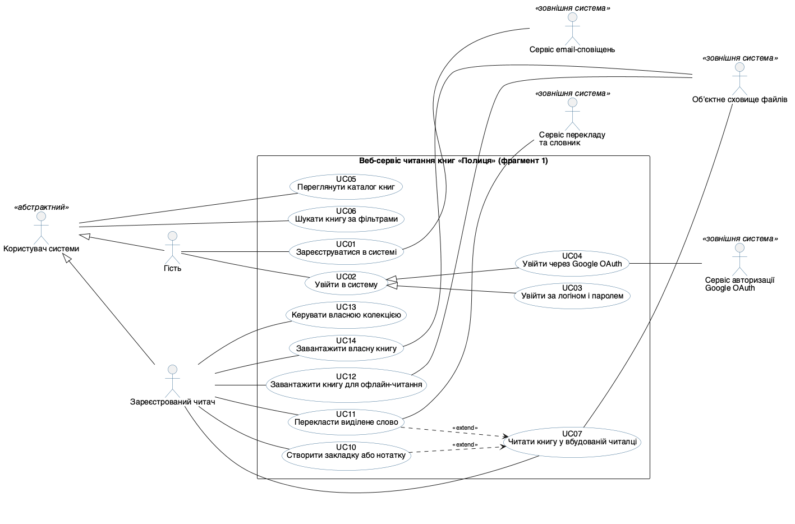
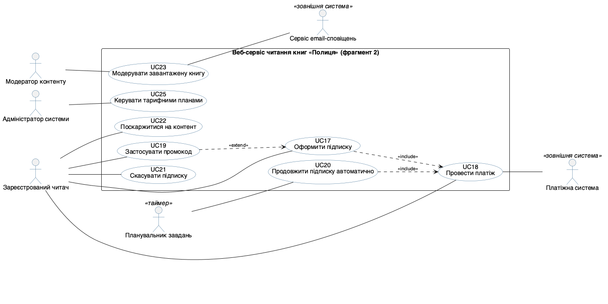

## Мета

**Варіант предметної області: веб-сервіс завантаження та читання книг «Полиця».** Роботу виконав студент групи ВТ-23-2 Камінський Олексій Дмитрович.

Ознайомитися із сучасними CASE-інструментами моделювання програмного забезпечення, налаштувати робоче середовище для побудови UML-моделей та опанувати побудову діаграми варіантів використання (Use Case diagram) — першої моделі, що формалізує функціональні вимоги до системи.

Предметна область, обрана для курсового завдання та для всіх чотирьох лабораторних робіт цього курсу, — веб-сервіс завантаження та читання книг «Полиця» (спрощений аналог MyBook/Bookmate). Користувач реєструється, переглядає каталог, завантажує власні книги у форматах EPUB/PDF, читає їх у вбудованій читалці зі збереженням прогресу й закладок, веде власні колекції та оформлює підписку для доступу до платного каталогу. Оплату обробляє зовнішня платіжна система, файли книг зберігаються у зовнішньому обʼєктному сховищі, вхід можливий через Google OAuth, а переклад виділеного слова виконує зовнішній словниковий сервіс.

## Розділ 1. Огляд CASE-інструментів і налаштування середовища

Методичка вимагає встановити (або підключити онлайн-версію) щонайменше два інструменти з переліку п. 1.1. Фактично підключено **три**: PlantUML, Mermaid і Draw.io. У кожному з них реально побудовано й відрендерено ту саму тестову діаграму (Розділ 2) — жоден інструмент не оцінювався «за описом».

**PlantUML** — основний інструмент, текстово-орієнтований CASE-засіб, що реалізує підхід «діаграма як код» (diagram-as-code). Встановлений локально через менеджер пакетів Homebrew; рендеринг виконує локальна збірка Graphviz.

**Mermaid** — другий текстовий інструмент із переліку п. 1.1. Підключений як пакет `@mermaid-js/mermaid-cli` і запускається через `npx` без глобальної інсталяції; рендерить діаграму в headless-браузері.

**Draw.io (diagrams.net)** — графічний редактор із переліку п. 1.1. Встановлено десктопну збірку через Homebrew (`brew install --cask drawio`, версія 28.2.5). Модель зберігається у власному форматі редактора `.drawio` (XML), а растрове зображення експортовано **засобами самого редактора** через його режим командного рядка.

Фактичний склад середовища на момент виконання роботи наведено нижче (вивід консолі).

```text
$ plantuml -version
PlantUML version 1.2026.8 / 149874a [2026-09-05 15:59:17 UTC]
(GPL source distribution)
Build Version: 1.2026.8
Git Commit: 149874a

$ dot -V
dot - graphviz version 16.1.0 (20260904.0139)

$ /opt/homebrew/opt/openjdk/bin/java -version
openjdk version "27" 2026-09-15
OpenJDK Runtime Environment Homebrew (build 27)
OpenJDK 64-Bit Server VM Homebrew (build 27, mixed mode, sharing)

$ node --version
v26.0.0

$ npx -y @mermaid-js/mermaid-cli@11 --version
11.17.0
```

Порівняльна таблиця інструментів за шістьма критеріями методички; сьомий рядок (робота з Git) додано, бо для курсового завдання модель зберігається в репозиторії разом із кодом.

| Критерій | PlantUML | Mermaid (mermaid-cli) | Draw.io / diagrams.net (онлайн) |
|---|---|---|---|
| Зручність інтерфейсу | Текстовий синтаксис, потребує звикання; жодного позиціонування мишею — розкладку будує Graphviz | Текстовий синтаксис, помітно лаконічніший за PlantUML, але й бідніший: немає `skinparam`, стилізація через окремий JSON-конфіг | Найпростіший старт: браузерна версія без інсталяції, палітра UML-фігур, drag-and-drop; розкладку повністю контролює автор |
| Швидкість побудови діаграми | Висока: діаграма з 20 use case і 11 акторів описана за 121 рядок коду, рендер PNG — 0,85 с | Висока для простих діаграм: тестова діаграма — 15 рядків файла проти 23 у PlantUML, рендер 1,02 с (із уже закешованим пакетом); запуск headless-браузера додає постійні накладні витрати | Нижча: кожен елемент і звʼязок розміщується вручну; у нашому випадку ті самі два класи зайняли 5379 байтів XML проти 741 байта `.puml` |
| Підтримка типів UML-діаграм | Усі потрібні в курсі: use case, класів, обʼєктів, компонентів, розгортання, діяльності, станів, послідовності | Класів, послідовності, станів, діяльності, ER; **діаграми варіантів використання та розгортання не підтримуються** — саме тому головну діаграму ЛР1 зроблено не в ньому | Фігури для всіх основних типів, але без семантичної моделі (це «малювання», а не модель): редактор не завадить зʼєднати два актори стрілкою `<<include>>` |
| Генерація коду з моделі | Обмежена (переважно зворотний напрям: код → діаграма) | Відсутня | Відсутня |
| Інтеграція з ШІ-асистентами | Дуже зручна: LLM повертає готовий текст `.puml`, який одразу рендериться й перевіряється | Так само зручна, ще й вбудована в GitHub/GitLab Markdown — ШІ-чат рендерить Mermaid прямо у відповіді | Опосередкована: ШІ може повернути `.drawio`-XML, і редактор його відкриє (саме так зроблено в Розділі 2), але перевіряти згенеровані координати фігур людині важко |
| Робота з Git | Повноцінна: `.puml` — звичайний текст, diff і merge по рядках | Повноцінна: `.mmd` — текст, ще й рендериться прямо у вебінтерфейсі GitHub | `.drawio` — XML із координатами; будь-яке зсування фігури дає «шум» у diff |
| Вартість | Безкоштовно (GPL) | Безкоштовно (MIT) | Безкоштовно |

**Висновок:** для курсового завдання обрано PlantUML як основний інструмент — він безкоштовний, підтримує всі потрібні курсу типи діаграм (зокрема use case, яких немає в Mermaid), зберігає модель у текстовому вигляді й найкраще поєднується з ШІ-асистентом. Mermaid залишено як допоміжний для простих діаграм, що вставляються прямо в Markdown-документацію репозиторію, а Draw.io — для випадків, коли потрібна ручна «презентаційна» розкладка.

## Розділ 2. Тестова діаграма в кожному з інструментів

Для перевірки коректності налаштування середовища побудовано просту тестову діаграму з двох класів та одного відношення між ними. Відношення — **асоціація «багато до багатьох»**: один читач читає багато книг, і ту саму книгу читає багато читачів, тому множинність `0..*` стоїть з обох кінців. (У Лабораторній роботі №2 цей самий звʼязок розгорнуто в окремий клас `ПрогресЧитання`, бо на нього треба повісити атрибути — сторінку й дату; тут, у тестовій діаграмі, достатньо простої асоціації.)

Одну й ту саму діаграму побудовано в усіх трьох інструментах — це і є перевірка налаштування середовища, якої вимагає п. 2 Частини 1 методички.

### 2.1. PlantUML

Файл `test_two_classes.puml`:

```text
@startuml
' Тестова діаграма для перевірки налаштування середовища PlantUML
' Лабораторна робота №1. Камінський Олексій Дмитрович, група ВТ-23-2
' Два класи з одним відношенням (асоціація «багато до багатьох»)

skinparam defaultFontName "Helvetica"
skinparam classAttributeIconSize 0
skinparam shadowing false

class Читач {
  - email: String
  - імʼя: String
  + увійти(пароль: String): boolean
}

class Книга {
  - назва: String
  - автор: String
  + отриматиОбсяг(): int
}

Читач "0..*" -- "0..*" Книга : читає >
@enduml
```

```text
$ plantuml -tsvg test_two_classes.puml && plantuml -tpng test_two_classes.puml
$ ls -l test_two_classes.puml test_two_classes.svg test_two_classes.png
-rw-r--r--  1 alex  staff    741  test_two_classes.puml
-rw-r--r--  1 alex  staff   4948  test_two_classes.svg
-rw-r--r--  1 alex  staff   6569  test_two_classes.png     (239 x 276 px)
```


### 2.2. Mermaid

Та сама діаграма мовою Mermaid, файл `test_two_classes.mmd`:

```text
%% Тестова діаграма для перевірки налаштування середовища Mermaid
%% Лабораторна робота №1. Камінський Олексій Дмитрович, група ВТ-23-2
%% Ті самі два класи й те саме відношення, що й у test_two_classes.puml
classDiagram
    class Читач {
        -String email
        -String імʼя
        +увійти(String пароль) boolean
    }
    class Книга {
        -String назва
        -String автор
        +отриматиОбсяг() int
    }
    Читач "0..*" -- "0..*" Книга : читає
```

```text
$ npx -y @mermaid-js/mermaid-cli@11 -i test_two_classes.mmd \
      -o test_two_classes_mermaid.png -c mmdc.json -b white -s 2
Generating single mermaid chart
$ ls -l test_two_classes.mmd test_two_classes_mermaid.svg test_two_classes_mermaid.png
-rw-r--r--  1 alex  staff    665  test_two_classes.mmd
-rw-r--r--  1 alex  staff  20048  test_two_classes_mermaid.svg
-rw-r--r--  1 alex  staff  38918  test_two_classes_mermaid.png   (600 x 852 px)
```


Відмінності, помічені на практиці: Mermaid записує тип перед імʼям (`-String email`), не має еквівалента `skinparam` (колір і шрифт задаються окремим файлом конфігурації `mmdc.json`), сам обирає вертикальну розкладку і не підтримує стрілку напрямку читання асоціації (`читає >`), тому підпис виводиться без неї.

### 2.3. Draw.io (браузерна версія)

Та сама діаграма у графічному редакторі. Модель збережено у власному форматі редактора — файл `test_two_classes.drawio` (XML mxGraph, 5379 байтів): два елементи `swimlane` із трьома секціями кожен (назва, атрибути, операції) та ребро `endArrow=none` з підписом «читає» і мітками множинності `0..*` на обох кінцях.

Робочий процес був таким: XML-модель збережено у форматі `.drawio`, після чого її відмалював і експортував сам редактор командою

```text
/Applications/draw.io.app/Contents/MacOS/draw.io --export --format png --scale 2 --border 10 \
    --output test_two_classes_drawio.png test_two_classes.drawio
```

(формат PNG, масштаб 2×, поле 10 px). Тут слід бути точним: фігури не перетягувалися мишею з палітри — їхні координати задано прямо в XML, який далі відкрив і відрендерив сам редактор. Для Draw.io це штатний спосіб роботи, бо `.drawio` і є його власним форматом моделі, але повного досвіду drag-and-drop-побудови ця робота не дає.

```text
$ ls -l test_two_classes.drawio test_two_classes_drawio.png
-rw-r--r--  1 alex  staff   5379  test_two_classes.drawio
-rw-r--r--  1 alex  staff  44841  test_two_classes_drawio.png   (644 x 836 px)
```


### 2.4. Що показало порівняння

| Показник (та сама діаграма) | PlantUML | Mermaid | Draw.io |
|---|---|---|---|
| Розмір файлу моделі | 741 Б | 665 Б | 5379 Б |
| Рядків/вузлів, які пише автор | 23 рядки | 15 рядків | 13 XML-елементів із координатами |
| Хто визначає розкладку | Graphviz | Mermaid | автор |
| Розмір PNG | 239 × 276 px | 600 × 852 px | 644 × 836 px |
| Час рендерингу | 0,74 с | 1,02 с | експорт у браузері, миттєво |

Окремо перевірено відображення кирилиці в усіх трьох інструментах: у PlantUML за це відповідає директива `skinparam defaultFontName "Helvetica"`, додана в кожен файл `.puml`; у Mermaid — `themeVariables.fontFamily` у конфігурації; у Draw.io — `fontFamily=Helvetica` у стилі кожної фігури. Українські назви класів, атрибутів і ролей відображаються коректно, без «квадратиків» замість літер.

**Висновок:** середовище налаштовано коректно — усі три інструменти встановлено/підключено, і кожен із них відмалював ту саму тестову діаграму. Головна відмінність, помічена під час порівняння, — у текстових інструментах зміст діаграми відокремлений від її розкладки (автор описує лише звʼязки), тоді як у графічному вони зберігаються разом, через що файл моделі стає у сім разів більшим і значно менш придатним до перегляду в `git diff`.

## Розділ 3. Актори системи

Актори визначалися за принципом «хто або що ініціює взаємодію або надає системі зовнішній сервіс». Крім очевидних людських ролей, до переліку включено пʼять зовнішніх систем і один часовий (неочевидний) актор — планувальник завдань, що ініціює автоматичне продовження підписки без участі людини.

| Актор | Тип | Опис ролі |
|---|---|---|
| Користувач системи | Людина (абстрактний актор) | Не існує окремо: це узагальнення спільної поведінки Гостя і Зареєстрованого читача. Виносить ті сценарії, які доступні будь-кому, — перегляд каталогу й пошук книги |
| Гість | Людина | Спеціалізація «Користувача системи». Неавторизований відвідувач: додатково до перегляду каталогу може зареєструватися та увійти |
| Зареєстрований читач | Людина | Спеціалізація «Користувача системи». Читає книги, веде власну колекцію, завантажує власні книги, оформлює й скасовує підписку, скаржиться на контент |
| Модератор контенту | Людина | Перевіряє завантажені користувачами книги: схвалює, відхиляє або блокує за скаргою |
| Адміністратор системи | Людина | Неочевидна роль: керує тарифними планами, цінами та правами доступу до платного каталогу |
| Платіжна система | Зовнішня система (другорядний актор) | Проводить списання коштів за підписку та повертає результат транзакції |
| Обʼєктне сховище файлів | Зовнішня система (другорядний актор) | Зберігає й віддає файли книг (EPUB/PDF). Сервіс зберігає в себе лише метадані й посилання |
| Сервіс авторизації Google OAuth | Зовнішня система (другорядний актор) | Підтверджує особу користувача під час входу через Google |
| Сервіс перекладу та словник | Зовнішня система (другорядний актор) | Повертає переклад і словникову статтю для виділеного читачем слова |
| Сервіс email-сповіщень | Зовнішня система (другорядний актор) | Доставляє листи: підтвердження реєстрації, результат модерації завантаженої книги |
| Планувальник завдань | Часовий актор (таймер) | Неочевидний актор: за розкладом ініціює автоматичне продовження підписки в день списання |

### Чому «Передплатник» — не актор

У чернетці моделі був ще один актор — «Передплатник» — як спеціалізація Зареєстрованого читача. Від нього свідомо відмовлено, і це головне змістове рішення цього розділу.

Передплатник — це **стан** читача, а не окрема роль: той самий обліковий запис стає передплатником після успішного платежу і перестає ним бути наступного дня після закінчення оплаченого періоду. Узагальнення акторів у UML описує статичну класифікацію ролей, а не стан, який змінюється під час роботи системи. Крім того, ланцюг `Гість → Зареєстрований читач → Передплатник` давав прямі логічні суперечності: Передплатник успадковував би UC17 «Оформити підписку», передумова якого — «у читача немає активної підписки», а Зареєстрований читач успадковував би від Гостя UC01 «Зареєструватися в системі», хоча реєструватися може тільки той, хто ще не зареєстрований.

Тому замість ланцюга з трьох ролей введено **абстрактного актора «Користувач системи»**, від якого успадковуються Гість і Зареєстрований читач як дві паралельні (а не вкладені) спеціалізації. Спільні сценарії — перегляд каталогу й пошук — висять на абстрактному акторі; реєстрація та вхід належать тільки Гостю; читання, колекції й підписка — тільки Зареєстрованому читачу. Наявність активної підписки виражено **передумовою** відповідних варіантів використання (UC12, UC21), а не окремим актором. Це рішення узгоджується з Лабораторною роботою №2, де в діаграмі класів є абстрактний клас `КористувачСистеми` і клас `Читач`, але класу «Передплатник» немає — підписка там є окремим обʼєктом зі станом.

**Висновок:** перелік містить 11 акторів: 1 абстрактний, 4 конкретні людські ролі, 5 зовнішніх систем і 1 часовий актор. Два узагальнення акторів (`Користувач системи ← Гість` і `Користувач системи ← Зареєстрований читач`) прибирають дублювання спільних асоціацій і при цьому не породжують суперечностей із передумовами сценаріїв.

## Розділ 4. Перелік варіантів використання

Визначено 20 варіантів використання. Усі назви сформульовано дієслівними фразами (що система робить для актора), а не іменниками, і кожен варіант має щонайменше одного актора.

Колонку «актор» навмисно розділено на дві: **основний актор** — той, хто ініціює сценарій і заради кого система його виконує; **другорядні актори** — зовнішні системи, яких наша система залучає для виконання сценарію. Зовнішня система, яку викликає наша система, ніколи не буває основним актором.

| ID | Варіант використання | Основний актор | Другорядні актори | Відношення |
|---|---|---|---|---|
| UC01 | Зареєструватися в системі | Гість | Сервіс email-сповіщень | — |
| UC02 | Увійти в систему | Гість | — | базовий для UC03, UC04 (generalization) |
| UC03 | Увійти за логіном і паролем | Гість (успадковано від UC02 через generalization — окремої лінії на діаграмі немає навмисно) | — | generalization → UC02 |
| UC04 | Увійти через Google OAuth | Гість (успадковано від UC02 через generalization) | Сервіс авторизації Google OAuth | generalization → UC02 |
| UC05 | Переглянути каталог книг | Користувач системи (абстрактний; успадковують Гість і Зареєстрований читач) | — | — |
| UC06 | Шукати книгу за фільтрами | Користувач системи (абстрактний) | — | — |
| UC07 | Читати книгу у вбудованій читалці | Зареєстрований читач | Обʼєктне сховище файлів | базовий для UC10, UC11 (extend) |
| UC10 | Створити закладку або нотатку | Зареєстрований читач | — | `<<extend>>` → UC07 |
| UC11 | Перекласти виділене слово | Зареєстрований читач | Сервіс перекладу та словник | `<<extend>>` → UC07 |
| UC12 | Завантажити книгу для офлайн-читання | Зареєстрований читач (передумова — активна підписка) | Обʼєктне сховище файлів | — |
| UC13 | Керувати власною колекцією | Зареєстрований читач | — | — |
| UC14 | Завантажити власну книгу | Зареєстрований читач | Обʼєктне сховище файлів | — |
| UC17 | Оформити підписку | Зареєстрований читач | — (платіжну систему залучає включений UC18) | `<<include>>` UC18; розширюється UC19 |
| UC18 | Провести платіж | Зареєстрований читач | Платіжна система | включається в UC17 і UC20 |
| UC19 | Застосувати промокод | Зареєстрований читач | — | `<<extend>>` → UC17 |
| UC20 | Продовжити підписку автоматично | Планувальник завдань | — (платіжну систему залучає включений UC18) | `<<include>>` UC18 |
| UC21 | Скасувати підписку | Зареєстрований читач (передумова — активна підписка) | — | — |
| UC22 | Поскаржитися на контент | Зареєстрований читач | — | — |
| UC23 | Модерувати завантажену книгу | Модератор контенту | Сервіс email-сповіщень | — |
| UC25 | Керувати тарифними планами | Адміністратор системи | — | — |

### Чому нумерація не суцільна: відкинуті кандидати

Нумерація має пропуски (немає UC08, UC09, UC15, UC16, UC24), і це не помилка, а слід свідомого рішення. У чернетці ці пʼять позицій були окремими варіантами використання, але жоден із них не відповідає означенню з п. 1.2 методички — «одна **закінчена** одиниця функціональності, яку система надає **актору**». Це внутрішні кроки реалізації, тобто функціональна декомпозиція, а не варіанти використання. Їх прибрано з переліку й з діаграми, а зміст перенесено в текстові специфікації. Ідентифікатори не перепризначалися, щоб зберегти звʼязність із наступними лабораторними роботами курсу.

| Колишній ID | Відкинутий кандидат | Чому це не варіант використання | Куди перенесено зміст |
|---|---|---|---|
| UC08 | Отримати файл книги зі сховища | Жоден актор не ставить собі за мету «отримати файл» — це спосіб, у який система виконує читання й офлайн-завантаження | Крок 3 основного потоку UC07 і крок 3 UC12; сховище лишилося другорядним актором цих UC |
| UC09 | Зберегти прогрес читання | Не має актора взагалі: система робить це сама, автоматично, без зовнішнього ініціатора. У переліку стояв із прочерком «— (службовий)» | Крок 6 основного потоку та постумова UC07 |
| UC15 | Перевірити формат і метадані файлу | Так само без актора: внутрішня валідація, що є частиною мети «завантажити книгу», а не окремою метою | Крок 2 основного потоку UC14 і альтернативні потоки 2а, 2б, 2в |
| UC16 | Зберегти файл у обʼєктному сховищі | Технічний крок реалізації UC14; «актором» помилково було вказано саме сховище | Крок 4 основного потоку UC14; сховище — другорядний актор UC14 |
| UC24 | Надіслати сповіщення читачу | Назва обіцяє цінність читачеві, але читач до цього сценарію не підключений — єдиним «актором» виявлявся поштовий сервіс, тобто інструмент, а не ініціатор | Постумови UC01 і UC23; поштовий сервіс — другорядний актор цих двох UC |

### Чому UC18 «Провести платіж» залишено

UC18 — єдиний «системний» варіант використання, який залишено в переліку, і для цього є три підстави. По-перше, у нього є людина-ініціатор: платить читач, саме він отримує цінність (активовану підписку) і саме він бачить відмову картки. По-друге, він справді повторно використовується двома різними базовими сценаріями — UC17 (ручне оформлення) і UC20 (автопродовження за таймером), а винесення спільної повторюваної поведінки і є прямим призначенням `<<include>>` за п. 1.2 методички. По-третє, методичка сама наводить такий звʼязок як зразок: «Оформити замовлення» завжди включає «Оплатити замовлення». На відміну від відкинутих пʼяти кандидатів, UC18 має власні альтернативні потоки (відхилення платежу, таймаут провайдера) і власну постумову — тобто є закінченим сценарієм, а не кроком.

**Висновок:** перелік із 20 позицій удвічі перевищує мінімальну вимогу методички (8–10) і містить усі три обовʼязкові типи відношень: 2 звʼязки `<<include>>`, 3 звʼязки `<<extend>>` та 4 узагальнення (2 між акторами і 2 між варіантами використання). Кількість `<<include>>` свідомо зменшено з девʼяти до двох — сім із них насправді були функціональною декомпозицією.

## Розділ 5. Діаграма варіантів використання

Діаграму побудовано в PlantUML, файл `usecase.puml`. Межу системи задано конструкцією `rectangle "Веб-сервіс читання книг «Полиця»" { ... }`: усі 20 варіантів використання розміщено всередині прямокутника, усі 11 акторів — зовні.

Асоціації «актор — варіант використання» намальовано **простою лінією** `--` без стрілок, як того вимагає таблиця нотації п. 1.2 методички (у чернетці тут помилково стояли напрямлені стрілки `-->`, до того ж із непослідовним напрямком). Напрямок залишено тільки там, де він несе зміст: трикутна головка `<|--` в узагальненнях і пунктирна стрілка `..>` у `<<include>>` та `<<extend>>`.

```text
@startuml
' Лабораторна робота №1. Діаграма варіантів використання (Use Case diagram)
' Предметна область: веб-сервіс завантаження та читання книг «Полиця»
' Камінський Олексій Дмитрович, група ВТ-23-2

skinparam defaultFontName "Helvetica"
skinparam shadowing false
skinparam nodesep 12
skinparam ranksep 90
skinparam packageStyle rectangle
skinparam ArrowFontSize 11
skinparam usecase {
  BackgroundColor #FEFEFE
  BorderColor #33668E
}
skinparam actor {
  BorderColor #33668E
}
left to right direction

' ======== АКТОРИ-ЛЮДИ (ліворуч від межі системи) ========
actor "Користувач системи" as User <<абстрактний>>
actor "Гість" as Guest
actor "Зареєстрований читач" as Reader
actor "Модератор контенту" as Moderator
actor "Адміністратор системи" as Admin

' ======== ЗОВНІШНІ СИСТЕМИ ТА ЧАСОВИЙ АКТОР (праворуч від межі системи) ========
actor "Сервіс авторизації\nGoogle OAuth" as OAuth <<зовнішня система>>
actor "Платіжна система" as PaySys <<зовнішня система>>
actor "Обʼєктне сховище файлів" as Storage <<зовнішня система>>
actor "Сервіс перекладу\nта словник" as Translate <<зовнішня система>>
actor "Сервіс email-сповіщень" as Mailer <<зовнішня система>>
actor "Планувальник завдань" as Scheduler <<таймер>>

' ======== УЗАГАЛЬНЕННЯ АКТОРІВ (generalization) ========
User <|-- Guest
User <|-- Reader

' ======== МЕЖА СИСТЕМИ ========
rectangle "Веб-сервіс читання книг «Полиця»" {

  ' --- доступ до системи ---
  usecase "UC01\nЗареєструватися в системі" as UC01
  usecase "UC02\nУвійти в систему" as UC02
  usecase "UC03\nУвійти за логіном і паролем" as UC03
  usecase "UC04\nУвійти через Google OAuth" as UC04

  ' --- каталог ---
  usecase "UC05\nПереглянути каталог книг" as UC05
  usecase "UC06\nШукати книгу за фільтрами" as UC06

  ' --- читання ---
  usecase "UC07\nЧитати книгу у вбудованій читалці" as UC07
  usecase "UC10\nСтворити закладку або нотатку" as UC10
  usecase "UC11\nПерекласти виділене слово" as UC11
  usecase "UC12\nЗавантажити книгу для офлайн-читання" as UC12

  ' --- власний контент ---
  usecase "UC13\nКерувати власною колекцією" as UC13
  usecase "UC14\nЗавантажити власну книгу" as UC14

  ' --- підписка та оплата ---
  usecase "UC17\nОформити підписку" as UC17
  usecase "UC18\nПровести платіж" as UC18
  usecase "UC19\nЗастосувати промокод" as UC19
  usecase "UC20\nПродовжити підписку автоматично" as UC20
  usecase "UC21\nСкасувати підписку" as UC21

  ' --- модерація та адміністрування ---
  usecase "UC22\nПоскаржитися на контент" as UC22
  usecase "UC23\nМодерувати завантажену книгу" as UC23
  usecase "UC25\nКерувати тарифними планами" as UC25
}

' ======== АСОЦІАЦІЇ АКТОРІВ-ЛЮДЕЙ (проста лінія, без напрямку) ========
User -- UC05
User -- UC06

Guest -- UC01
Guest -- UC02

Reader -- UC07
Reader -- UC10
Reader -- UC11
Reader -- UC12
Reader -- UC13
Reader -- UC14
Reader -- UC17
Reader -- UC18
Reader -- UC19
Reader -- UC21
Reader -- UC22

Moderator -- UC23
Admin -- UC25
Scheduler -- UC20

' ======== АСОЦІАЦІЇ ЗОВНІШНІХ СИСТЕМ (другорядні актори) ========
UC01 -- Mailer
UC04 -- OAuth
UC07 -- Storage
UC11 -- Translate
UC12 -- Storage
UC14 -- Storage
UC18 -- PaySys
UC23 -- Mailer

' ======== УЗАГАЛЬНЕННЯ ВАРІАНТІВ ВИКОРИСТАННЯ (generalization) ========
UC02 <|-- UC03
UC02 <|-- UC04

' ======== ВІДНОШЕННЯ <<include>> (від базового до включеного) ========
UC17 ..> UC18 : <<include>>
UC20 ..> UC18 : <<include>>

' ======== ВІДНОШЕННЯ <<extend>> (від розширювального до базового) ========
UC10 ..> UC07 : <<extend>>
UC11 ..> UC07 : <<extend>>
UC19 ..> UC17 : <<extend>>
@enduml
```

Результат рендерингу:

```text
$ plantuml -tsvg usecase.puml && plantuml -tpng usecase.puml
$ ls -l usecase.puml usecase.svg usecase.png
-rw-r--r--  1 alex  staff    4808  usecase.puml
-rw-r--r--  1 alex  staff   35289  usecase.svg
-rw-r--r--  1 alex  staff  112509  usecase.png     (1699 x 1444 px)
час рендерингу PNG: 0,85 с
```


### Читабельність: дві тематичні проєкції тієї самої моделі

Перша версія діаграми була нечитабельною: з директивою `skinparam linetype ortho` і 25 овалами лінії перетинали все полотно, а нижня чверть зображення лишалася порожньою. Виправлено трьома кроками: прибрано ортогональну маршрутизацію, задано щільнішу розкладку (`nodesep 12`, `ranksep 90`) і зменшено кількість овалів із 25 до 20. Висота зображення скоротилася з 1735 до 1444 px при більшій ширині, людські актори зібралися ліворуч, зовнішні системи — вгорі та праворуч.

Додатково, за прикладом Лабораторної роботи №2 (де діаграму класів подано повною й «ядерною» версіями), ту саму модель подано двома тематичними проєкціями. Це не інші моделі: кожен елемент фрагментів дослівно збігається з повною діаграмою, разом вони дають рівно ті самі 20 варіантів використання.





| Діаграма | Файл | Варіанти використання | Актори | Розмір PNG |
|---|---|---|---|---|
| Повна | `usecase.puml` | усі 20 | усі 11 | 1699 × 1444 px |
| Фрагмент 1 «Доступ, каталог і читання» | `usecase_reading.puml` | UC01–UC07, UC10–UC14 (12) | 7 | 1417 × 934 px |
| Фрагмент 2 «Підписка, модерація, адміністрування» | `usecase_subscription.puml` | UC17–UC23, UC25 (8) | 6 | 1393 × 698 px |

### Обґрунтування вибору типів відношень

Найбільшу кількість балів у критеріях оцінювання має саме коректність відношень, тому кожне рішення обґрунтовано окремо.

**Чому `<<include>>`, а не `<<extend>>`.** Відношення `<<include>>` застосовано там, де включений сценарій виконується **завжди** і без нього базовий варіант не досягає своєї мети. «Оформити підписку» (UC17) без успішного платежу (UC18) не має сенсу: підписка не активується, тому це `<<include>>`, а не `<<extend>>`. Другий і не менш важливий аргумент — повторне використання: той самий UC18 включається і в UC17 (читач оформлює підписку руками), і в UC20 (планувальник продовжує її автоматично). Саме винесення спільної повторюваної поведінки є призначенням `<<include>>`. Там, де повторного використання немає і крок є суто внутрішнім, `<<include>>` свідомо не застосовано — такі кроки описано в основному потоці текстової специфікації (див. таблицю відкинутих кандидатів у Розділі 4).

**Чому `<<extend>>`, а не `<<include>>`.** Відношення `<<extend>>` застосовано там, де додаткова поведінка спрацьовує **лише за умови** і її відсутність не ламає основний сценарій. «Перекласти виділене слово» (UC11) виконується тільки тоді, коли читач виділив слово і натиснув «Переклад»; переважна більшість сеансів читання завершується успішно без жодного звернення до словника. Додатковий аргумент: UC11 залежить від зовнішнього сервісу перекладу, і якщо той недоступний, базовий сценарій читання має продовжуватись — семантика `<<include>>` цього не дозволила б. Аналогічно «Застосувати промокод» (UC19) розширює оформлення підписки лише за наявності в читача промокоду, а «Створити закладку або нотатку» (UC10) — лише за бажанням читача. Зверніть увагу на напрямок стрілки: при `<<extend>>` вона йде **від розширювального варіанта до базового** (UC19 → UC17), тоді як при `<<include>>` — **від базового до включеного** (UC17 → UC18). Це дзеркальні напрямки, і їх плутання є однією з найтиповіших помилок.

**Чому в усіх трьох розширень є власний актор.** UC10, UC11 і UC19 зʼєднані простою лінією із Зареєстрованим читачем, бо саме він вирішує, чи спрацює розширення. Трактування `<<extend>>` тут послідовне: жоден розширювальний варіант не лишився «висіти» без актора.

**Чому generalization.** Узагальнення акторів `Користувач системи ← Гість` і `Користувач системи ← Зареєстрований читач` відображає спільну частину їхньої поведінки — перегляд каталогу й пошук книги. Обидві спеціалізації паралельні, а не вкладені одна в одну, тому Зареєстрований читач не успадковує «Зареєструватися в системі» (логічна суперечність, яку давала чернетка). Узагальнення варіантів використання `UC02 ← UC03` і `UC02 ← UC04` показує два способи досягти однієї мети «увійти в систему»: власним паролем або через Google. Тому UC03 і UC04 не зʼєднані власною лінією з Гостем — актора вони успадковують від UC02, і дублювати асоціацію було б помилкою.

**Висновок:** діаграма містить коректну межу системи, 20 варіантів використання, 11 акторів, 26 асоціацій і всі три обовʼязкові типи відношень; кожен звʼязок обґрунтовано критерієм обовʼязковості/опційності, а не інтуїцією, і кожен варіант використання має щонайменше одного актора — безпосередньо або через успадкування.

## Розділ 6. Текстові специфікації ключових варіантів використання

Для трьох найважливіших варіантів використання — читання книги (ядро продукту), завантаження власної книги (основне джерело контенту) та оформлення підписки (джерело доходу) — складено повні текстові специфікації за структурою п. 1.3 методички. Саме сюди перенесено ті внутрішні кроки, які в чернетці помилково були окремими варіантами використання.

### UC07 — Читати книгу у вбудованій читалці

| Поле | Значення |
|---|---|
| ID / Назва | UC07 — Читати книгу у вбудованій читалці |
| Актор(и) | Зареєстрований читач (основний); Обʼєктне сховище файлів, Сервіс перекладу та словник (другорядні) |
| Передумови | Читач авторизований; книга наявна в каталозі та доступна читачеві (безкоштовна, завантажена ним самим або відкрита за активною підпискою) |
| Основний потік | 1. Читач обирає книгу й натискає «Читати». 2. Система перевіряє право доступу до книги. 3. Система звертається до обʼєктного сховища за посиланням на файл і отримує його вміст. 4. Система визначає останню збережену позицію читання і відкриває книгу на ній (для першого відкриття — на першій сторінці). 5. Читач гортає сторінки. 6. Після кожної зміни сторінки система зберігає поточну позицію читання у профілі читача. 7. Читач закриває читалку. |
| Альтернативні потоки | 2а. Доступ заборонено (книга платна, підписка неактивна) — система пропонує «Оформити підписку» (UC17), сценарій завершується. 3а. Сховище недоступне або файл пошкоджено — система показує повідомлення «Книга тимчасово недоступна» і реєструє інцидент; сценарій завершується невдало. 5а. Читач виділяє слово й викликає переклад — виконується «Перекласти виділене слово» (`<<extend>>` UC11); якщо зовнішній словник недоступний, показується попередження, а читання триває. 5б. Читач створює закладку або нотатку — виконується «Створити закладку або нотатку» (`<<extend>>` UC10). 6а. Звʼязок із сервером втрачено — позиція накопичується локально й надсилається після відновлення звʼязку. |
| Постумови | Позиція читання збережена в профілі читача; створені під час сеансу закладки й нотатки збережені; книга позначена як «читається» у власній колекції |

### UC14 — Завантажити власну книгу

| Поле | Значення |
|---|---|
| ID / Назва | UC14 — Завантажити власну книгу |
| Актор(и) | Зареєстрований читач (основний); Обʼєктне сховище файлів (другорядний); результат сценарію формує чергу для Модератора контенту (UC23) |
| Передумови | Читач авторизований; не перевищено ліміт завантажень для його тарифу; файл має формат EPUB або PDF |
| Основний потік | 1. Читач відкриває форму «Завантажити книгу» і обирає файл. 2. Система перевіряє формат і метадані файлу: MIME-тип, розмір, цілісність архіву EPUB, витягує назву й автора. 3. Система показує розпізнані метадані; читач за потреби виправляє назву, автора, мову, обкладинку. 4. Система вивантажує файл в обʼєктне сховище і зберігає в себе лише метадані та посилання. 5. Система створює запис книги зі статусом «На модерації» й додає завдання в чергу модератора. 6. Система повідомляє читачеві, що книга прийнята й очікує перевірки. |
| Альтернативні потоки | 2а. Формат не підтримується або файл пошкоджено — система відхиляє завантаження з поясненням, файл не зберігається. 2б. Розмір перевищує ліміт — завантаження відхилено. 2в. За хешем файла виявлено дублікат уже завантаженої книги — система пропонує відкрити наявну книгу замість повторного завантаження. 4а. Сховище недоступне — система повторює вивантаження тричі з наростальною паузою; після третьої невдачі завантаження скасовується, запис у базі не створюється. |
| Постумови | Файл збережено в обʼєктному сховищі; у базі створено запис книги зі статусом «На модерації»; завдання додано в чергу модератора; завантажувач має доступ до своєї книги |

### UC17 — Оформити підписку

| Поле | Значення |
|---|---|
| ID / Назва | UC17 — Оформити підписку |
| Актор(и) | Зареєстрований читач (основний); Платіжна система (другорядний, залучається через включений UC18); Сервіс email-сповіщень (другорядний) |
| Передумови | Читач авторизований; у нього немає активної підписки; адміністратор налаштував щонайменше один тарифний план (UC25) |
| Основний потік | 1. Читач відкриває розділ «Підписка» і обирає тарифний план. 2. Система показує вартість, період і умови автопродовження. 3. Читач підтверджує оформлення. 4. Система виконує «Провести платіж» (`<<include>>` UC18). 5. Отримавши успішний результат, система активує підписку: фіксує її термін дії та дату наступного списання. 6. Система надсилає читачеві лист-підтвердження через сервіс email-сповіщень. |
| Альтернативні потоки | 2а. Читач уводить промокод — виконується «Застосувати промокод» (`<<extend>>` UC19): система перевіряє чинність коду та перераховує суму; якщо код недійсний або прострочений, показується попередження, а оформлення триває за повною ціною. 4а. Платіж відхилено (недостатньо коштів, помилка картки) — підписка не активується, читачеві показано причину відмови й запропоновано інший спосіб оплати. 4б. Платіжна система не відповідає — транзакцію позначено як «невизначена», підписка не активується, читачеві запропоновано повторити спробу пізніше. |
| Постумови | Підписку активовано, її термін дії й дата наступного списання збережені; платіжну транзакцію зафіксовано; у профілі читача зʼявляється стан «активна підписка», що відкриває доступ до платного каталогу (UC12) і можливість скасування (UC21). Нової ролі читач при цьому не набуває — змінюється лише стан його підписки |

**Висновок:** текстові специфікації показують те, чого графічна діаграма не передає: порядок кроків, умови спрацювання розширень і поведінку системи у відмовних ситуаціях — зокрема при недоступності зовнішніх сервісів, яких у цій предметній області аж пʼять. Саме сюди, а не на діаграму, перенесено внутрішні кроки системи (звернення до сховища, збереження прогресу, валідація файла, надсилання листа).

## Критичний аналіз ШІ-чернетки

Чернетку діаграми було згенеровано ШІ-асистентом за текстовим описом предметної області, після чого проведено ручну перевірку на відповідність реальній логіці сервісу й означенням з методички. Нижче — шість реальних помилок саме цієї чернетки та внесені виправлення.

| Помилка ШІ-чернетки | Чому це помилка | Як виправлено |
|---|---|---|
| **Функціональна декомпозиція замість варіантів використання.** Чернетка видала 25 овалів, серед яких «Отримати файл книги зі сховища», «Зберегти прогрес читання», «Перевірити формат і метадані файлу», «Зберегти файл у обʼєктному сховищі», «Надіслати сповіщення читачу» | Це внутрішні кроки системи, а не «закінчена одиниця функціональності, яку система надає актору» (п. 1.2). Двоє з них («Зберегти прогрес», «Перевірити формат») узагалі не мали жодного актора і висіли на діаграмі без асоціацій. ШІ оптимізує кількість елементів, а не їхню змістовність | Пʼять кандидатів прибрано з діаграми й перенесено в основні потоки специфікацій UC07, UC12 і UC14 (перелік — у таблиці Розділу 4); залишилося 20 варіантів використання, кожен із власним актором. UC18 «Провести платіж» залишено свідомо — він має ініціатора-людину й повторно використовується двома базовими сценаріями |
| **`<<extend>>` замість `<<include>>` на оплаті підписки** | Підписка без успішного платежу не активується — це обовʼязкова, а не опційна поведінка. `<<extend>>` тут семантично допускав би активну підписку без оплати | Замінено на `<<include>>` (UC17 → UC18) і додатково перевикористано той самий UC18 у сценарії автопродовження UC20 |
| **`<<include>>` замість `<<extend>>` на перекладі слова** | Переклад спрацьовує лише за умови «читач виділив слово»; більшість сеансів читання обходиться без нього. До того ж `<<include>>` зробив би читання неможливим при недоступності зовнішнього словника | Замінено на `<<extend>>` із правильним напрямком стрілки (UC11 → UC07); у специфікації UC07 додано альтернативний потік 5а на випадок відмови словника |
| **Пропущено неочевидних акторів: обʼєктне сховище файлів і планувальник завдань.** ШІ вважав, що файли книг лежать «усередині системи», а автопродовження підписки «виконується само собою» | Для сервісу з EPUB/PDF зберігання файлів є окремою зовнішньою підсистемою; без цього актора в ЛР3 не буде вузла сховища на діаграмі розгортання. Автоматичне списання ніхто з людей не ініціює, але ініціатор у сценарію бути мусить, інакше UC20 висить без актора і неможливо визначити тригер | Додано «Обʼєктне сховище файлів» як другорядного актора UC07, UC12 і UC14, та неочевидного актора «Планувальник завдань» зі стереотипом `<<таймер>>` як основного актора UC20 |
| **Зовнішні системи записано «основними акторами».** У чернетці основним актором «Провести платіж» була платіжна система, «Надіслати сповіщення» — поштовий сервіс | Основний актор — той, хто ініціює сценарій і заради кого система його виконує. Зовнішня система, яку викликає наша система, завжди є другорядним (supporting) актором. Інакше модель стверджує, що платіж ініціює банк, а не читач | Колонку таблиці розділено на «Основний актор» і «Другорядні актори»; людину проставлено основним скрізь, де ініціатор — людина; зовнішні системи переведено у другорядні |
| **Ланцюг узагальнення акторів `Гість → Зареєстрований читач → Передплатник`** | Ланцюг дає дві суперечності з власними передумовами: Читач успадковує «Зареєструватися в системі», хоча реєструється лише незареєстрований, а Передплатник успадковує «Оформити підписку», передумова якого — «немає активної підписки». Крім того, «Передплатник» — це стан, що змінюється в рантаймі, а не статична роль | Актора «Передплатник» прибрано, наявність підписки виражено передумовою UC12 і UC21. Введено абстрактного актора «Користувач системи» з двома **паралельними** спеціалізаціями — Гість і Зареєстрований читач; спільні UC05/UC06 піднято на абстрактного актора, реєстрація і вхід лишилися тільки в Гостя |

**Висновок:** ШІ-асистент справді прискорив роботу — чернетка з приблизним переліком акторів і варіантів використання зʼявилася за кілька хвилин замість години ручного переліку. Проте жодне з шести наведених виправлень не могло бути зроблене без розуміння саме цієї предметної області та без звіряння з означеннями методички. Найнебезпечнішою виявилася не плутанина стереотипів (її видно одразу), а функціональна декомпозиція: ШІ охоче перетворює кроки алгоритму на «варіанти використання», і діаграма з 25 овалів виглядає солідніше за правильну з 20, хоча насправді описує не вимоги, а реалізацію.

## Відповіді на питання для самоконтролю

### 1. Чим текстова специфікація Use Case доповнює графічну діаграму?

Діаграма відповідає лише на питання «хто» і «що»: які ролі взаємодіють із системою і які закінчені функції система надає. Вона принципово не показує «як саме» розгортається сценарій. Текстова специфікація додає: порядок кроків основного потоку, передумови, за яких сценарій взагалі може початися, конкретні умови спрацювання `<<extend>>`, поведінку у відмовних ситуаціях та постумови. У цій роботі специфікації виконали ще одну роль: саме в них переїхали внутрішні кроки системи (звернення до сховища, валідація файла, надсилання листа), які не мають бути окремими овалами на діаграмі, але без яких сценарій неповний.

### 2. Наведіть власний приклад, коли доцільно використати `<<include>>`, а коли — `<<extend>>`

З моєї предметної області: «Оформити підписку» (UC17) **включає** `<<include>>` «Провести платіж» (UC18) — без успішного списання підписка не активується, крок виконується завжди і є частиною мети базового сценарію; до того ж той самий UC18 повторно використовується сценарієм автопродовження UC20, а винесення спільної поведінки і є призначенням `<<include>>`. Натомість «Застосувати промокод» (UC19) **розширює** `<<extend>>` ту саму «Оформити підписку» — читач може оформити підписку, не маючи жодного промокоду, і відсутність цього кроку нічого не ламає. Важливо, що стрілки при цьому дивляться в протилежні боки: UC17 → UC18 для включення і UC19 → UC17 для розширення.

### 3. Чи може актором Use Case діаграми бути інша інформаційна система? Наведіть приклад

Так. Актор — це будь-яка зовнішня сутність, що взаємодіє із системою через її межу, незалежно від того, людина це чи програма. У моїй діаграмі таких акторів пʼять: платіжна система (проводить списання і повертає результат транзакції в UC18), обʼєктне сховище файлів (віддає й приймає файли книг у UC07, UC12, UC14), сервіс авторизації Google OAuth (підтверджує особу користувача в UC04), зовнішній сервіс перекладу (UC11) і сервіс email-сповіщень (UC01, UC23). Є ще й шостий, неочевидний нелюдський актор — планувальник завдань зі стереотипом `<<таймер>>`, який ініціює UC20 за розкладом. Важлива деталь: усі пʼять зовнішніх сервісів є **другорядними** акторами — їх викликає наша система, а ініціатором сценарію лишається людина. Основним актором нелюдський учасник є лише в UC20, де сценарій справді запускає таймер, а не користувач.

### 4. Які ризики виникають при бездумному використанні ШІ-згенерованої Use Case діаграми без подальшої перевірки?

Найнебезпечніший ризик — не синтаксичні помилки (вони одразу видно при рендерингу), а правдоподібні смислові. По-перше, функціональна декомпозиція: ШІ перетворює кроки алгоритму на окремі «варіанти використання», і модель починає описувати реалізацію замість вимог — у моїй чернетці таких псевдоваріантів було пʼять із двадцяти пʼяти, причому два взагалі без акторів. По-друге, втрата акторів: ШІ схильний «розчиняти» зовнішні системи всередині системи, і чернетка не мала ні обʼєктного сховища, ні планувальника — ці прогалини потім перейшли б у діаграми компонентів і розгортання. По-третє, підміна типу відношення: `<<extend>>` замість `<<include>>` виглядає нешкідливо на картинці, але означає зовсім інші вимоги до реалізації. По-четверте, структурні суперечності, які ШІ не помічає, бо не звіряє діаграму з передумовами: ланцюг узагальнення акторів у чернетці дозволяв зареєстрованому читачеві «зареєструватися», а передплатнику — «оформити підписку» за відсутності підписки.

### 5. У чому переваги текстово-орієнтованих CASE-інструментів (PlantUML, Mermaid) над графічними при роботі в команді з системою контролю версій (Git)?

Модель зберігається як звичайний текст, тому працюють усі механізми Git: `diff` показує змістовну зміну по рядках («додано звʼязок UC17 → UC18»), а не факт зміни бінарного файла; конфлікти при злитті розвʼязуються вручну на рівні рядків; `git blame` показує, хто і в якому комміті додав конкретного актора. У графічних редакторах файл `.mdj` або `.drawio` зберігає ще й координати фігур, тому навіть просте пересування елемента мишею дає великий «шум» у diff. Це видно й на цифрах цієї роботи: та сама тестова діаграма займає 741 байт у PlantUML, 665 байтів у Mermaid і 5379 байтів XML у Draw.io, причому в останньому більша частина вмісту — координати й стилі, а не зміст моделі.

## Висновки

У ході лабораторної роботи налаштовано робоче середовище моделювання й підключено **три** CASE-інструменти з переліку методички замість обовʼязкових двох: PlantUML 1.2026.8 з локальним Graphviz 16.1.0 та OpenJDK 27 (встановлено через Homebrew), Mermaid CLI 11.17.0 на Node.js v26 (запускається через `npx`) і десктопний Draw.io 28.2.5 (встановлено через Homebrew). Працездатність кожного з них підтверджено практично: одну й ту саму тестову діаграму з двох класів і асоціації «багато до багатьох» реально побудовано й відрендерено в усіх трьох (рисунки 1–3), в усіх трьох перевірено коректність відображення кирилиці. Складено порівняльну таблицю за шістьма критеріями методички з додатковим сьомим — придатністю до роботи в Git.

Для предметної області курсового проєкту — веб-сервісу завантаження та читання книг «Полиця» — визначено 11 акторів і 20 варіантів використання. Крім очевидних ролей, до моделі включено неочевидних учасників: адміністратора тарифних планів, пʼять зовнішніх систем (платіжну, обʼєктне сховище, Google OAuth, сервіс перекладу, сервіс email-сповіщень) і часового актора «Планувальник завдань». Усі зовнішні системи послідовно проведено як **другорядних** акторів: основним актором скрізь, де сценарій ініціює людина, лишається людина.

Продемонстровано всі три обовʼязкові типи відношень і обґрунтовано кожне рішення: 2 звʼязки `<<include>>` для обовʼязкової та повторно використовуваної поведінки, 3 звʼязки `<<extend>>` для опційної поведінки з явною умовою спрацювання, узагальнення акторів від абстрактного «Користувача системи» до Гостя і Зареєстрованого читача та узагальнення варіантів використання «Увійти в систему» ← «Увійти за логіном і паролем» / «Увійти через Google OAuth». Окремо перевірено напрямки стереотипів (`<<include>>` — від базового до включеного, `<<extend>>` — від розширювального до базового) і те, що кожен варіант використання має актора — безпосередньо або через успадкування.

Найціннішим результатом роботи виявився не перелік як такий, а два свідомі скорочення моделі. Перше — відмова від функціональної декомпозиції: пʼять «варіантів використання», які насправді були внутрішніми кроками системи, прибрано з діаграми й перенесено в основні потоки текстових специфікацій, через що перелік зменшився з 25 до 20 позицій, а кількість `<<include>>` — з девʼяти до двох. Друге — відмова від актора «Передплатник»: це стан облікового запису, а не роль, і ланцюг узагальнення `Гість → Читач → Передплатник` прямо суперечив передумовам власних специфікацій. Обидва рішення зафіксовано в критичному аналізі ШІ-чернетки разом із чотирма іншими реальними помилками, які довелося виправляти вручну.

Отримана модель є узгодженою основою для наступних лабораторних робіт курсу. Імена акторів («Користувач системи», «Зареєстрований читач», «Модератор контенту», «Адміністратор системи», «Платіжна система», «Обʼєктне сховище файлів») і сутності, що стоять за варіантами використання (книга, файл книги, прогрес читання, закладка, колекція, підписка, платіж, скарга), стануть основою для відображення на класи в ЛР2 — саме основою, а не прямим перенесенням: частина акторів перетвориться на класи (абстрактний «Користувач системи» → абстрактний клас `КористувачСистеми`), частина зовнішніх систем — на інтерфейси та вузли розгортання в ЛР3, а стан «активна підписка», який у цій роботі свідомо не став окремим актором, у ЛР2 буде виражений окремим класом підписки з полем статусу.
