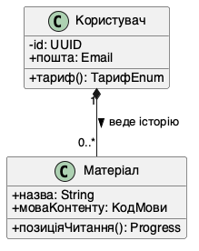
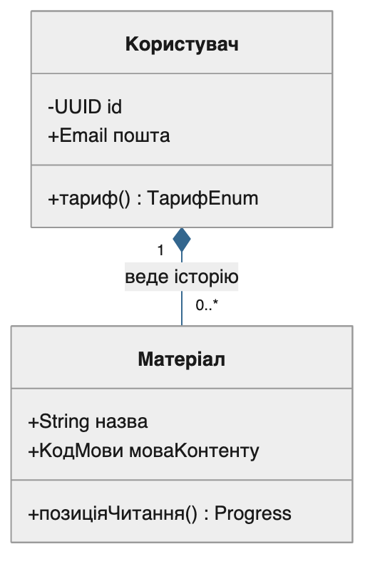
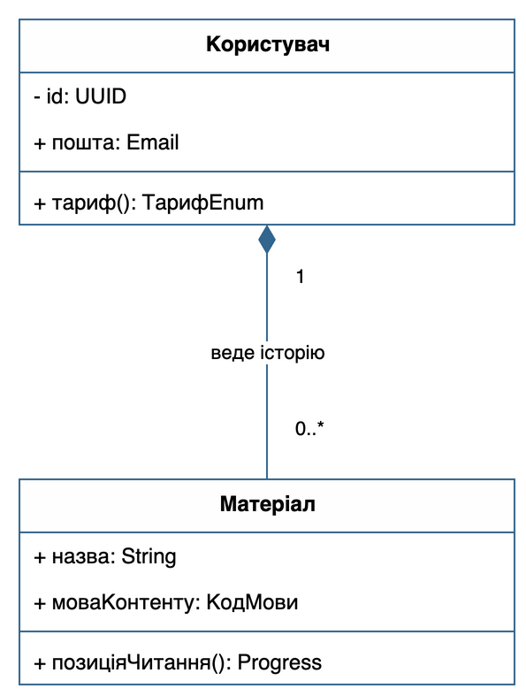
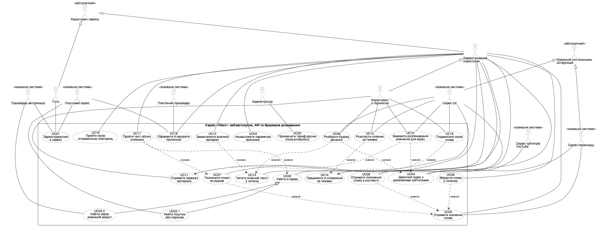
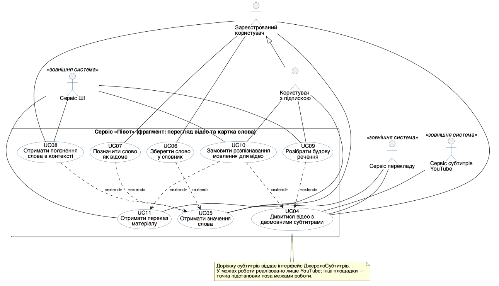
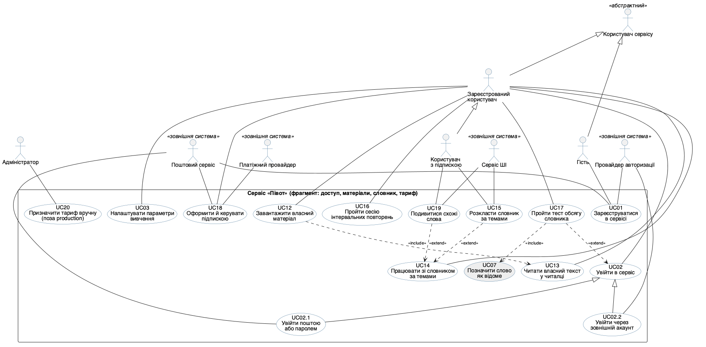

## Титульний аркуш

Структура звіту за п. 4 методички починається з титульного аркуша. Його поля наведено таблицею, і саме ця таблиця є єдиним джерелом правди для складальника звіту `build_docx.py`: титульну сторінку документа він будує з неї, а не з власних сталих, тому тема роботи в `.docx` не може розійтися з темою в джерелі звіту.

| Поле | Значення |
|---|---|
| Міністерство | Міністерство освіти і науки України |
| Заклад освіти | Житомирська політехніка |
| Кафедра | Кафедра ММСА |
| Номер роботи | Лабораторна робота № 1 |
| Дисципліна | Моделювання та аналіз програмного забезпечення |
| Назва роботи | Огляд CASE-інструментів моделювання та побудова діаграми варіантів використання |
| Варіант предметної області | «Півот» — вебсервіс і браузерне розширення для вивчення іноземної мови на основі власного контенту користувача |
| Виконавець | Камінський Олексій Дмитрович |
| Група | ВТ-23-2 |
| Місто й рік | Житомир – 2026 |

## Мета

**Варіант предметної області: «Півот» — вебсервіс і браузерне розширення для вивчення іноземної мови на основі власного контенту користувача.** Роботу виконав студент групи ВТ-23-2 Камінський Олексій Дмитрович.

Ознайомитися із сучасними CASE-інструментами моделювання програмного забезпечення, налаштувати робоче середовище для побудови UML-моделей та опанувати побудову діаграми варіантів використання (Use Case diagram) — першої моделі, що формалізує функціональні вимоги до системи.

Предметна область обрана спільною для всіх чотирьох лабораторних робіт курсу й для курсової роботи, і збігається з темою дипломної роботи. «Півот» (робочий домен `pivotsubs.com`) складається з двох частин. Браузерне розширення показує поверх відеоплеєра два рядки субтитрів одночасно — оригінал і переклад; кожне слово в репліці клікабельне, незнайомі слова підсвічені за профілем відомої лексики користувача. Вебзастосунок веде особистий словник із контекстом, читалку власних текстів, сесії інтервальних повторень, тест обсягу словника й підписку. Слово, збережене з субтитрів у розширенні, одразу потрапляє у словник вебзастосунку й у найближчу сесію повторень.

Межі моделі зафіксовано один раз і витримано в усіх чотирьох лабораторних роботах. Відеоплатформа розглядається одна — **YouTube**; джерело субтитрів заховане за інтерфейсом `ДжерелоСубтитрів`, тому інші площадки присутні в моделі лише як точка підстановки з позначкою «інші адаптери поза межами роботи». Штучний інтелект — це **зовнішній сервіс за API**: власних моделей система не має й не навчає, вона лише формує запит, кешує відповідь і списує денний ліміт. Мобільний застосунок і Safari-версія розширення залишені поза межами роботи як перспектива розвитку. Телеметрії й аналітики в системі свідомо немає.

## Розділ 1. Огляд CASE-інструментів і налаштування середовища

Методичка вимагає встановити (або підключити онлайн-версію) щонайменше два інструменти з переліку п. 1.1. Фактично підключено **три**: PlantUML, Mermaid і Draw.io. У кожному з них реально побудовано й відрендерено ту саму тестову діаграму (Розділ 2) — жоден інструмент не оцінювався «за описом».

**PlantUML** — основний інструмент, текстово-орієнтований CASE-засіб, що реалізує підхід «діаграма як код» (diagram-as-code). Встановлений локально через менеджер пакетів Homebrew; рендеринг виконує локальна збірка Graphviz.

**Mermaid** — другий текстовий інструмент із переліку п. 1.1. Підключений як пакет `@mermaid-js/mermaid-cli` і запускається через `npx` без глобальної інсталяції; рендерить діаграму в headless-браузері.

**Draw.io (diagrams.net)** — графічний редактор із переліку п. 1.1. Встановлено десктопну збірку через Homebrew (`brew install --cask drawio`, версія 28.2.5). Модель зберігається у власному форматі редактора `.drawio` (XML), а растрове зображення експортовано **засобами самого редактора** через його режим командного рядка.

Фактичний склад середовища на момент виконання роботи наведено нижче (вивід консолі).

```text
$ plantuml -version
PlantUML version 1.2026.8 / 149874a [2026-09-05 15:59:17 UTC]
(GPL source distribution)
Build Version: 1.2026.8
Git Commit: 149874a

$ dot -V
dot - graphviz version 16.1.0 (20260904.0139)

$ /opt/homebrew/opt/openjdk/bin/java -version
openjdk version "27" 2026-09-15
OpenJDK Runtime Environment Homebrew (build 27)
OpenJDK 64-Bit Server VM Homebrew (build 27, mixed mode, sharing)

$ node --version
v26.0.0

$ npx -y @mermaid-js/mermaid-cli@11 --version
11.17.0
```

Порівняльна таблиця інструментів за шістьма критеріями методички; сьомий рядок (робота з Git) додано, бо для курсового завдання модель зберігається в репозиторії разом із кодом.

| Критерій | PlantUML | Mermaid (mermaid-cli) | Draw.io / diagrams.net |
|---|---|---|---|
| Зручність інтерфейсу | Текстовий синтаксис, потребує звикання; жодного позиціонування мишею — розкладку будує Graphviz | Текстовий синтаксис, помітно лаконічніший за PlantUML, але й бідніший: немає `skinparam`, стилізація через окремий JSON-конфіг | Найпростіший старт: браузерна версія без інсталяції, палітра UML-фігур, drag-and-drop; розкладку повністю контролює автор |
| Швидкість побудови діаграми | Висока: головна діаграма роботи — 12 акторів, 22 овали і 35 асоціацій — описана 151 рядком коду, рендер PNG — 0,88 с | Висока для простих діаграм: тестова діаграма — 15 рядків файла проти 25 у PlantUML, рендер 1,01 с (із уже закешованим пакетом); запуск headless-браузера додає постійні накладні витрати | Нижча: кожен елемент і звʼязок розміщується вручну; у нашому випадку ті самі два класи зайняли 5463 байти XML проти 1066 байтів `.puml` |
| Підтримка типів UML-діаграм | Усі потрібні в курсі: use case, класів, обʼєктів, компонентів, розгортання, діяльності, станів, послідовності | Класів, послідовності, станів, діяльності, ER; **діаграми варіантів використання та розгортання не підтримуються** — саме тому головну діаграму ЛР1 зроблено не в ньому | Фігури для всіх основних типів, але без семантичної моделі (це «малювання», а не модель): редактор не завадить зʼєднати два актори стрілкою `<<include>>` |
| Генерація коду з моделі | Обмежена (переважно зворотний напрям: код → діаграма) | Відсутня | Відсутня |
| Інтеграція з ШІ-асистентами | Дуже зручна: LLM повертає готовий текст `.puml`, який одразу рендериться й перевіряється | Так само зручна, ще й вбудована в GitHub/GitLab Markdown — ШІ-чат рендерить Mermaid прямо у відповіді | Опосередкована: ШІ може повернути `.drawio`-XML, і редактор його відкриє (саме так зроблено в Розділі 2), але перевіряти згенеровані координати фігур людині важко |
| Робота з Git | Повноцінна: `.puml` — звичайний текст, diff і merge по рядках | Повноцінна: `.mmd` — текст, ще й рендериться прямо у вебінтерфейсі GitHub | `.drawio` — XML із координатами; будь-яке зсування фігури дає «шум» у diff |
| Вартість | Безкоштовно (GPL) | Безкоштовно (MIT) | Безкоштовно |

**Висновок:** для курсового завдання обрано PlantUML як основний інструмент — він безкоштовний, підтримує всі потрібні курсу типи діаграм (зокрема use case, яких немає в Mermaid), зберігає модель у текстовому вигляді й найкраще поєднується з ШІ-асистентом. Mermaid залишено як допоміжний для простих діаграм, що вставляються прямо в Markdown-документацію репозиторію, а Draw.io — для випадків, коли потрібна ручна «презентаційна» розкладка.

## Розділ 2. Тестова діаграма в кожному з інструментів

Для перевірки коректності налаштування середовища побудовано просту тестову діаграму з двох класів та одного відношення між ними. Її призначення за п. 2 Частини 1 методички — переконатися, що інструмент встановлено й що він коректно рендерить кирилицю. Пару класів узято **з власної предметної області**, а не абстрактну: `Користувач` і `Матеріал` — це перші дві сутності «Півота», і в Лабораторній роботі №2 вони входять у діаграму класів під тими самими іменами, де `Матеріал` стає абстрактним класом із двома нащадками (`Відео` і `Документ`). Завдяки цьому тестова діаграма не вносить у звіт жодного слова чужого словника, а трасовність до ЛР2 буквальна: те саме відношення між тими самими класами.

Відношення в тестовій діаграмі — **композиція «один до багатьох»** `Користувач "1" *-- "0..*" Матеріал`. Суцільний ромб стоїть з боку користувача: матеріал в історії не існує без власника, у базі даних звʼязок описаний як `ON DELETE CASCADE`, а один користувач веде історію з будь-якої кількості матеріалів, зокрема з нуля. Та сама кратність і той самий тип відношення повторені в ЛР2 без змін.

Одну й ту саму діаграму побудовано в усіх трьох інструментах — це і є перевірка налаштування середовища.

### 2.1. PlantUML

Файл `test_two_classes.puml`:

```text
@startuml
' Тестова діаграма для перевірки налаштування середовища PlantUML
' Лабораторна робота №1. Камінський Олексій Дмитрович, група ВТ-23-2
' Два класи з одним відношенням (композиція «один до багатьох»)
' Пара взята з власної предметної області: «Півот» — вебсервіс і браузерне
' розширення для вивчення іноземної мови на власному контенті користувача

skinparam defaultFontName "Helvetica"
skinparam classAttributeIconSize 0
skinparam shadowing false

class Користувач {
  - id: UUID
  + пошта: Email
  + тариф(): ТарифEnum
}

class Матеріал {
  + назва: String
  + моваКонтенту: КодМови
  + позиціяЧитання(): Progress
}

Користувач "1" *-- "0..*" Матеріал : веде історію >
@enduml
```

```text
$ plantuml -tsvg test_two_classes.puml && plantuml -tpng test_two_classes.puml
$ ls -l test_two_classes.puml test_two_classes.svg test_two_classes.png
-rw-r--r--  1 alex  staff   1066  test_two_classes.puml    (25 рядків)
-rw-r--r--  1 alex  staff   5415  test_two_classes.svg
-rw-r--r--  1 alex  staff   7678  test_two_classes.png     (219 x 276 px)
```



### 2.2. Mermaid

Та сама діаграма мовою Mermaid, файл `test_two_classes.mmd`:

```text
%% Тестова діаграма для перевірки налаштування середовища Mermaid
%% Лабораторна робота №1. Камінський Олексій Дмитрович, група ВТ-23-2
%% Ті самі два класи й те саме відношення, що й у test_two_classes.puml
classDiagram
    class Користувач {
        -UUID id
        +Email пошта
        +тариф() ТарифEnum
    }
    class Матеріал {
        +String назва
        +КодМови моваКонтенту
        +позиціяЧитання() Progress
    }
    Користувач "1" *-- "0..*" Матеріал : веде історію
```

Mermaid не має еквівалента `skinparam`, тому шрифт і кольори задаються окремим файлом конфігурації. Він лежить у теці лабораторної роботи під імʼям `mmdc.json` і передається ключем `-c`, тож наведена нижче команда відтворюється без жодних додаткових дій:

```text
$ cat mmdc.json
{
  "theme": "neutral",
  "themeVariables": {
    "fontFamily": "Helvetica, Arial, sans-serif",
    "fontSize": "14px",
    "primaryColor": "#FEFEFE",
    "primaryBorderColor": "#33668E",
    "primaryTextColor": "#1A1A1A",
    "lineColor": "#33668E"
  }
}
```

```text
$ npx -y @mermaid-js/mermaid-cli@11 -i test_two_classes.mmd \
      -o test_two_classes_mermaid.png -c mmdc.json -b white -s 2
Generating single mermaid chart
$ ls -l test_two_classes.mmd mmdc.json test_two_classes_mermaid.svg test_two_classes_mermaid.png
-rw-r--r--  1 alex  staff    719  test_two_classes.mmd            (15 рядків)
-rw-r--r--  1 alex  staff    256  mmdc.json
-rw-r--r--  1 alex  staff  20479  test_two_classes_mermaid.svg
-rw-r--r--  1 alex  staff  34554  test_two_classes_mermaid.png    (526 x 798 px)
```



Відмінності, помічені на практиці: Mermaid записує тип перед імʼям (`-UUID id` замість `- id: UUID`), сам обирає вертикальну розкладку і не підтримує стрілку напрямку читання відношення (`веде історію >`), тому підпис виводиться без неї. Ромб композиції Mermaid малює там само, де й PlantUML, — з боку класу-композита.

### 2.3. Draw.io

Спершу — про статус цього інструмента в роботі. Методичка (п. 1 Частини 1) вимагає **щонайменше два** інструменти з переліку п. 1.1. Другим інструментом у цій роботі вважається **Mermaid** — він є в тому самому переліку п. 1.1 і теж реально встановлений і запущений (п. 2.2). Draw.io наведено **третім, додатковим**, і нижче чесно описано, в якому саме обсязі він використаний.

Та сама діаграма у графічному редакторі. Модель збережено у власному форматі редактора — файл `test_two_classes.drawio` (XML mxGraph, 5463 байти): два елементи `swimlane` із трьома секціями кожен (назва, атрибути, операції) та ребро з підписом «веде історію», стилем `startArrow=diamondThin;startFill=1;endArrow=none` (суцільний ромб композиції з боку класу `Користувач`) і мітками кратності `1` та `0..*` на відповідних кінцях.

Робочий процес був таким: XML-модель збережено у форматі `.drawio`, після чого її відмалював і експортував сам редактор командою

```text
/Applications/draw.io.app/Contents/MacOS/draw.io --export --format png --scale 2 --border 10 \
    --output test_two_classes_drawio.png test_two_classes.drawio
```

(формат PNG, масштаб 2×, поле 10 px). Тут слід бути точним: фігури не перетягувалися мишею з палітри — їхні координати задано прямо в XML, який далі відкрив і відрендерив сам редактор. Для Draw.io це штатний спосіб роботи, бо `.drawio` і є його власним форматом моделі, але повного досвіду drag-and-drop-побудови ця робота не дає. Саме через це Draw.io і зарахований третім, додатковим інструментом, а вимогу методички про два інструменти закривають PlantUML і Mermaid, у яких текст моделі автор пише власноруч від першого до останнього рядка.

```text
$ ls -l test_two_classes.drawio test_two_classes_drawio.png
-rw-r--r--  1 alex  staff   5463  test_two_classes.drawio
-rw-r--r--  1 alex  staff  51680  test_two_classes_drawio.png   (595 x 787 px)
```



### 2.4. Що показало порівняння

| Показник (та сама діаграма) | PlantUML | Mermaid | Draw.io |
|---|---|---|---|
| Розмір файлу моделі | 1066 Б | 719 Б | 5463 Б |
| Рядків/вузлів, які пише автор | 25 рядків | 15 рядків | 13 XML-елементів із координатами |
| Хто визначає розкладку | Graphviz | Mermaid | автор |
| Статус у цій роботі | основний інструмент | другий інструмент за п. 1 Частини 1 | додатковий, третій |
| Розмір PNG | 219 × 276 px | 526 × 798 px | 595 × 787 px |
| Час рендерингу | 0,73 с | 1,01 с | експорт у редакторі, миттєво |

Окремо перевірено відображення кирилиці в усіх трьох інструментах: у PlantUML за це відповідає директива `skinparam defaultFontName "Helvetica"`, додана в кожен файл `.puml`; у Mermaid — `themeVariables.fontFamily` у файлі `mmdc.json`, що лежить у теці роботи; у Draw.io — `fontFamily=Helvetica` у стилі кожної фігури. Українські назви класів, атрибутів і ролей відображаються коректно, без «квадратиків» замість літер.

**Висновок:** середовище налаштовано коректно — вимогу методички про два інструменти закривають PlantUML і Mermaid, Draw.io підключено третім, і кожен із трьох відмалював ту саму тестову діаграму з класами `Користувач` і `Матеріал`. Головна відмінність, помічена під час порівняння, — у текстових інструментах зміст діаграми відокремлений від її розкладки (автор описує лише звʼязки), тоді як у графічному вони зберігаються разом, через що файл моделі стає у сім разів більшим і значно менш придатним до перегляду в `git diff`.

## Розділ 3. Актори системи

Актори визначалися за принципом «хто або що ініціює взаємодію або надає системі зовнішній сервіс». Крім очевидних людських ролей, до переліку включено шість зовнішніх систем і двох абстрактних акторів — по одному в людській і в машинній гілці. Разом **12 акторів**.

| Актор | Тип | Опис ролі |
|---|---|---|
| Користувач сервісу | Людина (абстрактний актор) | Не існує окремо: узагальнення всіх людей-споживачів сервісу. Несе спільну властивість — мовну пару й мову інтерфейсу, якою людина бачить сервіс незалежно від наявності акаунта |
| Гість | Людина | Спеціалізація «Користувача сервісу». Неавтентифікований відвідувач: читає вітрину й юридичні сторінки, створює акаунт |
| Зареєстрований користувач | Людина | Спеціалізація «Користувача сервісу». Власник акаунта на базовому тарифі: дивиться відео з двомовними субтитрами, веде словник, читає власні тексти, повторює слова в межах денних лімітів |
| Користувач з підпискою | Людина | Спеціалізація «Зареєстрованого користувача». Додатково має розпізнавання мовлення, розбір граматики, перекази, розкладку словника темами й експорт |
| Адміністратор | Людина | Неочевидна роль. У моделі за ним закріплено один сценарій — UC20 «Призначити тариф вручну (поза production)»: це службовий перемикач тарифу на екрані підписки, відкритий лише коли середовище не бойове. Решта обслуговування (міграції схеми БД, спостереження за денними лімітами й місячними стелями) виконується інструментами розгортання й моніторингу, а не через інтерфейс сервісу, тому варіантами використання не оформлена — див. пояснення нижче |
| Зовнішній постачальник ШІ-функцій | Зовнішня система (абстрактний актор) | Узагальнення двох постачальників, які викликаються за однаковим протоколом: запит → спільний кеш за відбитком вмісту → списання денного ліміту → тихий відкат при вичерпанні |
| Сервіс ШІ | Зовнішня система (другорядний актор) | Спеціалізація постачальника. Пояснення слова в контексті, розбір речення, переказ, розкладка слів темами, векторні подання, розпізнавання мовлення (Gemini / Anthropic) |
| Сервіс перекладу | Зовнішня система (другорядний актор) | Спеціалізація постачальника. Машинний і якісний переклад реплік та виділених фрагментів (Google Translate / DeepL за одним інтерфейсом) |
| Сервіс субтитрів YouTube | Зовнішня система (другорядний актор) | Віддає доріжку субтитрів відео (`timedtext`, json3) і метадані мови й автогенерації |
| Платіжний провайдер | Зовнішня система (другорядний актор) | Оформлення й ведення підписки, кабінет покупця, вебхуки про стан оплати (Polar як merchant of record) |
| Провайдер авторизації | Зовнішня система (другорядний актор) | Підтверджує особу користувача під час входу через зовнішній акаунт (Google OAuth) |
| Поштовий сервіс | Зовнішня система (другорядний актор) | Доставляє одноразові коди входу, листи скидання пароля й повідомлення про стан підписки (Resend) |

### Дві гілки узагальнення акторів: 5 відношень у двох гілках

Узагальнень акторів на діаграмі **пʼять** — рівно стільки відношень `<|--` записано в `usecase.puml`, — але вони утворюють **дві незалежні гілки**: людську (три відношення) і машинну (два). Далі в тексті «дві» означає гілки, «пʼять» — відношення; це одна й та сама річ, порахована на двох рівнях.

**Людська гілка:** `Користувач сервісу` ◁— `Гість` і `Користувач сервісу` ◁— `Зареєстрований користувач` — дві **паралельні** спеціалізації, а не ланцюг. Якби «Зареєстрований користувач» спадкував «Гостя», він успадкував би й UC01 «Зареєструватися в сервісі», передумова якого — відсутність акаунта. Далі `Зареєстрований користувач` ◁— `Користувач з підпискою`: тут спадкування **коректне**, бо підписник справді виконує всі сценарії базового тарифу й додає чотири платні.

Окремо варто пояснити, чому «Користувач з підпискою» тут є актором, хоча наявність підписки — це стан запису в базі. Підписка в цьому сервісі змінює не параметр сценарію, а **склад доступних сценаріїв**: чотири варіанти використання (UC09, UC10, UC11, UC15) без неї не існують взагалі. Це і є означення ролі. Суперечності з передумовами не виникає, бо UC18 сформульовано як «**оформити й керувати** підпискою»: підписник не «оформлює підписку вдруге», а керує картою, бачить залишки лімітів і скасовує продовження в кабінеті покупця.

**Машинна гілка:** `Зовнішній постачальник ШІ-функцій` ◁— `Сервіс ШІ` і ◁— `Сервіс перекладу`. Обидва викликаються системою за однаковим протоколом — запит, спільний кеш за відбитком вмісту, списання денного ліміту, тихий відкат при вичерпанні, — тому спільна поведінка винесена в абстрактного актора. Практична користь від цього узагальнення видна вже в ЛР3: саме воно перетворюється на **один компонент «Шар зовнішніх сервісів»**, який надає два інтерфейси — `IШІ` і `IПереклад` — замість двох незалежних компонентів-адаптерів. Тобто узагальнення акторів відображається на спільний компонент, а не на спільний інтерфейс: самі операції в ШІ й у перекладу різні, однаковий у них протокол виклику.

### Чому в абстрактного «Користувача сервісу» немає власних варіантів використання

Абстрактний актор на діаграмі зʼєднаний лише двома узагальненнями й не має жодної асоціації з овалом. Це свідоме рішення, а не пропуск. Єдине, що справді роблять і гість, і власник акаунта, — переглядають вітрину та юридичні сторінки, а цей перегляд не має власної мети навчання й не змінює стану системи, тому окремим варіантом використання не оформлений (див. відкинутих кандидатів у Розділі 4). Абстрактний актор залишений, бо він фіксує єдину точку спеціалізації для людської гілки й несе спільну властивість «мовна пара та мова інтерфейсу». У ЛР2 цей актор **власного класу не отримує**: спеціалізація «Зареєстрований користувач» відображається на звичайний (не абстрактний) клас `Користувач`, а мовна пара й мова інтерфейсу живуть рядками класу `НалаштуванняКористувача` — пари «ключ — значення», спільної для вебу й розширення. Абстрактним класом у діаграмі класів став `Матеріал`, а не користувач, і таблиця трасовності ЛР2 фіксує це прямо. Тобто абстрактний актор — інструмент саме цієї моделі вимог, а не заготовка під абстрактний клас. Якби викладач вимагав, щоб кожен актор мав хоча б один власний овал, найчеснішим доповненням був би UC «Переглянути вітрину сервісу» — саме його, а не штучне підняття UC04 на абстрактний рівень.

### Чому обовʼязки адміністратора звужено до одного сценарію

Адміністратор у цьому сервісі робить три речі: застосовує міграції схеми БД, спостерігає за витратою денних лімітів і місячних стель та може призначити тариф вручну, коли середовище не бойове. Варіантом використання стала лише третя: в продукті це видимий елемент керування на екрані підписки, доступний під прапорцем середовища `PIVOT_PLAN_OVERRIDE`, і людина справді досягає через нього власної мети. Перші дві виконуються **поза межею системи** — командою розгортання й засобами спостереження за сервером, — і в моделі варіантів використання їм немає місця: у них немає ні екрана, ні звернення до API сервісу. Їхнє природне місце — діаграма розгортання ЛР3, де є вузол сервера застосунку з артефактом «міграції схеми БД».

Раніше єдиною асоціацією адміністратора була лінія до UC18 «Оформити й керувати підпискою». Її прибрано: UC18 — сценарій покупця, у ньому людина оформлює підписку й керує власною картою, а службове призначення тарифу має іншу мету, іншу умову (не бойове середовище) й іншого актора. Змішувати їх однією лінією означало б стверджувати, що адміністратор оформлює комусь підписку, чого в системі немає.

**Висновок:** перелік акторів містить 12 позицій, із них 6 — зовнішні системи й 2 — абстрактні узагальнення; усі шість зовнішніх систем послідовно проведено як **другорядні** актори, бо жодна з них не ініціює сценарій заради власної мети.

## Розділ 4. Перелік варіантів використання

Визначено **20 варіантів використання** — удвічі більше за мінімум методички (8–10). На діаграмі їм відповідають 22 овали: UC02 показано разом із двома своїми спеціалізаціями UC02.1 і UC02.2 (узагальнення варіантів використання).

У колонці «Основний актор» для спеціалізованих UC02.1 і UC02.2 стоїть позначка «(успадковано від UC02)»: власної лінії до людського актора на діаграмі в них немає й бути не повинно — асоціації спеціалізованого варіанта використання успадковуються від узагальненого, і дублювати їх лініями означало б показати той самий звʼязок двічі.

| № | Назва | Основний актор | Другорядні актори | Тип звʼязків |
|---|---|---|---|---|
| UC01 | Зареєструватися в сервісі | Гість | Поштовий сервіс, Провайдер авторизації | — |
| UC02 | Увійти в сервіс | Зареєстрований користувач | — | предок UC02.1 і UC02.2 (узагальнення); база для `<<extend>>` UC17 |
| UC02.1 | Увійти поштою або паролем | Зареєстрований користувач (успадковано від UC02) | Поштовий сервіс | спеціалізація UC02 |
| UC02.2 | Увійти через зовнішній акаунт | Зареєстрований користувач (успадковано від UC02) | Провайдер авторизації | спеціалізація UC02 |
| UC03 | Налаштувати параметри вивчення | Зареєстрований користувач | — | — |
| UC04 | Дивитися відео з двомовними субтитрами | Зареєстрований користувач | Сервіс субтитрів YouTube, Сервіс перекладу | база для `<<extend>>` UC09 і UC10 |
| UC05 | Отримати значення слова | Зареєстрований користувач | Сервіс перекладу | база для `<<extend>>` UC06, UC07, UC08 |
| UC06 | Зберегти слово у словник | Зареєстрований користувач | — | `<<extend>>` → UC05 |
| UC07 | Позначити слово як відоме | Зареєстрований користувач | — | `<<extend>>` → UC05; ціль `<<include>>` з UC17 |
| UC08 | Отримати пояснення слова в контексті | Зареєстрований користувач | Сервіс ШІ | `<<extend>>` → UC05 |
| UC09 | Розібрати будову речення | Користувач з підпискою | Сервіс ШІ | `<<extend>>` → UC04 і → UC13 |
| UC10 | Замовити розпізнавання мовлення для відео | Користувач з підпискою | Сервіс ШІ | `<<extend>>` → UC04 і → UC11 |
| UC11 | Отримати переказ матеріалу | Користувач з підпискою | Сервіс ШІ | база для `<<extend>>` UC10 |
| UC12 | Завантажити власний матеріал | Зареєстрований користувач | — | `<<include>>` → UC13 |
| UC13 | Читати власний текст у читалці | Зареєстрований користувач | — | ціль `<<include>>` з UC12; база для `<<extend>>` UC09 |
| UC14 | Працювати зі словником за темами | Зареєстрований користувач | — | база для `<<extend>>` UC15 і UC19 |
| UC15 | Розкласти словник за темами | Користувач з підпискою | Сервіс ШІ | `<<extend>>` → UC14 |
| UC16 | Пройти сесію інтервальних повторень | Зареєстрований користувач | — | — |
| UC17 | Пройти тест обсягу словника | Зареєстрований користувач | — | `<<include>>` → UC07; `<<extend>>` → UC02 |
| UC18 | Оформити й керувати підпискою | Зареєстрований користувач | Платіжний провайдер, Поштовий сервіс | — |
| UC19 | Подивитися схожі слова | Користувач з підпискою | Сервіс ШІ | `<<extend>>` → UC14 |
| UC20 | Призначити тариф вручну (поза production) | Адміністратор | — | — |

### Короткий зміст варіантів використання

- **UC01.** Гість створює акаунт поштою або через зовнішній акаунт, у мастері першого запуску обирає мовну пару й акцент озвучки.
- **UC02.** Користувач отримує доступ до власного акаунта; UC02.1 — паролем або одноразовим кодом з пошти (тим самим кодом відновлюється доступ), UC02.2 — через зовнішній акаунт.
- **UC03.** Мовна пара, мова інтерфейсу, кегль і колір рядків субтитрів, зсув таймінгу, акцент; за потреби — власний ключ ШІ замість серверних лімітів.
- **UC04.** Поверх плеєра користувач бачить оригінал і переклад одночасно, перемикає режим показу, відкриває панель транскрипту, керує репліками клавішами, обирає джерело перекладу.
- **UC05.** Клік по слову в репліці або виділення фрагмента тексту відкриває картку: словникова стаття або машинний переклад, озвучка, джерело.
- **UC06.** Слово кладеться в особистий словник разом з реплікою-контекстом, посиланням на момент і мовною парою. Зовнішніх систем цей сценарій не торкається: у продукті збереження слова перевіряє сесію й стелю тарифу та пише рядок у словник, не звертаючись ні до ШІ, ні до перекладу.
- **UC07.** Слово виводиться з підсвічування; профіль відомої лексики окремий для кожної мови.
- **UC08.** Користувач просить ШІ сказати, що слово означає саме в цій репліці, а не в словнику взагалі.
- **UC09.** Переклад речення, роль кожного фрагмента, назва часу чи конструкції й пояснення «чому форма така».
- **UC10.** Для відео без субтитрів замовляється доріжка, зроблена ШІ; користувач спостерігає стан роботи.
- **UC11.** Стислий переказ відео чи власного тексту й оцінка «чи по силах» — зрозумілість матеріалу за власним профілем лексики.
- **UC12.** Текст додається вставкою, файлом (PDF, EPUB, DOCX, FB2, TXT, MD) або посиланням на статтю; за потреби користувач виправляє визначену мову.
- **UC13.** Читання з пагінацією й збереженням позиції, виділення фрагментів, перегляд збереженого з цього тексту, зміна шрифта й теми.
- **UC14.** Перегляд словника темами й повним списком, пошук, картка слова з розписанням повторень, видалення зайвого, вивантаження словника для зовнішніх застосунків і архіву власних даних.
- **UC15.** ШІ групує нерозібрані слова за смисловими темами; негруповане лишається в «Різному».
- **UC16.** Сесія вправами без кнопок самооцінки — оцінку виводить система з відповіді; можна відпрацювати окреме слово або одну тему. Вправа показує переклад, збережений у картці слова, і до довідника чи сервісу перекладу під час сесії не звертається.
- **UC17.** За хвилину користувач відмічає знайомі слова з частотних смуг і отримує оцінку «≈N слів» та рівень CEFR з історією зростання. Тест можна пройти як другий крок мастера знайомства — той мастер відкривається вже в оболонці застосунку, тобто після входу, — або будь-коли потім з екрана словника.
- **UC18.** Оформлення підписки, залишки лімітів і стель, керування картою й скасуванням у кабінеті покупця.
- **UC19.** Для відкритої картки слова сервіс показує схожі за змістом записи з власного словника користувача: ШІ рахує векторні подання контекстів, а пошук іде по них. Саме тут у моделі зʼявляються «векторні подання» з опису сервісу ШІ.
- **UC20.** Адміністратор призначає акаунту тариф вручну службовим перемикачем на екрані підписки; у бойовому середовищі перемикач недоступний.

### Відкинуті кандидати: що свідомо не стало варіантом використання

| Кандидат | Чому відкинуто | Куди перенесено |
|---|---|---|
| «Отримати доріжку субтитрів з YouTube» | Внутрішній крок системи, а не закінчена одиниця функціональності для актора: користувач ставить за мету дивитися відео, а не «отримати доріжку» | Основний потік UC04, крок 3 |
| «Перекласти репліку» | Те саме: користувач не ставить за мету переклад окремої репліки, він хоче бачити два рядки субтитрів | Основний потік UC04, кроки 5–6 |
| «Перевірити денний ліміт тарифу» | Внутрішнє розгалуження системи без власного актора; на діаграмі висіло б без асоціацій | Альтернативні потоки UC04, UC05, UC12 і майбутня діаграма діяльності ЛР4 |
| «Зберегти позицію читання» | Побічний ефект кроку читання, а не мета | Основний потік UC13 |
| «Переглянути історію матеріалів і залишки лімітів» | Перегляд без власної мети: це стартовий екран, присутній усередині UC04, UC14 і UC18 | Передумови UC04 і UC14 |
| «Автентифікуватися» як `<<include>>` до кожного UC | Дало б 19 однакових пунктирних стрілок до UC02 і зробило б діаграму нечитабельною | Передумова «користувач автентифікований» в усіх UC, крім UC01 |
| «Показати картку збереженого слова» як окремий UC | Кандидат зʼявився, коли зʼясувалося, що сесія повторень показує не словникову статтю, а вже збережений переклад картки. Але це внутрішній крок вправи без власної мети актора — той самий тип помилки, що й «Перекласти репліку» | Основний потік UC16 |

**Висновок:** перелік містить 20 варіантів використання; сім кандидатів свідомо відкинуто, бо вони описували внутрішні кроки реалізації, а не цінність для актора — саме ця перевірка відрізняє модель вимог від функціональної декомпозиції.

## Розділ 5. Діаграма варіантів використання

Діаграму побудовано в PlantUML, файл `usecase.puml`. Межу системи задано конструкцією `rectangle "Сервіс «Півот»: вебзастосунок, API та браузерне розширення" { ... }`: усі 22 овали розміщено всередині прямокутника, усі 12 акторів — зовні. Межа проведена саме так, бо «Півот» — це не лише вебсервер: розширення в браузері користувача є частиною системи, а не зовнішнім актором, тоді як сторінка YouTube, з якої розширення читає доріжку, лишається зовні.

Асоціації «актор — варіант використання» намальовано **простою лінією** `--` без стрілок, як того вимагає таблиця нотації п. 1.2 методички. Напрямок залишено тільки там, де він несе зміст: трикутна головка `<|--` в узагальненнях і пунктирна стрілка `..>` у `<<include>>` та `<<extend>>`.

```text
@startuml
' Лабораторна робота №1. Діаграма варіантів використання (Use Case diagram)
' Предметна область: «Півот» — вебсервіс і браузерне розширення
' для вивчення іноземної мови на основі власного контенту користувача
' Камінський Олексій Дмитрович, група ВТ-23-2

skinparam defaultFontName "Helvetica"
skinparam shadowing false
skinparam nodesep 14
skinparam ranksep 95
skinparam packageStyle rectangle
skinparam ArrowFontSize 11
skinparam usecase {
  BackgroundColor #FEFEFE
  BorderColor #33668E
}
skinparam actor {
  BorderColor #33668E
}
top to bottom direction

' ======== АКТОРИ-ЛЮДИ ========
actor "Користувач сервісу" as User <<абстрактний>>
actor "Гість" as Guest
actor "Зареєстрований\nкористувач" as Reg
actor "Користувач\nз підпискою" as Sub
actor "Адміністратор" as Admin

' ======== УЗАГАЛЬНЕННЯ АКТОРІВ-ЛЮДЕЙ (generalization) ========
' абстрактний батько, дві паралельні спеціалізації (гість і власник акаунта),
' підписка — спеціалізація зареєстрованого користувача
User <|-- Guest
User <|-- Reg
Reg <|-- Sub

' ======== МЕЖА СИСТЕМИ ========
rectangle "Сервіс «Півот»: вебзастосунок, API та браузерне розширення" {

  ' --- доступ до сервісу й налаштування ---
  usecase "UC01\nЗареєструватися\nв сервісі" as UC01
  usecase "UC02\nУвійти в сервіс" as UC02
  usecase "UC02.1\nУвійти поштою\nабо паролем" as UC02a
  usecase "UC02.2\nУвійти через\nзовнішній акаунт" as UC02b
  usecase "UC03\nНалаштувати параметри\nвивчення" as UC03

  ' --- відео з двомовними субтитрами ---
  usecase "UC04\nДивитися відео з\nдвомовними субтитрами" as UC04
  usecase "UC10\nЗамовити розпізнавання\nмовлення для відео" as UC10
  usecase "UC11\nОтримати переказ\nматеріалу" as UC11

  ' --- робота зі словом і реченням ---
  usecase "UC05\nОтримати значення\nслова" as UC05
  usecase "UC06\nЗберегти слово\nу словник" as UC06
  usecase "UC07\nПозначити слово\nяк відоме" as UC07
  usecase "UC08\nОтримати пояснення\nслова в контексті" as UC08
  usecase "UC09\nРозібрати будову\nречення" as UC09

  ' --- власні матеріали ---
  usecase "UC12\nЗавантажити власний\nматеріал" as UC12
  usecase "UC13\nЧитати власний текст\nу читалці" as UC13

  ' --- словник, повторення, рівень ---
  usecase "UC14\nПрацювати зі словником\nза темами" as UC14
  usecase "UC15\nРозкласти словник\nза темами" as UC15
  usecase "UC16\nПройти сесію\nінтервальних повторень" as UC16
  usecase "UC17\nПройти тест обсягу\nсловника" as UC17
  usecase "UC19\nПодивитися схожі\nслова" as UC19

  ' --- тариф ---
  usecase "UC18\nОформити й керувати\nпідпискою" as UC18
  usecase "UC20\nПризначити тариф вручну\n(поза production)" as UC20
}

' ======== ЗОВНІШНІ СИСТЕМИ (другорядні актори) ========
actor "Зовнішній постачальник\nШІ-функцій" as Provider <<абстрактний>>
actor "Сервіс ШІ" as Ai <<зовнішня система>>
actor "Сервіс перекладу" as Tr <<зовнішня система>>
actor "Сервіс субтитрів\nYouTube" as YT <<зовнішня система>>
actor "Платіжний провайдер" as Pay <<зовнішня система>>
actor "Провайдер авторизації" as OAuth <<зовнішня система>>
actor "Поштовий сервіс" as Mail <<зовнішня система>>

' ======== УЗАГАЛЬНЕННЯ ЗОВНІШНІХ АКТОРІВ (generalization) ========
' обидва постачальники викликаються однаково: запит -> спільний кеш ->
' списання денного ліміту -> тихий відкат при вичерпанні
Provider <|-- Ai
Provider <|-- Tr

' ======== УЗАГАЛЬНЕННЯ ВАРІАНТІВ ВИКОРИСТАННЯ (generalization) ========
' та сама мета «отримати доступ до власного акаунта», різні вторинні актори
UC02 <|-- UC02a
UC02 <|-- UC02b

' ======== АСОЦІАЦІЇ АКТОРІВ-ЛЮДЕЙ (основні актори) ========
Guest -- UC01

Reg -- UC02
Reg -- UC03
Reg -- UC04
Reg -- UC05
Reg -- UC06
Reg -- UC07
Reg -- UC08
Reg -- UC12
Reg -- UC13
Reg -- UC14
Reg -- UC16
Reg -- UC17
Reg -- UC18

Sub -- UC09
Sub -- UC10
Sub -- UC11
Sub -- UC15
Sub -- UC19

Admin -- UC20

' ======== АСОЦІАЦІЇ ЗОВНІШНІХ СИСТЕМ (другорядні актори) ========
Mail -- UC01
OAuth -- UC01
Mail -- UC02a
OAuth -- UC02b
YT -- UC04
Tr -- UC04
Tr -- UC05
Ai -- UC08
Ai -- UC09
Ai -- UC10
Ai -- UC11
Ai -- UC15
Ai -- UC19
Pay -- UC18
Mail -- UC18

' ======== ВІДНОШЕННЯ <<include>> (від базового до включеного) ========
UC17 ..> UC07 : <<include>>
UC12 ..> UC13 : <<include>>

' ======== ВІДНОШЕННЯ <<extend>> (від розширювального до базового) ========
UC06 ..> UC05 : <<extend>>
UC07 ..> UC05 : <<extend>>
UC08 ..> UC05 : <<extend>>
UC09 ..> UC04 : <<extend>>
UC09 ..> UC13 : <<extend>>
UC10 ..> UC04 : <<extend>>
UC10 ..> UC11 : <<extend>>
UC15 ..> UC14 : <<extend>>
UC19 ..> UC14 : <<extend>>
UC17 ..> UC02 : <<extend>>
@enduml
```

```text
$ plantuml -tsvg usecase.puml && plantuml -tpng usecase.puml
$ ls -l usecase.puml usecase.svg usecase.png
-rw-r--r--  1 alex  staff    6305  usecase.puml   (151 рядок)
-rw-r--r--  1 alex  staff   50578  usecase.svg
-rw-r--r--  1 alex  staff  153377  usecase.png    (2737 x 1044 px)
```



### Читабельність: дві тематичні проєкції тієї самої моделі

Повна діаграма містить 12 акторів, 22 овали і 35 асоціацій — цього достатньо, щоб частина звʼязків на ній перетиналася. Щоб не жертвувати повнотою моделі заради зовнішнього вигляду, додатково побудовано дві **проєкції** тієї самої моделі: у них не змінено жодного елемента й жодного типу відношення, просто показано різні підмножини. Проєкції доповнюють рисунок 4, а не замінюють його.

Проєкція №1 — ядро теми дипломної роботи: перегляд відео з двомовними субтитрами й картка слова. Тут зібрані всі три зовнішні постачальники контенту й усі розширення, що зростають з UC05.



Проєкція №2 — доступ до сервісу, власні матеріали, словник і тариф. Один овал, UC07, позначено сірим: він належить першій проєкції й наведений тут лише як ціль відношення `<<include>>` з UC17.



### Обґрунтування вибору типів відношень

Двох `<<include>>` і десяти `<<extend>>` ужито не «для демонстрації», а за єдиним критерієм: чи може базовий сценарій дійти до своєї мети без цього кроку. Критерій застосовано в обидві сторони: один `<<include>>`, який був у чернетці моделі, перевірку не пройшов і прибраний — про це нижче окремо.

| Відношення | Тип | Чому саме так |
|---|---|---|
| UC17 → UC07 | `<<include>>` | Тест обсягу словника **завжди** завершується поповненням профілю відомої лексики — прямі відмітки плюс слова, виведені за частотним рангом. Без цього результат тесту не має для користувача жодного наслідку: оцінка «≈4200 слів» не впливає ні на підсвічування, ні на зрозумілість матеріалів. Це обовʼязкова частина сценарію |
| UC12 → UC13 | `<<include>>` | Завантаження матеріалу **завжди** закінчується відкриттям тексту в читалці — сервіс робить перехід автоматично. Сценарій «завантажив і нічого не побачив» цінності не дає й у системі не існує |
| UC06, UC07, UC08 → UC05 | `<<extend>>` | Точка розширення «картка слова відкрита». Базовий сценарій самодостатній: людина подивилася значення й пішла далі. Кожне продовження має власну умову — вільний ліміт збережених слів для UC06, вільний денний ліміт пояснень для UC08 |
| UC09 → UC04, UC09 → UC13 | `<<extend>>` | Точка розширення «речення вибране», умова входу — тариф із доступом до граматики. Саме `extend`, бо переглянути відео й прочитати власний текст можна жодного разу не розібравши речення. Два відношення, бо точка розширення є і в плеєрі, і в читалці |
| UC10 → UC04 | `<<extend>>` | Умова «у відео немає придатної доріжки субтитрів». У переважній більшості сеансів розпізнавання не потрібне взагалі |
| UC10 → UC11 | `<<extend>>` | Умова «переказ замовлено для відео без доріжки»: щоб переказати таке відео, спершу треба отримати з нього текст |
| UC15 → UC14 | `<<extend>>` | Умова «є нерозібрані слова і тариф дозволяє». Словник повністю працює й без ШІ-розкладки: є повний список, пошук і картка слова |
| UC19 → UC14 | `<<extend>>` | Точка розширення «картка слова відкрита зі словника», умова — тариф із доступом до пошуку схожих фраз. Словник досягає своєї мети без цього кроку, а сам пошук має власну зовнішню залежність: векторні подання контекстів рахує сервіс ШІ |
| UC17 → UC02 | `<<extend>>` | Тест обсягу словника — другий крок мастера знайомства, який можна пропустити. Базою взято саме UC02 «Увійти в сервіс», а не UC01 «Зареєструватися»: мастер відкривається в оболонці застосунку, куди людина потрапляє після входу, і тест вимагає акаунта, мовної пари й профілю лексики. Основний актор у UC02 і UC17 один і той самий — зареєстрований користувач, тому розширення не перетинає акторів |
| UC02 ◁— UC02.1, UC02.2 | узагальнення UC | Та сама мета — отримати доступ до власного акаунта, той самий основний актор, той самий результат, але **різні другорядні актори**: пошта в одному випадку, провайдер авторизації в іншому. Це класична підстава для узагальнення, а не для `<<extend>>`: жоден зі способів входу не є «додатком» до іншого |

### Чому `<<include>>` саме два, а не три

У чернетці моделі був третій `<<include>>`: UC16 «Пройти сесію інтервальних повторень» → UC05 «Отримати значення слова» з обґрунтуванням «у кожній вправі значення слова показується обовʼязково». Перевірка його не підтвердила, і він прибраний з двох причин.

По-перше, він суперечить власній специфікації UC05 з Розділу 6: її передумова — «на екрані відкрито матеріал: репліка субтитрів у плеєрі, сторінка власного тексту в читалці або виділений фрагмент», а перший крок основного потоку — «користувач клікає слово». У сесії повторень не виконується ні передумова, ні перший крок: матеріал не відкритий, і людина нічого не клікає. Включений сценарій, який неможливо виконати всередині базового, — не `include`, а помилка.

По-друге, він суперечить продукту. Вправа сесії показує **переклад, уже збережений у картці слова** (він потрапив туди під час UC06 разом із реплікою-контекстом), і жодного звернення ні до спільного довідника, ні до сервісу перекладу під час сесії немає. «Показати збережений переклад» і «виконати UC05» — різні речі, і підміна одного іншим була єдиною підставою для того `include`.

Кандидат «замінити на `<<include>>` до нового дрібного UC «Показати картку збереженого слова»» теж відкинуто: це внутрішній крок вправи без власної мети актора (див. таблицю відкинутих кандидатів у Розділі 4). Окремо розглядався й кандидат UC01 → UC03 `<<include>>` — реєстрація справді завжди закінчується вибором мовної пари в мастері. Його не взято, бо UC03 асоційований із зареєстрованим користувачем, а UC01 — з гостем: включення протягло б сценарій власника акаунта всередину сценарію гостя, тобто повернуло б те саме зчеплення акторів, якого ця модель уникає свідомо.

Мінімум методички («щонайменше 8–10 UC, включно з прикладами `<<include>>`, `<<extend>>` та хоча б одним узагальненням») двома включеннями виконано; штучно нарощувати їх кількість за рахунок неправдивого відношення — гірше, ніж мати на одне менше.

### Напрямки стрілок

Окремо варто пояснити напрямки стрілок, бо саме на них найчастіше помиляються: `<<include>>` малюється **від базового сценарію до включеного** (UC12 → UC13: завантаження викликає читалку), а `<<extend>>` — **від розширювального до базового** (UC06 → UC05: збереження доповнює картку слова). На діаграмі ці два стереотипи дивляться в протилежні боки, і це правильно.

**Висновок:** на діаграмі застосовано всі три обовʼязкові типи відношень — 2 `<<include>>`, 10 `<<extend>>`, 5 узагальнень акторів у двох гілках (3 у людській, 2 у машинній) і 2 узагальнення варіантів використання; кожне відношення обґрунтоване перевіркою «чи дійде базовий сценарій до мети без цього кроку», і один `<<include>>`, який цієї перевірки не пройшов, з моделі прибрано.

## Розділ 6. Текстові специфікації ключових варіантів використання

Повні специфікації складено за структурою п. 1.3 методички для трьох варіантів використання, що найточніше описують тему роботи: UC04 — ядро браузерного розширення, UC05 — вузол, у якому сходяться розширення й вебзастосунок, і UC12 — вхід власного контенту користувача, названого прямо в темі роботи. Саме сюди перенесено внутрішні кроки системи, відкинуті як кандидати в Розділі 4.

### UC04 — Дивитися відео з двомовними субтитрами

| Поле | Значення |
|---|---|
| ID / Назва | UC04 — Дивитися відео з двомовними субтитрами |
| Актор(и) | Зареєстрований користувач (основний); Сервіс субтитрів YouTube, Сервіс перекладу (другорядні) |
| Передумови | Користувач автентифікований у сервісі; розширення встановлене й повʼязане з акаунтом; у налаштуваннях задано мовну пару (UC03); відкрито сторінку відео на YouTube |
| Основний потік | 1. Користувач відкриває сторінку відео. 2. Розширення знаходить плеєр і визначає ідентифікатор відео. 3. Розширення звертається до сервісу субтитрів YouTube і отримує доріжку реплік оригінальною мовою. 4. Система шукає переклад доріжки у спільному кеші за її відбитком; при влучанні крок 5 пропускається. 5. Система надсилає доріжку до сервісу перекладу частинами по ≤20 000 знаків, причому частина під курсором іде першою, і списує денний ліміт. 6. Система зберігає переклад у спільний кеш за відбитком доріжки. 7. Розширення вимикає рідні субтитри плеєра й малює поверх відео два рядки — оригінал і переклад. 8. Слова, яких немає у профілі відомої лексики, підсвічуються. 9. Користувач дивиться відео; на кожній зміні часу оверлей показує поточну репліку. 10. Користувач за потреби перемикає режим показу, відкриває панель транскрипту, повторює репліку або робить крок назад і вперед клавішами. 11. Користувач закриває вкладку; система зберігає позицію перегляду й відсоток зрозумілості матеріалу в історію |
| Альтернативні потоки | 3а. У відео немає придатної доріжки субтитрів — для тарифу з підпискою система пропонує «Замовити розпізнавання мовлення» (`<<extend>>` UC10); для базового тарифу показується пояснення, і сценарій завершується. 3б. У плеєрі ввімкнено автопереклад — система додатково запитує доріжку оригінальною мовою, інакше обидва рядки були б перекладом. 4а. Користувач обрав джерелом перекладу готову доріжку платформи — кроки 5–6 не виконуються. 5а. Денний ліміт перекладу вичерпано — відбувається тихий відкат на базового постачальника перекладу без повідомлення про помилку; якщо недоступний і він, показується лише оригінал. 5б. Сервіс перекладу недоступний — система показує оригінальний рядок, позначає переклад як тимчасово недоступний і повторює спробу на наступній частині. 9а. Користувач клікає слово в репліці — виконується UC05 «Отримати значення слова». 9б. Користувач клікає речення — за наявності тарифу виконується `<<extend>>` UC09 «Розібрати будову речення» |
| Постумови | Відео показане з двома рядками субтитрів; переклад доріжки збережений у спільному кеші й доступний наступним глядачам того самого відео без повторних витрат; у історії користувача зʼявився запис з оцінкою зрозумілості; денний ліміт зменшено на фактично перекладений обсяг |

### UC05 — Отримати значення слова

| Поле | Значення |
|---|---|
| ID / Назва | UC05 — Отримати значення слова |
| Актор(и) | Зареєстрований користувач (основний); Сервіс перекладу (другорядний) |
| Передумови | Користувач автентифікований; на екрані відкрито матеріал — репліка субтитрів у плеєрі, сторінка власного тексту в читалці або будь-який виділений фрагмент на сторінці; задано мовну пару |
| Основний потік | 1. Користувач клікає слово в репліці або виділяє фрагмент тексту. 2. Система визначає лему слова й мову джерела. 3. Система шукає словникову статтю для цієї пари мов у спільному довіднику. 4. Якщо стаття знайдена — показуються її головні значення й частини мови; якщо ні — система звертається до сервісу перекладу за машинним перекладом. 5. Система відкриває картку слова: значення, контекстна репліка, кнопка озвучки з обраним акцентом і позначка джерела (довідник або машинний переклад). 6. Користувач читає картку й закриває її |
| Альтернативні потоки | 2а. Виділено кілька слів — система обробляє фрагмент як словосполучення й одразу йде до кроку 4. 3а. Прямої пари мов у довіднику немає — пара будується через англійську, у картці зазначається, що переклад непрямий. 4а. Сервіс перекладу недоступний — картка показує лише словникову статтю або повідомлення «переклад тимчасово недоступний»; перегляд матеріалу не переривається. 5а. Користувач натискає «Зберегти» — виконується `<<extend>>` UC06 «Зберегти слово у словник» за умови вільного ліміту збережених слів. 5б. Користувач натискає «Знаю» — виконується `<<extend>>` UC07 «Позначити слово як відоме». 5в. Користувач натискає «Пояснити в контексті» — виконується `<<extend>>` UC08 за умови вільного денного ліміту пояснень; при вичерпаному ліміті кнопка показує залишок і пропонує UC18 |
| Постумови | Користувач побачив значення слова; стан системи не змінився, якщо не спрацювало жодне з трьох розширень; звернення до сервісу перекладу (якщо воно було) збережене у спільний кеш і списане з денного ліміту |

### UC12 — Завантажити власний матеріал

| Поле | Значення |
|---|---|
| ID / Назва | UC12 — Завантажити власний матеріал |
| Актор(и) | Зареєстрований користувач (основний) |
| Передумови | Користувач автентифікований; у налаштуваннях задано мовну пару; залишок денного ліміту на завантаження матеріалів не вичерпано |
| Основний потік | 1. Користувач відкриває екран «Новий текст». 2. Користувач обирає спосіб: вставити текст, надіслати файл або вказати посилання на статтю. 3. Система приймає джерело й перевіряє розмір і формат. 4. Система обирає парсер за розширенням і MIME-типом файла (PDF, EPUB, DOCX, FB2, TXT, MD або HTML статті). 5. Парсер витягує текст і, для PDF, справжні межі сторінок оригіналу. 6. Система визначає мову тексту евристикою й показує її користувачеві. 7. Система розбиває текст на сторінки за обраною одиницею й обчислює карту частот слів. 8. Система рахує зрозумілість матеріалу за профілем відомої лексики користувача. 9. Система зберігає документ і створює запис в історії матеріалів. 10. Система автоматично відкриває текст у читалці — виконується `<<include>>` UC13 «Читати власний текст у читалці» |
| Альтернативні потоки | 3а. Файл перевищує обмеження розміру — система відмовляє, називаючи фактичний і допустимий розмір у мегабайтах; сценарій завершується невдало. 3б. Денний ліміт завантажень вичерпано — система показує залишок і пропонує UC18 «Оформити й керувати підпискою». 4а. Формат не підтримується жодним парсером — система називає перелік підтримуваних форматів. 5а. PDF складається зі сканованих зображень без текстового шару — система повідомляє, що текст витягти неможливо. 6а. Мову визначено невпевнено — користувач виправляє її вручну зі списку мов, і крок 7 повторюється. 9а. Такий самий відбиток вмісту вже є в акаунті — система не створює дублікат, а відкриває наявний документ на збереженій позиції |
| Постумови | Документ збережений і повʼязаний з акаунтом; у історії зʼявився запис з назвою, мовою й оцінкою зрозумілості; текст відкритий у читалці на першій сторінці; денний ліміт завантажень зменшено на одиницю |

**Висновок:** текстові специфікації показують те, чого графічна діаграма не передає: порядок кроків, умови спрацювання розширень і поведінку системи у відмовних ситуаціях — зокрема тихий відкат при вичерпаних лімітах і роботу спільного кеша, завдяки якому другий глядач того самого відео не коштує сервісу нічого.

## Критичний аналіз ШІ-чернетки

Чернетку діаграми було згенеровано ШІ-асистентом за текстовим описом предметної області, після чого проведено ручну перевірку на відповідність реальній логіці сервісу й означенням з методички. Перевірка робилася у два проходи: перший — за означеннями нотації, другий — звіренням кожного другорядного актора й кожного `<<include>>` із кодом продукту. Другий прохід виявився результативнішим за перший: саме він зняв з діаграми три відношення, що виглядали бездоганно. Нижче — шість реальних помилок саме цієї чернетки та внесені виправлення.

| Помилка ШІ-чернетки | Чому це помилка | Як виправлено |
|---|---|---|
| **Функціональна декомпозиція замість варіантів використання.** Чернетка видала 24 овали, серед яких «Отримати доріжку субтитрів з YouTube», «Перекласти репліку», «Перевірити денний ліміт тарифу», «Зберегти позицію читання» | Це внутрішні кроки системи, а не «закінчена одиниця функціональності, яку система надає актору» (п. 1.2). Два з них — «Перевірити денний ліміт» і «Зберегти позицію читання» — узагалі не мали жодного актора й висіли на діаграмі без асоціацій. ШІ оптимізує кількість елементів, а не їхню змістовність | Чотири кандидати прибрано з діаграми й перенесено в основні та альтернативні потоки специфікацій UC04, UC12 і UC13 (перелік — у таблиці Розділу 4) |
| **Вигаданий другорядний актор: «Сервіс ШІ» на UC06 «Зберегти слово у словник».** Чернетка пояснила це тим, що в описі сервісу ШІ згадані «векторні подання» | Це класична галюцинація за асоціацією: властивість із опису актора приклеєна до першого ж сценарію, де згадується слово. У продукті збереження слова перевіряє сесію й стелю тарифу та пише рядок у словник — жодного звернення ні до ШІ, ні до векторів у ньому немає. Вектори справді є, але рахуються ліниво й в іншому сценарії | Асоціацію «Сервіс ШІ — UC06» прибрано з діаграми й з колонки «Другорядні актори». Щоб векторні подання не зникли з моделі безпідставно, доданий окремий UC19 «Подивитися схожі слова» з актором «Сервіс ШІ» і `<<extend>>` до UC14 — саме там вони й працюють |
| **Хибний `<<include>>`: UC16 «Пройти сесію інтервальних повторень» → UC05 «Отримати значення слова».** Обґрунтування чернетки — «у кожній вправі значення слова показується обовʼязково» | Відношення суперечить і власній специфікації UC05 (її передумова — відкритий матеріал, перший крок — клік по слову; у сесії не виконується ні те, ні те), і продукту: вправа показує переклад, уже збережений у картці слова, і до довідника чи сервісу перекладу під час сесії не звертається. Обґрунтування підмінило «показати збережений переклад» на «виконати UC05» | `<<include>>` прибрано; у Розділі 5 додано підрозділ, де показано, чому включень саме два, і чому заміна на дрібний UC «Показати картку збереженого слова» теж відкинута |
| **`<<extend>>`, що перетинає акторів: UC17 «Пройти тест обсягу словника» → UC01 «Зареєструватися в сервісі»** | Розширення виконується в межах екземпляра базового сценарію, а UC01 належить Гостю. Модель твердила, що гість — без акаунта, мовної пари й профілю лексики — проходить сценарій зареєстрованого користувача, тобто повертала те саме зчеплення акторів, якого Розділ 3 спеціально уникає, відмовившись успадкувати «Зареєстрованого користувача» від «Гостя». У продукті мастер знайомства відкривається в оболонці застосунку, тобто вже після входу | Базу змінено на UC02 «Увійти в сервіс»: основний актор у UC02 і UC17 один і той самий, умова входу («мастер знайомства ще не пройдено») збереглася, а передумови специфікації більше не порушуються |
| **`<<include>>` замість `<<extend>>` на поясненні слова в контексті (UC08).** Чернетка зробила пояснення обовʼязковою частиною картки слова | Пояснення в контексті — платна операція з денним лімітом: при вичерпанні ліміту система мовчки показує картку без пояснення. `<<include>>` означав би, що без відповіді ШІ картку слова взагалі не можна показати, і будь-який збій зовнішнього сервісу ламав би перегляд відео | Замінено на `<<extend>>` від UC08 до UC05 з явною умовою «вільний денний ліміт пояснень». В альтернативний потік UC05 додано поведінку при вичерпаному ліміті |
| **Зовнішні системи записано основними акторами, а людські обовʼязки — злиті в один овал.** У чернетці основним актором UC18 був платіжний провайдер, UC15 ініціював сервіс ШІ, а адміністратор висів на тому самому UC18, що й покупець | Основний актор — той, хто ініціює сценарій і заради чиєї мети система його виконує; викликана зовнішня система завжди другорядна. Спільна лінія адміністратора й покупця до UC18 твердила, що адміністратор оформлює комусь підписку, хоча службова дія має іншу мету, іншу умову (не бойове середовище) й іншого актора | Колонку таблиці Розділу 4 розділено на «Основний актор» і «Другорядні актори», усі шість зовнішніх систем переведено в другорядні. Службову дію винесено в окремий UC20 «Призначити тариф вручну (поза production)», а лінію «Адміністратор — UC18» прибрано |

**Висновок:** ШІ-асистент справді прискорив роботу — чернетка з приблизним переліком акторів і варіантів використання зʼявилася за кілька хвилин замість години ручного переліку. Проте жодне з шести виправлень не могло бути зроблене без розуміння саме цієї предметної області: щоб помітити вигаданий звʼязок «Сервіс ШІ — UC06», треба знати, що робить збереження слова в коді, а щоб зняти `<<include>>` з сесії повторень — знати, що вправа показує збережений переклад, а не словникову статтю. Найнебезпечнішими виявилися не плутанина стереотипів, яку видно одразу, а два типи правдоподібних помилок: функціональна декомпозиція (діаграма з 24 овалів виглядає солідніше за правильну) і відношення, обґрунтування яких звучить переконливо, поки його не звірити з продуктом.

## Відповіді на питання для самоконтролю

### 1. Чим текстова специфікація Use Case доповнює графічну діаграму?

Діаграма відповідає лише на питання «хто» і «що»: які ролі взаємодіють із системою і які закінчені функції система надає. Вона принципово не показує, як саме розгортається сценарій. Текстова специфікація додає порядок кроків основного потоку, передумови, за яких сценарій взагалі може початися, конкретні умови спрацювання `<<extend>>`, поведінку у відмовних ситуаціях і постумови. У цій роботі специфікації виконали ще одну роль: саме в них переїхали внутрішні кроки системи — звернення до спільного кеша перекладів, вибір парсера за форматом файла, списання денного ліміту й тихий відкат при його вичерпанні. На діаграмі вони були б псевдоваріантами використання без актора, а в специфікації вони на своєму місці.

### 2. Наведіть власний приклад, коли доцільно використати `<<include>>`, а коли — `<<extend>>`

З моєї предметної області: «Завантажити власний матеріал» (UC12) **включає** `<<include>>` «Читати власний текст у читалці» (UC13) — після розбору файла сервіс сам відкриває текст на першій сторінці, і сценарій, що завершується без цього кроку, не дає користувачеві нічого. Натомість «Зберегти слово у словник» (UC06) **розширює** `<<extend>>` «Отримати значення слова» (UC05): людина цілком може подивитися значення й піти далі, а збереження спрацьовує лише за умови вільного ліміту збережених слів. Перевірка проста й та сама в обох випадках: якщо базовий сценарій без цього кроку не досягає своєї мети — це `include`, якщо досягає — `extend`. Важливо й те, що стрілки дивляться в протилежні боки: UC12 → UC13 для включення і UC06 → UC05 для розширення.

### 3. Чи може актором Use Case діаграми бути інша інформаційна система? Наведіть приклад

Так. Актор — це будь-яка зовнішня сутність, що взаємодіє із системою через її межу, незалежно від того, людина це чи програма. У моїй діаграмі таких акторів шість: сервіс субтитрів YouTube (віддає доріжку реплік у UC04), сервіс перекладу (перекладає доріжку в UC04 і виділений фрагмент у UC05), сервіс ШІ (пояснення, розбір речення, переказ, розпізнавання мовлення, теми словника, векторні подання), платіжний провайдер (UC18), провайдер авторизації (UC01, UC02.2) і поштовий сервіс (UC01, UC02.1, UC18). Два з них — сервіс ШІ й сервіс перекладу — узагальнені абстрактним актором «Зовнішній постачальник ШІ-функцій», бо викликаються за однаковим протоколом із кешуванням і списанням ліміту. Важлива деталь: усі шість є **другорядними** акторами, бо жоден із них не ініціює сценарій заради власної мети — їх викликає наша система на запит людини.

### 4. Які ризики виникають при бездумному використанні ШІ-згенерованої Use Case діаграми без подальшої перевірки?

Найнебезпечніший ризик — не синтаксичні помилки, їх видно одразу при рендерингу, а правдоподібні смислові. По-перше, функціональна декомпозиція: ШІ перетворює кроки алгоритму на окремі варіанти використання, і модель починає описувати реалізацію замість вимог — у моїй чернетці таких псевдоваріантів було чотири з двадцяти чотирьох, причому два взагалі без акторів. По-друге, втрата зовнішніх акторів: ШІ схильний «розчиняти» зовнішні системи всередині системи, і чернетка не мала ні сервісу субтитрів YouTube, ні поштового сервісу — ці прогалини потім перейшли б у діаграми компонентів і розгортання, де немає кому віддавати доріжку субтитрів. По-третє, підміна типу відношення: `<<include>>` замість `<<extend>>` на поясненні слова виглядає нешкідливо на картинці, але означає зовсім інші вимоги — що без відповіді зовнішньої моделі картку слова взагалі не можна показати. По-четверте, структурні суперечності з власними передумовами: чернетка повісила перегляд відео на абстрактного актора, тобто дозволила гостю без акаунта користуватися функцією, яка вимагає мовної пари й профілю лексики.

### 5. У чому переваги текстово-орієнтованих CASE-інструментів (PlantUML, Mermaid) над графічними при роботі в команді з системою контролю версій (Git)?

Модель зберігається як звичайний текст, тому працюють усі механізми Git: `diff` показує змістовну зміну по рядках — наприклад, «додано відношення UC12 ..> UC13 : `<<include>>`», — а не факт зміни бінарного файла; конфлікти при злитті розвʼязуються вручну на рівні рядків; `git blame` показує, хто і в якому комміті додав конкретного актора. У графічних редакторах файл `.mdj` або `.drawio` зберігає ще й координати фігур, тому навіть просте пересування елемента мишею дає великий «шум» у diff. Це видно й на цифрах цієї роботи: та сама тестова діаграма займає 1066 байтів у PlantUML, 719 байтів у Mermaid і 5463 байти XML у Draw.io, причому в останньому більша частина вмісту — координати й стилі, а не зміст моделі. Для мене це має пряме практичне значення: модель лежить в одному репозиторії з кодом сервісу, і зміну вимоги видно в тому самому `git log`, що й зміну реалізації.

## Висновки

У ході лабораторної роботи налаштовано робоче середовище моделювання й підключено **три** CASE-інструменти з переліку методички замість обовʼязкових двох: PlantUML 1.2026.8 з локальним Graphviz 16.1.0 та OpenJDK 27 (встановлено через Homebrew), Mermaid CLI 11.17.0 на Node.js v26 (запускається через `npx`) і десктопний Draw.io 28.2.5. Вимогу методички про два інструменти закривають PlantUML і Mermaid — у них текст моделі автор пише власноруч; Draw.io підключено третім, додатковим, і в Розділі 2.3 прямо сказано, в якому саме обсязі він використаний. Працездатність кожного підтверджено практично: одну й ту саму тестову діаграму з класів `Користувач` і `Матеріал`, звʼязаних композицією 1 — 0..*, реально побудовано й відрендерено в усіх трьох (рисунки 1–3), в усіх трьох перевірено коректність відображення кирилиці. Пара класів узята з власної предметної області, тому та сама діаграма без змін входить у ЛР2. Складено порівняльну таблицю за шістьма критеріями методички з додатковим сьомим — придатністю до роботи в Git.

Для предметної області дипломної й курсової роботи — сервісу «Півот», що складається з вебзастосунку й браузерного розширення для вивчення іноземної мови на власному контенті користувача, — визначено 12 акторів і 20 варіантів використання, що вдвічі перевищує мінімум методички. Крім очевидних ролей, до моделі включено неочевидних учасників: адміністратора, якому належить службовий сценарій ручного призначення тарифу поза бойовим середовищем, і шість зовнішніх систем — сервіс субтитрів YouTube, сервіс перекладу, сервіс ШІ, платіжний провайдер, провайдер авторизації та поштовий сервіс. Усі шість послідовно проведено як **другорядні** актори: основним актором скрізь, де сценарій ініціює людина, лишається людина.

Продемонстровано всі три обовʼязкові типи відношень, і кожне обґрунтоване за єдиним критерієм «чи дійде базовий сценарій до мети без цього кроку»: 2 звʼязки `<<include>>` для обовʼязкової поведінки, 10 звʼязків `<<extend>>` для опційної з явною умовою спрацювання, 5 узагальнень акторів у двох незалежних гілках — людській (`Користувач сервісу` ◁— `Гість` і ◁— `Зареєстрований користувач` ◁— `Користувач з підпискою`) і машинній (`Зовнішній постачальник ШІ-функцій` ◁— `Сервіс ШІ` і ◁— `Сервіс перекладу`) — та 2 узагальнення варіантів використання для двох способів входу, які відрізняються саме другорядним актором. Окремо перевірено напрямки стереотипів і те, що кожен варіант використання має актора — безпосередньо або через успадкування асоціацій узагальненого UC02. Критерій застосовано в обидві сторони: третій `<<include>>`, який був у чернетці моделі (сесія повторень → картка значення слова), перевірки не пройшов і з діаграми прибраний, бо його передумови недосяжні всередині базового сценарію.

Найціннішим результатом роботи виявився не перелік як такий, а перевірка меж моделі. По-перше, відмова від функціональної декомпозиції: чотири «варіанти використання», які насправді були внутрішніми кроками системи, прибрано з діаграми й перенесено в потоки текстових специфікацій, через що перелік зменшився з 24 до 18 позицій, а вже потім виріс до 20 за рахунок двох сценаріїв, які справді мають власного актора й власну мету — пошуку схожих слів і ручного призначення тарифу. По-друге, свідоме обмеження однією відеоплатформою: субтитри YouTube показані як окремий зовнішній актор саме тому, що джерело доріжки сховане за інтерфейсом `ДжерелоСубтитрів`, а решта платформ лишається точкою підстановки поза межами роботи — це архітектурне рішення, а не вимушене спрощення. По-третє, свідоме рішення залишити абстрактного актора без власних асоціацій і пояснити це, а не маскувати штучним овалом. По-четверте, звірка кожного другорядного актора й кожного включення з кодом продукту: саме вона зняла з діаграми вигадану залежність збереження слова від сервісу ШІ й хибне включення в сесії повторень. Усі ці рішення зафіксовані в критичному аналізі ШІ-чернетки разом із помилками, які довелося виправляти вручну.

Отримана модель є узгодженою основою для наступних лабораторних робіт курсу. Імена акторів («Користувач сервісу», «Зареєстрований користувач», «Користувач з підпискою», «Адміністратор», «Сервіс ШІ», «Сервіс перекладу», «Сервіс субтитрів YouTube») і сутності, що стоять за варіантами використання (матеріал, відео, документ, транскрипт, збережене слово, тема словника, відоме слово, стан повторення, оцінка рівня, підписка, лічильник використання), стануть основою для відображення на класи в ЛР2 — саме основою, а не прямим перенесенням. Відображення не є взаємно однозначним, і ЛР2 це підтверджує: «Зареєстрований користувач» стає класом `Користувач`, а абстрактний актор «Користувач сервісу» власного класу не отримує взагалі — його спільна властивість (мовна пара й мова інтерфейсу) живе рядками класу `НалаштуванняКористувача`, тоді як абстрактним класом у діаграмі класів став `Матеріал`. Узагальнення зовнішніх постачальників відображається в ЛР3 на один компонент «Шар зовнішніх сервісів» із двома інтерфейсами `IШІ` та `IПереклад`, а UC04 з його двома вкладеними циклами й пʼятьма розгалуженнями стане основним бізнес-процесом діаграми діяльності в ЛР4.
