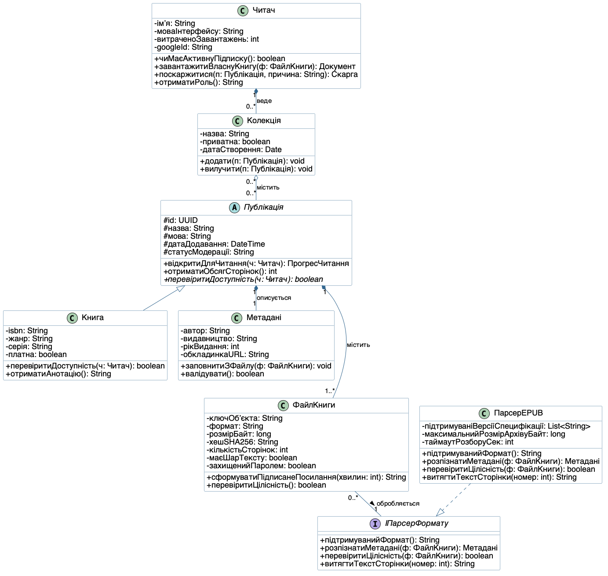
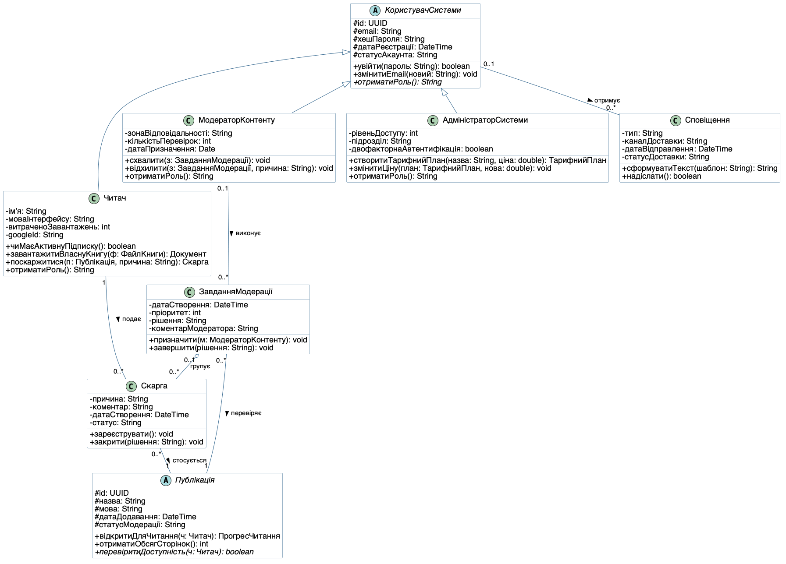
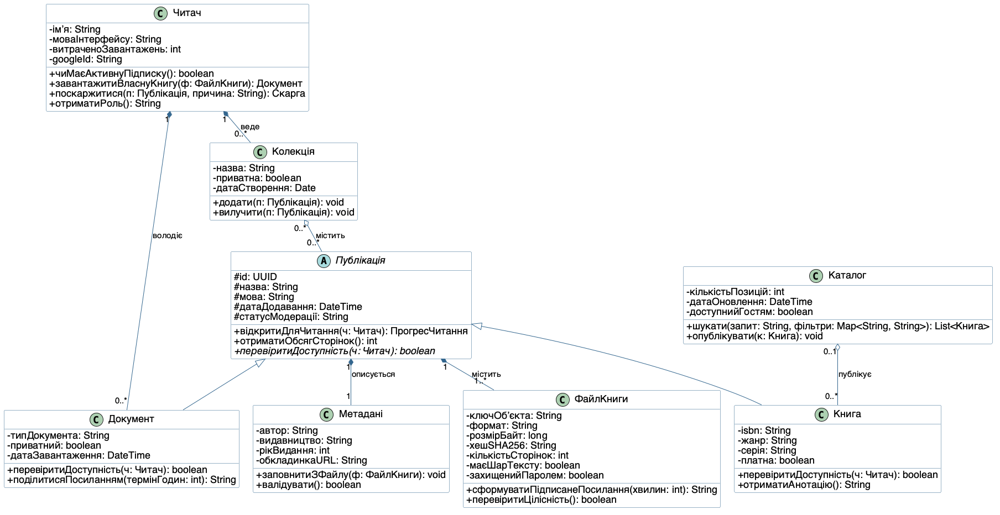
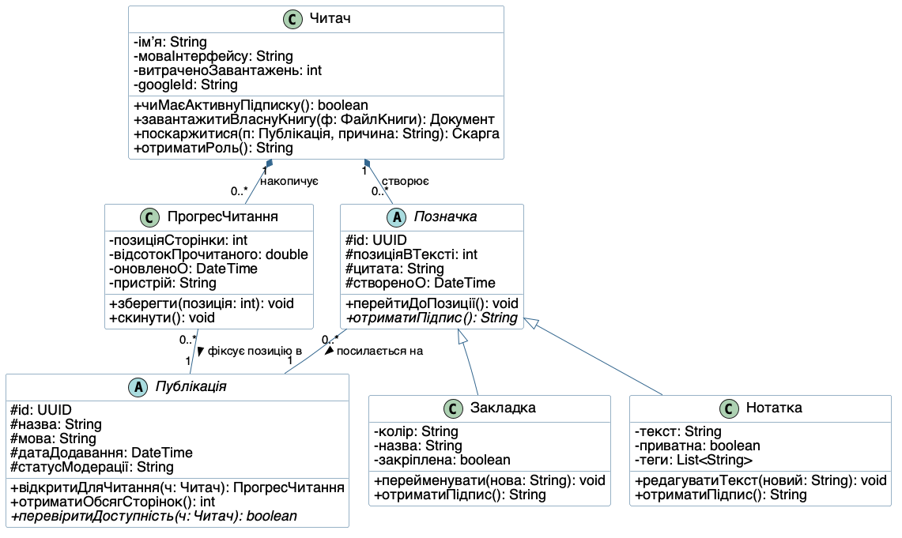
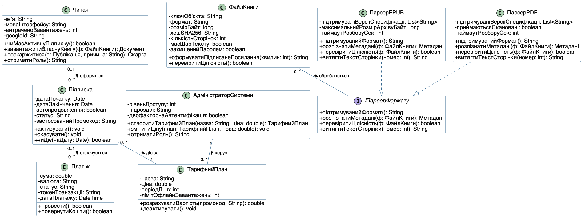
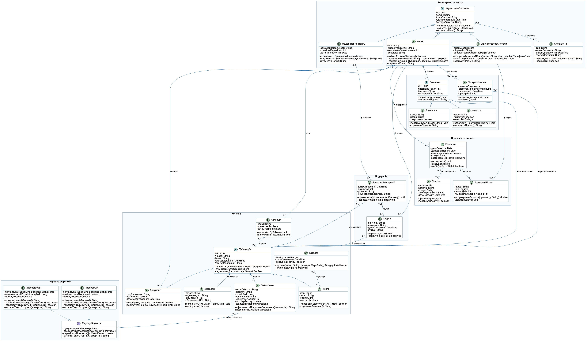

## Мета

Опанувати нотацію діаграми класів UML (Unified Modeling Language — уніфікована мова моделювання): навчитися коректно моделювати класи, їхні атрибути й методи з правильними модифікаторами видимості, а також застосовувати всі базові типи відношень — асоціацію з множинністю, агрегацію, композицію, узагальнення та реалізацію інтерфейсу — для предметної області власного курсового завдання. Додаткова мета — перевірити трасованість вимог: кожен клас побудованої моделі має походити від конкретного варіанта використання або текстової специфікації, зафіксованих у Лабораторній роботі №1.

Предметна область та сама, що й у Лабораторній роботі №1: веб-сервіс завантаження та читання книг «Полиця» — спрощений аналог MyBook і Bookmate. Користувач реєструється, переглядає каталог, завантажує власні книги у форматах EPUB або PDF, читає їх у вбудованій читалці зі збереженням прогресу й закладок, веде власні колекції та оформлює підписку для доступу до платного каталогу. Модератор перевіряє завантажений користувачами контент; оплату обробляє зовнішня платіжна система, файли книг зберігаються в зовнішньому обʼєктному сховищі, вхід можливий через Google OAuth, а переклад виділеного слова виконує зовнішній словниковий сервіс.

## Розділ 1. Від Use Case до класів: метод виділення сутностей

Класи не вигадувалися «з голови»: за основу взято текстові специфікації трьох ключових сценаріїв Лабораторної роботи №1 (UC07 «Читати книгу у вбудованій читалці», UC14 «Завантажити власну книгу», UC17 «Оформити підписку») та перелік усіх 25 варіантів використання. Застосовано класичний прийом іменникового аналізу: з тексту специфікацій виписано всі іменники та іменникові словосполучення, після чого кожен з них свідомо віднесено до однієї з чотирьох категорій.

| Категорія іменника | Рішення в моделі | Приклади з ЛР1 |
|---|---|---|
| Самостійна сутність зі станом і поведінкою | Окремий клас | книга, файл книги, підписка, платіж, скарга, колекція, прогрес читання |
| Характеристика іншої сутності | Атрибут класу | назва, автор, мова, ISBN, розмір файла, дата наступного списання, промокод |
| Роль або стан сутності, а не окремий тип | Клас-стан або метод-предикат, а не окремий клас | «Передплатник» → `Підписка` зі статусом + метод `чиМаєАктивнуПідписку()` |
| Зовнішня система або технічний артефакт | Не клас предметної області; переноситься у ЛР3 (компоненти, розгортання) | платіжна система, обʼєктне сховище, Google OAuth, вебхук, інцидент, черга повідомлень |

Окремо варто пояснити четверту категорію. Зовнішні актори Лабораторної роботи №1 («Платіжна система», «Обʼєктне сховище файлів», «Сервіс авторизації Google OAuth», «Сервіс перекладу та словник», «Сервіс email-сповіщень») не стають класами предметної області, бо вони не є частиною нашого домену — ми не володіємо їхнім станом і не керуємо їхнім життєвим циклом. Проте кожна з цих систем залишає в нашій моделі слід у вигляді класу-посередника або атрибута: сховище представлене класом `ФайлКниги` з ключем обʼєкта, платіжна система — класом `Платіж` із токеном транзакції, Google OAuth — атрибутом `googleId` класу `Читач`, сервіс email-сповіщень — класом `Сповіщення` зі статусом доставки. Саме ці класи в Лабораторній роботі №3 будуть привʼязані до відповідних зовнішніх вузлів на діаграмах компонентів і розгортання.

Третя категорія потребує ще одного уточнення, бо вона є джерелом найчастішої помилки. Іменник зі специфікації стає класом лише тоді, коли має власний стан, який змінюється незалежно від стану інших сутностей. Якщо ж іменник описує тимчасове становище вже наявної сутності («передплатник», «активний читач», «заблокований акаунт»), його місце — в атрибуті-стані, бо обʼєкт не може в часі змінювати свій клас, а становище змінюється щомісяця.

**Висновок:** метод іменникового аналізу дав не лише перелік класів, а й обґрунтоване рішення щодо кожного спірного іменника, зокрема щодо актора «Передплатник», який навмисно не став класом.

## Розділ 2. Перелік класів предметної області

Усього визначено 24 елементи моделі: 20 звичайних класів, 3 абстрактні класи та 1 інтерфейс. Це суттєво перевищує мінімальну вимогу завдання (6–8 класів, серед них один абстрактний і один інтерфейс), що пояснюється обсягом предметної області — у Лабораторній роботі №1 для неї зафіксовано 25 варіантів використання.

| Клас | Тип | Призначення | Походження (Use Case з ЛР1) |
|---|---|---|---|
| `КористувачСистеми` | Абстрактний клас | Спільні дані будь-якого облікового запису: ідентифікатор, пошта, хеш пароля, стан акаунта | UC01, UC02, UC03 |
| `Читач` | Клас (нащадок `КористувачСистеми`) | Основний користувач: читає, веде колекції, завантажує власні книги, оформлює підписку | UC05–UC14, UC17, UC22 |
| `МодераторКонтенту` | Клас (нащадок `КористувачСистеми`) | Перевіряє завантажений користувачами контент: схвалює або відхиляє | UC23 |
| `АдміністраторСистеми` | Клас (нащадок `КористувачСистеми`) | Керує тарифними планами, цінами й доступом до платного каталогу | UC25 |
| `Сповіщення` | Клас | Вихідне повідомлення користувачеві: реєстрація, результат модерації, продовження підписки, нове завдання модераторові | UC23, UC24 |
| `Публікація` | Абстрактний клас | Спільна основа будь-якого матеріалу для читання: назва, мова, дата додавання, статус модерації | UC05, UC07 |
| `Книга` | Клас (нащадок `Публікація`) | Ліцензований контент правовласника: ISBN, жанр, серія, ознака платності; лише `Книга` потрапляє в публічний `Каталог` | UC05, UC06, UC07 |
| `Документ` | Клас (нащадок `Публікація`) | Власне завантаження читача: без ISBN, у публічний каталог не потрапляє, доступне власникові та за тимчасовим посиланням | UC13, UC14 |
| `Метадані` | Клас | Єдиний бібліографічний опис публікації: автор, видавництво, рік, обкладинка | UC14, UC15 |
| `ФайлКниги` | Клас | Запис про обʼєкт у сховищі та властивості розібраного файла: ключ, формат, розмір, хеш, кількість сторінок, текстовий шар, захист паролем | UC08, UC12, UC15, UC16 |
| `Каталог` | Клас | Публічний перелік опублікованих книг із пошуком і фільтрами | UC05, UC06 |
| `Колекція` | Клас | Власна полиця читача: добірка публікацій під власною назвою | UC13 |
| `ПрогресЧитання` | Клас | Позиція читача в конкретній публікації та відсоток прочитаного | UC07, UC09 |
| `Позначка` | Абстрактний клас | Спільна основа закладки й нотатки: позиція в тексті, цитата, дата | UC10 |
| `Закладка` | Клас (нащадок `Позначка`) | Іменована позиція для швидкого повернення | UC10 |
| `Нотатка` | Клас (нащадок `Позначка`) | Текстовий коментар читача до фрагмента з тегами | UC10 |
| `Підписка` | Клас | Договір доступу до платного каталогу: період, статус, автопродовження | UC17, UC20, UC21 |
| `ТарифнийПлан` | Клас | Умови підписки: ціна, період, ліміт офлайн-завантажень | UC17, UC25 |
| `Платіж` | Клас | Транзакція списання коштів із токеном для повторних списань | UC18, UC20 |
| `Скарга` | Клас | Звернення читача щодо неприйнятного контенту конкретної публікації | UC22 |
| `ЗавданняМодерації` | Клас | Одиниця роботи модератора: публікація на перевірці з пріоритетом і рішенням | UC14, UC23 |
| `IПарсерФормату` | Інтерфейс | Контракт розбору файла: розпізнавання метаданих, перевірка цілісності, витяг тексту | UC15 |
| `ПарсерEPUB` | Клас (реалізує `IПарсерФормату`) | Алгоритм розбору EPUB: читання OPF-маніфесту, перевірка цілісності архіву | UC15 |
| `ПарсерPDF` | Клас (реалізує `IПарсерФормату`) | Алгоритм розбору PDF: підрахунок сторінок, перевірка захисту паролем і наявності текстового шару | UC15 |

Два підтипи `Публікація` варто розмежувати явно, бо нечітка межа між ними знецінила б саме узагальнення. Розрізнювальною ознакою обрано походження контенту, а не його поточний стан:

- `Книга` — ліцензований матеріал, що надійшов від правовласника. Має `isbn`, належить публічному `Каталогу` (агрегація `Каталог ◇ Книга`), може бути платною (`платна`), а доступ до неї визначає наявність активної підписки.
- `Документ` — файл, який читач завантажив сам (UC14). ISBN не має, у публічний `Каталог` не потрапляє за жодних умов — структурно це виражено тим, що каталог агрегує саме `Книга`, а не `Публікація`. Модерація (UC23) перевіряє його на легальність і або допускає до читання власником, або відхиляє; поширення відбувається лише через тимчасове посилання (`поділитисяПосиланням()`) чи додавання у власну `Колекція`.

Через це три атрибути, що керують доступом, не дублюють, а доповнюють один одного: `Книга.платна` відповідає на питання «чи потрібна підписка», `Документ.приватний` — «чи діє зараз посилання для інших», `Каталог.доступнийГостям` — «чи бачить перелік неавторизований відвідувач».

**Висновок:** модель містить 24 елементи, серед них три абстрактні класи (`КористувачСистеми`, `Публікація`, `Позначка`) та один інтерфейс (`IПарсерФормату`); кожен клас має явне походження від конкретного варіанта використання ЛР1, а межа між підтипами `Книга` і `Документ` задана структурно, а не на словах.

## Розділ 3. Атрибути, методи й модифікатори видимості

Кожен клас моделі має щонайменше три атрибути з явно вказаним типом і щонайменше два методи з сигнатурою. Видимість призначалася не навмання, а за трьома правилами, які варто сформулювати окремо, бо саме тут студенти найчастіше ставлять `+` усюди.

| Видимість | Де застосовано в моделі | Приклад | Обґрунтування |
|---|---|---|---|
| `#` protected | Усі атрибути трьох абстрактних класів | `# статусАкаунта: String` у `КористувачСистеми`; `# позиціяВТексті: int` у `Позначка` | Нащадки (`Читач`, `Закладка`, `Нотатка`) працюють із цими полями безпосередньо, тож `private` зробив би спадкування безглуздим, а `public` — зруйнував би інкапсуляцію |
| `-` private | Усі атрибути конкретних класів | `- хешSHA256: String` у `ФайлКниги`; `- токенТранзакції: String` у `Платіж` | Стан змінюється лише через методи класу. Для `Платіж` це ще й вимога безпеки: токен повторних списань не можна відкривати назовні |
| `+` public | Усі методи | `+ чиДіє(наДату: Date): boolean` у `Підписка` | Методи утворюють контракт класу — те, заради чого інші класи до нього звертаються |

Три методи позначено стереотипом `{abstract}`, і на діаграмі вони відображаються курсивом — по одному в кожному абстрактному класі:

- `+ {abstract} отриматиРоль(): String` у `КористувачСистеми` — роль визначає сам підтип, спільної реалізації немає;
- `+ {abstract} перевіритиДоступність(ч: Читач): boolean` у `Публікація` — `Книга` перевіряє ознаку платності та активність підписки, а `Документ` — чи є читач його власником або чи діє тимчасове посилання;
- `+ {abstract} отриматиПідпис(): String` у `Позначка` — `Закладка` повертає власну назву, `Нотатка` — перші слова тексту.

Окремо слід пояснити інтерфейс `IПарсерФормату`: він має чотири методи й жодного атрибута. Це не недогляд, а вимога нотації — інтерфейс за визначенням є контрактом поведінки без власного стану, тому вимога «не менше трьох атрибутів» до нього не застосовується. Так само побудовано й еталонний приклад методички, де інтерфейс `Оцінюваний` має лише два методи й жодного атрибута.

Принципово важливим є те, який саме стан зберігають класи-реалізації. Атрибути `ПарсерEPUB` і `ПарсерPDF` описують налаштування самого алгоритму розбору, а не конкретний розібраний файл: `- підтримуваніВерсіїСпецифікації: List<String>`, `- максимальнийРозмірАрхівуБайт: long`, `- таймаутРозборуСек: int` у EPUB-парсера та `- підтримуваніВерсіїСпецифікації`, `- приймаютьсяСкановані: boolean`, `- таймаутРозборуСек: int` у PDF-парсера. Це узгоджено з множинністю асоціації `ФайлКниги "0..*" -- "1" IПарсерФормату`: один екземпляр парсера обслуговує довільну кількість файлів, тому тримати в ньому кількість сторінок або ознаку захисту паролем конкретного файла було б прямою суперечністю — обʼєкт не може одночасно мати сім різних значень одного поля. Властивості розібраного файла натомість зберігає сам файл: `ФайлКниги` має `- кількістьСторінок: int`, `- маєШарТексту: boolean`, `- захищенийПаролем: boolean`. Метод `Публікація.отриматиОбсягСторінок()` не дублює ці дані, а підсумовує їх по всіх файлах публікації. Усі методи парсерів приймають `ф: ФайлКниги` параметром, тобто спроєктовані як stateless-сервіси, і склад атрибутів тепер цьому відповідає.

**Висновок:** видимість у моделі несе змістове навантаження: `#` позначає точки розширення для нащадків, `-` захищає інваріанти класу, `+` описує його зовнішній контракт; стан конкретного файла зберігається у `ФайлКниги`, а не в парсері, який цей файл обробляє.

## Розділ 4. Фрагмент діаграми: усі пʼять типів відношень

Повна діаграма містить 24 класи й 30 звʼязків, тому для демонстрації нотації окремо побудовано скорочений фрагмент із восьми класів, у якому кожен із пʼяти обовʼязкових типів відношень представлений принаймні один раз. У фрагменті скорочено лише кількість класів: склад атрибутів і методів кожного показаного класу дослівно збігається з повною діаграмою, бо файл `classes_core.puml` генерується з `classes.puml` скриптом `make_views.py`, який переносить тіла класів без змін. Файл `classes_core.puml`:

```text
@startuml
' Лабораторна робота №2. Фрагмент діаграми класів: усі пʼять типів відношень
' Фрагмент повної діаграми класів (classes.puml) для демонстрації всіх пʼяти
' типів відношень UML. Склад атрибутів і методів кожного класу дослівно
' збігається з повною діаграмою.
' Камінський Олексій Дмитрович, група ВТ-23-2

skinparam defaultFontName "Helvetica"
skinparam defaultFontSize 18
skinparam classAttributeIconSize 0
skinparam shadowing false
skinparam ArrowFontSize 15
skinparam nodesep 25
skinparam ranksep 40
skinparam class {
  BackgroundColor #FEFEFE
  BorderColor #33668E
  ArrowColor #33668E
}

class Читач {
  - імʼя: String
  - моваІнтерфейсу: String
  - витраченоЗавантажень: int
  - googleId: String
  + чиМаєАктивнуПідписку(): boolean
  + завантажитиВласнуКнигу(ф: ФайлКниги): Документ
  + поскаржитися(п: Публікація, причина: String): Скарга
  + отриматиРоль(): String
}

abstract class Публікація {
  # id: UUID
  # назва: String
  # мова: String
  # датаДодавання: DateTime
  # статусМодерації: String
  + відкритиДляЧитання(ч: Читач): ПрогресЧитання
  + отриматиОбсягСторінок(): int
  + {abstract} перевіритиДоступність(ч: Читач): boolean
}

class Книга {
  - isbn: String
  - жанр: String
  - серія: String
  - платна: boolean
  + перевіритиДоступність(ч: Читач): boolean
  + отриматиАнотацію(): String
}

class Метадані {
  - автор: String
  - видавництво: String
  - рікВидання: int
  - обкладинкаURL: String
  + заповнитиЗФайлу(ф: ФайлКниги): void
  + валідувати(): boolean
}

class Колекція {
  - назва: String
  - приватна: boolean
  - датаСтворення: Date
  + додати(п: Публікація): void
  + вилучити(п: Публікація): void
}

class ФайлКниги {
  - ключОбʼєкта: String
  - формат: String
  - розмірБайт: long
  - хешSHA256: String
  - кількістьСторінок: int
  - маєШарТексту: boolean
  - захищенийПаролем: boolean
  + сформуватиПідписанеПосилання(хвилин: int): String
  + перевіритиЦілісність(): boolean
}

interface IПарсерФормату {
  + підтримуванийФормат(): String
  + розпізнатиМетадані(ф: ФайлКниги): Метадані
  + перевіритиЦілісність(ф: ФайлКниги): boolean
  + витягтиТекстСторінки(номер: int): String
}

class ПарсерEPUB {
  - підтримуваніВерсіїСпецифікації: List<String>
  - максимальнийРозмірАрхівуБайт: long
  - таймаутРозборуСек: int
  + підтримуванийФормат(): String
  + розпізнатиМетадані(ф: ФайлКниги): Метадані
  + перевіритиЦілісність(ф: ФайлКниги): boolean
  + витягтиТекстСторінки(номер: int): String
}

' --- 1. Узагальнення (generalization) ---
Публікація <|-- Книга

' --- 2. Реалізація інтерфейсу (realization) ---
ПарсерEPUB ..|> IПарсерФормату

' --- 3. Композиція (composition) ---
Публікація "1" *-- "1" Метадані : описується
Публікація "1" *-- "1..*" ФайлКниги : містить
Читач "1" *-- "0..*" Колекція : веде

' --- 4. Агрегація (aggregation) ---
Колекція "0..*" o-- "0..*" Публікація : містить

' --- 5. Асоціація з множинністю (association) ---
ФайлКниги "0..*" -- "1" IПарсерФормату : обробляється >

' --- підказки розкладки (не відношення UML) ---
Метадані -[hidden]down- ФайлКниги
@enduml
```



На рисунку добре видно графічні відмінності, про які йдеться в розділі 1.2 методички:

- узагальнення — суцільна лінія з незафарбованим трикутником від `Книга` до `Публікація`;
- реалізація — пунктирна лінія з таким самим трикутником від `ПарсерEPUB` до `IПарсерФормату`;
- композиція — зафарбований ромб з боку цілого у трьох звʼязках: `Публікація ◆ Метадані`, `Публікація ◆ ФайлКниги` і `Читач ◆ Колекція`;
- агрегація — незафарбований ромб з боку `Колекція` у звʼязку `Колекція ◇ Публікація`;
- асоціація з множинністю — проста лінія `ФайлКниги "0..*" -- "1" IПарсерФормату` без жодного ромба.

У коді фрагмента кожне відношення стоїть у секції свого типу: зокрема `Публікація "1" *-- "1..*" ФайлКниги` розміщено в секції «3. Композиція», а не серед асоціацій, бо символ `*--` позначає саме композицію. Абстрактний клас `Публікація` та інтерфейс `IПарсерФормату` PlantUML рендерить курсивом обидва, а розрізняє їх круглим маркером у заголовку: «A» в абстрактного класу, «I» в інтерфейсу, «C» у звичайного. Абстрактний метод `перевіритиДоступність()` також виділено курсивом, як вимагає розділ 1.3 методички.

**Висновок:** фрагмент підтверджує, що всі пʼять типів відношень реалізовано засобами PlantUML коректно, вони візуально розрізняються на відрендереному зображенні, а склад членів класів на фрагменті не розходиться з повною діаграмою.

## Розділ 5. Повна діаграма класів і чотири часткові види

Повну модель побудовано у файлі `classes.puml`. Щоб 24 класи не перетворилися на нечитабельне полотно, застосовано три прийоми.

По-перше, класи згруповано в шість пакетів за функціональними зонами: «Користувачі та доступ», «Контент», «Читання», «Підписка та оплата», «Модерація», «Обробка форматів». Пакети не є відношенням UML і не впливають на семантику моделі — це суто засіб структурування, який водночас готує ґрунт для Лабораторної роботи №3, де ці самі зони стануть компонентами на діаграмі компонентів.

По-друге, у кінці файла додано чотири звʼязки зі стилем `-[hidden]down-`. Це не відношення UML і на зображенні вони не видимі: вони лише підказують механізму розкладки Graphviz, що пакети треба ставити один під одним. Без них Graphviz вишиковував усі шість пакетів в один горизонтальний ряд, і зображення виходило завширшки понад 4500 пікселів — PlantUML обрізав його за типовим обмеженням `PLANTUML_LIMIT_SIZE` у 4096 пікселів. Після додавання прихованих звʼязків діаграма має розмір 3954 × 2302 пікселі й уміщується повністю.

По-третє — і це головне для читабельності на друкованому аркуші — повну діаграму розкладено на чотири часткові види, кожен із яких розміщено на окремій сторінці в альбомній орієнтації. Причина суто геометрична: кегль тексту всередині зображення на аркуші дорівнює «кегль у пікселях ÷ ширина зображення × ширина друку», тому 24 класи на одному аркуші дають близько 2,7 pt — текст, який фізично неможливо прочитати, хоча саме за ним оцінюються коректність відношень (30 % балів) і коректність множинності (15 %). Чотири види з 6–9 класами дають від 6,4 до 10,7 pt, тобто читаються без збільшувального скла.

Види побудовано не «на око»: файли `classes_view1..4.puml` генеруються з `classes.puml` тим самим скриптом `make_views.py`, який, по-перше, переносить тіла класів дослівно і, по-друге, перевіряє, що кожне з 30 відношень повної діаграми потрапило рівно на один вид — не загубилося й не продублювалося.

| Вид | Рисунок | Класи | Відношення на виді |
|---|---|---|---|
| Вид 1. Користувачі, доступ і модерація | Рисунок 2 | `КористувачСистеми`, `Читач`, `МодераторКонтенту`, `АдміністраторСистеми`, `Сповіщення`, `Скарга`, `ЗавданняМодерації`, `Публікація` | 3 узагальнення, 1 агрегація, 5 асоціацій = 9 |
| Вид 2. Контент: публікації, метадані, файли й колекції | Рисунок 3 | `Читач`, `Публікація`, `Книга`, `Документ`, `Метадані`, `ФайлКниги`, `Каталог`, `Колекція` | 2 узагальнення, 4 композиції, 2 агрегації = 8 |
| Вид 3. Читання: прогрес і позначки | Рисунок 4 | `Читач`, `Публікація`, `ПрогресЧитання`, `Позначка`, `Закладка`, `Нотатка` | 2 узагальнення, 2 композиції, 2 асоціації = 6 |
| Вид 4. Підписка, оплата та обробка форматів | Рисунок 5 | `Читач`, `АдміністраторСистеми`, `Підписка`, `ТарифнийПлан`, `Платіж`, `ФайлКниги`, `IПарсерФормату`, `ПарсерEPUB`, `ПарсерPDF` | 2 реалізації, 5 асоціацій = 7 |

Чотири класи — `Читач`, `Публікація`, `ФайлКниги` та `АдміністраторСистеми` — свідомо повторюються більш ніж на одному виді як межові. Їхній склад атрибутів і методів на всіх видах однаковий, бо береться з одного джерела.









Повний код діаграми:

```text
@startuml
' Лабораторна робота №2. Діаграма класів предметної області
' Предметна область: веб-сервіс завантаження та читання книг «Полиця»
' Камінський Олексій Дмитрович, група ВТ-23-2

skinparam defaultFontName "Helvetica"
skinparam defaultFontSize 16
skinparam classAttributeIconSize 0
skinparam shadowing false
skinparam packageStyle rectangle
skinparam ArrowFontSize 14
skinparam nodesep 20
skinparam ranksep 30
skinparam class {
  BackgroundColor #FEFEFE
  BorderColor #33668E
  ArrowColor #33668E
}
skinparam package {
  BackgroundColor #F7FAFC
  BorderColor #9AB3C6
}

package "Користувачі та доступ" {

  abstract class КористувачСистеми {
    # id: UUID
    # email: String
    # хешПароля: String
    # датаРеєстрації: DateTime
    # статусАкаунта: String
    + увійти(пароль: String): boolean
    + змінитиEmail(новий: String): void
    + {abstract} отриматиРоль(): String
  }

  class Читач {
    - імʼя: String
    - моваІнтерфейсу: String
    - витраченоЗавантажень: int
    - googleId: String
    + чиМаєАктивнуПідписку(): boolean
    + завантажитиВласнуКнигу(ф: ФайлКниги): Документ
    + поскаржитися(п: Публікація, причина: String): Скарга
    + отриматиРоль(): String
  }

  class МодераторКонтенту {
    - зонаВідповідальності: String
    - кількістьПеревірок: int
    - датаПризначення: Date
    + схвалити(з: ЗавданняМодерації): void
    + відхилити(з: ЗавданняМодерації, причина: String): void
    + отриматиРоль(): String
  }

  class АдміністраторСистеми {
    - рівеньДоступу: int
    - підрозділ: String
    - двофакторнаАвтентифікація: boolean
    + створитиТарифнийПлан(назва: String, ціна: double): ТарифнийПлан
    + змінитиЦіну(план: ТарифнийПлан, нова: double): void
    + отриматиРоль(): String
  }

  class Сповіщення {
    - тип: String
    - каналДоставки: String
    - датаВідправлення: DateTime
    - статусДоставки: String
    + сформуватиТекст(шаблон: String): String
    + надіслати(): boolean
  }
}

package "Контент" {

  abstract class Публікація {
    # id: UUID
    # назва: String
    # мова: String
    # датаДодавання: DateTime
    # статусМодерації: String
    + відкритиДляЧитання(ч: Читач): ПрогресЧитання
    + отриматиОбсягСторінок(): int
    + {abstract} перевіритиДоступність(ч: Читач): boolean
  }

  class Книга {
    - isbn: String
    - жанр: String
    - серія: String
    - платна: boolean
    + перевіритиДоступність(ч: Читач): boolean
    + отриматиАнотацію(): String
  }

  class Документ {
    - типДокумента: String
    - приватний: boolean
    - датаЗавантаження: DateTime
    + перевіритиДоступність(ч: Читач): boolean
    + поділитисяПосиланням(термінГодин: int): String
  }

  class Метадані {
    - автор: String
    - видавництво: String
    - рікВидання: int
    - обкладинкаURL: String
    + заповнитиЗФайлу(ф: ФайлКниги): void
    + валідувати(): boolean
  }

  class ФайлКниги {
    - ключОбʼєкта: String
    - формат: String
    - розмірБайт: long
    - хешSHA256: String
    - кількістьСторінок: int
    - маєШарТексту: boolean
    - захищенийПаролем: boolean
    + сформуватиПідписанеПосилання(хвилин: int): String
    + перевіритиЦілісність(): boolean
  }

  class Каталог {
    - кількістьПозицій: int
    - датаОновлення: DateTime
    - доступнийГостям: boolean
    + шукати(запит: String, фільтри: Map<String, String>): List<Книга>
    + опублікувати(к: Книга): void
  }

  class Колекція {
    - назва: String
    - приватна: boolean
    - датаСтворення: Date
    + додати(п: Публікація): void
    + вилучити(п: Публікація): void
  }
}

package "Читання" {

  class ПрогресЧитання {
    - позиціяСторінки: int
    - відсотокПрочитаного: double
    - оновленоО: DateTime
    - пристрій: String
    + зберегти(позиція: int): void
    + скинути(): void
  }

  abstract class Позначка {
    # id: UUID
    # позиціяВТексті: int
    # цитата: String
    # створеноО: DateTime
    + перейтиДоПозиції(): void
    + {abstract} отриматиПідпис(): String
  }

  class Закладка {
    - колір: String
    - назва: String
    - закріплена: boolean
    + перейменувати(нова: String): void
    + отриматиПідпис(): String
  }

  class Нотатка {
    - текст: String
    - приватна: boolean
    - теги: List<String>
    + редагуватиТекст(новий: String): void
    + отриматиПідпис(): String
  }
}

package "Підписка та оплата" {

  class Підписка {
    - датаПочатку: Date
    - датаЗакінчення: Date
    - автопродовження: boolean
    - статус: String
    - застосованийПромокод: String
    + активувати(): void
    + скасувати(): void
    + чиДіє(наДату: Date): boolean
  }

  class ТарифнийПлан {
    - назва: String
    - ціна: double
    - періодДнів: int
    - лімітОфлайнЗавантажень: int
    + розрахуватиВартість(промокод: String): double
    + деактивувати(): void
  }

  class Платіж {
    - сума: double
    - валюта: String
    - статус: String
    - токенТранзакції: String
    - датаПлатежу: DateTime
    + провести(): boolean
    + повернутиКошти(): boolean
  }
}

package "Модерація" {

  class Скарга {
    - причина: String
    - коментар: String
    - датаСтворення: DateTime
    - статус: String
    + зареєструвати(): void
    + закрити(рішення: String): void
  }

  class ЗавданняМодерації {
    - датаСтворення: DateTime
    - пріоритет: int
    - рішення: String
    - коментарМодератора: String
    + призначити(м: МодераторКонтенту): void
    + завершити(рішення: String): void
  }
}

package "Обробка форматів" {

  interface IПарсерФормату {
    + підтримуванийФормат(): String
    + розпізнатиМетадані(ф: ФайлКниги): Метадані
    + перевіритиЦілісність(ф: ФайлКниги): boolean
    + витягтиТекстСторінки(номер: int): String
  }

  class ПарсерEPUB {
    - підтримуваніВерсіїСпецифікації: List<String>
    - максимальнийРозмірАрхівуБайт: long
    - таймаутРозборуСек: int
    + підтримуванийФормат(): String
    + розпізнатиМетадані(ф: ФайлКниги): Метадані
    + перевіритиЦілісність(ф: ФайлКниги): boolean
    + витягтиТекстСторінки(номер: int): String
  }

  class ПарсерPDF {
    - підтримуваніВерсіїСпецифікації: List<String>
    - приймаютьсяСкановані: boolean
    - таймаутРозборуСек: int
    + підтримуванийФормат(): String
    + розпізнатиМетадані(ф: ФайлКниги): Метадані
    + перевіритиЦілісність(ф: ФайлКниги): boolean
    + витягтиТекстСторінки(номер: int): String
  }
}

' ======== УЗАГАЛЬНЕННЯ (generalization) ========
КористувачСистеми <|-- Читач
КористувачСистеми <|-- МодераторКонтенту
КористувачСистеми <|-- АдміністраторСистеми
Публікація <|-- Книга
Публікація <|-- Документ
Позначка <|-- Закладка
Позначка <|-- Нотатка

' ======== РЕАЛІЗАЦІЯ ІНТЕРФЕЙСУ (realization) ========
ПарсерEPUB ..|> IПарсерФормату
ПарсерPDF ..|> IПарсерФормату

' ======== КОМПОЗИЦІЯ (composition) ========
Публікація "1" *-- "1" Метадані : описується
Публікація "1" *-- "1..*" ФайлКниги : містить
Читач "1" *-- "0..*" Документ : володіє
Читач "1" *-- "0..*" Колекція : веде
Читач "1" *-- "0..*" ПрогресЧитання : накопичує
Читач "1" *-- "0..*" Позначка : створює

' ======== АГРЕГАЦІЯ (aggregation) ========
Каталог "0..1" o-- "0..*" Книга : публікує
Колекція "0..*" o-- "0..*" Публікація : містить
ЗавданняМодерації "0..1" o-- "0..*" Скарга : групує

' ======== АСОЦІАЦІЇ З МНОЖИННІСТЮ (association) ========
ПрогресЧитання "0..*" -- "1" Публікація : фіксує позицію в >
Позначка "0..*" -- "1" Публікація : посилається на >
Читач "1" -- "0..*" Скарга : подає >
КористувачСистеми "0..1" -- "0..*" Сповіщення : отримує >
Читач "0..1" -- "0..*" Підписка : оформлює >
Підписка "0..*" -- "1" ТарифнийПлан : діє за >
Підписка "0..1" -- "0..*" Платіж : оплачується >
АдміністраторСистеми "1" -- "0..*" ТарифнийПлан : керує >
МодераторКонтенту "0..1" -- "0..*" ЗавданняМодерації : виконує >
ЗавданняМодерації "0..*" -- "1" Публікація : перевіряє >
Скарга "0..*" -- "1" Публікація : стосується >
ФайлКниги "0..*" -- "1" IПарсерФормату : обробляється >

' ======== ПРИХОВАНІ ЗВʼЯЗКИ ДЛЯ КОМПАКТНОЇ ВЕРТИКАЛЬНОЇ РОЗКЛАДКИ ========
' (не є відношеннями UML — лише підказки розкладки для Graphviz)
Сповіщення -[hidden]down- Каталог
Нотатка -[hidden]down- Підписка
Платіж -[hidden]down- Скарга
ЗавданняМодерації -[hidden]down- ПарсерPDF
@enduml
```

Рендеринг виконано локально встановленим PlantUML; усі шість діаграм створено без помилок і попереджень, попередню перевірку синтаксису пройдено з нульовим кодом завершення:

```text
$ plantuml -version | head -2
PlantUML version 1.2026.8 / 149874a [2026-09-05 15:59:17 UTC]
(GPL source distribution)

$ dot -V
dot - graphviz version 16.1.0 (20260904.0139)

$ plantuml -checkonly classes.puml classes_core.puml classes_view1.puml \
           classes_view2.puml classes_view3.puml classes_view4.puml ; echo "exit=$?"
exit=0

$ python3 make_views.py
записано classes_core.puml
записано classes_view1.puml
записано classes_view2.puml
записано classes_view3.puml
записано classes_view4.puml
відношень у повній діаграмі: 30; на чотирьох видах: 30
перевірка покриття відношень: OK (кожне відношення рівно на одному виді)

$ plantuml -tsvg classes.puml classes_core.puml classes_view*.puml
$ plantuml -tpng classes.puml classes_core.puml classes_view*.puml
$ ls -l classes*.png classes*.svg
-rw-r--r--  1 alex  staff  529704  classes.png          (3954 x 2302)
-rw-r--r--  1 alex  staff   85906  classes.svg
-rw-r--r--  1 alex  staff  169571  classes_core.png     (1383 x 1310)
-rw-r--r--  1 alex  staff   25513  classes_core.svg
-rw-r--r--  1 alex  staff   92673  classes_view1.png    (1793 x 1288)
-rw-r--r--  1 alex  staff   27246  classes_view1.svg
-rw-r--r--  1 alex  staff   82240  classes_view2.png    (1808 x  932)
-rw-r--r--  1 alex  staff   26101  classes_view2.svg
-rw-r--r--  1 alex  staff   50728  classes_view3.png    (1141 x  681)
-rw-r--r--  1 alex  staff   18886  classes_view3.svg
-rw-r--r--  1 alex  staff   88504  classes_view4.png    (1901 x  717)
-rw-r--r--  1 alex  staff   28536  classes_view4.svg
```



Рисунок 6 подано як оглядовий: він показує загальну структуру моделі та поділ на шість пакетів, але кегль тексту всередині нього на аркуші становить близько 2,7 pt. Для перевірки типів відношень і множинності призначені Рисунки 2–5, де той самий текст має від 6,4 до 10,7 pt, а для читання повної діаграми в довільному масштабі до роботи додано векторний файл `classes.svg`.

Кількісний склад діаграми перевірено підрахунком безпосередньо за текстом файла, а не «на око»:

| Елемент моделі | Кількість | Позначення на діаграмі |
|---|---|---|
| Абстрактні класи | 3 | Назва класу курсивом + круглий блакитний маркер «A» у заголовку (у коді PlantUML — ключове слово `abstract`) |
| Інтерфейси | 1 | Назва курсивом + круглий маркер «I» у заголовку (у коді — ключове слово `interface`) |
| Звичайні класи | 20 | Прямокутник із трьох секцій, маркер «C» у заголовку |
| Узагальнення (generalization) | 7 | Суцільна лінія з незафарбованим трикутником |
| Реалізація (realization) | 2 | Пунктирна лінія з незафарбованим трикутником |
| Композиція (composition) | 6 | Лінія з зафарбованим ромбом з боку цілого |
| Агрегація (aggregation) | 3 | Лінія з незафарбованим ромбом з боку цілого |
| Асоціація (association) | 12 | Проста лінія з множинністю на обох кінцях |

Варто наголосити на одній деталі позначень, бо вона легко вводить в оману: курсив назви сам по собі не відрізняє абстрактний клас від інтерфейсу — PlantUML рендерить курсивом обидва. Розрізняють їх саме круглі маркери «A» і «I» у заголовку, тому в таблиці вище вказано обидві ознаки, а не лише курсив.

Підрахунок виконано автоматично за текстом файла — пошуком відповідних синтаксичних конструкцій PlantUML; результат збігається з таблицею вище:

```text
$ grep -c '^  abstract class' classes.puml
3
$ grep -c '^  interface' classes.puml
1
$ grep -c '^  class ' classes.puml
20
$ grep -c '<|--' classes.puml
7
$ grep -c '\.\.|>' classes.puml
2
$ grep -c '\*--' classes.puml
6
$ grep -c 'o--' classes.puml
3
$ grep -cE '" -- "' classes.puml
12
```

**Висновок:** діаграма містить 24 елементи моделі й 30 відношень, серед яких представлені всі пʼять обовʼязкових типів; зображення відрендерено повністю, без обрізання за граничним розміром, а розклад на чотири часткові види зробив кожне відношення й кожну множинність читабельними на друкованому аркуші.

## Розділ 6. Обґрунтування відношень «ціле-частина» за тестом розділу 1.2.5

Методичка пропонує однозначний практичний тест для розрізнення агрегації й композиції: «Якщо видалити ціле, чи має сенс частині продовжувати існувати сама по собі?» Якщо ні — композиція; якщо так — агрегація або звичайна асоціація. Нижче тест застосовано до кожного з девʼяти відношень «ціле-частина» моделі. Додатковим критерієм слугує другий рядок порівняльної таблиці методички: чи може частина одночасно належати кільком цілим (при композиції — ні, лише одному).

| Відношення | Тип | Відповідь на тест «чи має сенс частині існувати без цілого» |
|---|---|---|
| `Публікація` ◆ `Метадані` (1 — 1) | Композиція | Ні. Запис «автор: Орвелл, рік: 1949, обкладинка: …» поза конкретною публікацією — це набір рядків без власника й без сенсу. Метадані ніколи не поділяються між двома публікаціями: навіть два видання тієї самої книги мають власні записи. Видалення публікації видаляє метадані разом із нею |
| `Публікація` ◆ `ФайлКниги` (1 — 1..*) | Композиція | Ні. `ФайлКниги` — це не фізичний файл, а запис про обʼєкт у сховищі: ключ, формат, розмір, хеш, кількість сторінок. Поза публікацією цей ключ нікому не адресований, а при видаленні публікації сервіс зобовʼязаний видалити й обʼєкт у сховищі, інакше той залишиться оплачуваним «сміттям». Множинність `1..*` відображає, що одна публікація може мати кілька файлів — версії EPUB і PDF |
| `Читач` ◆ `Документ` (1 — 0..*) | Композиція | Ні. Власне завантаження читача не потрапляє в публічний каталог і не передається іншому власникові, тому поза акаунтом завантажувача воно не має ні адресата, ні правової підстави зберігатися. Видалення акаунта зобовʼязує видалити й завантажені документи разом з їхніми файлами у сховищі. Жоден документ не може належати двом читачам |
| `Читач` ◆ `Колекція` (1 — 0..*) | Композиція | Ні. Полиця «Читаю зараз» належить конкретному читачеві й не може бути передана іншому: при видаленні акаунта всі його колекції зникають разом із ним. Жодна колекція не може одночасно належати двом читачам |
| `Читач` ◆ `ПрогресЧитання` (1 — 0..*) | Композиція | Ні. Запис «сторінка 148, 37 %» має сенс лише у звʼязці з тим, хто дочитав до цієї сторінки. Прогрес неможливо передати іншому читачеві й неможливо «залишити в системі» після видалення акаунта |
| `Читач` ◆ `Позначка` (1 — 0..*) | Композиція | Ні. Закладка й нотатка є приватним результатом праці конкретного читача; це найочевидніший випадок спільного життєвого циклу — разом з акаунтом видаляються всі його нотатки. Той факт, що двоє читачів зробили нотатку на тій самій сторінці, не робить її спільною: це два різні обʼєкти |
| `Каталог` ◇ `Книга` (0..1 — 0..*) | Агрегація | Так. Книга існує й до публікації в каталозі (статус «На модерації»), і після зняття з каталогу: залишається доступною тим, хто її завантажив, та зберігається в їхніх колекціях. Зняття книги з каталогу — це зміна статусу, а не видалення сутності. Саме тому множинність з боку каталогу `0..1`, а не `1` |
| `Колекція` ◇ `Публікація` (0..* — 0..*) | Агрегація | Так. Це класичний випадок із розділу 1.2.3: при видаленні полиці «Прочитати влітку» книги з неї нікуди не зникають. Більше того, та сама книга одночасно лежить у полицях десятків різних читачів — тобто частина належить багатьом цілим, що композиція прямо забороняє |
| `ЗавданняМодерації` ◇ `Скарга` (0..1 — 0..*) | Агрегація | Так. Скарга створюється читачем самостійно (UC22) і реєструється в системі ще до того, як модератор візьме її в роботу; завдання модерації лише групує кілька скарг на ту саму публікацію — і ця «та сама публікація» тепер виражена в моделі явно, асоціацією `Скарга "0..*" -- "1" Публікація`. Після закриття завдання скарги залишаються в історії звернень читача як підстава ухваленого рішення |

Не менш важливо обґрунтувати зворотні рішення — де спокусливо було б поставити ромб, але це була б помилка. Пʼять найспірніших пар розглянуто окремо. Спільний принцип цих пʼяти рядків один: якщо запис зобовʼязаний пережити видалення свого «власника», то й множинність з боку власника має бути `0..1`, а не `1` — інакше модель сама забороняє той сценарій, заради якого відмовилися від композиції.

| Відношення | Обраний тип | Чому не агрегація і не композиція |
|---|---|---|
| `Підписка` — `Платіж` (0..1 — 0..*) | Асоціація | Запис платежу має самостійну цінність поза підпискою: він потрібен для фінансової звітності, повернення коштів і розбору спору з платіжною системою. За тестом 1.2.5 платіж зобовʼязаний пережити видалення підписки — тому з боку підписки стоїть `0..1`. З боку платежу стоїть `0..*`, а не `1..*`: підписка у статусі «очікує оплати» (`Підписка.статус`, метод `активувати()`) ще не має жодного платежу, і той самий випадок дає UC19, коли промокод зводить суму першого періоду до нуля |
| `Читач` — `Підписка` (0..1 — 0..*) | Асоціація | Підписка — це договір, а не структурна частина читача. Вона не передається іншому, але зобовʼязана пережити видалення акаунта: строк зберігання фінансових документів не залежить від бажання клієнта закрити профіль. Тому саме асоціація з `0..1` з боку читача, а не композиція: композиція каскадно знищила б підписку, а разом із нею — і всю привʼязану історію платежів |
| `ПрогресЧитання` — `Публікація` (0..* — 1) | Асоціація | Прогрес уже є частиною `Читач` за композицією, а в UML частина може мати лише одного власника-ціле. Звʼязок із публікацією відповідає на питання «де саме читач зупинився», тобто є посиланням, а не володінням |
| `КористувачСистеми` — `Сповіщення` (0..1 — 0..*) | Асоціація | Сповіщення формує й доставляє зовнішній сервіс email-розсилки, а не сам користувач; запис про доставку зберігається для аудиту навіть тоді, коли адресат видалив акаунт, — звідси `0..1`. Асоціацію проведено від `КористувачСистеми`, а не від `Читач`, бо UC23 передбачає сповіщення й модераторові про нове завдання |
| `Скарга` — `Публікація` (0..* — 1) | Асоціація | Скарга не є частиною публікації: публікація не «складається зі скарг», і видалення публікації не повинно стирати історію звернень, на підставі яких її видалили. Це посилання на обʼєкт скарги, що робить UC22 трасованим у структуру: саме сюди зберігається параметр методу `Читач.поскаржитися(п: Публікація, причина: String)` |

**Висновок:** у моделі шість композицій і три агрегації; кожне рішення отримано застосуванням того самого тесту з розділу 1.2.5, а в пʼяти спірних випадках свідомо обрано звичайну асоціацію, бо частина переживає ціле або має кількох власників — і в кожному такому випадку множинність з боку «власника» поставлено `0..1`, щоб модель не суперечила власному обґрунтуванню.

## Розділ 7. Множинність на звʼязках

Множинність проставлено на обох кінцях кожного звʼязку, окрім узагальнень і реалізацій, де вона за нотацією не застосовується. Нижче наведено повний перелік із 21 звʼязку з прочитанням кожного природною мовою — саме так його перевіряють на коректність.

| Звʼязок | Множинність | Прочитання |
|---|---|---|
| `Каталог` ◇ `Книга` | 0..1 — 0..* | Книга перебуває щонайбільше в одному каталозі (або в жодному, поки на модерації); каталог містить будь-яку кількість книг |
| `Колекція` ◇ `Публікація` | 0..* — 0..* | Публікація може лежати в довільній кількості колекцій різних читачів; колекція може бути й порожньою |
| `ЗавданняМодерації` ◇ `Скарга` | 0..1 — 0..* | Скарга може бути ще не взята в роботу; одне завдання групує кілька скарг на ту саму публікацію |
| `Публікація` ◆ `Метадані` | 1 — 1 | Рівно один запис метаданих на публікацію й навпаки |
| `Публікація` ◆ `ФайлКниги` | 1 — 1..* | Публікація має щонайменше один файл (інакше її нема чим читати), може мати кілька — EPUB і PDF |
| `Читач` ◆ `Документ` | 1 — 0..* | Завантажений документ має рівно одного власника; новий читач не має жодного |
| `Читач` ◆ `Колекція` | 1 — 0..* | Новий читач не має жодної колекції; згодом може створити скільки завгодно |
| `Читач` ◆ `ПрогресЧитання` | 1 — 0..* | Окремий запис прогресу на кожну розпочату публікацію |
| `Читач` ◆ `Позначка` | 1 — 0..* | Закладки й нотатки не обовʼязкові |
| `Читач` — `Скарга` | 1 — 0..* | Скаргу завжди подає конкретний читач, анонімних скарг немає |
| `Читач` — `Підписка` | 0..1 — 0..* | Читач може не мати жодної підписки; завершена підписка зберігається у фінансовій історії й після видалення акаунта, тому з боку читача `0..1` |
| `КористувачСистеми` — `Сповіщення` | 0..1 — 0..* | Сповіщення адресоване щонайбільше одному користувачеві: після видалення акаунта запис про доставку лишається в журналі аудиту вже без адресата |
| `ПрогресЧитання` — `Публікація` | 0..* — 1 | Багато читачів мають власний прогрес в одній публікації |
| `Позначка` — `Публікація` | 0..* — 1 | Позначка завжди вказує рівно на одну публікацію |
| `Скарга` — `Публікація` | 0..* — 1 | Скарга завжди подана рівно на одну публікацію; на ту саму публікацію може надійти довільна кількість скарг |
| `Підписка` — `ТарифнийПлан` | 0..* — 1 | Підписка діє рівно за одним планом; за одним планом оформлено багато підписок |
| `Підписка` — `Платіж` | 0..1 — 0..* | Підписка в статусі «очікує оплати» ще не має платежів; платіж зберігається й після видалення підписки, тому з боку підписки `0..1` |
| `АдміністраторСистеми` — `ТарифнийПлан` | 1 — 0..* | План має одного відповідального адміністратора |
| `МодераторКонтенту` — `ЗавданняМодерації` | 0..1 — 0..* | `0..1` — ключовий момент: завдання вже існує в черзі, але ще нікому не призначене |
| `ЗавданняМодерації` — `Публікація` | 0..* — 1 | Публікацію можуть перевіряти повторно — після кожної нової скарги створюється нове завдання |
| `ФайлКниги` — `IПарсерФормату` | 0..* — 1 | Файл обробляє рівно один парсер, обраний за форматом; один екземпляр парсера обслуговує будь-яку кількість файлів |

Окремої уваги заслуговують три групи множинностей, де легко помилитися.

Перша — `0..1` з боку модератора у звʼязку з `ЗавданняМодерації`. Завдання створюється автоматично в UC14 одразу після завантаження книги, і якийсь час воно існує без виконавця; поставити тут `1` означало б, що завдання неможливо створити, поки не знайдено вільного модератора.

Друга — `0..1` з боку «власника» у трьох звʼязках: `Читач` — `Підписка`, `Підписка` — `Платіж` і `КористувачСистеми` — `Сповіщення`. Це прямий наслідок обґрунтувань розділу 6. Якби там стояло `1`, модель стверджувала б, що кожен платіж зобовʼязаний мати підписку, кожна підписка — читача, а кожне сповіщення — адресата; тоді видалення акаунта робило б модель суперечливою, бо руйнувало б обовʼязковий звʼязок. Саме через це від композиції `Читач ◆ Підписка` довелося відмовитися: композиція каскадно видаляє підписки, а разом із ними ламається вся фінансова історія, збереження якої і є причиною відмови від композиції у звʼязку з платежем.

Третя — `0..*` на обох кінцях агрегації `Колекція` ◇ `Публікація`: це та сама «багато до багатьох», яку композиція структурно не допускає.

**Висновок:** усі 21 звʼязок із множинністю прочитано природною мовою і перевірено на відповідність сценаріям Лабораторної роботи №1; саме прочитання вголос виявило, що множинність `1` з боку власника суперечить вимозі зберігати фінансову історію та журнал доставки, і її змінено на `0..1`.

## Розділ 8. Перевірка узгодженості з Лабораторною роботою №1

Узгодженість із Лабораторною роботою №1 оцінюється окремим критерієм (15 % балів), тому перевірку виконано у трьох незалежних зрізах: відображення акторів, трасування кожного варіанта використання на класи та звіряння ключових іменників текстових специфікацій.

### 8.1. Відображення акторів ЛР1 на елементи моделі класів

| Актор ЛР1 | Відображення в діаграмі класів |
|---|---|
| Гість | Не має власного класу: неавторизований відвідувач не має стану в системі. Його сценарії (UC05, UC06) обслуговує клас `Каталог` з атрибутом `- доступнийГостям: boolean` |
| Зареєстрований читач | Клас `Читач` (нащадок `КористувачСистеми`) |
| Передплатник | Свідомо не окремий клас. Це роль, якої читач набуває за наявності активної підписки: пара `Читач` + `Підписка` зі `статус = "активна"`, перевіряється методом `Читач.чиМаєАктивнуПідписку()`. Детальне обґрунтування — у розділі «Критичний аналіз ШІ-чернетки», рядок 1 |
| Модератор контенту | Клас `МодераторКонтенту` (нащадок `КористувачСистеми`) |
| Адміністратор системи | Клас `АдміністраторСистеми` (нащадок `КористувачСистеми`) |
| Платіжна система (зовнішня) | Не клас домену. Слід у моделі: клас `Платіж` з атрибутом `- токенТранзакції: String` і методами `провести()`, `повернутиКошти()` |
| Обʼєктне сховище файлів (зовнішня) | Не клас домену. Слід у моделі: клас `ФайлКниги` з атрибутом `- ключОбʼєкта: String` і методом `сформуватиПідписанеПосилання()` |
| Сервіс авторизації Google OAuth (зовнішня) | Не клас домену. Слід у моделі: атрибут `- googleId: String` класу `Читач` |
| Сервіс перекладу та словник (зовнішня) | Не клас домену і не має сліду в структурі: переклад не змінює стан жодної сутності. Відобразиться в ЛР3 як зовнішній компонент і в ЛР4 як дія в потоці читання |
| Сервіс email-сповіщень (зовнішня) | Не клас домену. Слід у моделі: клас `Сповіщення` з атрибутами `- каналДоставки: String` і `- статусДоставки: String` |
| Планувальник завдань (таймер) | Не клас домену: це тригер, а не сутність. Слід у моделі: атрибути `Підписка.автопродовження` і `Підписка.датаЗакінчення`, метод `Підписка.чиДіє(наДату)` |

### 8.2. Трасування «Use Case → задіяні класи»

| Use Case з ЛР1 | Задіяні класи діаграми ЛР2 |
|---|---|
| UC01 Зареєструватися в системі | `КористувачСистеми`, `Читач`, `Сповіщення` |
| UC02 Увійти в систему | `КористувачСистеми` → `увійти()` |
| UC03 Увійти за логіном і паролем | `КористувачСистеми` → `хешПароля`, `увійти()` |
| UC04 Увійти через Google OAuth | `Читач` → `googleId` |
| UC05 Переглянути каталог книг | `Каталог`, `Книга` (підтип `Публікація`) |
| UC06 Шукати книгу за фільтрами | `Каталог` → `шукати()`, `Метадані` → `автор`, `видавництво`, `рікВидання` |
| UC07 Читати книгу у вбудованій читалці | `Публікація` → `відкритиДляЧитання()`, `Книга`, `ФайлКниги`, `ПрогресЧитання` |
| UC08 Отримати файл книги зі сховища | `ФайлКниги` → `сформуватиПідписанеПосилання()`, `перевіритиЦілісність()` |
| UC09 Зберегти прогрес читання | `ПрогресЧитання` → `зберегти()` |
| UC10 Створити закладку або нотатку | `Позначка` (абстрактний), `Закладка`, `Нотатка` |
| UC11 Перекласти виділене слово | `Позначка` → `цитата` (текст виділення); зовнішній словник класу не має |
| UC12 Завантажити книгу для офлайн-читання | `ФайлКниги`, `Підписка`, `ТарифнийПлан` → `лімітОфлайнЗавантажень` (ліміт), `Читач` → `витраченоЗавантажень` (спожито) |
| UC13 Керувати власною колекцією | `Колекція` → `додати()`, `вилучити()` |
| UC14 Завантажити власну книгу | `Читач` → `завантажитиВласнуКнигу()`, `Документ`, `ФайлКниги`, `Метадані`, `ЗавданняМодерації` |
| UC15 Перевірити формат і метадані файлу | `IПарсерФормату`, `ПарсерEPUB`, `ПарсерPDF`, `Метадані` → `валідувати()`, `ФайлКниги` → `кількістьСторінок`, `маєШарТексту`, `захищенийПаролем` |
| UC16 Зберегти файл у обʼєктному сховищі | `ФайлКниги` → `ключОбʼєкта`, `хешSHA256` |
| UC17 Оформити підписку | `Підписка` → `активувати()`, `ТарифнийПлан`, `Платіж` |
| UC18 Провести платіж | `Платіж` → `провести()` |
| UC19 Застосувати промокод | `ТарифнийПлан` → `розрахуватиВартість(промокод)`, `Підписка` → `застосованийПромокод` |
| UC20 Продовжити підписку автоматично | `Підписка` → `автопродовження`, `чиДіє()`, `Платіж` → `токенТранзакції` |
| UC21 Скасувати підписку | `Підписка` → `скасувати()` |
| UC22 Поскаржитися на контент | `Скарга` → `зареєструвати()` плюс асоціація `Скарга "0..*" -- "1" Публікація`, `Читач` → `поскаржитися(п: Публікація, причина: String)` |
| UC23 Модерувати завантажену книгу | `ЗавданняМодерації`, `МодераторКонтенту` → `схвалити()`, `відхилити()`, `Публікація` → `статусМодерації`, `Сповіщення` |
| UC24 Надіслати сповіщення читачу | `Сповіщення` → `сформуватиТекст()`, `надіслати()` |
| UC25 Керувати тарифними планами | `ТарифнийПлан`, `АдміністраторСистеми` → `створитиТарифнийПлан()`, `змінитиЦіну()` |

Усі 25 варіантів використання знайшли відповідність у моделі — отже, сигналу про неповноту, про який попереджає розділ 3.5 методички, немає. Окремо варто відзначити UC22: до внесення асоціації `Скарга` — `Публікація` цей сценарій трасувався лише на клас і метод, але параметру `п: Публікація` методу `поскаржитися()` не було куди зберігатися, тобто структурно скарга «висіла в повітрі» й не знала, на що вона подана.

### 8.3. Звіряння ключових іменників текстових специфікацій ЛР1

З трьох повних специфікацій Лабораторної роботи №1 виписано ключові іменники й перевірено, чи кожен присутній у моделі як клас або як атрибут.

| Іменник зі специфікації | UC | Де в моделі ЛР2 |
|---|---|---|
| читач | UC07, UC14, UC17 | Клас `Читач` |
| книга | UC07 | Клас `Книга` |
| право доступу | UC07 | Метод `Публікація.перевіритиДоступність()` |
| файл книги | UC07, UC14 | Клас `ФайлКниги` |
| позиція читання | UC07 | Атрибут `ПрогресЧитання.позиціяСторінки` |
| прогрес читання | UC07 | Клас `ПрогресЧитання` |
| закладка, нотатка | UC07, UC10 | Класи `Закладка`, `Нотатка` (нащадки `Позначка`) |
| виділене слово (цитата) | UC07 | Атрибут `Позначка.цитата` |
| власна колекція | UC07, UC14 | Клас `Колекція` |
| формат, MIME-тип | UC14 | Атрибут `ФайлКниги.формат`, метод `IПарсерФормату.підтримуванийФормат()` |
| розмір файла | UC14 | Атрибут `ФайлКниги.розмірБайт` |
| цілісність архіву EPUB | UC14 | Метод `ПарсерEPUB.перевіритиЦілісність()` |
| метадані (назва, автор, мова, обкладинка) | UC14 | Клас `Метадані` — єдине джерело автора, видавництва й року; плюс атрибути `Публікація.назва`, `Публікація.мова` |
| кількість сторінок | UC07, UC14 | Атрибут `ФайлКниги.кількістьСторінок`; підсумовує метод `Публікація.отриматиОбсягСторінок()` |
| хеш файла, дублікат | UC14 | Атрибут `ФайлКниги.хешSHA256` |
| посилання на обʼєкт у сховищі | UC14 | Атрибут `ФайлКниги.ключОбʼєкта` |
| статус «На модерації» | UC14 | Атрибут `Публікація.статусМодерації` |
| черга модерації | UC14, UC23 | Клас `ЗавданняМодерації` + атрибут `пріоритет` |
| ліміт завантажень | UC12, UC14 | Сам ліміт — лише в `ТарифнийПлан.лімітОфлайнЗавантажень`, бо це умова тарифу; у `Читач` зберігається не копія ліміту, а фактичне споживання `витраченоЗавантажень`. Правило UC12: `Читач.витраченоЗавантажень < ТарифнийПлан.лімітОфлайнЗавантажень` |
| email-сповіщення | UC14, UC23 | Клас `Сповіщення` |
| тарифний план | UC17 | Клас `ТарифнийПлан` |
| вартість, період | UC17 | Атрибути `ТарифнийПлан.ціна`, `ТарифнийПлан.періодДнів` |
| автопродовження | UC17, UC20 | Атрибут `Підписка.автопродовження` |
| транзакція, токен повторних списань | UC17 | Клас `Платіж`, атрибут `токенТранзакції` |
| дата наступного списання | UC17 | Атрибут `Підписка.датаЗакінчення` |
| промокод | UC17, UC19 | Атрибут `Підписка.застосованийПромокод`, параметр методу `ТарифнийПлан.розрахуватиВартість()` |
| платний каталог | UC17 | Клас `Каталог` + атрибут `Книга.платна` |
| скарга | UC22 | Клас `Скарга` + асоціація з `Публікація` |

Під час цього звіряння виявлено й усунено три випадки дублювання, коли один і той самий факт зберігався у двох місцях і модель не вказувала, яке з них головне. Автора книги залишено лише в `Метадані` — у `Книга` натомість зʼявився власний атрибут `серія`, — бо композиція `Публікація ◆ Метадані` з множинністю 1—1 гарантує рівно один запис метаданих на публікацію, і два «автори» створювали б два джерела істини. Ліміт офлайн-завантажень залишено лише в `ТарифнийПлан`, а в `Читач` зберігається споживання. Атрибути-«зовнішні ключі» `Документ.власникId` і `Сповіщення.адресат` вилучено як зайву деталізацію реалізації: ті самі факти вже виражені відношеннями `Читач ◆ Документ` і `КористувачСистеми — Сповіщення`, а на діаграмі класів предметної області звʼязок має бути лінією, а не полем.

Перевірка виявила три іменники зі специфікацій, яким свідомо не знайдено місця в моделі, і їх чесно зафіксовано як межі моделі, а не замовчано. «Інцидент» (альтернативний потік 3а специфікації UC07 — реєстрація збою при недоступності сховища) є технічним артефактом спостережуваності, а не сутністю предметної області; йому місце в ЛР3 серед компонентів логування. «Вебхук» (альтернативний потік 5б специфікації UC17) — механізм інтеграції з платіжною системою, тобто теж технічний, а не доменний елемент. «Читалка» — це елемент інтерфейсу користувача, а не сутність зі станом: її поведінку в моделі виражають методи `Публікація.відкритиДляЧитання()` і `ПрогресЧитання.зберегти()`.

**Висновок:** усі 11 акторів і всі 25 варіантів використання Лабораторної роботи №1 відображені в моделі класів; із виписаних ключових іменників специфікацій поза моделлю свідомо залишено три технічні поняття з письмовим обґрунтуванням, а три випадки подвійного зберігання одного факту зведено до єдиного джерела істини.

## Критичний аналіз ШІ-чернетки

Чернетку переліку класів і коду PlantUML згенеровано ШІ-асистентом за текстовим описом предметної області та результатами Лабораторної роботи №1 — методичка (розділ 1.4) прямо рекомендує такий сценарій, зокрема для швидкої перевірки спірних відношень тестом із розділу 1.2.5. Нижче наведено шість реальних помилок саме цієї чернетки й внесені виправлення. Жодна з них не є загальною фразою — кожна стосується конкретної пари класів цієї предметної області.

| Помилка ШІ-чернетки | Чому це помилка | Як виправлено |
|---|---|---|
| Створено клас `Передплатник` як нащадка `Читач` — «бо в ЛР1 є такий актор» | Підписка — це стан, а не тип. Читач набуває й втрачає роль передплатника щомісяця, а обʼєкт у статичній ієрархії класів не може змінювати свій клас у часі (динамічна класифікація). Крім того, клас-нащадок без жодного власного атрибута, крім `датаЗакінчення`, дублював би дані класу `Підписка` | Клас `Передплатник` вилучено. Роль виражено станом: `Підписка.статус` + метод-предикат `Читач.чиМаєАктивнуПідписку()`. У таблиці 8.1 актор «Передплатник» явно відображено на пару `Читач` + `Підписка(статус = активна)` |
| Звʼязок `Колекція` — `Публікація` позначено композицією (зафарбованим ромбом) | Прямо суперечить тесту 1.2.5: після видалення полиці «Прочитати влітку» книга залишається в каталозі й у полицях інших читачів. Друге порушення — множинність: композиція допускає лише одне ціле на частину, а та сама книга лежить у сотнях колекцій одночасно | Замінено на агрегацію `Колекція "0..*" o-- "0..*" Публікація`. Композицію натомість застосовано там, де вона дійсно доречна: `Читач ◆ Колекція` — сама полиця без власника не існує |
| Звʼязок `Підписка` — `Платіж` позначено композицією з множинністю `1 — 1..*` | Тест 1.2.5 дає відповідь «так, має сенс»: запис платежу потрібен для фінансової звітності й повернення коштів уже після того, як підписку скасовано. Але хибною була й сама множинність, причому в обидва боки: `1` з боку підписки означає, що платіж не може існувати без неї (тобто заперечує щойно сказане), а `1..*` забороняє підписку в статусі «очікує оплати» та нульовий перший платіж за промокодом з UC19 | Замінено на асоціацію `Підписка "0..1" -- "0..*" Платіж`. Ту саму помилку «обовʼязкового власника» виправлено ще у двох звʼязках: `Читач "0..1" -- "0..*" Підписка` (раніше композиція, що каскадно знищувала б фінансову історію) і `КористувачСистеми "0..1" -- "0..*" Сповіщення` |
| Файл книги змодельовано атрибутом `- файл: String` усередині класу `Книга`; окремого класу немає | У ЛР1 зафіксовано зовнішнього актора «Обʼєктне сховище файлів» і два службові варіанти використання UC08 та UC16 — отже, файл має власну поведінку (перевірка цілісності, формування підписаного посилання) і власні атрибути (ключ обʼєкта, формат, розмір, хеш). Без окремого класу в ЛР3 не буде до чого привʼязати компонент сховища, а в UC14 нічим буде виявляти дублікат за хешем | Виділено клас `ФайлКниги` у композиції з `Публікація` (множинність `1..*` — версії EPUB і PDF) та в асоціації з інтерфейсом парсера. Сюди ж перенесено властивості розібраного файла (`кількістьСторінок`, `маєШарТексту`, `захищенийПаролем`), які чернетка тримала в парсерах |
| Жодного інтерфейсу: метод `розпізнатиМетадані()` поміщено прямо в клас `Книга`, а стан розбору — в атрибути парсерів | EPUB (ZIP-архів з OPF-маніфестом) і PDF (обʼєктна структура зі словником) розбираються принципово різними алгоритмами — це поліморфна технічна поведінка, що не належить доменній сутності «книга». Додатково: один екземпляр парсера обслуговує `0..*` файлів, тому атрибут на кшталт `кількістьСторінок` у ньому фізично не може мати одного значення | Введено інтерфейс `IПарсерФормату` з чотирма методами й двома реалізаціями — `ПарсерEPUB` і `ПарсерPDF`. У парсерах залишено лише налаштування алгоритму (підтримувані версії специфікації, таймаут розбору, граничний розмір архіву), усі методи приймають `ф: ФайлКниги` параметром |
| `Нотатка` зроблена нащадком `Закладка`; усім атрибутам усіх класів проставлено видимість `+` | Нотатка не «є різновидом» закладки — це сестринські поняття зі спільною частиною (позиція в тексті, цитата, дата створення), тому напрямок узагальнення тут вигаданий. Суцільна публічна видимість руйнує інкапсуляцію й позбавляє сенсу самі модифікатори: зокрема `Платіж.токенТранзакції` у публічному доступі є ще й діркою в безпеці | Введено абстрактний клас `Позначка` з двома рівноправними нащадками. Видимість переглянуто за правилом: `#` — атрибути абстрактних класів (доступні нащадкам), `-` — атрибути конкретних класів, `+` — лише методи |

**Висновок:** ШІ-асистент справді скоротив час на формування чернетки — список класів із правдоподібними атрибутами й готовий синтаксис PlantUML зʼявилися за кілька хвилин. Проте характер помилок системний і повторює той, що вже спостерігався в Лабораторній роботі №1: ШІ дослівно перетворює акторів на класи (звідси `Передплатник`), схильний до «сильних» відношень і «обовʼязкових» множинностей там, де їх немає, недооцінює зовнішні системи (файл як рядок замість класу) і ставить `+` усюди, бо так простіше. Щодо «сильних» відношень точна цифра така: композицію замість агрегації чернетка поставила двічі — у звʼязках `Колекція` — `Публікація` і `Підписка` — `Платіж`, причому другий у остаточній моделі взагалі не є відношенням «ціле-частина», тож із девʼяти наявних звʼязків «ціле-частина» виправленим виявився один, а друга помилка перевела звʼязок у клас асоціацій. Виправити жодну з цих помилок без знання власної предметної області та без текстових специфікацій ЛР1 неможливо — що й підтверджує тезу розділу 1.4 методички: ШІ корисний як генератор чернетки й синтаксису, але рішення щодо типу кожного відношення ухвалює людина.

## Відповіді на питання для самоконтролю

### 1. Чим відрізняється агрегація від композиції з погляду життєвого циклу обʼєктів?

При композиції життєвий цикл частини повністю залежить від цілого: частина створюється в межах цілого і знищується разом із ним, причому належати вона може лише одному цілому. При агрегації частина має незалежний життєвий цикл: вона існує до входження в ціле, переживає його видалення й може одночасно належати кільком цілим. Приклади з власної моделі: `Читач ◆ Колекція` — композиція, бо полиця «Читаю зараз» створюється читачем і зникає разом з його акаунтом, передати її іншому неможливо; `Колекція ◇ Публікація` — агрегація, бо після видалення полиці книги залишаються в каталозі й у полицях інших читачів, а та сама книга одночасно лежить у багатьох колекціях.

### 2. Що означає множинність `0..1` на асоціативному звʼязку?

Це означає «нуль або один», тобто звʼязок опційний: обʼєкт або має рівно одного партнера з цього боку, або не має жодного. У власній моделі така множинність стоїть із боку модератора у звʼязку `МодераторКонтенту "0..1" -- "0..*" ЗавданняМодерації`. Ситуація, що її виражає `0..1`, цілком реальна: завдання модерації створюється автоматично одразу після завантаження книги (UC14) і певний час лежить у черзі нерозподіленим. Якби тут стояла множинність `1`, модель стверджувала б, що завдання неможливо створити, поки не знайдено вільного модератора, — а це суперечить специфікації UC14, де постумовою є саме «завдання додано в чергу модератора». Друге, не менш практичне застосування `0..1` — звʼязки `Підписка` — `Платіж`, `Читач` — `Підписка` і `КористувачСистеми` — `Сповіщення`: тут `0..1` означає, що запис переживає видалення свого «власника» й залишається у фінансовій звітності та журналі аудиту.

### 3. У чому різниця між узагальненням (generalization) і реалізацією (realization)?

Узагальнення — відношення «є різновидом» (is-a) між класами: нащадок успадковує і структуру (атрибути), і поведінку (реалізовані методи) предка, додаючи власні. Позначається суцільною лінією з незафарбованим трикутником. Реалізація — відношення «виконує контракт» між класом та інтерфейсом: успадковується лише перелік сигнатур без будь-якої реалізації та без жодного атрибута, бо інтерфейс не має стану. Позначається пунктирною лінією з таким самим трикутником. Різниця добре видна у власній моделі: `Книга` успадковує від `Публікація` готові атрибути `назва`, `мова`, `статусМодерації` й готовий метод `отриматиОбсягСторінок()`, тоді як `ПарсерEPUB` не отримує від `IПарсерФормату` нічого — лише зобовʼязання самостійно написати всі чотири методи. Друга практична відмінність: клас може реалізувати кілька інтерфейсів, тоді як узагальнення в більшості мов обмежене одним предком.

### 4. Чому абстрактний клас позначається курсивом і що це означає для створення екземплярів?

Курсив (або стереотип `{abstract}`) означає, що клас не може мати власних екземплярів і призначений лише для успадкування. У моделі таких класів три. Не існує «просто Користувача системи» — є конкретні `Читач`, `МодераторКонтенту` чи `АдміністраторСистеми`; не існує «просто Публікації» — є `Книга` або `Документ`; не існує «просто Позначки» — є `Закладка` або `Нотатка`. Технічна причина заборони — наявність абстрактних методів: `Публікація.перевіритиДоступність()` не має реалізації, бо правила доступу принципово різні для каталожної книги (платна чи ні, чи активна підписка) і для власного документа (чи є читач його власником). Створити обʼєкт із методом без тіла неможливо, тому абстракція тут не стилістичне рішення, а структурна необхідність. Варто додати, що на відрендереному зображенні курсив не є достатньою ознакою: назву інтерфейсу PlantUML теж рендерить курсивом, а розрізняють їх круглі маркери «A» (abstract) та «I» (interface) у заголовку класу.

### 5. Яку роль відіграють модифікатори видимості і чому вони важливі вже на етапі моделювання?

Видимість фіксує межу між контрактом класу і його внутрішньою кухнею, тобто визначає, що саме інші класи мають право знати. На етапі моделювання це важливо з трьох причин. По-перше, це проєктне рішення, а не деталь реалізації: позначивши `Платіж.токенТранзакції` як `-`, ми закріплюємо вимогу безпеки, яку потім неможливо «випадково» порушити в коді. По-друге, видимість `#` явно позначає точки розширення: атрибути `КористувачСистеми` навмисно protected, бо з ними працюють нащадки, і це проєктне твердження про те, як ієрархію дозволено розширювати далі. По-третє, суцільне `+` фактично скасовує інкапсуляцію ще на папері: якщо кожен клас може змінити будь-яке поле будь-якого іншого, модель перестає обмежувати систему й не дає відповіді на питання, хто відповідає за інваріанти — наприклад, за те, щоб `Підписка.датаЗакінчення` ніколи не стала раніше за `датаПочатку`.

### 6. Які ризики виникають, якщо покластися на ШІ-згенерований перелік класів без перевірки?

Ризики не гіпотетичні — усі шість перелічено в розділі «Критичний аналіз ШІ-чернетки» з конкретними парами класів. Узагальнено вони зводяться до чотирьох типів. Перший — дослівне перетворення акторів на класи: ШІ побачив у ЛР1 актора «Передплатник» і зробив клас, не розрізнивши тип і стан. Другий — завищення сили відношень і «обовʼязковості» множинностей: композиція й кінець `1` ставляться там, де частина переживає ціле, а це призводить до каскадного видалення даних, яких видаляти не можна (історія платежів). Третій — втрата зовнішніх систем і неправильне розміщення стану: файл книги стає рядком усередині класу, а властивості конкретного файла осідають у stateless-парсері, який за моделлю обслуговує багато файлів одразу. Четвертий — формальна коректність без змісту: синтаксис PlantUML бездоганний, усі класи мають по три атрибути, діаграма рендериться, але модель описує не ту систему, яку спроєктовано в ЛР1 — зокрема, клас `Скарга` у чернетці не мав жодного звʼязку з публікацією, хоч метод `поскаржитися(п: Публікація, …)` приймав її параметром. Останній ризик найнебезпечніший, бо помилку не видно ні компілятору, ні рендереру — її виявляє лише звіряння з текстовими специфікаціями, виконане в розділі 8.

## Висновки

У ході лабораторної роботи для предметної області курсового проєкту — веб-сервісу завантаження та читання книг «Полиця» — побудовано діаграму класів із 24 елементів: 20 звичайних класів, 3 абстрактні класи (`КористувачСистеми`, `Публікація`, `Позначка`) та 1 інтерфейс (`IПарсерФормату`). Кожен клас має щонайменше три атрибути з явним типом і щонайменше два методи з повною сигнатурою, що перевищує мінімальну вимогу завдання (6–8 класів). Модифікатори видимості розставлено за послідовним правилом: `#` для атрибутів абстрактних класів, доступних нащадкам, `-` для атрибутів конкретних класів і `+` для всіх методів; три абстрактні методи — по одному на кожен абстрактний клас — позначено стереотипом `{abstract}`.

На діаграмі представлені всі пʼять типів відношень із теоретичної частини методички: 7 узагальнень (три нащадки `КористувачСистеми`, два нащадки `Публікація`, два нащадки `Позначка`), 2 реалізації інтерфейсу (`ПарсерEPUB` і `ПарсерPDF` реалізують `IПарсерФормату`, не маючи спільного предка), 6 композицій, 3 агрегації та 12 звичайних асоціацій — разом 30 звʼязків. Множинність проставлено на обох кінцях кожного з 21 звʼязку, де вона застосовна, і кожну прочитано природною мовою в розділі 7. Саме таке прочитання вголос виявило головну семантичну помилку першого варіанта: кінець `1` з боку «власника» у звʼязках `Підписка` — `Платіж`, `Читач` — `Підписка` і `Читач` — `Сповіщення` суперечив власному ж обґрунтуванню, за яким ці записи мають переживати видалення власника. Множинність змінено на `0..1`, композицію `Читач ◆ Підписка` замінено на асоціацію, а сповіщення привʼязано до `КористувачСистеми`, бо адресатом буває й модератор.

Для всіх девʼяти відношень «ціле-частина» письмово застосовано тест із розділу 1.2.5 методички. Композиція обрана там, де частина не переживає ціле й не може належати двом цілим одночасно (метадані й файли публікації, завантажені документи, колекції, прогрес читання та позначки читача), агрегація — там, де частина має власний життєвий цикл (книги в каталозі, публікації в колекціях, скарги в завданні модерації). Окремо обґрунтовано пʼять зворотних рішень, де спокуса поставити ромб була найбільшою, але правильною виявилась звичайна асоціація, — і в кожному з них множинність з боку власника поставлено `0..1`, щоб модель не забороняла сценарій, заради якого від композиції відмовилися.

Узгодженість із Лабораторною роботою №1 перевірено у трьох незалежних зрізах: усі 11 акторів відображено на класи, атрибути або свідомо залишено поза моделлю з обґрунтуванням; усі 25 варіантів використання трасовано на конкретні класи й методи; ключові іменники трьох повних текстових специфікацій (UC07, UC14, UC17) звірено по пунктах. Поза моделлю свідомо залишено три технічні поняття — «інцидент», «вебхук» і «читалка» — із вказівкою, у якій наступній роботі вони зʼявляться. Три випадки подвійного зберігання одного факту — автор книги, ліміт офлайн-завантажень і атрибути-ключі `власникId` та `адресат` — зведено до єдиного джерела істини. Окремим результатом звіряння стало рішення не робити актора «Передплатник» класом і структурне вираження UC22 асоціацією `Скарга` — `Публікація`, без якої скарга не знала, на що її подано.

Окремим результатом роботи є подача самої діаграми. Повна діаграма з 24 класів на одному аркуші дає кегль тексту всередині зображення близько 2,7 pt і фізично не читається, хоча саме за нею оцінюються коректність відношень і коректність множинності — разом 45 % балів. Тому модель розкладено на чотири часткові види по 6–9 класів, кожен на окремій сторінці в альбомній орієнтації, з кеглем від 6,4 до 10,7 pt. Скрипт `make_views.py` генерує ці види з єдиного джерела `classes.puml` і автоматично перевіряє, що кожне з 30 відношень потрапило рівно на один вид, — тому розійтися з повною діаграмою вони не можуть. Повну діаграму залишено як оглядову, а для читання в довільному масштабі додано векторний `classes.svg`.

Отримана модель є безпосередньою основою для наступних лабораторних робіт: шість пакетів діаграми («Користувачі та доступ», «Контент», «Читання», «Підписка та оплата», «Модерація», «Обробка форматів») стануть компонентами на діаграмі компонентів ЛР3, класи `ФайлКниги`, `Платіж` і `Сповіщення` — точками зʼєднання із зовнішніми вузлами на діаграмі розгортання, а методи `Читач.завантажитиВласнуКнигу()`, `IПарсерФормату.розпізнатиМетадані()`, `ЗавданняМодерації.завершити()` і `Сповіщення.надіслати()` утворять послідовність дій бізнес-процесу завантаження та модерації книги на діаграмі діяльності ЛР4.
