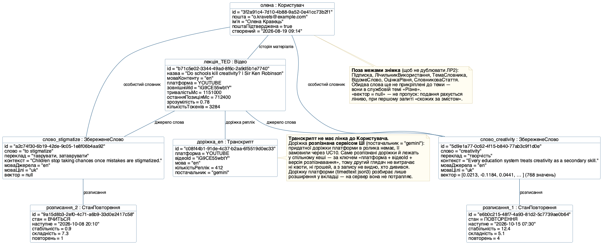
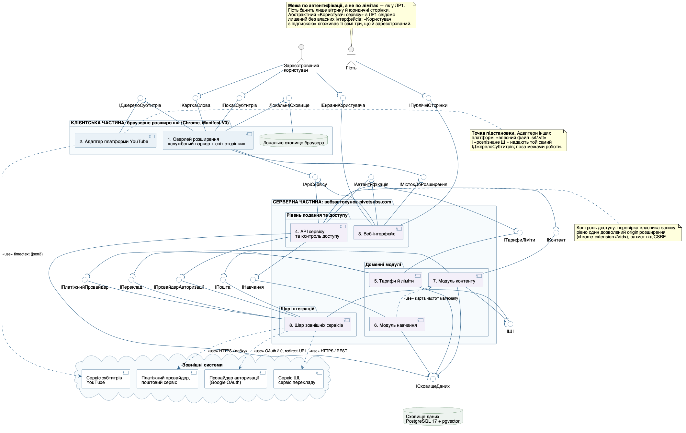
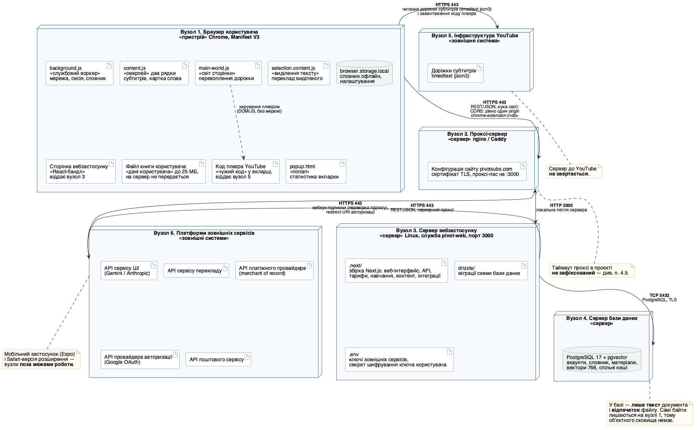

## Мета

**Варіант предметної області: «Півот» — вебсервіс і браузерне розширення для вивчення іноземної мови на основі власного контенту користувача.** Роботу виконав студент групи ВТ-23-2 Камінський Олексій Дмитрович.

Опанувати три структурні діаграми UML (Unified Modeling Language — уніфікована мова моделювання), які доповнюють діаграму класів Лабораторної роботи №2: діаграму обʼєктів (Object Diagram) — конкретний «знімок» системи у фіксований момент; діаграму компонентів (Component Diagram) — модульну архітектуру з наданими й необхідними інтерфейсами; діаграму розгортання (Deployment Diagram) — фізичне розміщення програмних частин на обладнанні.

Предметна область спільна для всіх чотирьох лабораторних робіт курсу й для курсової роботи та збігається з темою дипломної роботи. Межі моделі, прийняті в ЛР1 і ЛР2, діють без змін: відеоплатформа розглядається одна — YouTube, а джерело субтитрів заховане за інтерфейсом `ДжерелоСубтитрів`, тому інші площадки присутні лише як точка підстановки; штучний інтелект — зовнішній сервіс за API, власних моделей у роботі немає; мобільний застосунок і Safari-версія — поза межами роботи; телеметрії й аналітики в системі свідомо немає.

Якщо ЛР2 відповідала на питання «з чого система складається як модель даних», то ця робота відповідає на три інші питання. Діаграма обʼєктів — «як виглядають конкретні дані в один момент часу й чи можлива взагалі така конфігурація». Діаграма компонентів — «на які замінні модулі розкладається код і через які контракти вони зчеплені». Діаграма розгортання — «де саме цей код виконується й по яких протоколах вузли розмовляють». Це перехід від логічної моделі до фізичної, і головна перевірка якості тут — щоб жоден елемент не зʼявився з типового шаблону, а був підтверджений реальним устроєм сервісу.

## Розділ 1. Інструмент і порядок рендерингу діаграм

Усі три діаграми описані текстом у нотації PlantUML (версія 1.2026.8) і відрендерені локально двома форматами: SVG — векторний, для читання на екрані й масштабування без втрат, PNG — растровий, для вставляння в текст звіту. Текстовий опис діаграми, а не малюнок у графічному редакторі, обраний свідомо: такий опис версіонується в git поряд із кодом сервісу, а зміна моделі видна в diff рядком, а не перемальовуванням.

```text
plantuml -tsvg objects.puml     && plantuml -tpng objects.puml
plantuml -tsvg components.puml  && plantuml -tpng components.puml
plantuml -tsvg deployment.puml  && plantuml -tpng deployment.puml
```

У кожному файлі задано `skinparam defaultFontName "Helvetica"`, щоб кириличні підписи рендерилися однаково на всіх трьох діаграмах, і `skinparam shadowing false`, щоб прибрати тіні, які в чорно-білому друку перетворюються на брудні контури.

| Файл | Що описує | Відрендеровано |
|---|---|---|
| `objects.puml` | Частина 1. Знімок стану системи: 7 обʼєктів пʼяти класів ЛР2 | `objects.svg`, `objects.png` |
| `components.puml` | Частина 2. Модульна архітектура: 8 компонентів, 18 інтерфейсів | `components.svg`, `components.png` |
| `deployment.puml` | Частина 3. Фізична архітектура: 6 вузлів, 20 розміщених елементів | `deployment.svg`, `deployment.png` |

**Висновок:** діаграми зберігаються як текст і рендеряться однією командою, тому модель можна вести в тому ж репозиторії, що й код, а звіт перезбирати без ручного перемальовування.

## Розділ 2. Діаграма обʼєктів: знімок стану системи

### 2.1. Який фрагмент діаграми класів ілюструє цей знімок

Методичка вимагає обрати 4–5 класів діаграми класів, повʼязаних асоціацією, агрегацією або композицією. Обрано рівно пʼять, і обрано їх так, щоб у знімку були присутні всі три типи відношень одразу: `Користувач`, `Відео` (нащадок абстрактного `Матеріал`), `Транскрипт`, `ЗбереженеСлово` і `СтанПовторення`. Саме ця пʼятірка утворює наскрізний шлях даних головного сценарію теми — UC04 «Дивитися відео з двомовними субтитрами» разом із UC06 «Зберегти слово у словник» і UC16 «Пройти сесію інтервальних повторень».

Знімок зроблено в момент **8 жовтня 2026 р., 18:42 (Київ)**. Описана ним ситуація така: користувачка Олена Кравець із мовною парою «англійська → українська» і діючою підпискою дивилася лекцію TED, у якої немає придатної доріжки субтитрів платформи, тому доріжку колись замовили через UC10 «Замовити розпізнавання мовлення для відео» — і вона вже лежить у спільному кеші розпізнаних доріжок. Це не дрібниця вибору прикладу, а єдиний спосіб зробити знімок правдивим: спільний серверний кеш доріжок (`transcript_cache`) наповнює **лише** конвеєр розпізнавання, у якому `постачальник` сьогодні завжди `gemini`. Доріжку самої платформи (`timedtext`, json3) розбирає виключно розширення у вкладці й на сервер не кладе взагалі, тому обʼєкта з таким постачальником у спільному кеші існувати не може. З цієї лекції вона зберегла два слова: `creativity` — уже четвертий раз повторене й призначене на 15 жовтня, і `to stigmatize` — збережене щойно, у стані «вчиться», з найближчим показом того ж вечора. Жодне з двох слів ще не прикріплене до теми словника, бо ШІ-розкладку (UC15) вона не запускала.

Значення атрибутів — **правдоподібні тестові дані**, а не вивантаження з робочої бази. Ідентифікатори наведені у справжніх форматах (UUID-4 для записів бази, одинадцятизначний base64url для ідентифікатора відео YouTube), назва матеріалу — реальної публічної лекції, а тексти контекстів написані самостійно, щоб не переносити у звіт фрагменти чужої стенограми. Числа взаємно узгоджені: `останняПозиціяМс = 712400` менша за `тривалістьМс = 1151000`, а момент збереження другого слова (`00:11:48`) лежить у межах перегляду.

Два слоти варті окремого пояснення, бо в них легко порушити нотацію. Перший: `вектор` у слова `creativity` записаний **конкретним значенням** — `[0.0213, -0.1184, 0.0441, … ] (768 значень)`, а не типом `Vector(768)`. Тип — це мова діаграми класів (ЛР2), на діаграмі обʼєктів у слоті стоїть значення, і таблиця п. 1.1 методички формулює цю різницю прямо. Другий: у слова `to stigmatize` той самий слот має значення `null`, і це не пропуск, а точний стан системи — векторне подання контексту рахується ліниво, при першому запиті «схожих за змістом», тому в щойно збереженого слова його ще немає. Слота `відпечаток` в обʼєкті доріжки немає свідомо: у класі `Транскрипт` ЛР2 `відпечаток()` — це **операція** в секції методів, а слот на діаграмі обʼєктів можна дати лише атрибуту.

### 2.2. Код діаграми обʼєктів

```text
@startuml
' Лабораторна робота №3. Частина 1. Діаграма обʼєктів
' Предметна область: «Півот» — вебсервіс і браузерне розширення
' для вивчення іноземної мови на основі власного контенту користувача
' Камінський Олексій Дмитрович, група ВТ-23-2
' Знімок стану системи: 8 жовтня 2026 р., 18:42 (Київ)

' --- блок оформлення (skinparam) опущено, повний текст — у файлі objects.puml ---

object "олена : Користувач" as u {
  id = "3f2a91c4-7d10-4b88-9a52-0e41cc73b2f1"
  пошта = "o.kravets@example.com"
  імʼя = "Олена Кравець"
  поштаПідтверджена = true
  створений = "2026-08-19 09:14"
}

object "лекція_TED : Відео" as v {
  id = "b71c5e02-3344-49ad-8f6c-2a9d5b1e7740"
  назва = "Do schools kill creativity? | Sir Ken Robinson"
  моваКонтенту = "en"
  платформа = YOUTUBE
  зовнішнійId = "iG9CE55wbtY"
  тривалістьМс = 1151000
  останняПозиціяМс = 712400
  зрозумілість = 0.78
  кількістьТокенів = 3284
}

object "доріжка_en : Транскрипт" as t {
  id = "c08f44b1-91de-4c37-b2aa-6f5519d0ec33"
  платформа = YOUTUBE
  відеоId = "iG9CE55wbtY"
  мова = "en"
  кількістьРеплік = 412
  постачальник = "gemini"
}

object "слово_creativity : ЗбереженеСлово" as w1 {
  id = "5d9e1a77-0c62-4f15-b840-77ab3c9f1d0e"
  слово = "creativity"
  переклад = "творчість"
  контекст = "Every education system treats creativity as a secondary skill."
  моваДжерела = "en"
  моваЦілі = "uk"
  вектор = [0.0213, -0.1184, 0.0441, … ] (768 значень)
}

object "слово_stigmatize : ЗбереженеСлово" as w2 {
  id = "a2c74f30-6b19-42de-9c05-1e8f06b4aa92"
  слово = "to stigmatize"
  переклад = "таврувати, затаврувати"
  контекст = "Children stop taking chances once mistakes are stigmatized."
  моваДжерела = "en"
  моваЦілі = "uk"
  вектор = null
}

object "розписання_1 : СтанПовторення" as r1 {
  id = "e6b0c215-48f7-4a93-81d2-5c7739ae0b64"
  стан = ПОВТОРЕННЯ
  наступне = "2026-10-15 07:30"
  стабільність = 12.4
  складність = 5.1
  повторень = 4
}

object "розписання_2 : СтанПовторення" as r2 {
  id = "9a15d8b3-2ef0-4c71-a6b9-33d0e2417c58"
  стан = ВЧИТЬСЯ
  наступне = "2026-10-08 20:10"
  стабільність = 0.9
  складність = 7.3
  повторень = 1
}

' ====== ЛІНКИ (екземпляри асоціацій діаграми класів ЛР2) ======
u -- v : історія матеріалів
u -- w1 : особистий словник
u -- w2 : особистий словник
v -- t : доріжка реплік
v -- w1 : джерело слова
v -- w2 : джерело слова
w1 -- r1 : розписання
w2 -- r2 : розписання

note right of t
  **Транскрипт не має лінка до Користувача.**
  Доріжка **розпізнана сервісом ШІ** (постачальник = "gemini"):
  придатної доріжки платформи в ролика немає, її
  замовили через UC10. Саме розпізнані доріжки й лежать
  у спільному кеші — за ключем «платформа + відеоId +
  версія розпізнавання», тому другий глядач не витрачає
  ні квоти, ні грошей, а з запису не видно, хто дивився.
  Доріжку платформи (timedtext json3) розбирає лише
  розширення у вкладці — на сервер вона не потрапляє.
end note

note bottom of u
  **Поза межами знімка** (щоб не дублювати ЛР2):
  Підписка, ЛічильникВикористання, ТемаСловника,
  ВідомеСлово, ОцінкаРівня, СловниковаСтаття.
  Обидва слова ще не прикріплені до теми —
  вони в службовій темі «Різне».
  «вектор = null» — не пропуск: подання рахується
  ліниво, при першому запиті «схожих за змістом».
end note
@enduml
```

### 2.3. Рисунок



### 2.4. Відповідність лінків асоціаціям діаграми класів

Головна відмінність нотації, зафіксована в розділі 1.1 методички: на діаграмі класів зʼєднання — це асоціація з множинністю, на діаграмі обʼєктів — **лінк**, конкретний екземпляр асоціації, і множинності він не має, бо вона вже «розгорнута» в конкретну кількість прямокутників. Тому всі вісім лінків підписані лише роллю з діаграми класів, без чисел, і намальовані простою лінією без ромбів: ромб — твердження про тип відношення, а не про екземпляр.

| Лінк на знімку | Відношення на діаграмі класів ЛР2 | Множинність у ЛР2 | Як розгорнуто в знімку |
|---|---|---|---|
| `олена — лекція_TED` | `Користувач ◆— Матеріал` «історія матеріалів» | 1 — 0..\* | Один матеріал із історії; решта матеріалів у знімок не внесена |
| `олена — слово_creativity`, `олена — слово_stigmatize` | `Користувач ◆— ЗбереженеСлово` «особистий словник» | 1 — 0..\* | Два слова: множинність `0..*` розгорнулася у два прямокутники |
| `лекція_TED — слово_creativity`, `лекція_TED — слово_stigmatize` | `Матеріал ◇— ЗбереженеСлово` «джерело слова» | 0..1 — 0..\* | Обидва слова збережені з того самого відео |
| `лекція_TED — доріжка_en` | `Відео — Транскрипт` «доріжка реплік» | 0..\* — 0..1 | Одна доріжка на одне відео; з боку доріжки видно, що власника в неї немає |
| `слово_creativity — розписання_1`, `слово_stigmatize — розписання_2` | `ЗбереженеСлово ◆— СтанПовторення` «розписання» | 1 — 0..1 | У кожного слова рівно одне розписання, у різних станах |

Знімок зробив видимими три властивості моделі класів, які на самій діаграмі класів доводилося доказувати словами. Перша: **у `Транскрипт` немає жодного лінка до `Користувач`** — рішення про спільний довідник без власника виглядає на знімку не як забутий звʼязок, а як факт, бо прямокутник доріжки стоїть збоку й тримається тільки за відео. Друга: множинність `0..1` на `СтанПовторення` справді потрібна — обидва слова тут розписання мають, але слово, щойно збережене й ще не внесене в сесію, існувало б без нього. Третя: обидва слова одночасно є частиною користувача (композиція) і частиною відео (агрегація) — конфігурація, яка в ЛР2 обґрунтовувалася тестом «частина може мати лише один композит», і знімок показує, що вона непротирічна.

**Висновок:** діаграма обʼєктів підтвердила, що конфігурація, передбачена діаграмою класів ЛР2, справді досяжна, і водночас виявилася зрозумілішою за абстрактну модель: сім прямокутників із реальними значеннями читаються швидше, ніж двадцять класів із типами.

## Розділ 3. Діаграма компонентів: модульна архітектура

### 3.1. Принцип декомпозиції й межа «клієнт — сервер»

Декомпозиція зроблена за принципом «один компонент — одна бізнес-можливість», як радить методичка, з одним додатковим обмеженням: компонентом ставав лише той модуль, який **можна замінити, не переписуючи решти**. Саме це відрізняє компонент від пакета класів ЛР2: пакет групує дані, компонент оголошує контракт.

Діаграма явно розділена на дві частини, бо в цій системі це дві окремі збірки, два окремі розгортання й дві окремі межі довіри: **клієнтська** — браузерне розширення (Chrome, Manifest V3), **серверна** — вебзастосунок на домені `pivotsubs.com`. Усередині серверної частини виділено три рівні: рівень подання та доступу, доменні модулі й шар інтеграцій. За межі обох частин винесено **спільне сховище даних** і **зовнішні системи**, бо вони не є модулями нашого коду. А ось локальне сховище браузера лишається всередині клієнтської частини й надає інтерфейс `IЛокальнеСховище`: воно невіддільне від розширення — живе в його власному просторі `browser.storage.local`, разом з ним встановлюється й разом з ним видаляється.

| Компонент | Бізнес-можливість | Чому окремий компонент |
|---|---|---|
| 1. Оверлей розширення | Показ двох рядків субтитрів, картка слова, панель транскрипту, попап | Єдина частина, що живе у чужій сторінці; платформенно-сліпа — знає лише інтерфейси |
| 2. Адаптер платформи YouTube | Пошук плеєра, спостереження за навігацією, перехоплення доріжки, розкладка панелі | Головна точка підстановки теми: нова платформа додається новою реалізацією `IДжерелоСубтитрів` |
| 3. Веб-інтерфейс | Історія матеріалів, читалка, словник, сесія повторень, тест рівня, налаштування, підписка | Окрема збірка сторінок; крім екранів, надає місток до розширення |
| 4. API сервісу та контроль доступу | REST-маршрути, перевірка власника запису, єдиний дозволений origin розширення, захист від CSRF | Єдина точка входу для двох клієнтів; контроль доступу не можна розмазати по модулях |
| 5. Тарифи й ліміти | Тариф за ступенями, денні ліміти, місячні стелі, тихий відкат, вебхуки підписки | Наскрізна можливість: її питають усі модули, тому вона не належить жодному з них |
| 6. Модуль навчання | Розписання FSRS, профіль відомих слів, оцінка зрозумілості, тест обсягу словника, темізація | Уся «математика навчання» в одному місці: її можна замінити іншим алгоритмом |
| 7. Модуль контенту | Парсери документів, пагінація, відпечатки, транскрипти, спільні кеші перекладів і розборів | Межа, за якою закінчується особисте й починається спільне (кеші за хеш-ключем) |
| 8. Шар зовнішніх сервісів | Адаптери ШІ, перекладу, пошти, платежів, провайдера авторизації; шифрування власного ключа користувача | Один шар, а не пʼять компонентів: виклики однотипні — запит, кеш, списання ліміту, тихий відкат |

Свідомо **не** виділено окремими компонентами: словник, сесію повторень і тест рівня (це три можливості одного модуля навчання, вони ділять ті самі дані й той самий алгоритм); окремий «шлюз API» перед застосунком (у системі його немає — застосунок один, а TLS і таймаути робить проксі, і це вузол розгортання, а не компонент); чергу повідомлень (довга робота розпізнавання доігрується в тому ж процесі, що обслужив запит).

### 3.2. Код діаграми компонентів

Угода про напрямок, прийнята у файлі, щоб зʼєднання «льодяник-розетка» читалися однаково: провайдер завжди приєднується до кружечка знизу (`-up-`), споживач — зверху (`-down-(`). Через це кружечок інтерфейса завжди стоїть між тим, хто надає, і тим, хто потребує, а потік залежностей на діаграмі йде строго вниз: людина → клієнт → рівень доступу → доменні модулі → інтеграції та сховище.

Виняток з цієї угоди один — `IМістокДоРозширення`. Там провайдером є розширення, тобто елемент, який за змістом потоку стоїть **вище** свого споживача (вебсторінки), тому в коді напрямки перевернуті: `Оверлей -down- IМістокДоРозширення` і `Веб-інтерфейс -up-( IМістокДоРозширення`. Семантика при цьому не змінюється й змінитися не може: у PlantUML `-up-` і `-down-` керують лише розкладкою, а боком контракту керують самі символи — плоска лінія `--` завжди належить провайдерові, півколо `-(` завжди споживачеві. Виняток зроблений заради читабельності рисунка, а не заради зручності моделі.

```text
@startuml
' Лабораторна робота №3. Частина 2. Діаграма компонентів
' Предметна область: «Півот» — вебсервіс і браузерне розширення
' для вивчення іноземної мови на основі власного контенту користувача
' Камінський Олексій Дмитрович, група ВТ-23-2
' Принцип декомпозиції: один компонент — одна бізнес-можливість.
' Угода про напрямок: провайдер завжди знизу («-up-» до кружечка),
' споживач завжди зверху («-down-(» до того самого кружечка).
' Єдиний виняток — IМістокДоРозширення: там провайдер (розширення) за
' змістом стоїть ВИЩЕ споживача (вебсторінка), бо потік «людина → клієнт →
' сервер» на діаграмі йде вниз. Семантика від цього не змінюється: плоска
' лінія «--» завжди у провайдера, півколо «-(» завжди у споживача.

' --- блок оформлення (skinparam) опущено, повний текст — у файлі components.puml ---

actor "Зареєстрований\nкористувач" as Reg
actor "Гість" as Guest

' =====================================================================
' КЛІЄНТСЬКА ЧАСТИНА — браузерне розширення
' =====================================================================
package "КЛІЄНТСЬКА ЧАСТИНА: браузерне розширення (Chrome, Manifest V3)" as CLIENT {
  component "1. Оверлей розширення\n<<службовий воркер + світ сторінки>>" as Overlay #E8F0F7
  component "2. Адаптер платформи YouTube" as YT #E8F0F7
  database "Локальне сховище браузера" as Local
}

' =====================================================================
' СЕРВЕРНА ЧАСТИНА — вебзастосунок pivotsubs.com
' =====================================================================
package "СЕРВЕРНА ЧАСТИНА: вебзастосунок pivotsubs.com" as SERVER {
  package "Рівень подання та доступу" as L1 {
    component "3. Веб-інтерфейс" as Web #F3EFF8
    component "4. API сервісу\nта контроль доступу" as API #F3EFF8
  }
  package "Доменні модулі" as L2 {
    component "5. Тарифи й ліміти" as Plans #F3EFF8
    component "6. Модуль навчання" as Learn #F3EFF8
    component "7. Модуль контенту" as Content #F3EFF8
  }
  package "Шар інтеграцій" as L3 {
    component "8. Шар зовнішніх сервісів" as ExtLayer #F3EFF8
  }
}

database "Сховище даних\nPostgreSQL 17 + pgvector" as DB

cloud "Зовнішні системи" as Cloud {
  component "Сервіс субтитрів\nYouTube" as CloudYT
  component "Сервіс ШІ,\nсервіс перекладу" as CloudAI
  component "Платіжний провайдер,\nпоштовий сервіс" as CloudPay
  component "Провайдер авторизації\n(Google OAuth)" as CloudOAuth
}

' ===================== ІНТЕРФЕЙСИ =====================
interface "IПоказСубтитрів" as IShow
interface "IКарткаСлова" as ICard
interface "IЕкраниКористувача" as IScreens
interface "IДжерелоСубтитрів" as ISub
interface "IЛокальнеСховище" as ILocal
interface "IМістокДоРозширення" as IBridge
interface "IApiСервісу" as IApi
interface "IАвтентифікація" as IAuth
interface "IТарифиЛіміти" as ILimits
interface "IНавчання" as ILearn
interface "IКонтент" as IContent
interface "IШІ" as IAI
interface "IПереклад" as ITranslate
interface "IПошта" as IMail
interface "IПлатіжнийПровайдер" as IPay
interface "IСховищеДаних" as IStore
interface "IПровайдерАвторизації" as IOAuth
interface "IПублічніСторінки" as IPublic

' ---- надані інтерфейси «назовні», до людини ----
Overlay -up- IShow
Overlay -up- ICard
Web -up- IScreens
Web -up- IPublic
Reg -down-( IShow
Reg -down-( ICard
Reg -down-( IScreens
Guest -down-( IPublic

' ---- клієнтська частина ----
YT -up- ISub
Overlay -down-( ISub
Local -up- ILocal
Overlay -down-( ILocal

' ---- місток «вебсторінка — розширення» ----
' Приймач повідомлень оголошує саме розширення
' (browser.runtime.onMessageExternal + externally_connectable),
' а викликає його сторінка вебзастосунку — отже провайдер тут розширення.
Overlay -down- IBridge
Web -up-( IBridge

' ---- межа «клієнт — сервер» ----
API -up- IApi
Overlay -down-( IApi
Web -down-( IApi
API -up- IAuth
Web -down-( IAuth

' ---- усередині серверної частини ----
Plans -up- ILimits
API -down-( ILimits
Learn -up- ILearn
API -down-( ILearn
Content -up- IContent
API -down-( IContent

ExtLayer -up- IAI
Learn -down-( IAI
Content -down-( IAI
ExtLayer -up- ITranslate
Content -down-( ITranslate
ExtLayer -up- IPay
Plans -down-( IPay
ExtLayer -up- IMail
Plans -down-( IMail
ExtLayer -up- IOAuth
API -down-( IOAuth

DB -up- IStore
API -down-( IStore
Plans -down-( IStore
Learn -down-( IStore
Content -down-( IStore

'  ---- підказки компонувальнику (не елементи моделі) ----
Reg -[hidden]right- Guest
API -[hidden]down- Plans
Plans -[hidden]down- ExtLayer
Content -[hidden]right- Learn

' ===================== ЗАЛЕЖНОСТІ =====================
YT ..> CloudYT : <<use>> timedtext (json3)
ExtLayer ..> CloudAI : <<use>> HTTPS / REST
ExtLayer ..> CloudPay : <<use>> HTTPS / вебхук
ExtLayer ..> CloudOAuth : <<use>> OAuth 2.0, redirect-URI
Learn ..> Content : <<use>> карта частот матеріалу

note left of YT
  **Точка підстановки.** Адаптери інших
  платформ, «власний файл .srt/.vtt»
  і «розпізнане ШІ» надають той самий
  IДжерелоСубтитрів; поза межами роботи.
end note

note top of Guest
  **Межа по автентифікації, а не по лімітах** — як у ЛР1.
  Гість бачить лише вітрину й юридичні сторінки.
  Абстрактний «Користувач сервісу» з ЛР1 свідомо
  лишений без власних інтерфейсів; «Користувач
  з підпискою» споживає ті самі три, що й зареєстрований.
end note

note right of API
  Контроль доступу: перевірка власника запису,
  рівно один дозволений origin розширення
  (chrome-extension://<id>), захист від CSRF.
end note
@enduml
```

### 3.3. Рисунок



### 3.4. Надані й необхідні інтерфейси кожного компонента

| Компонент | Надані інтерфейси (provided) | Необхідні інтерфейси (required) |
|---|---|---|
| 1. Оверлей розширення | `IПоказСубтитрів`, `IКарткаСлова`, `IМістокДоРозширення`, `IСтатистикаВкладки`\* | `IДжерелоСубтитрів`, `IApiСервісу`, `IЛокальнеСховище` |
| 2. Адаптер платформи YouTube | `IДжерелоСубтитрів`, `IПлеєр`\* | `IПерехопленняМережі`\* (світ сторінки), `IЦільоваМова`\* |
| 3. Веб-інтерфейс | `IЕкраниКористувача`, `IПублічніСторінки` | `IApiСервісу`, `IАвтентифікація`, `IМістокДоРозширення` |
| 4. API сервісу та контроль доступу | `IApiСервісу`, `IАвтентифікація`, `IНалаштування`\* | `IТарифиЛіміти`, `IНавчання`, `IКонтент`, `IПровайдерАвторизації`, `IСховищеДаних` |
| 5. Тарифи й ліміти | `IТарифиЛіміти`, `IПланКористувача`\* | `IПлатіжнийПровайдер`, `IПошта`, `IСховищеДаних` |
| 6. Модуль навчання | `IНавчання`, `IЗрозумілість`\*, `IТестРівня`\* | `IШІ`, `IСховищеДаних` |
| 7. Модуль контенту | `IКонтент`, `IТранскрипти`\*, `IПарсерДокумента`\* | `IШІ`, `IПереклад`, `IСховищеДаних` |
| 8. Шар зовнішніх сервісів | `IШІ`, `IПереклад`, `IПошта`, `IПлатіжнийПровайдер`, `IПровайдерАвторизації` | — (потреба виражена залежностями `<<use>>` до зовнішніх систем) |

\* — інтерфейс існує в моделі, але на рисунку не накреслений: він має лише одного споживача в межах того самого компонента або споживається поза системою. На рисунку накреслені всі 18 інтерфейсів, через які проходить зʼєднання «льодяник-розетка» між різними елементами діаграми; решту винесено в цю таблицю, щоб рисунок лишився читабельним.

Мінімум методички («хоча б один наданий **та/або** необхідний інтерфейс») витримано всіма вісьмома компонентами, і сім із восьми мають обидва боки контракту. Виняток один і він свідомий: у **шару зовнішніх сервісів** необхідного інтерфейса немає взагалі. Це не недогляд, а зміст самого шару — він ходить у чужі системи, яким ми контракту не диктуємо, тому його потреба виражена не «розеткою», а залежностями `<<use>>` до хмари «Зовнішні системи». Намалювати йому необхідний інтерфейс означало б стверджувати, що Gemini, платіжний провайдер і Google OAuth реалізують **наш** інтерфейс, тоді як насправді це ми пристосовуємося до їхнього.

Два напрямки в таблиці варті окремої перевірки, бо їх найлегше переставити місцями. Перший — **`IМістокДоРозширення`**: провайдером тут є саме **оверлей розширення**, а споживачем — веб-інтерфейс. Приймач повідомлень оголошує розширення (`browser.runtime.onMessageExternal` у службовому воркері плюс `externally_connectable` у манифесті, рівно з одним дозволеним origin), а викликає його сторінка вебзастосунку, коли людина змінила налаштування. Зворотний напрямок означав би, що контракт визначає сторінка, а реалізує його розширення, — і вже сама назва інтерфейса («місток **до** розширення») це б заперечила. Другий — **`IПровайдерАвторизації`**: його надає шар зовнішніх сервісів, а потребує компонент «API сервісу та контроль доступу», бо вхід через зовнішній акаунт (Google OAuth) розпочинає саме він, і саме він приймає зворотний redirect-URI.

Окремо показані пʼять залежностей пунктирною стрілкою, бо це слабші звʼязки, а не контракти: `Адаптер YouTube ⇢ Сервіс субтитрів YouTube` (`<<use>>` timedtext json3), `Шар зовнішніх сервісів ⇢ Сервіс ШІ й сервіс перекладу` (`<<use>>` HTTPS/REST), `Шар зовнішніх сервісів ⇢ Платіжний провайдер і поштовий сервіс` (`<<use>>` HTTPS і зворотний вебхук), `Шар зовнішніх сервісів ⇢ Провайдер авторизації` (`<<use>>` OAuth 2.0 і redirect-URI) і `Модуль навчання ⇢ Модуль контенту` (`<<use>>` карта частот матеріалу: оцінка зрозумілості читає підготовлену модулем контенту карту, але контракту на це не укладає). Провайдер авторизації винесено в окрему залежність, а не склеєно з платіжною: у нього інший протокол, інший зворотний канал (redirect-URI замість вебхука) і інший компонент-споживач на нашому боці.

**Висновок:** вісім компонентів покривають усі 20 варіантів використання ЛР1, при цьому межа «клієнт — сервер» на діаграмі збігається з реальною межею двох збірок, а єдина точка, через яку розширення дізнається про платформу, — інтерфейс `IДжерелоСубтитрів`, тому обмеження «лише YouTube» локалізоване в одному компоненті з восьми.

## Розділ 4. Діаграма розгортання: фізична архітектура

### 4.1. Код діаграми розгортання

```text
@startuml
' Лабораторна робота №3. Частина 3. Діаграма розгортання
' Предметна область: «Півот» — вебсервіс і браузерне розширення
' для вивчення іноземної мови на основі власного контенту користувача
' Камінський Олексій Дмитрович, група ВТ-23-2

' --- блок оформлення (skinparam) опущено, повний текст — у файлі deployment.puml ---

' =====================================================================
' ВУЗОЛ 1. Пристрій користувача
' =====================================================================
node "**Вузол 1.** Браузер користувача\n<<пристрій>> Chrome, Manifest V3" as Client {
  artifact "background.js\n<<службовий воркер>>\nмережа, сесія, словник" as A1
  artifact "content.js\n<<оверлей>> два рядки\nсубтитрів, картка слова" as A2
  artifact "main-world.js\n<<світ сторінки>>\nперехоплення доріжки" as A3
  artifact "selection.content.js\n<<виділення тексту>>\nпереклад виділеного" as A7
  artifact "popup.html\n<<попап>>\nстатистика вкладки" as A4
  artifact "Код плеєра YouTube\n<<чужий код>> у вкладці,\nвіддає вузол 5" as E1
  artifact "Сторінка вебзастосунку\n<<React-бандл>>\nвіддає вузол 3" as A5
  artifact "Файл книги користувача\n<<дані користувача>> до 25 МБ,\nна сервер не передається" as A8
  database "browser.storage.local\nсловник офлайн,\nналаштування" as A6
}

' =====================================================================
' ВУЗОЛ 2. Проксі
' =====================================================================
node "**Вузол 2.** Проксі-сервер\n<<сервер>> nginx / Caddy" as Proxy {
  artifact "Конфігурація сайту pivotsubs.com\nсертифікат TLS, проксі-пас на :3000" as B1
}

' =====================================================================
' ВУЗОЛ 3. Сервер вебзастосунку
' =====================================================================
node "**Вузол 3.** Сервер вебзастосунку\n<<сервер>> Linux, служба pivot-web, порт 3000" as App {
  artifact ".next/\nзбірка Next.js: веб-інтерфейс, API,\nтарифи, навчання, контент, інтеграції" as C1
  artifact "drizzle/\nміграції схеми бази даних" as C2
  artifact ".env\nключі зовнішніх сервісів,\nсекрет шифрування ключа користувача" as C3
}

' =====================================================================
' ВУЗОЛ 4. Сервер бази даних
' =====================================================================
node "**Вузол 4.** Сервер бази даних\n<<сервер>>" as Db {
  database "PostgreSQL 17 + pgvector\nакаунти, словник, матеріали,\nвектори 768, спільні кеші" as D1
}

' =====================================================================
' ВУЗОЛ 5. Інфраструктура YouTube
' =====================================================================
node "**Вузол 5.** Інфраструктура YouTube\n<<зовнішня система>>" as YT {
  artifact "Доріжки субтитрів\ntimedtext (json3)" as E2
}

' =====================================================================
' ВУЗОЛ 6. Платформи зовнішніх сервісів
' =====================================================================
node "**Вузол 6.** Платформи зовнішніх сервісів\n<<зовнішні системи>>" as Ext {
  artifact "API сервісу ШІ\n(Gemini / Anthropic)" as F1
  artifact "API сервісу перекладу" as F2
  artifact "API платіжного провайдера\n(merchant of record)" as F3
  artifact "API провайдера авторизації\n(Google OAuth)" as F4
  artifact "API поштового сервісу" as F5
}

' =====================================================================
' ШЛЯХИ КОМУНІКАЦІЇ
' =====================================================================
' ---- сітка артефактів вузла 1 (підказки компонувальнику, не елементи моделі) ----
A1 -[hidden]down- A5
A2 -[hidden]down- A8
A7 -[hidden]down- A4
A3 -[hidden]down- E1

Client -down-> Proxy : **HTTPS 443**\nREST/JSON, кука сесії;\nCORS: рівно один origin\nchrome-extension://<id>
Proxy -down-> App : **HTTP 3000**\nлокальна петля сервера
App -down-> Db : **TCP 5432**\nPostgreSQL, TLS
Client -right-> YT : **HTTPS 443**\nчитання доріжки субтитрів (timedtext json3)\nі завантаження коду плеєра
App -left-> Ext : **HTTPS 443**\nREST/JSON, серверний проксі
Ext -up-> Proxy : **HTTPS 443**\nвебхук підписки (перевірка підпису),\nredirect-URI авторизації

' керування плеєром — локальні DOM/JS-виклики в межах сторінки,
' по мережі тут не йде нічого, тому протоколу на звʼязку немає
A3 ..> E1 : керування плеєром\n(DOM/JS, без мережі)

note bottom of Db
  У базі — **лише текст** документа
  і **відпечаток** файлу. Самі байти
  лишаються на вузлі 1, тому
  обʼєктного сховища немає.
end note

note bottom of Proxy
  Таймаут проксі в проєкті
  **не зафіксований** — див. п. 4.5.
end note

note bottom of YT
  Сервер до YouTube
  **не звертається**.
end note

note bottom of Ext
  Мобільний застосунок (Expo)
  і Safari-версія розширення —
  вузли **поза межами роботи**.
end note
@enduml
```

### 4.2. Рисунок



### 4.3. Вузли та розміщені на них артефакти

Методичка вимагає щонайменше чотири вузли; побудовано шість, із них чотири — власні, два — зовнішні, і на них розміщено двадцять елементів: вісімнадцять артефактів і два сховища даних. Різницю «компонент проти артефакта» витримано буквально: компонент — логічна одиниця (наприклад, «Модуль контенту»), артефакт — конкретний файл, що розгортається (наприклад, збірка `.next/`, у якій цей модуль фізично лежить).

| № | Вузол | Артефакти на вузлі |
|---|---|---|
| 1 | Браузер користувача (Chrome, Manifest V3) | `background.js` (службовий воркер: мережа, сесія, синхронізація словника), `content.js` (оверлей субтитрів і картка слова), `main-world.js` (перехоплення доріжки й керування плеєром у світі сторінки), `selection.content.js` (переклад виділеного тексту на будь-якій сторінці), `popup.html` (статистика вкладки), сторінка вебзастосунку у вкладці (React-бандл), код відеоплеєра YouTube (чужий код, виконується у вкладці), файл книги користувача (дані користувача, до 25 МБ), `browser.storage.local` (словник офлайн, налаштування) |
| 2 | Проксі-сервер (nginx / Caddy) | Конфігурація сайту `pivotsubs.com`: сертифікат TLS домену й проксі-пас на порт 3000 |
| 3 | Сервер вебзастосунку (Linux, служба `pivot-web`, порт 3000) | `.next/` — збірка Next.js, у якій лежать компоненти 3–8; `drizzle/` — міграції схеми бази даних; `.env` — ключі зовнішніх сервісів і секрет шифрування власного ключа користувача |
| 4 | Сервер бази даних | `PostgreSQL 17 + pgvector` (акаунти, словник, матеріали, вектори розмірності 768, спільні кеші) |
| 5 | Інфраструктура YouTube *(зовнішня система)* | Доріжки субтитрів `timedtext` (json3) |
| 6 | Платформи зовнішніх сервісів *(зовнішні системи)* | API сервісу ШІ (Gemini / Anthropic), API сервісу перекладу, API платіжного провайдера, API провайдера авторизації (Google OAuth), API поштового сервісу |

Два рішення тут навмисно відрізняються від типового шаблону вебсервісу, і обидва мають причину в самій системі. **Окремого вузла обʼєктного сховища немає — і не тому, що файли малі.** Причина сильніша: файл книги на сервер **узагалі не передається**. Завантаження відбувається у браузері — там файл читається, там рахується його SHA-256 відпечаток, там його розбирає парсер; на сервер їде лише готовий нормалізований текст (`documents.content`) і ті 32 байти відпечатка (`documents.fingerprint`). Колонок типу `bytea` чи `blob` у схемі бази немає жодної. Тому байти файлу живуть на вузлі 1, а не на вузлі 4, і сховищу об'єктів у цій системі просто нічого було б зберігати. Відпечаток же тримається на сервері навмисно: екран «оригінал на іншому пристрої» просить вибрати файл заново й мусить **сличити** його з чимось — а якби відпечаток лежав поруч із байтами в браузері, то на новому пристрої його там так само не було б. **Окремого вузла кеша немає:** спільні кеші перекладів, транскриптів і розборів — це таблиці з хеш-ключем у тій самій базі, і саме тому вони переживають перезапуск застосунку.

Ще одна деталь вузла 1 важлива для чесності інвентаря: артефактом показано й **код відеоплеєра YouTube**. Плеєр виконується у вкладці користувача, тобто на вузлі 1, а з інфраструктури YouTube (вузол 5) по мережі приходять лише дві речі — код цього плеєра й доріжка субтитрів. Керування плеєром, яким займається `main-world.js`, показано пунктирною залежністю **всередині** вузла 1 і без протоколу: це локальні DOM- і JS-виклики в межах однієї сторінки, по мережі тут не йде нічого.

### 4.4. Трасування «компонент → артефакт → вузол»

| Компонент (Частина 2) | Артефакт, що його реалізує | Вузол |
|---|---|---|
| 1. Оверлей розширення | `content.js`, `background.js`, `popup.html`, `selection.content.js` | 1. Браузер користувача |
| 2. Адаптер платформи YouTube | `main-world.js` і частина `content.js` | 1. Браузер користувача |
| 3. Веб-інтерфейс | `.next/` (віддає сторінку), React-бандл у вкладці | 3. Сервер вебзастосунку + 1. Браузер |
| 4. API сервісу та контроль доступу | `.next/` (серверні маршрути) | 3. Сервер вебзастосунку |
| 5. Тарифи й ліміти | `.next/` + `.env` (ключі провайдера) | 3. Сервер вебзастосунку |
| 6. Модуль навчання | `.next/` | 3. Сервер вебзастосунку |
| 7. Модуль контенту | `.next/` + `drizzle/` (схема кешів) | 3. Сервер вебзастосунку |
| 8. Шар зовнішніх сервісів | `.next/` + `.env` (ключі зовнішніх API) | 3. Сервер вебзастосунку |
| Сховище даних | `PostgreSQL 17 + pgvector` (текст документів і відпечатки, самі файли — на вузлі 1) | 4. Сервер бази даних |

Таблиця показує два випадки, про які прямо питає методичка. **Один компонент — кілька артефактів:** оверлей розширення фізично розкладений на чотири файли, бо Manifest V3 вимагає, щоб фоновий воркер, скрипт сторінки, скрипт виділення тексту й попап були окремими точками входу з власними правилами застосування. **Кілька компонентів — один артефакт:** шість серверних компонентів (3–8) лежать в одній збірці `.next/`, бо вебзастосунок розгортається як одна служба; логічна межа між ними від цього не зникає — вона лишається контрактом, який видно на діаграмі компонентів, і саме по ній зручно різати систему, якщо колись знадобиться окреме розгортання.

### 4.5. Шляхи комунікації та протоколи

| Шлях | Протокол | Що передається |
|---|---|---|
| Вузол 1 → Вузол 2 | **HTTPS 443**, REST/JSON | Запити розширення й вебсторінки з кукою сесії; сервер пускає по CORS рівно один origin `chrome-extension://<id>` |
| Вузол 2 → Вузол 3 | **HTTP 3000**, локальна петля | Розшифрований трафік усередині машини; TLS завершується на проксі |
| Вузол 3 → Вузол 4 | **TCP 5432**, протокол PostgreSQL, TLS | Запити до даних і векторний пошук; порт відкритий лише для вебзастосунку |
| Вузол 1 → Вузол 5 | **HTTPS 443** | Читання доріжки субтитрів (`timedtext`, json3) і завантаження коду плеєра; **сервер до YouTube не звертається** |
| Вузол 3 → Вузол 6 | **HTTPS 443**, REST/JSON | Запити до ШІ, перекладу, пошти й платіжного провайдера через серверний проксі |
| Вузол 6 → Вузол 2 | **HTTPS 443** | Зворотний канал: вебхук підписки з перевіркою підпису й redirect-URI провайдера авторизації |

Керування плеєром у цій таблиці свідомо **відсутнє**, хоч у попередній версії моделі воно стояло підписом саме на цьому шляху. Керування плеєром — це локальні DOM- і JS-виклики `main-world.js` у межах відкритої сторінки; по мережі тут не передається нічого, а протокол на звʼязку стверджував би мережну взаємодію там, де її немає. На рисунку це показано внутрішньою залежністю вузла 1.

Дві протокольні деталі варті окремого рядка, бо кожна з них є рішенням, а не умовністю. Перша: **напрямок звʼязку з YouTube** — доріжку читає тільки розширення у вкладці користувача, з його адреси й у межах сторінки; серверного завантаження немає ні фактично, ні в планах. Друга: **вебхук приходить на той самий проксі**, що й користувацький трафік, і єдине, що відрізняє його від підробки, — перевірка підпису на стороні застосунку.

А ось третя деталь, якої в моделі **немає** і яку варто назвати прямо, бо вона добре ілюструє п. 6.6 про межі ШІ. Таймаут проксі перед застосунком у проєкті **не зафіксований**: конфігурації проксі в репозиторії немає, числа немає і в документі розгортання — там так і написано, «перевірити й вписати». Для довідки: умовчання `proxy_read_timeout` у nginx — 60 секунд, у Caddy обмеження немає. Розпізнавання мовлення цей таймаут не зачіпає (відповідь клієнтові йде відразу, а робота доігрується фоном), але будь-який звичайний довгий запит — зачіпає. Тому артефакт вузла 2 названо нейтрально — «конфігурація сайту: сертифікат TLS, проксі-пас на порт 3000», — а не вигаданим імʼям файла з вигаданими «подовженими таймаутами»: на діаграмі розгортання чесне відкрите питання корисніше за переконливу неправду.

**Висновок:** шість вузлів, двадцять розміщених елементів (18 артефактів і 2 сховища даних) і шість підписаних шляхів описують систему так, що її можна розгорнути за цією діаграмою; найцікавішим фактом виявився не перелік вузлів, а те, що один зі звʼязків (клієнт → YouTube) обходить власний сервер і тим самим виносить за його межі і трафік, і юридичну відповідальність за доступ до доріжки.

## Розділ 5. Перевірка узгодженості з Лабораторними роботами №1 і №2

Три діаграми цієї роботи не є новою моделлю: вони мусять бути тим самим сервісом, який уже описаний акторами ЛР1 і класами ЛР2. Перевірку зроблено у двох зрізах.

**Зріз 1. Дванадцять акторів ЛР1 на елементах ЛР3.** У ЛР1 перелік акторів містить рівно дванадцять позицій: пʼять людських ролей (абстрактний «Користувач сервісу», Гість, Зареєстрований користувач, Користувач з підпискою, Адміністратор), шість зовнішніх систем і абстрактний «Зовнішній постачальник ШІ-функцій» — і обидва абстрактні узагальнення в цьому числі враховані. Людські актори перетворилися не на компоненти, а на споживачів наданих інтерфейсів і на вузол «Браузер користувача»; зовнішні системи — на вузли 5 і 6 та на залежності `<<use>>` від шару інтеграцій.

| Актор ЛР1 | Де він на діаграмах ЛР3 |
|---|---|
| **Користувач сервісу** *(абстрактний)* | Свідомо **без власних інтерфейсів** — рівно з тієї ж причини, з якої в ЛР1 він лишений без власних асоціацій: він узагальнює й гостя, а гість не має ні акаунта, ні мовної пари, ні профілю відомої лексики |
| Гість | Актор «Гість» на діаграмі компонентів: споживає лише `IПублічніСторінки` (вітрина й юридичні сторінки) |
| Зареєстрований користувач, Користувач з підпискою | Актор «Зареєстрований користувач»: споживає `IПоказСубтитрів`, `IКарткаСлова`, `IЕкраниКористувача`. Користувач з підпискою споживає ті самі три; різниця між ними — не в наборі контрактів, а в результаті перевірки `IТарифиЛіміти` |
| Адміністратор | Не компонент: працює артефактами вузла 3 — `drizzle/` (міграції) і `.env` (ключі, стелі) |
| **Зовнішній постачальник ШІ-функцій** *(абстрактний)* | Шар зовнішніх сервісів як єдиний компонент замість двох окремих: саме це узагальнення й виражене тим, що `IШІ` та `IПереклад` надає один компонент за однією схемою — запит, кеш, списання ліміту, тихий відкат |
| Сервіс субтитрів YouTube | Вузол 5; залежність `Адаптер YouTube ⇢ Сервіс субтитрів YouTube` |
| Сервіс перекладу, Сервіс ШІ *(спеціалізації «Зовнішнього постачальника ШІ-функцій»)* | Вузол 6; інтерфейси `IПереклад` і `IШІ` шару інтеграцій |
| Платіжний провайдер | Вузол 6; інтерфейс `IПлатіжнийПровайдер`; зворотний шлях «Вузол 6 → Вузол 2» (вебхук підписки з перевіркою підпису) |
| Провайдер авторизації | Вузол 6 (артефакт «API провайдера авторизації, Google OAuth»); **власний інтерфейс `IПровайдерАвторизації`** шару інтеграцій, потрібний компонентові «API сервісу та контроль доступу»; окрема залежність `<<use>>` OAuth 2.0; зворотний шлях «Вузол 6 → Вузол 2» (redirect-URI) |
| Поштовий сервіс | Вузол 6; інтерфейс `IПошта`, потрібний компонентові «Тарифи й ліміти» |

**Зріз 2. Класи ЛР2 на компонентах ЛР3.** Кожен клас предметної області дістав компонент, що ним володіє, і жоден клас не лишився без власника.

| Класи ЛР2 | Компонент-власник |
|---|---|
| `Користувач`, `НалаштуванняКористувача` | 4. API сервісу та контроль доступу |
| `Підписка`, `ЛічильникВикористання` | 5. Тарифи й ліміти |
| `ЗбереженеСлово`, `ТемаСловника`, `ВідомеСлово`, `СтанПовторення`, `ОцінкаРівня` | 6. Модуль навчання |
| `Матеріал`, `Відео`, `Документ`, `Транскрипт`, `ПереказДоріжки`, `СловниковаСтаття`, інтерфейс `ПарсерДокумента` з реалізаціями | 7. Модуль контенту |
| Інтерфейс `ДжерелоСубтитрів`, `ДжерелоСубтитрівYouTube`, `ФабрикаДжерелСубтитрів` | 2. Адаптер платформи YouTube |

Окремо варто відзначити чотири поняття, які в ЛР2 були свідомо відкинуті з приміткою «це процеси, їхнє місце — ЛР3», і які тут справді зʼявилися: `МенеджерСловника` став компонентом «Модуль навчання», `СервісПерекладу` — частиною компонента «Шар зовнішніх сервісів», `КонтролерЧиталки` — частиною компонента «Веб-інтерфейс», а `ОбробникПідписки` — компонентом «Тарифи й ліміти», який і володіє класами `Підписка` та `ЛічильникВикористання`. Це підтверджує, що фільтр «сутність, а не процес» у ЛР2 був застосований правильно: процеси не зникли, вони просто чекали на свою діаграму.

**Висновок:** усі 12 акторів ЛР1 і всі 20 елементів моделі класів ЛР2 знайшли місце на діаграмах цієї роботи, причому всі чотири поняття, відкладені в ЛР2 як «процеси», стали компонентами саме тут — перевірка трасованості пройдена в обидві сторони.

## Розділ 6. Відповіді на питання для самоконтролю

### 6.1. Чим відрізняється лінк від асоціації

Асоціація — твердження про **типи**: «користувач може мати нуль або більше збережених слів». Лінк — твердження про **екземпляри**: «ось цей обʼєкт `олена` повʼязаний ось із цим обʼєктом `слово_creativity`». Тому лінк не має множинності: вона вже витрачена на те, щоб намалювати два прямокутники слів, а не один. На знімку з розділу 2 множинність `0..*` асоціації «особистий словник» розгорнулася рівно у два лінки.

### 6.2. Коли діаграма обʼєктів перевіряє діаграму класів

Коли в моделі є частина, що належить двом цілим одночасно. У ЛР2 `ЗбереженеСлово` є композитною частиною `Користувач` і агрегатною частиною `Матеріал`, і на діаграмі класів це виглядає підозріло — два ромби на одному класі. Знімок знімає підозру: обидва лінки існують одночасно й не суперечать один одному, бо видалення відео забирає посилання на момент, а не саму картку. Другий випадок такої перевірки — класи-довідники без власника: відсутність лінка `Транскрипт — Користувач` на знімку видно відразу, і видно, що доріжка при цьому не «висить», а тримається за відео.

### 6.3. Різниця між наданим і необхідним інтерфейсом

Наданий інтерфейс — те, що компонент обіцяє іншим і за що відповідає: `Адаптер YouTube` надає `IДжерелоСубтитрів`, тобто гарантує, що віддасть доріжку, знайде плеєр і сховає родні субтитри. Необхідний — те, без чого компонент не працює, але чого сам не робить: `Оверлей` потребує `IДжерелоСубтитрів` і не знає, хто його реалізує. У нотації перший — кружечок («льодяник»), другий — півколо («розетка»), і зʼєднання читається як вставляння льодяника в розетку. Практична цінність саме в асиметрії: замінивши провайдера, споживача не торкаються.

### 6.4. Чим компонент відрізняється від артефакта

Компонент — логічна одиниця архітектури, артефакт — фізичний файл, що розгортається на вузлі. «Модуль контенту» — компонент; `.next/` — артефакт. Компонент можна обговорювати, не знаючи мови програмування; артефакт не можна скопіювати, не знаючи його формату. Різниця практична: межі компонентів вирішують, хто кого може викликати, а межі артефактів — що саме треба передеплоїти після зміни.

### 6.5. Чому один компонент реалізується кількома артефактами (і навпаки)

Обидва випадки є в цій роботі й обидва мають технічну причину. Один компонент у трьох артефактах: оверлей розширення розкладений на `background.js`, `content.js` і `popup.html`, бо Manifest V3 вимагає окремих точок входу для фонового воркера, скрипта сторінки й попапа — логічно це один модуль, фізично три файли з різними правами. Шість компонентів в одному артефакті: серверні компоненти 3–8 лежать у збірці `.next/`, бо застосунок розгортається як одна служба. Відповідність «компонент — артефакт» не є взаємно однозначною, бо компонент відповідає на питання «хто за що відповідає», а артефакт — на питання «що покласти на диск».

### 6.6. Обмеження ШІ-згенерованої декомпозиції

Три обмеження, перевірені на практиці цієї роботи. Перше: ШІ не знає масштабу системи, тому пропонує декомпозицію з типового шаблону — шлюз, черга, окремий кеш, окреме обʼєктне сховище — незалежно від того, чи є вони насправді. Друге: ШІ не відчуває вартості межі; він охоче ріже на дрібні компоненти, бо «мікросервіси — добре», і не бачить, що три дрібні компоненти ділять ті самі дані й той самий алгоритм, тому межа між ними обернеться лише зайвими викликами. Третє: ШІ не перевіряє характеристик інфраструктури — ні таймаутів, ні відмовостійкості, ні того, чи дозволяють умови зовнішнього сервісу те, що намальовано на діаграмі. Усе це видно лише інженерові, який знає саму систему.

## Критичний аналіз ШІ-чернетки

Чернетки всіх трьох діаграм згенеровано ШІ-асистентом за текстовим описом предметної області, переліком варіантів використання ЛР1 і моделлю класів ЛР2, після чого проведено ручну звірку з реальним устроєм сервісу. Нижче — шість реальних помилок саме цих чернеток, знайдених першим проходом звірки, а далі окремим підрозділом — ще чотири, які вилізли лише на другому проході, коли діаграми звірялися вже не з описом предметної області, а з кодом сервісу.

| Помилка ШІ-чернетки | Чому це помилка | Як виправлено |
|---|---|---|
| **Діаграма обʼєктів: лінк `олена — доріжка_en`.** Чернетка привʼязала транскрипт до користувача, бо «знімок про користувача, отже все має вести до нього» | Це той самий систематичний нахил ШІ, що й у ЛР2: усе робити частиною головного обʼєкта. Але доріжка спільна для всіх глядачів і зберігається за ключем «платформа + відеоId + **версія розпізнавання**» — версія в ключі не декорація, вона дає вичистити доріжки, зроблені старим промптом, одним запитом. Лінк до користувача знищив би обидва сенси рішення — приватність (із записів стало б видно, хто що дивився) і економію (другий глядач ролика не витрачає квоти) | Лінк прибрано; доріжка тримається лише за `лекція_TED`. На рисунку додано примітку з **повним** ключем, щоб відсутність лінка не читалася як недогляд |
| **Діаграма обʼєктів: множинності на лінках.** Чернетка підписала зʼєднання як `1 — 0..*`, просто перенісши підписи з діаграми класів ЛР2 | Пряме порушення розділу 1.1 методички: на діаграмі обʼєктів множинності не буває, бо вона вже розгорнута в конкретну кількість прямокутників. Запис `1 — 0..*` між двома конкретними обʼєктами безглуздий: між ними або є лінк, або його немає | Усі вісім підписів замінено на назви ролей з діаграми класів («особистий словник», «джерело слова», «розписання»), числа прибрано |
| **Діаграма компонентів: 17 компонентів замість 8.** Чернетка видала окремі «Словник», «Сесія повторень», «Тест рівня», «Оцінка зрозумілості», «Темізація словника» | Класична «занадто дрібна» декомпозиція, про яку попереджає розділ 1.4 методички. Усі пʼять працюють з тими самими даними (`ЗбереженеСлово`, `СтанПовторення`, `ВідомеСлово`) і тим самим алгоритмом FSRS; межа між ними не замінна й нічого не приховує, тому це не компоненти, а можливості одного компонента | Обʼєднано в «Модуль навчання» з трьома наданими інтерфейсами (`IНавчання`, `IЗрозумілість`, `IТестРівня`). Кількість компонентів зведено до 8 — по одній бізнес-можливості на компонент |
| **Діаграма компонентів: «API Gateway» і «Message Queue».** Чернетка додала їх, бо вони є в кожному шаблоні вебсервісу | Жодного з двох у системі немає. Застосунок один, і зовнішнього шлюзу перед ним немає — TLS і таймаути робить проксі, а це вузол розгортання, а не компонент. Черги теж немає: довга робота з розпізнавання доігрується в тому самому процесі, що обслужив запит. Домалювати їх означало б описати не цю систему, а середню систему з інтернету | Обидва прибрано. Проксі перенесено туди, де йому місце, — на діаграму розгортання вузлом 2; механізм довгої роботи описано в розділі 4.5 як вимогу до таймаутів |
| **Діаграма розгортання: вузли обʼєктного сховища й кеша.** Чернетка додала «S3-сумісне сховище для PDF» і «Redis для кешу перекладів» | Те саме перенесення шаблону, але вже з наслідками для безпеки: кожен лишній вузол — це ще один канал, який треба захищати й описувати в політиці конфіденційності. Причина, чому сховище об'єктів зайве, при цьому **не в розмірі файла**: файл книги на сервер узагалі не передається. Його читає, відпечатує й розбирає браузер, а в базу їде лише нормалізований текст і 32 байти SHA-256; колонок `bytea` чи `blob` у схемі немає жодної. Спільні ж кеші — це таблиці з хеш-ключем у тій самій базі, і саме тому вони переживають перезапуск застосунку | Обидва вузли прибрано. Текст документів і відпечатки показано на вузлі 4, а **самі байти файла — артефактом вузла 1** з підписом «на сервер не передається». Обґрунтування у звіті виправлено: справа не в межі 25 МБ, а в тому, що файл не їде на сервер |
| **Діаграма розгортання: звʼязок «сервер → YouTube».** Чернетка провела запит доріжки від сервера вебзастосунку, бо «сервер звертається до зовнішніх API» | Напрямок тут не деталь, а суть архітектури: доріжку читає виключно розширення у вкладці користувача, з його адреси й у межах сторінки. Серверне завантаження з площадки блокується діапазонами хостингу й суперечить її умовам, тому такого звʼязку немає ні фактично, ні в планах. Намальована стрілка описувала б систему, яку не можна розгорнути | Звʼязок перенесено на «Вузол 1 → Вузол 5» з підписом «читання доріжки у межах сторінки»; на рисунку додано примітку «сервер до YouTube не звертається» |


### Другий прохід: чого не видно з першого разу

Перший прохід звірки прибрав елементи, яких у системі немає, — і цього виявилося **недостатньо**. Повторна звірка готових діаграм із кодом сервісу (а не з описом предметної області) знайшла ще чотири помилки, і всі чотири були небезпечніші за перші шість, бо виглядали вже не як шаблон з інтернету, а як правдоподібні твердження про наш власний сервіс. Найгірше те, що одна з них навіть ховалася в самому критичному аналізі: обґрунтування «обʼєктне сховище зайве, бо файли малі» було хибним, тобто правильне виправлення трималося на неправильній причині.

| Помилка, знайдена на другому проході | Чому це помилка | Як виправлено |
|---|---|---|
| **Діаграма обʼєктів: доріжка платформи у спільному кеші.** Чернетка дала обʼєктові `Транскрипт` постачальника `youtube/timedtext json3` і поклала його в спільний серверний кеш | Такого запису в системі не існує, і помилка тут підриває саму тезу знімка. Спільний серверний кеш доріжок наповнює **лише** конвеєр розпізнавання мовлення, у якому постачальник сьогодні завжди `gemini`; доріжку платформи розбирає виключно розширення у вкладці й на сервер не кладе взагалі. Теза «доріжка спільна, другий глядач не витрачає квоти» справджується саме для розпізнаних доріжок — тобто для протилежного значення, ніж поставила чернетка | Постачальника виправлено на `gemini`, сценарій знімка уточнено (у ролика немає придатної доріжки платформи, доріжку замовили через UC10); примітку переписано так, щоб видно було обидва шляхи — спільний кеш для розпізнаного й вкладка для `timedtext`. Слот `відпечаток` з обʼєкта прибрано: у класі `Транскрипт` ЛР2 це **операція**, а не атрибут |
| **Діаграма компонентів: перевернутий місток «вебсторінка — розширення».** Чернетка зробила провайдером `IМістокДоРозширення` веб-інтерфейс, а споживачем — оверлей розширення | Приймач повідомлень оголошує саме розширення (`onMessageExternal` у службовому воркері плюс `externally_connectable` у манифесті), а викликає його сторінка вебзастосунку. Перевернутий напрямок стверджував би, що контракт визначає сторінка, а реалізує його розширення; це суперечить і назві інтерфейса («місток **до** розширення»), і власній угоді файла «провайдер завжди на боці реалізації» | Напрямок змінено: `Оверлей -- IМістокДоРозширення`, `Веб-інтерфейс -( IМістокДоРозширення`. У таблиці п. 3.4 інтерфейс перенесено з наданих компонента 3 до наданих компонента 1, а з необхідних компонента 1 — до необхідних компонента 3 |
| **Діаграма компонентів: провайдер авторизації без жодного контракту.** Чернетка склеїла платіжний провайдер, поштовий сервіс і провайдера авторизації в один елемент хмари, не давши входу через зовнішній акаунт ні інтерфейса, ні окремої залежності | Google OAuth — окремий зовнішній провайдер входу: у схемі бази під нього є власна таблиця з `provider_id`, маркерами доступу й `id_token`, а в документі розгортання — окремий крок із рівно одним redirect-URI. Без власного інтерфейса актор ЛР1 «Провайдер авторизації» або висить на діаграмі без звʼязку, або (ще гірше) трасується в таблиці п. 5 на чужі `IПлатіжнийПровайдер` і `IПошта` — і заявлена наскрізна трасованість акторів перестає виконуватися | Додано інтерфейс `IПровайдерАвторизації`: надає «Шар зовнішніх сервісів», потребує «API сервісу та контроль доступу». Провайдера авторизації виділено окремим елементом хмари з власною залежністю `<<use>>` OAuth 2.0; рядок таблиці п. 5 виправлено |
| **Діаграма компонентів: абстрактний актор ЛР1 як споживач конкретних інтерфейсів.** Чернетка повісила на «Користувача сервісу» `IПоказСубтитрів`, `IКарткаСлова` й `IЕкраниКористувача` | Це пряме скасування рішення, яке ЛР1 спеціально обґрунтовує: абстрактний актор узагальнює й гостя, а гість не має ні акаунта, ні мовної пари, ні профілю відомої лексики — отже, через спадкування гість отримував би двомовні субтитри й картку слова, які ЛР1 у нього забрала. Межа в ЛР1 проведена по **автентифікації**, а не по лімітах тарифу, тому виправдання «різниця лише в перевірці `IТарифиЛіміти`» підміняє причину | На діаграму виведено двох конкретних акторів: «Зареєстрований користувач» (три інтерфейси) і «Гість» (лише новий `IПублічніСторінки` — вітрина й юридичні сторінки). Абстрактний актор лишений без власних інтерфейсів, як у ЛР1; текст п. 5 виправлено, щоб причина збігалася з ЛР1 |

Висновок із цього проходу практичніший за висновок із першого. Перші шість помилок виловлюються питанням «а це в нас узагалі є?» — його можна поставити, знаючи лише перелік вузлів і компонентів. Наступні чотири виловлюються лише питанням «а де саме в коді це написано?»: напрямок містка видно в одному рядку обробника повідомлень, порожнечу колонки `bytea` — у схемі бази, постачальника доріжки — у коментарі до таблиці кеша, а межу гостя — у власному тексті ЛР1. Тому в цій роботі звірка з кодом проведена **двічі**: один раз за описом предметної області, другий — за файлами сервісу, і друга перевірка дала більше, ніж перша.

**Висновок:** чернетки дали корисний чорновий каркас за кілька хвилин, але всі десять виправлень вимагали знання саме цього сервісу, а не знання UML. Помилки розклалися на два чітких різновиди. Перший — **підстановка типового шаблону на місце реальної системи**: чотири з шести виправлень першого проходу прибирають елементи, яких у системі просто немає (шлюз, черга, обʼєктне сховище, зовнішній кеш). Другий — **правдоподібна вигадка про наш власний сервіс**: перевернутий напрямок містка, доріжка з неіснуючим постачальником, файл книги в базі, провайдер авторизації без контракту. Другий різновид небезпечніший, бо шаблон видно за питанням «а це в нас є?», а вигадку — лише за питанням «а де це написано в коді?». Саме тому критичний розбір чернетки обовʼязковий, а не бажаний, і саме тому його варто робити двічі.

## Висновки

У роботі побудовано три структурні діаграми UML для предметної області «Півот» — вебсервісу й браузерного розширення для вивчення іноземної мови на основі власного контенту користувача. Діаграма обʼєктів містить сім обʼєктів пʼяти класів ЛР2 з узгодженими між собою значеннями й вісім лінків без множинностей; діаграма компонентів — вісім компонентів, вісімнадцять накреслених інтерфейсів і пʼять залежностей, з явним розділенням клієнтської частини (браузерне розширення) і серверної (вебзастосунок, API); діаграма розгортання — шість вузлів, двадцять розміщених елементів (вісімнадцять артефактів і два сховища даних) і шість підписаних шляхів комунікації. Усі числові мінімуми методички (4–5 класів на знімку, не менше 5 компонентів, не менше 4 вузлів) перевищено, причому перевищено не заради кількості: кожен додатковий елемент зʼявився тому, що без нього з моделі випадало конкретне рішення сервісу.

Три діаграми виявилися трьома різними інструментами перевірки, а не трьома виглядами однієї картинки. Діаграма обʼєктів перевірила модель даних ЛР2: вона показала, що конфігурація з двома ромбами на `ЗбереженеСлово` справді досяжна, і зробила видимим рішення про спільні довідники без власника — відсутність лінка до користувача видно відразу, тоді як на діаграмі класів її доводилося обґрунтовувати абзацом тексту. Діаграма компонентів перевірила межі: вона показала, що обмеження «лише YouTube» локалізоване в одному компоненті з восьми й усувається новою реалізацією `IДжерелоСубтитрів`, а не переписуванням оверлея. Діаграма розгортання перевірила реалізовність: вона виявила, що один із шести звʼязків (клієнт → YouTube) обходить власний сервер, і це не оптимізація, а вимога — серверне завантаження доріжки неможливе.

Трасованість витримана в обидві сторони. Усі 12 акторів ЛР1 знайшли місце: пʼять людських ролей — як споживачі наданих інтерфейсів і як вузол «Браузер користувача», шість зовнішніх систем — як вузли 5 і 6 з залежностями `<<use>>`, і обидва абстрактні узагальнення теж не загубилися. «Користувач сервісу» лишений **без власних інтерфейсів** — рівно з тієї ж причини, з якої ЛР1 лишила його без власних асоціацій: він узагальнює й гостя, а гість не має акаунта, тому ні двомовні субтитри, ні картка слова йому не доступні, і межа тут по автентифікації, а не по лімітах тарифу. «Зовнішній постачальник ШІ-функцій» виражений тим, що `IШІ` та `IПереклад` надає один шар інтеграцій за однією схемою. Усі 20 елементів моделі класів ЛР2 дістали компонент-власник, і жоден клас не лишився без нього. Особливо показово, що всі чотири поняття, свідомо відкинуті в ЛР2 з приміткою «це процеси, їхнє місце — ЛР3», справді стали тут компонентами: `МенеджерСловника` → «Модуль навчання», `СервісПерекладу` → «Шар зовнішніх сервісів», `КонтролерЧиталки` → «Веб-інтерфейс», `ОбробникПідписки` → «Тарифи й ліміти».

Відповідаючи на питання, яким методичка просить завершити звіт — **яка з трьох діаграм найкраще пояснює архітектуру стороннім особам** — відповідь залежить від того, хто ця стороння особа, і три різні відповіді самі по собі є результатом роботи. Новому розробникові найкорисніша **діаграма компонентів**: вона єдина відповідає на питання «куди мені писати код і кого я маю право викликати», і межа «клієнт — сервер» на ній збігається з межею двох збірок, тому після неї не треба читати репозиторій, щоб зрозуміти, де що лежить. Замовникові або керівникові найзрозуміліша **діаграма розгортання**: вона говорить мовою речей, за які платять і які можна зламати, — скільки серверів, де лежать персональні дані, які зовнішні сервіси є критичною залежністю. А тому, хто сумнівається в самій моделі даних, потрібна **діаграма обʼєктів**: вона єдина не абстрактна, і сім прямокутників з реальними значеннями переконують швидше, ніж двадцять класів із типами. Якщо ж обирати одну, вибір — діаграма компонентів, бо вона лежить посередині: з неї видно і логіку, і майбутні вузли розгортання, і місце кожного класу ЛР2.

Головним методичним результатом роботи став висновок про межі ШІ в задачах архітектури, і він виявився двоступеневим. Перший прохід звірки прибрав чотири елементи, яких у системі немає взагалі (шлюз, черга повідомлень, обʼєктне сховище, зовнішній кеш), і виправив один напрямок звʼязку, намальований «як звичайно буває». Але другий прохід — уже не за описом предметної області, а за файлами самого сервісу — знайшов ще чотири помилки іншої, небезпечнішої природи: перевернутий напрямок містка «вебсторінка — розширення», доріжку субтитрів із постачальником, якого в спільному кеші не буває, файли книг, нібито складені в базу даних, і провайдера авторизації, що висів на діаграмі без жодного контракту. Шаблон видно за питанням «а це в нас є?», і його ловить будь-хто, хто знає перелік вузлів. Вигадку про власний сервіс видно лише за питанням «а де саме в коді це написано?» — і вона тим переконливіша, чим грамотніше сформульована. Для наступних робіт це дає конкретне робоче правило: ШІ можна доручити каркас і перевірку синтаксису, але кожен вузол, компонент, протокол і **напрямок** мусить мати підтвердження у файлі сервісу — не в описі предметної області, а саме в коді; причому перевірку варто робити двічі, бо в цій роботі друга перевірка дала більше помилок, ніж перша, і одна з них ховалася просто в тексті критичного аналізу.
