## Мета

Закріпити матеріал лекції 7 і навчитися будувати діаграму діяльності (Activity Diagram) мови UML (Unified Modeling Language — уніфікована мова моделювання) для реального сценарію власного курсового завдання: розподіляти дії між учасниками за доріжками, виражати розгалуження, цикли та паралельні гілки, показувати передачу обʼєктів у певних станах, а головне — перевіряти побудовану діаграму на коректність за правилами маркерів, а не лише малювати її.

Формальний титульний аркуш оформлено першою сторінкою цього документа; нижче продубльовано його змістові поля, яких вимагає пункт 1 структури звіту, — тему роботи та варіант предметної області.

| Поле титульного аркуша | Значення |
|---|---|
| Лабораторна робота | № 4 |
| Дисципліна | Моделювання та аналіз програмного забезпечення |
| Тема роботи | Побудова діаграми діяльності бізнес-процесу |
| Варіант предметної області | Веб-сервіс завантаження та читання книг «Полиця» (спрощений аналог MyBook і Bookmate) — та сама предметна область, що й у Лабораторних роботах №1, №2 і №3 |
| Змодельований бізнес-процес | UC14 «Завантажити власну книгу»: від вибору файла до публікації документа в каталозі або його відхилення |
| Виконав | Камінський Олексій Дмитрович, група ВТ-23-2 |
| Інструмент | PlantUML 1.2026.8 (локальна установка, рендеринг Graphviz) |

Предметна область та сама, що й у Лабораторних роботах №1 і №2: веб-сервіс завантаження та читання книг «Полиця». Користувач реєструється, переглядає каталог, завантажує власні книги у форматах EPUB або PDF, читає їх у вбудованій читалці зі збереженням прогресу й закладок, веде власні колекції та оформлює підписку для доступу до платного каталогу. Модератор перевіряє завантажений користувачами контент; оплату обробляє зовнішня платіжна система, файли книг зберігаються в зовнішньому обʼєктному сховищі, вхід можливий через Google OAuth, а переклад виділеного слова виконує зовнішній словниковий сервіс.

## Розділ 1. Вибір варіанта використання та його текстова специфікація

З двадцяти пʼяти варіантів використання Лабораторної роботи №1 для моделювання обрано **UC14 «Завантажити власну книгу»**. Вибір зумовлений трьома причинами. По-перше, його основний потік містить шість кроків у самій специфікації, а разом із продовженням процесу — **UC23 «Модерувати завантажену книгу»** (рядок 221 переліку варіантів використання ЛР1: основний актор — «Модератор контенту», другорядний — «Сервіс email-сповіщень») — розгортається у процес із понад двадцяти кроків, що з запасом перекриває вимогу «щонайменше вісім кроків». По-друге, у цьому сценарії беруть участь одразу пʼятеро виконавців, зокрема три зовнішні щодо системи, тож доріжок вистачає природним чином, без штучного дроблення. По-третє — і це головне — специфікація UC14 містить саме ті конструкції, яких вимагає завдання: альтернативні потоки 2а–2в дають розгалуження з власними кінцевими вузлами, а потік 4а — цикл із явною умовою виходу.

Нижче наведено текстову специфікацію UC14 дослівно так, як вона зафіксована в розділі 6 Лабораторної роботи №1 — діаграма діяльності будується саме за нею.

| Поле | Значення |
|---|---|
| ID / Назва | UC14 — Завантажити власну книгу |
| Актор(и) | Зареєстрований читач (основний); Обʼєктне сховище файлів (другорядний); результат сценарію формує чергу для Модератора контенту (UC23) |
| Передумови | Читач авторизований; не перевищено ліміт завантажень для його тарифу; файл має формат EPUB або PDF |
| Основний потік | 1. Читач відкриває форму «Завантажити книгу» і обирає файл. 2. Система перевіряє формат і метадані файлу: MIME-тип, розмір, цілісність архіву EPUB, витягує назву й автора. 3. Система показує розпізнані метадані; читач за потреби виправляє назву, автора, мову, обкладинку. 4. Система вивантажує файл в обʼєктне сховище і зберігає в себе лише метадані та посилання. 5. Система створює запис книги зі статусом «На модерації» й додає завдання в чергу модератора. 6. Система повідомляє читачеві, що книга прийнята й очікує перевірки. |
| Альтернативні потоки | 2а. Формат не підтримується або файл пошкоджено — система відхиляє завантаження з поясненням, файл не зберігається. 2б. Розмір перевищує ліміт — завантаження відхилено. 2в. За хешем файла виявлено дублікат уже завантаженої книги — система пропонує відкрити наявну книгу замість повторного завантаження. 4а. Сховище недоступне — система повторює вивантаження тричі з наростальною паузою; після третьої невдачі завантаження скасовується, запис у базі не створюється. |
| Постумови | Файл збережено в обʼєктному сховищі; у базі створено запис книги зі статусом «На модерації»; завдання додано в чергу модератора; завантажувач має доступ до своєї книги |

Усі три альтернативні потоки специфікації дали на діаграмі конкретні конструкції, і жоден не залишився без моделювання. Потік **2в** (дублікат за хешем) дав перше розгалуження «Такий файл уже завантажено?» з власним кінцевим вузлом. Потоки **2а** і **2б** обʼєднано в одне розгалуження «Файл придатний до обробки?», бо непідтримуваний формат, пошкоджений архів і перевищений розмір — це три причини однієї й тієї самої відмови на одному й тому самому кроці; розрізняти їх окремими вузлами означало б дублювати структуру без нових конструкцій. Потік **4а** («система повторює вивантаження тричі з наростальною паузою; після третьої невдачі завантаження скасовується, запис у базі не створюється») дав цикл із явною умовою виходу та окреме розгалуження після нього — саме тому на гілці «ні» стоїть дія «Скасувати завантаження і звільнити чернетку запису», а не створення запису книги.

Кроки 2 і 4 основного потоку UC14 на діаграмі розгорнуто детальніше, ніж у тексті специфікації, але **нових варіантів використання це не вводить**. У Лабораторній роботі №1 внутрішні кроки «Перевірити формат і метадані файлу» та «Зберегти файл у обʼєктному сховищі» свідомо **вилучено** з переліку варіантів використання (ЛР1, розділ 4, таблиця вилучених позицій: «це внутрішні кроки реалізації, тобто функціональна декомпозиція, а не варіанти використання»), а їхній зміст перенесено саме в текст специфікації UC14. Діаграма діяльності — природне місце, де ці кроки знову стають видимими, бо тут вони є діями, а не варіантами використання.

Межі змодельованого процесу свідомо розширено порівняно з «вузьким» UC14: діаграма доводить документ не до постановки в чергу модерації, а до його фактичної публікації або відхилення й сповіщення читача. Підстава для цього розширення — не вигаданий альтернативний потік, а окремий варіант використання **UC23 «Модерувати завантажену книгу»** з переліку ЛР1, для якого там указано основного актора «Модератор контенту» і другорядного «Сервіс email-сповіщень»; сповіщення читача про результат ЛР1 відносить саме до постумов UC23 (рядок таблиці вилучених позицій для колишнього UC24: «Постумови UC01 і UC23»). Повної текстової специфікації UC23 у ЛР1 немає — там складено лише три специфікації (UC07, UC14, UC17), — тому поведінку модератора на діаграмі визначено за назвою UC23, його акторами та методами класу `МодераторКонтенту` з ЛР2 (`схвалити(з: ЗавданняМодерації)`, `відхилити(з: ЗавданняМодерації, причина: String)`). Звідси й ключове модельне рішення: дія `Каталог.опублікувати()` виконується **тільки** на гілці «схвалено», тому відхилений документ у публічний каталог не потрапляє. Інакше в процесі не було б ані розгалуження за рішенням модератора, ані учасника «Модератор контенту», ані взаємодії з поштовим сервісом — тобто сценарій обривався б саме там, де починається найцікавіша з погляду моделювання частина.

**Висновок:** UC14 разом із продовженням UC23 — єдина пара варіантів використання моделі, у якій одночасно природно виникають цикл повторних спроб, паралельна робота двох виконавців і чотири незалежні розгалуження, тому саме вона обрана для діаграми діяльності.

## Розділ 2. Розподіл дій по доріжках

Згідно з методикою розділу 1.2 методички спершу виписано всі дієслівні фрази зі специфікації, після чого для кожної визначено виконавця. Рівень абстракції добирався за правилом розділу 1.3: дія — це один змістовний крок сценарію з погляду виконавця, після якого результат уже можна спостерігати. Саме тому в кінцевій діаграмі немає кроків на зразок «Натиснути кнопку „Огляд“», хоча у чернетці вони були (див. розділ «Критичний аналіз ШІ-чернетки»), а чотири інтерфейсні кроки чернетки згорнуто в одну дію «Обрати файл книги й надіслати його в систему» — рівно крок 1 специфікації UC14.

| Доріжка | Роль у сценарії | Дії, які в ній виконуються |
|---|---|---|
| Читач | Ініціатор процесу, власник контенту | Обрати файл книги й надіслати його в систему; відкрити наявний документ замість повторного завантаження; ознайомитися з причиною відмови; уточнити назву, автора та мову документа; ознайомитися з причиною технічної відмови; отримати лист про схвалення; відкрити документ у власній колекції; отримати лист про відхилення; ознайомитися з причиною відхилення |
| Система «Полиця» | Координатор процесу | Обчислити хеш файла і звірити його з раніше завантаженими; запропонувати відкрити наявний документ; перевірити формат, розмір і цілісність файла; відхилити завантаження з поясненням причини; розпізнати метадані парсером формату; вивантажити файл у обʼєктне сховище; отримати результат вивантаження; зафіксувати спробу вивантаження; скасувати завантаження і звільнити чернетку запису; створити запис документа зі статусом «На модерації»; сформувати обкладинку та підготувати непублічний індекс; опублікувати документ у каталозі; позначити документ як «Відхилено»; надіслати запит на сповіщення про схвалення; надіслати запит на сповіщення про відхилення |
| Обʼєктне сховище файлів | Зовнішня система зберігання файлів | Опрацювати запит на збереження обʼєкта |
| Модератор контенту | Перевіряльник завантаженого контенту | Відкрити завдання модерації; перевірити вміст і правомірність публікації; ухвалити рішення щодо документа |
| Сервіс email-сповіщень | Зовнішня система доставки листів | Сформувати й доставити лист про схвалення; сформувати й доставити лист про відхилення |

Чотири з пʼяти доріжок відповідають акторам Лабораторної роботи №1 — «Обʼєктне сховище файлів», «Модератор контенту», «Сервіс email-сповіщень» названо дослівно так, як вони підписані на діаграмі варіантів використання; доріжка «Читач» — це актор «Зареєстрований читач», скорочений до назви однойменного класу ЛР2 (`Читач`), щоб підпис доріжки не розтягував колонку. Пʼята доріжка «Система «Полиця»» — це не актор, а сама межа системи з діаграми варіантів використання: усе, що на діаграмі ЛР1 лежить усередині прямокутника системи.

Окремого коментаря потребує дія **«Зафіксувати спробу вивантаження»**: на перший погляд вона дрібніша за сусідні бізнес-кроки й виглядає службовою. Її залишено свідомо, і причина не оформлювальна, а семантична. Умова виходу з циклу — «Вивантаження невдале і спроб менше трьох?» — посилається на лічильник спроб, і якщо жодна дія в тілі циклу цей лічильник не змінює, цикл формально виглядає коректним, а фактично є нескінченним. Саме ця дія робить другу кон'юнкту умови зрештою хибною, що й доводиться таблицею розділу 5.2. Тобто виняток із правила однакового рівня абстракції тут обґрунтований завершуваністю циклу, а не недоглядом.

**Висновок:** розподіл дій по доріжках показав, що три з пʼяти учасників процесу є зовнішніми щодо системи, і це головна особливість обраного сценарію: система тут здебільшого координує, а не виконує роботу самостійно.

## Розділ 3. Діаграма діяльності

Процес розгортається так. Читач обирає файл і надсилає його в систему — разом із керуванням передається обʼєкт `ФайлКниги` у стані «переданий». Система обчислює хеш файла і звіряє його з раніше завантаженими: якщо такий файл уже є, система пропонує відкрити наявний документ, і гілка завершується власним кінцевим вузлом (альтернативний потік 2в). Далі система перевіряє формат, розмір і цілісність; якщо файл непридатний, завантаження відхиляється і ця гілка теж завершується власним кінцевим вузлом, не доходячи до решти процесу. Придатний файл розбирається парсером формату, читач уточнює метадані, після чого починається цикл вивантаження у зовнішнє сховище: система надсилає сигнал сховищу, сховище опрацьовує запит, система очікує на результат і фіксує спробу. Цикл повторюється, доки вивантаження невдале і спроб менше трьох, тому завершується не пізніше третьої ітерації.

Після циклу стоїть окреме рішення «Файл збережено у сховищі?», бо вийти з циклу можна двома різними способами — через успіх і через вичерпання спроб. Якщо файл не збережено, система скасовує завантаження, читач бачить причину, і гілка завершується власним кінцевим вузлом. Якщо збережено, система створює запис документа зі статусом «На модерації», і процес розгалужується: система паралельно формує обкладинку та готує індекс, а модератор у цей самий час відкриває завдання, перевіряє вміст і ухвалює рішення. Ці дві лінії не залежать одна від одної й належать різним доріжкам, тому зʼєднані саме вузлами розгалуження та зʼєднання, а не послідовним потоком.

Назву паралельної дії уточнено до «Сформувати обкладинку та підготувати **непублічний** індекс» навмисно. Індексація справді виконується одночасно з модерацією — інакше публікація схваленого документа затягувалася б на час побудови індексу, — але побудований індекс до рішення модератора лишається в непублічному стані й пошуком у каталозі не знаходиться. Видимим його робить окрема дія «Опублікувати документ у каталозі», яка виконується вже після рішення. Без цього уточнення діаграма суперечила б самому змісту модерації: проіндексований документ знайшовся б пошуком у каталозі ще до рішення модератора, тобто перевірка контенту втратила б сенс.

Вузол зʼєднання чекає обидві гілки, після чого рішення модератора визначає долю документа. Обидві гілки цього рішення симетричні за структурою, але **завершуються окремо**: на гілці «схвалено» документ публікується в каталозі, читач отримує лист про схвалення й відкриває документ у власній колекції; на гілці «відхилено» документ позначається як «Відхилено», читач отримує лист про відхилення й ознайомлюється з причиною. Саме тому на діаграмі пʼять кінцевих вузлів, а не один: жодне з двох завершень не веде до дії іншого.

```plantuml
@startuml
' Лабораторна робота №4. Діаграма діяльності бізнес-процесу
' Предметна область: веб-сервіс завантаження та читання книг «Полиця»
' Сценарій: UC14 «Завантажити власну книгу» — від вибору файла до публікації в каталозі
' Камінський Олексій Дмитрович, група ВТ-23-2

skinparam defaultFontName "Helvetica"
skinparam shadowing false
skinparam ArrowFontSize 11
skinparam activity {
  BackgroundColor #FEFEFE
  BorderColor #33668E
  ArrowColor #33668E
  DiamondBackgroundColor #FDF6E3
  DiamondBorderColor #33668E
  DiamondFontSize 12
  StartColor #33668E
  EndColor #33668E
  BarColor #33668E
}
skinparam swimlane {
  BorderColor #9AB3C6
  TitleFontSize 13
}
' Надсилання сигналу / очікування події: стереотипи <<output>> та <<input>> (нотація SDL
' у PlantUML 1.2026.x; старі термінатори :текст> і :текст< у цій версії не розпізнаються)
' Об'єктні вузли оформлено зеленими примітками — відповідно до розділу 1.1 методички.
' Завантажений читачем матеріал — це клас «Документ» (нащадок «Публікація») з ЛР2,
' а не «Книга»: «Книга» в ЛР2 — позиція публічного каталогу з isbn, жанром і платністю.
skinparam noteBackgroundColor #D5F5E3
skinparam noteBorderColor #27AE60
skinparam noteFontSize 11

|#F4F8FB|Читач|
start
:Обрати файл книги й надіслати його в систему;
note right: ФайлКниги\n[переданий]

|#FBF7F2|Система «Полиця»|
:Обчислити хеш файла і звірити його з раніше завантаженими;
if (Такий файл уже завантажено?) then (так)
  :Запропонувати відкрити наявний документ;
  |Читач|
  :Відкрити наявний документ замість повторного завантаження;
  stop
else (ні)
endif

|Система «Полиця»|
:Перевірити формат, розмір і цілісність файла;
if (Файл придатний до обробки?) then (ні)
  :Відхилити завантаження з поясненням причини;
  |Читач|
  :Ознайомитися з причиною відмови;
  stop
else (так)
endif

|Система «Полиця»|
:Розпізнати метадані парсером формату;
note right: Метадані\n[розпізнані]

|Читач|
:Уточнити назву, автора та мову документа;

|Система «Полиця»|
repeat
  :Вивантажити файл у обʼєктне сховище;<<output>>
  |#F2F7F4|Обʼєктне сховище файлів|
  :Опрацювати запит на збереження обʼєкта;
  |Система «Полиця»|
  :Отримати результат вивантаження;<<input>>
  :Зафіксувати спробу вивантаження;
repeat while (Вивантаження невдале і спроб менше трьох?) is (так) not (ні)

if (Файл збережено у сховищі?) then (ні)
  :Скасувати завантаження і звільнити чернетку запису;
  |Читач|
  :Ознайомитися з причиною технічної відмови;
  stop
else (так)
endif

|Система «Полиця»|
:Створити запис документа зі статусом «На модерації»;
note right: Документ\n[на модерації]

fork
  :Сформувати обкладинку та підготувати непублічний індекс;
fork again
  |#F7F2F8|Модератор контенту|
  :Відкрити завдання модерації;
  :Перевірити вміст і правомірність публікації;
  :Ухвалити рішення щодо документа;
end fork

|Система «Полиця»|
if (Рішення модератора?) then (схвалено)
  :Опублікувати документ у каталозі;
  note right: Документ\n[опублікований]
  :Надіслати запит на сповіщення про схвалення;<<output>>
  |#FDF7F7|Сервіс email-сповіщень|
  :Сформувати й доставити лист про схвалення;
  |Читач|
  :Отримати лист про схвалення;<<input>>
  :Відкрити документ у власній колекції;
  stop
else (відхилено)
  |Система «Полиця»|
  :Позначити документ як «Відхилено»;
  note right: Документ\n[відхилений]
  :Надіслати запит на сповіщення про відхилення;<<output>>
  |Сервіс email-сповіщень|
  :Сформувати й доставити лист про відхилення;
  |Читач|
  :Отримати лист про відхилення;<<input>>
  :Ознайомитися з причиною відхилення;
  stop
endif
@enduml
```



**Висновок:** діаграма відтворює весь шлях завантаженого документа від вибору файла до публікації або відхилення, причому всі три відмовні гілки завершуються власними кінцевими вузлами до вузла розгалуження, а два результати модерації мають окремі завершення після нього — саме це і є головною умовою відсутності взаємних блокувань.

## Розділ 4. Перевірка відповідності вимогам завдання

Кожну вимогу розділу 2 методички перевірено окремо по тексту `.puml`-файла; кількісні показники підраховано розбором файла, а не «на око».

| Вимога завдання | Норма | Фактично | Де саме виконана |
|---|---|---|---|
| Щонайменше три доріжки | 3 | **5** | `Читач`, `Система «Полиця»`, `Обʼєктне сховище файлів`, `Модератор контенту`, `Сервіс email-сповіщень` |
| Щонайменше дванадцять дій одного рівня абстракції, дієслівними фразами | 12 | **30** | Усі дії починаються дієсловом: «Обрати…», «Обчислити…», «Перевірити…», «Розпізнати…», «Вивантажити…», «Опрацювати…», «Створити…», «Ухвалити…», «Опублікувати…», «Позначити…», «Відкрити…» тощо |
| Розгалуження з вичерпними й взаємовиключними умовами; кожна гілка зливається або має власний кінцевий вузол | 1 | **4** | `Такий файл уже завантажено?` (так — власний кінцевий вузол; ні — злиття в основний потік); `Файл придатний до обробки?` (ні — власний кінцевий вузол; так — злиття); `Файл збережено у сховищі?` (ні — власний кінцевий вузол; так — злиття); `Рішення модератора?` (схвалено / відхилено — кожна гілка має власний кінцевий вузол) |
| Пара розгалуження та зʼєднання, гілки якої належать різним доріжкам | 1 | **1** | `fork` після «Створити запис документа зі статусом „На модерації“»: гілка 1 — «Сформувати обкладинку та підготувати непублічний індекс» у доріжці `Система «Полиця»`; гілка 2 — три дії модерації у доріжці `Модератор контенту`; `end fork` чекає обидві |
| Цикл з явною умовою виходу | 1 | **1** | `repeat … repeat while (Вивантаження невдале і спроб менше трьох?) is (так) not (ні)` — цикл із перевіркою після тіла, що реалізує альтернативний потік 4а специфікації UC14 («повторює вивантаження тричі») |
| Обʼєктний вузол, що відображає клас із ЛР2 у певному стані | 1 | **5** | `ФайлКниги [переданий]`, `Метадані [розпізнані]`, `Документ [на модерації]`, `Документ [опублікований]`, `Документ [відхилений]` — класи `ФайлКниги`, `Метадані`, `Документ` взято з діаграми класів ЛР2 без перейменування |
| Дія надсилання сигналу або очікування події із зовнішнім учасником | 1 | **6** | Надсилання сигналу: «Вивантажити файл у обʼєктне сховище», «Надіслати запит на сповіщення про схвалення», «Надіслати запит на сповіщення про відхилення». Очікування події: «Отримати результат вивантаження», «Отримати лист про схвалення», «Отримати лист про відхилення» |

Додатково діаграма містить один початковий вузол і **пʼять кінцевих вузлів діяльності** — по одному на кожен завершальний шлях: дублікат файла, відмова за форматом, відмова сховища, схвалення модератором і відхилення модератором.

**Висновок:** усі сім вимог до складу діаграми виконано, причому шість із них — із запасом, а не «впритул до норми»; жодна вимога не виконана формально, кожна конструкція зумовлена змістом специфікації UC14.

## Розділ 5. Перевірка за правилами маркерів

Методичка вимагає таблицю проходження маркера для основного сценарію та однієї альтернативної гілки. Таблиць нижче три, і третю додано не для обсягу: саме програвання маркера гілкою «відхилено» виявило в попередній версії діаграми помилку, через яку читач «відкривав документ у власній колекції» навіть після відхилення модератором. Гілка, яку жодного разу не програли, залишається неперевіреною, хоч би як охайно вона виглядала на рисунку.

### 5.1. Основний сценарій: файл новий, вивантаження з першої спроби, модератор схвалює

У колонці «Маркерів» показано, скільки маркерів одночасно існує в діаграмі після виконання кроку.

| Крок | Вузол | Маркерів | Пояснення |
|---|---|---|---|
| 1 | Початковий вузол → «Обрати файл книги й надіслати його в систему» | 1 | Діяльність запущено в доріжці «Читач»; разом із керуванням передається обʼєкт `ФайлКниги [переданий]` |
| 2 | «Обчислити хеш файла і звірити його з раніше завантаженими» → рішення «Такий файл уже завантажено?» | 1 | Маркер перейшов у доріжку «Система «Полиця»»; вузол рішення маркер не розмножує — він обирає рівно одну гілку |
| 3 | Гілка «ні» → злиття → «Перевірити формат, розмір і цілісність файла» | 1 | Файл новий, тому процес триває |
| 4 | Рішення «Файл придатний до обробки?» → «так» → злиття | 1 | Друге рішення; гілка «так» порожня й одразу зливається з основним потоком |
| 5 | «Розпізнати метадані парсером формату» | 1 | Зʼявляється обʼєкт `Метадані [розпізнані]` |
| 6 | «Уточнити назву, автора та мову документа» | 1 | Керування переходить у доріжку «Читач» і повертається до системи |
| 7 | Вхід у цикл → «Вивантажити файл у обʼєктне сховище» (надсилання сигналу) | 1 | Сигнал зовнішній системі; маркер залишається один, бо надсилання сигналу не є розгалуженням |
| 8 | «Опрацювати запит на збереження обʼєкта» | 1 | Маркер перебуває в доріжці «Обʼєктне сховище файлів» |
| 9 | «Отримати результат вивантаження» (очікування події) → «Зафіксувати спробу вивантаження» | 1 | Маркер повернувся в доріжку системи; лічильник спроб = 1 |
| 10 | Рішення циклу «Вивантаження невдале і спроб менше трьох?» → «ні» | 1 | Вивантаження вдале, тому умова хибна і маркер виходить із циклу |
| 11 | Рішення «Файл збережено у сховищі?» → «так» → злиття | 1 | Третій, окремий від циклу вузол рішення |
| 12 | «Створити запис документа зі статусом „На модерації“» | 1 | Зʼявляється обʼєкт `Документ [на модерації]` |
| 13 | Вузол розгалуження (fork) | **1 → 2** | Маркер розмножується: один іде в гілку системи, другий — у гілку модератора |
| 14 | «Сформувати обкладинку та підготувати непублічний індекс» | 2 | Перша гілка, доріжка «Система «Полиця»» |
| 15 | «Відкрити завдання модерації» → «Перевірити вміст і правомірність публікації» → «Ухвалити рішення щодо документа» | 2 | Друга гілка, доріжка «Модератор контенту»; обидві гілки виконуються одночасно |
| 16 | Вузол зʼєднання (join) | **2 → 1** | Чекає обидва маркери й породжує один |
| 17 | Рішення «Рішення модератора?» → «схвалено» → «Опублікувати документ у каталозі» | 1 | Зʼявляється обʼєкт `Документ [опублікований]`; непублічний індекс стає видимим у каталозі |
| 18 | «Надіслати запит на сповіщення про схвалення» (надсилання сигналу) | 1 | Маркер лишається один; сигнал іде поштовому сервісу |
| 19 | «Сформувати й доставити лист про схвалення» | 1 | Маркер у доріжці «Сервіс email-сповіщень» |
| 20 | «Отримати лист про схвалення» (очікування події) → «Відкрити документ у власній колекції» | 1 | Маркер повертається в доріжку «Читач» |
| 21 | Кінцевий вузол гілки «схвалено» | **1 → 0** | Діяльність завершена, маркерів у діаграмі не залишилося |

### 5.2. Альтернативна гілка 4а: сховище не відповідає на всіх трьох спробах

Кроки 1–9 збігаються з основним сценарієм, тому таблиця починається з десятого кроку.

| Крок | Вузол | Маркерів | Пояснення |
|---|---|---|---|
| 10 | Рішення циклу → «так» (спроба 1 невдала, спроб менше трьох) | 1 | Маркер повертається на початок тіла циклу; розмноження не відбувається |
| 11 | Друга ітерація: «Вивантажити…» → «Опрацювати запит…» → «Отримати результат…» → «Зафіксувати спробу» | 1 | Лічильник спроб = 2 |
| 12 | Рішення циклу → «так» (спроба 2 невдала) | 1 | Друге повернення в тіло циклу |
| 13 | Третя ітерація тих самих чотирьох дій | 1 | Лічильник спроб = 3 |
| 14 | Рішення циклу → «ні» (спроб уже три) | 1 | Друга кон'юнкта умови стала хибною, тому цикл завершується **навіть за постійної помилки сховища** |
| 15 | Рішення «Файл збережено у сховищі?» → «ні» | 1 | Саме для цього випадку й потрібне окреме рішення після циклу |
| 16 | «Скасувати завантаження і звільнити чернетку запису» | 1 | Запис документа не створюється — дослівно відповідає потоку 4а: «запис у базі не створюється» |
| 17 | «Ознайомитися з причиною технічної відмови» | 1 | Маркер переходить у доріжку «Читач» |
| 18 | Власний кінцевий вузол цієї гілки | **1 → 0** | Жоден вузол зʼєднання не очікує маркера з цієї гілки, тому завершення коректне |

### 5.3. Альтернативна гілка: модератор відхиляє документ

Кроки 1–16 збігаються з основним сценарієм (маркер уже пройшов вузол зʼєднання), тому таблиця починається з сімнадцятого кроку. Саме цю гілку в попередній версії діаграми не було програно жодного разу — і саме в ній ховалася помилка.

| Крок | Вузол | Маркерів | Пояснення |
|---|---|---|---|
| 17 | Рішення «Рішення модератора?» → «відхилено» → «Позначити документ як «Відхилено»» | 1 | Зʼявляється обʼєкт `Документ [відхилений]`; дія «Опублікувати документ у каталозі» не виконується, тому непублічний індекс так і не стає видимим |
| 18 | «Надіслати запит на сповіщення про відхилення» (надсилання сигналу) | 1 | Сповіщення читача про результат модерації ЛР1 відносить до постумов UC23, а «Сервіс email-сповіщень» указано там другорядним актором цього UC |
| 19 | «Сформувати й доставити лист про відхилення» | 1 | Маркер у доріжці «Сервіс email-сповіщень» |
| 20 | «Отримати лист про відхилення» (очікування події) | 1 | Маркер повертається в доріжку «Читач» |
| 21 | «Ознайомитися з причиною відхилення» | 1 | Остання дія цієї гілки; дія «Відкрити документ у власній колекції» на цьому шляху **недосяжна** |
| 22 | Власний кінцевий вузол гілки «відхилено» | **1 → 0** | Діяльність завершена; документ у публічний каталог не потрапив |

Порівняння кроку 21 у таблицях 5.1 і 5.3 — це й є перевірка того, що відхилений документ не отримує поведінки схваленого. Маркер, що пішов гілкою «відхилено», фізично не може досягти дії «Відкрити документ у власній колекції», бо між цими двома гілками немає жодного спільного вузла після рішення модератора.

### 5.4. Висновок про відсутність взаємних блокувань

Перевірка за правилами маркерів дає чотири аргументи на користь того, що діаграма не містить взаємних блокувань (deadlock).

По-перше, **максимальна одночасна кількість маркерів у діаграмі дорівнює двом**, і виникає вона лише на ділянці між вузлом розгалуження та вузлом зʼєднання (кроки 13–16 основного сценарію). Поза цією ділянкою в діаграмі завжди рівно один маркер, тож ніде не може скластися ситуація, коли два потоки чекають один одного.

По-друге, **усередині жодної з двох гілок розгалуження немає вузлів рішення**. Обидві гілки виконуються беззастережно, тому вузол зʼєднання гарантовано отримує рівно два маркери й гарантовано спрацьовує. Саме тут найчастіше й виникає класична помилка, описана в питанні 4 для самоконтролю: якби «схвалено» і «відхилено» були гілками розгалуження, зʼєднання чекало б маркера з гілки, яка ніколи не виконається, і процес зупинився б назавжди. У нашій діаграмі результат модерації виражено **вузлом рішення**, кожна гілка якого має власний кінцевий вузол, а не розгалуженням зі зʼєднанням.

По-третє, **усі чотири вузли рішення мають вичерпні й взаємовиключні умови**: «так/ні», «так/ні», «так/ні», «схвалено/відхилено». Жодне значення вхідних даних не лишає маркер без гілки, і жодне не відкриває дві гілки одночасно. Три з чотирьох рішень мають одну гілку з власним кінцевим вузлом і одну, що зливається з основним потоком; четверте (рішення модератора) має два власні кінцеві вузли. Обидва варіанти прямо дозволені вимогою методички «кожна гілка або зливається зі спільним потоком, або завершується власним кінцевим вузлом».

По-четверте, **цикл завершується за будь-якого перебігу подій**, бо його умова є кон'юнкцією двох предикатів, другий з яких («спроб менше трьох») монотонно наближається до хибності при кожній ітерації завдяки дії «Зафіксувати спробу вивантаження». Таблиця 5.2 показує це явно: навіть якщо сховище не відповідає жодного разу, на чотирнадцятому кроці маркер залишає цикл. Відмовні ж гілки завершуються власними кінцевими вузлами **до** вузла розгалуження, тому вони фізично не можуть «недодати» маркер вузлу зʼєднання.

**Висновок:** взаємних блокувань у діаграмі немає; у кожному з трьох змодельованих перебігів кількість маркерів скінченно зменшується до нуля, і жоден вузол зʼєднання не очікує гілки, яка не виконувалася.

## Розділ 6. Узгодженість із Лабораторними роботами №1 і №2

Методичка вимагає, щоб діаграма діяльності відповідала і специфікації варіанта використання, і діаграмі класів. Трасування виконано за трьома напрямами.

Одразу слід зафіксувати межу трасування, щоб таблиця нижче не обіцяла більше, ніж є. До кінця кроку «Створити запис документа зі статусом „На модерації“» кожна дія діаграми має джерелом конкретний крок або альтернативний потік **текстової специфікації UC14** з ЛР1. Далі специфікації вже немає: UC23 «Модерувати завантажену книгу» присутній у ЛР1 лише рядком переліку варіантів використання (актори — «Модератор контенту» і «Сервіс email-сповіщень»), повного тексту для нього не складали. Тому дії модерації, публікації та сповіщення трасуються не до тексту сценарію, а до назви UC23, його акторів і методів класів ЛР2 — і це перший фрагмент моделі, для якого діаграма діяльності сама стає первинним описом поведінки, а не похідним від ЛР1.

Окремо слід пояснити, чому обʼєктні вузли підписано класом `Документ`, а не `Книга`, хоча сам варіант використання називається «Завантажити власну книгу». У словнику Лабораторної роботи №2 це два різні класи — обидва нащадки абстрактного `Публікація`. Клас `Книга` описано як «позицію публічного каталогу» з атрибутами `автор`, `isbn`, `жанр`, `платна` і трасовано до UC05, UC06, UC07. Клас `Документ` описано як «власний матеріал читача, завантажений ним самим; може бути приватним» з атрибутами `типДокумента`, `приватний`, `власникId` і трасовано саме до UC13 і **UC14**. Це підтверджують і сигнатура методу `Читач.завантажитиВласнуКнигу(ф: ФайлКниги): Документ`, і асоціація `Читач "1" -- "0..*" Документ : завантажив >`, і рядок таблиці трасування ЛР2 для UC14, де перелічено `Читач → завантажитиВласнуКнигу(), Документ, ФайлКниги, Метадані, ЗавданняМодерації` — класу `Книга` там немає. Отже, завантажений читачем матеріал у нашій моделі — це `Документ`; побутове слово «книга» лишилося тільки в назві самого UC14 та у фразі «обрати файл книги», де йдеться про файл, а не про сутність моделі.

| Елемент діаграми діяльності | Джерело в ЛР1 (Use Case) | Джерело в ЛР2 (класи) |
|---|---|---|
| Доріжка «Читач» | Актор «Зареєстрований читач» | Клас `Читач` (нащадок `КористувачСистеми`) |
| Доріжка «Модератор контенту» | Актор «Модератор контенту» | Клас `МодераторКонтенту` |
| Доріжка «Обʼєктне сховище файлів» | Актор «Обʼєктне сховище файлів» | Клас-посередник `ФайлКниги` (ключ обʼєкта) |
| Доріжка «Сервіс email-сповіщень» | Актор «Сервіс email-сповіщень» | Клас `Сповіщення` |
| «Обчислити хеш файла і звірити його з раніше завантаженими» | UC14, альтернативний потік 2в («за хешем файла виявлено дублікат») | `ФайлКниги.хешSHA256` |
| «Перевірити формат, розмір і цілісність файла» | UC14, крок 2 основного потоку (у ЛР1 — внутрішній крок, свідомо не виділений в окремий UC) | `IПарсерФормату`, `ФайлКниги.перевіритиЦілісність()` |
| «Розпізнати метадані парсером формату» | UC14, крок 2 («витягує назву й автора») | `IПарсерФормату.розпізнатиМетадані()`, `ПарсерEPUB`, `ПарсерPDF` |
| «Вивантажити файл у обʼєктне сховище», «Опрацювати запит на збереження обʼєкта» | UC14, крок 4 («система вивантажує файл в обʼєктне сховище»); актор «Обʼєктне сховище файлів» | `ФайлКниги.ключОбʼєкта` |
| «Створити запис документа зі статусом „На модерації“» | UC14, крок 5 («створює запис книги зі статусом „На модерації“ й додає завдання в чергу модератора») | `Документ`, `Публікація.статусМодерації`, `ЗавданняМодерації` |
| «Перевірити вміст і правомірність публікації», «Ухвалити рішення щодо документа» | UC23 «Модерувати завантажену книгу» | `МодераторКонтенту.схвалити()`, `.відхилити()`, `ЗавданняМодерації.завершити()` |
| «Опублікувати документ у каталозі» | UC23 (результат схвалення) і UC05 «Переглянути каталог книг» (наповнення каталогу) | `Каталог.опублікувати(п: Публікація)` — `Документ` є `Публікація` |
| «Надіслати запит на сповіщення про схвалення / про відхилення», «Сформувати й доставити лист…» | Постумови UC23; «Сервіс email-сповіщень» — другорядний актор UC23 у переліку ЛР1 | `Сповіщення.сформуватиТекст()`, `Сповіщення.надіслати()` |
| «Відкрити документ у власній колекції» | UC13 «Керувати власною колекцією», UC07 «Читати книгу» | `Колекція.додати()`, `Публікація.відкритиДляЧитання()` |
| Обʼєктні вузли `ФайлКниги`, `Метадані`, `Документ` | — | Класи `ФайлКниги`, `Метадані`, `Документ` (пакет «Контент») |

Стани обʼєктних вузлів також не вигадано: `[на модерації]`, `[опублікований]`, `[відхилений]` — це значення атрибута `Публікація.статусМодерації` з діаграми класів ЛР2, успадкованого класом `Документ`.

**Висновок:** жодного нового актора, класу чи сутності в Лабораторній роботі №4 не введено — усі пʼять доріжок, усі обʼєктні вузли та всі згадані методи взято зі словника ЛР1 і ЛР2. Новим є лише одне: порядок кроків модерації, для якого в ЛР1 немає текстової специфікації, тому тут він описаний уперше. Найважчим пунктом трасування виявився вибір між класами `Книга` і `Документ`, і розвʼязано його не за назвою варіанта використання, а за таблицею трасування ЛР2.

## Розділ 7. Рендеринг діаграми та виявлена несумісність нотації

Діаграму відрендерено локально встановленим PlantUML. Під час рендерингу виявлено реальну проблему сумісності, яку варто зафіксувати, бо вона стосується всіх, хто виконуватиме цю лабораторну роботу на свіжій версії інструмента.

```text
$ plantuml -version
PlantUML version 1.2026.8 / 149874a [2026-09-05 15:59:17 UTC]
(GPL source distribution)

$ plantuml -checkonly activity.puml
$ echo $?
0

$ plantuml -tsvg activity.puml && plantuml -tpng activity.puml
$ ls -l activity.svg activity.png
-rw-r--r--  1 alex  staff   40589  activity.svg
-rw-r--r--  1 alex  staff  165812  activity.png
```

Розмір PNG — 2615 × 1913 пікселів. Перший варіант діаграми було записано точно за таблицею розділу 1.1 методички, де надсилання сигналу позначається як `:Текст>`, а очікування події — як `:Текст<`. У PlantUML 1.2026.8 ці термінатори **більше не розпізнаються**: рядок `:Вивантажити файл у обʼєктне сховище>` не завершує дію, а продовжує читатися далі, через що в один прямокутник злилися текст дії, наступне оголошення доріжки й наступна дія, а доріжки «Обʼєктне сховище файлів» та «Сервіс email-сповіщень» узагалі зникли з діаграми. Там, де після такої дії йшов `repeat while` або `stop`, PlantUML натомість видавав повідомлення про синтаксичну помилку — `Syntax Error?` або `Cannot find if`.

Це не помилка оформлення конкретного файла: **приклад викладача `Лаб4_діаграма_діяльності.puml` з теки `materials/lab4` на цій самій версії теж не рендериться** — `plantuml -checkonly` повертає код 200 і повідомлення про помилку в рядку 18, тобто в рядку `repeat while (Кур'єр прийняв?) is (ні) not (так)`, одразу після дії `:Отримати пропозицію<`.

Розвʼязання: у PlantUML 1.2026.x фігури нотації SDL задаються стереотипами після звичайного термінатора `;`. Перевірено експериментально — сім варіантів запису порівняно за кількістю згенерованих полігонів у SVG, і робочими виявилися саме стереотипи:

```text
:Надіслати сигнал;<<output>>     — пʼятикутник зі стрілкою вправо (надсилання сигналу)
:Очікувати подію;<<input>>       — пʼятикутник із виїмкою зліва (очікування події)
:Процедура;<<procedure>>         — прямокутник із подвійними бічними лініями
:Збереження;<<save>>             — паралелограм
:Задача;<<task>>                 — прямокутник
```

Варто наголосити, що це **власна** помилка, а не помилка ШІ-чернетки: нотацію `:Текст>` було взято безпосередньо з таблиці розділу 1.1 методички, і в збереженій чернетці `activity_ai_draft.puml` жодного сигналу взагалі немає (див. рядок 5 таблиці критичного аналізу). Виявити несумісність можна було лише одним способом — запустити рендеринг.

**Висновок:** діаграма рендериться без помилок (`plantuml -checkonly` повертає 0), SVG і PNG створено й перевірено; нотацію надсилання сигналу та очікування події довелося перевести зі старого запису `:Текст>` / `:Текст<` на стереотипи `<<output>>` / `<<input>>`, бо в PlantUML 1.2026.8 старий запис непрацездатний навіть у прикладі з методички.

## Критичний аналіз ШІ-чернетки

Чернетку діаграми було згенеровано ШІ-асистентом за текстовою специфікацією UC14 на початку роботи; вона збережена у файлах `activity_ai_draft.puml` / `activity_ai_draft.png` навмисно **з усіма хибами**, щоб кожен рядок таблиці нижче можна було перевірити за самим файлом, а не лише прочитати. Усі шість пунктів стосуються конструкцій, фактично присутніх у збереженій чернетці (46 рядків).


| № | Що зробив ШІ | Чому це помилка | Як виправлено |
|---|---|---|---|
| 1 | Два взаємовиключні результати модерації — «Опублікувати книгу в каталозі» та «Позначити книгу як „Відхилено“» — поставив у гілки `fork … fork again … end fork` (рядки 36–40 чернетки) | Це хрестоматійне взаємне блокування. Вузол зʼєднання чекає маркер із **кожної** гілки, але реально виконується лише одна з двох, тому маркер застрягає в зʼєднанні назавжди. До того ж семантично це означало б, що документ одночасно й опубліковано, й відхилено | Розгалуження та зʼєднання замінено на **вузол рішення**: `if (Рішення модератора?) then (схвалено) … else (відхилено) … endif`, де кожна гілка має власний кінцевий вузол. Пару `fork/join` перенесено туди, де паралельність справжня, — на підготовку індексу системою та перевірку модератором |
| 2 | Обійшовся двома доріжками — «Читач» і «Система», — розчинивши в системі обʼєктне сховище, модератора й поштовий сервіс | Втрачається головна властивість сценарію: три з пʼяти його учасників зовнішні щодо системи. Крім того, це прямо суперечить ЛР1, де «Обʼєктне сховище файлів», «Модератор контенту» і «Сервіс email-сповіщень» — окремі актори, і зламало б трасування в ЛР3, де ці самі учасники стали окремими вузлами розгортання | Додано три доріжки з назвами акторів ЛР1 без змін; дії перенесено до їхніх справжніх виконавців: «Опрацювати запит на збереження обʼєкта» — у сховище, три дії модерації — до модератора, доставку листів — до поштового сервісу |
| 3 | Не змоделював повторні спроби вивантаження, хоча альтернативний потік 4а специфікації UC14 прямо каже «система повторює вивантаження тричі з наростальною паузою»: у чернетці на це є лише одна дія «Збереження файлу» | Чернетка мовчки припускала, що зовнішнє сховище не відмовляє ніколи. Це типова для ШІ помилка «щасливого шляху»: альтернативні потоки специфікації він читає, але в діаграму переносить лише основний | Додано цикл `repeat … repeat while (Вивантаження невдале і спроб менше трьох?)`, у тіло якого обовʼязково введено дію «Зафіксувати спробу вивантаження» — без неї лічильник в умові ніхто б не змінював і цикл став би нескінченним. Після циклу поставлено **окремий** вузол рішення «Файл збережено у сховищі?», бо з циклу можна вийти двома різними способами: через успіх і через вичерпання спроб |
| 4 | Дав дії іменниками — «Валідація файлу», «Збереження файлу», «Модерація», «Відправка email» — і водночас змішав рівні абстракції: поряд із «Модерацією» стояли «Натиснути кнопку „Огляд“» і «Вибрати файл на диску» | Назва дії має бути дієслівною фразою (вимога завдання), а всі дії — одного масштабу (розділ 1.3 методички). «Модерація» — це цілий підпроцес на три кроки, а «Натиснути кнопку» — елемент інтерфейсу, що взагалі не є змістовним кроком сценарію | Усі назви переформульовано дієслівними фразами; чотири інтерфейсні кроки згорнуто в одну змістовну дію «Обрати файл книги й надіслати його в систему» (крок 1 специфікації), а «Модерацію» розгорнуто у три дії рівня виконавця |
| 5 | Не показав жодного обʼєктного вузла й жодної взаємодії сигналами — усі переходи були звичайними потоками керування | Без обʼєктних вузлів із діаграми не видно, що саме передається між діями і в якому стані перебуває документ; без сигналів зникає принципова різниця між викликом усередині системи та зверненням до зовнішньої системи, яка може й не відповісти | Додано пʼять обʼєктних вузлів зі станами класів ЛР2 (`ФайлКниги [переданий]`, `Метадані [розпізнані]`, `Документ [на модерації] / [опублікований] / [відхилений]`) і шість дій взаємодії: три надсилання сигналу та три очікування події |
| 6 | Назвав завантажений читачем матеріал «книгою» — «Опублікувати книгу в каталозі», «Позначити книгу як „Відхилено“» (рядки 37 і 39 чернетки) | У словнику ЛР2 `Книга` і `Документ` — різні класи: `Книга` має `isbn`, `жанр` і `платна` й трасується до UC05–UC07, тоді як UC14 у таблиці трасування ЛР2 перелічує саме `Документ`, а метод має сигнатуру `завантажитиВласнуКнигу(): Документ`. Помилка підступна тим, що «книга» звучить природно й збігається з назвою самого UC14 | Усі обʼєктні вузли й формулювання дій переведено на клас `Документ`; обґрунтування винесено окремим абзацом у Розділ 6. Ця хиба — єдина з шести, що протрималася найдовше: вона непомітно перейшла з чернетки у першу власну версію діаграми й виявилася лише під час побудови таблиці трасування до ЛР2 |

Для повноти варто назвати й дві типові хиби ШІ, яких у **цій конкретній** чернетці не виявилося, тому в таблицю вони не внесені: цикл із умовою на лічильник без дії, що цей лічильник змінює (тут циклу не було взагалі — див. рядок 3), і відтворення застарілої нотації сигналів `:Текст>` / `:Текст<` з документації без перевірки на встановленій версії інструмента (тут сигналів не було взагалі — див. рядок 5; цю помилку в роботі зробив не ШІ, а автор, переписавши нотацію з таблиці розділу 1.1 методички, і описана вона в Розділі 7).

**Висновок:** ШІ-чернетка дала корисний каркас — перелік кроків і їхню послідовність, — але жодну з шести наведених хиб не можна було помітити, просто прочитавши згенерований код: хиби 1 і 3 виявляє лише програвання маркера за правилами семантики, хибу 6 — лише трасування до діаграми класів ЛР2, а хиби 2, 4 і 5 — лише звіряння з вимогами завдання й списком акторів ЛР1. Це точно збігається з тезою розділу 1.4 методички: мовна модель імітує міркування про діаграму, але не виконує її, тому висновок про коректність лишається за студентом.

## Відповіді на питання для самоконтролю

### 1. Чому перед побудовою діаграми діяльності корисно спочатку розподілити дії по виконавцях?

Бо виконавець — це найнадійніший індикатор меж відповідальності й місць, де процес може «зависнути». У нашому сценарії щойно дії розклалися по доріжках, одразу стало видно, що три учасники з пʼяти зовнішні, а отже кожне звернення до них потенційно може не повернути відповідь — звідси й цикл повторних спроб, і дії очікування події. Якби ми почали малювати послідовність кроків одразу, вивантаження у сховище виглядало б як звичайна внутрішня дія, і цикл просто не зʼявився б.

### 2. Як розпізнати, що дві дії можна виконувати паралельно, а не послідовно?

Критерій простий: між діями не повинно бути залежності за даними й за ресурсом. У нашій діаграмі «Сформувати обкладинку та підготувати непублічний індекс» і «Перевірити вміст і правомірність публікації» паралельні, бо індексація потребує лише файла й метаданих, модерація — лише вмісту, і жодна з них не споживає результату іншої. Натомість «Створити запис документа» і «Відкрити завдання модерації» паралельними бути не можуть: завдання модерації посилається на вже створений запис. Практична перевірка — уявно поміняти дії місцями: якщо результат процесу не змінюється, вони паралельні. Важливо й інше: паралельність не повинна мовчки змінювати постумови сценарію. Саме тому дію індексації довелося уточнити словом «непублічний» — інакше документ знаходився б пошуком ще до схвалення модератором, тобто паралельна гілка мовчки знецінила б саму модерацію.

### 3. Чим відрізняється цикл із перевіркою після тіла від циклу з перевіркою перед тілом? Наведіть приклад із власного сценарію.

Цикл із перевіркою після тіла (`repeat … repeat while`) виконує тіло щонайменше один раз, а потім перевіряє умову; цикл із перевіркою перед тілом (`while … endwhile`) може не виконатися жодного разу. У нашому сценарії потрібен саме перший: першу спробу вивантажити файл у сховище треба зробити беззастережно, адже дізнатися, чи працює сховище, можна лише звернувшись до нього. Якби тут стояв `while (вивантаження невдале?)`, умова на вході була б невідомою, бо жодної спроби ще не було. Натомість цикл із перевіркою перед тілом природний в іншому місці моделі — у сценарії UC07, де система гортає сторінки, доки читач не закрив читалку: там цілком можливо, що читач закриє книгу, не перегорнувши жодної сторінки.

### 4. Що станеться, якщо гілки, які виходять із вузла рішення, зʼєднати вузлом зʼєднання?

Виникне взаємне блокування. Вузол рішення пропускає маркер рівно в одну гілку, а вузол зʼєднання за семантикою чекає маркера з **усіх** вхідних гілок, тому він ніколи не спрацює, і процес зупиниться назавжди. Саме цю помилку й містила ШІ-чернетка (рядок 1 таблиці критичного аналізу): результати модерації «схвалено» і «відхилено» були оформлені як `fork/join`. Виправити її можна двома способами: замінити зʼєднання на **злиття**, яке пропускає маркер із будь-якої однієї гілки, або дати кожній гілці **власний кінцевий вузол**. У нашій діаграмі застосовано обидва: три «файлові» рішення зливаються з основним потоком гілкою «так», а рішення модератора завершується двома окремими кінцевими вузлами, бо схвалений і відхилений документи мають різну подальшу долю. Показово, що на рисунку чернетка виглядає цілком охайно — помилка видно не на око, а лише під час програвання маркера.

### 5. Навіщо на діаграмі діяльності показувати стан обʼєкта, що передається між діями?

Бо потік керування відповідає на питання «що відбувається далі», але не відповідає на питання «що саме передається і в якому воно вигляді». Ланцюжок `ФайлКниги [переданий]` → `Метадані [розпізнані]` → `Документ [на модерації]` → `Документ [опублікований]` показує, що в процесі змінюється не лише позиція маркера, а й стан предметної сутності, і при цьому прямо привʼязує діаграму діяльності до атрибута `Публікація.статусМодерації` з діаграми класів. Без обʼєктних вузлів дві діаграми лишилися б двома незалежними малюнками — і, що важливіше, не виявилася б підміна класу: саме спроба підписати обʼєктний вузол іменем класу з ЛР2 показала, що завантажений матеріал — це `Документ`, а не `Книга`.

### 6. Чому таблиця проходження маркера є більш надійним способом перевірки діаграми, ніж візуальний огляд?

Тому що вона змушує назвати **число** маркерів після кожного вузла, а число неможливо «приблизно вгадати». Візуальний огляд ШІ-чернетки нічого підозрілого не виявляє: прямокутники акуратні, стрілки не перетинаються. Але щойно ми доходимо до вузла зʼєднання і записуємо «очікується 2 маркери, фактично прибув 1», помилка стає арифметичним фактом. Те саме з циклом: лише в таблиці видно, що без дії «Зафіксувати спробу вивантаження» лічильник у його умові ніколи не змінився б. Є й третій, найважливіший для цієї роботи урок: таблиця перевіряє **лише ту гілку, яку справді програли**. Поки таблиць було дві (основний сценарій і відмова сховища), гілка «відхилено» лишалася неперевіреною — і саме в ній маркер доходив до дії «Відкрити документ у власній колекції», тобто читач «відкривав» відхилений документ. Помилку виявило лише складання третьої таблиці (розділ 5.3).

### 7. У яких випадках ШІ-чернетка діаграми діяльності найімовірніше містить помилки?

За нашим досвідом — у чотирьох. По-перше, в альтернативних і відмовних потоках: ШІ впевнено переносить у діаграму основний сценарій і мовчки ігнорує «що буде, якщо зовнішня система не відповість». По-друге, у виборі між розгалуженням і рішенням: він схильний ставити `fork` там, де насправді потрібне рішення, бо `fork` виглядає «складніше й серйозніше». По-третє, у визначенні виконавця: зовнішні системи він розчиняє в «Системі», бо зі специфікації їхня окремішність прямо не випливає. По-четверте, у термінології предметної області: ШІ бере слово з назви варіанта використання («книга») і не звіряє його з діаграмою класів, де цей матеріал називається `Документ`. Окремо варто додати, що є й помилки, які ШІ не робить, а людина робить: застарілу нотацію `:Текст>` у цю роботу вніс не асистент, а автор — переписавши її з таблиці методички й не перевіривши на встановленій версії інструмента.

## Висновки

У Лабораторній роботі №4 побудовано діаграму діяльності бізнес-процесу завантаження, модерації та публікації документа у веб-сервісі «Полиця» — це варіант використання UC14 Лабораторної роботи №1, доведений до свого природного продовження UC23 «Модерувати завантажену книгу». Діаграма містить 5 доріжок, 30 дій, сформульованих дієслівними фразами, 4 вузли рішення, 1 пару розгалуження та зʼєднання, 1 цикл із перевіркою після тіла, 5 обʼєктних вузлів, 6 дій взаємодії із зовнішніми учасниками (3 надсилання сигналу та 3 очікування події), 1 початковий і 5 кінцевих вузлів. Кожна з семи вимог розділу 2 методички виконана з запасом, і кожна конструкція в межах UC14 зумовлена конкретним потоком його специфікації: 2в дав перше розгалуження, 2а і 2б — друге, 4а — цикл і третє розгалуження. Четверте розгалуження (рішення модератора) походить уже не з тексту UC14, а з UC23, для якого в ЛР1 текстової специфікації немає, — цю межу трасування явно зафіксовано в Розділі 6.

Головний практичний результат роботи — не сама діаграма, а перевірка за правилами маркерів, причому саме її **повнота**. Поки таблиць було дві — основний сценарій і відмова сховища, — діаграма виглядала бездоганною. Третя таблиця, складена для гілки «модератор відхилив», показала, що маркер цією гілкою доходив до дії «Відкрити документ у власній колекції», тобто читач «відкривав» відхилений документ — попри те, що дія «Опублікувати документ у каталозі» на цьому шляху не виконувалася взагалі. Помилку виправлено розведенням завершень: тепер кожна гілка рішення модератора має власний кінцевий вузол, і маркер з гілки «відхилено» фізично не може досягти дій гілки «схвалено». Урок простий і неприємний: неперевірена гілка — це не «майже перевірена», а непройдена.

Другим змістовним результатом стало трасування до діаграми класів. Варіант використання називається «Завантажити власну книгу», і слово «книга» природно перекочувало і в ШІ-чернетку, і в першу власну версію діаграми. Проте в моделі ЛР2 це два різні класи: `Книга` — позиція публічного каталогу з `isbn`, `жанром` і ознакою платності, а `Документ` — власний матеріал читача, і саме `Документ` повертає метод `Читач.завантажитиВласнуКнигу()` і саме його перелічує таблиця трасування ЛР2 для UC14. Підміна була б непомітною на рисунку, але зламала б наскрізну узгодженість чотирьох робіт. Цей епізод добре показує, навіщо обʼєктні вузли взагалі потрібні: вони змушують назвати сутність іменем класу, а не побутовим словом.

Найцікавішою частиною проєктування виявилися межі паралельності. Початкова спокуса була зробити паралельними індексацію документа системою й читання його самим завантажувачем — адже специфікація UC14 прямо каже, що книга вже доступна власникові. Але таке розгалуження створило б вузол зʼєднання, який чекав би, доки читач дочитає документ, тобто фактично невизначено довго. Правильною парою виявилися індексація й модерація: обидві обмежені в часі, обидві не залежать одна від одної, обидві належать різним доріжкам. Але й тут паралельність довелося уточнити: назву дії змінено на «підготувати непублічний індекс», бо індекс, побудований до рішення модератора, не має робити документ знаходжуваним у каталозі. Розгалуження — це не просто спосіб «показати одночасність», а зобовʼязання, що обидві гілки колись завершаться й жодна з них не порушить постумов сценарію.

Окремий результат — критичний розбір ШІ-чернетки, збереженої у файлі `activity_ai_draft.puml`, і виявлена несумісність нотації. Із шести знайдених у чернетці хиб дві (зʼєднання альтернативних гілок і пропущений цикл повторних спроб) виявляє лише програвання маркера, ще одну (підміну класу `Документ` на `Книга`) — лише трасування до ЛР2. Несподіваним технічним результатом стало те, що запис надсилання сигналу `:Текст>` і очікування події `:Текст<` із таблиці розділу 1.1 методички не працює на PlantUML 1.2026.8: дія не завершується, сусідні рядки зливаються в один прямокутник, а оголошені після них доріжки зникають із діаграми. На цій самій версії не рендериться й приклад викладача `Лаб4_діаграма_діяльності.puml`. Робочою альтернативою виявилися стереотипи `<<output>>` і `<<input>>`. Цей епізод — найкращий аргумент на користь правила «нерендерений `.puml` не вважається зробленим»: файл, що успішно проходить перевірку очима, цілком може давати діаграму з трьома втраченими доріжками.
