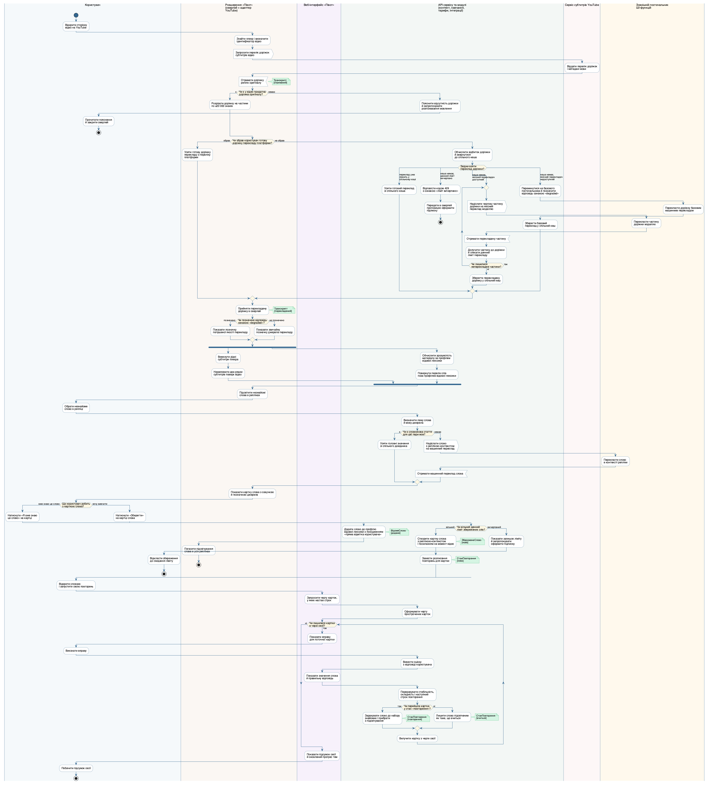
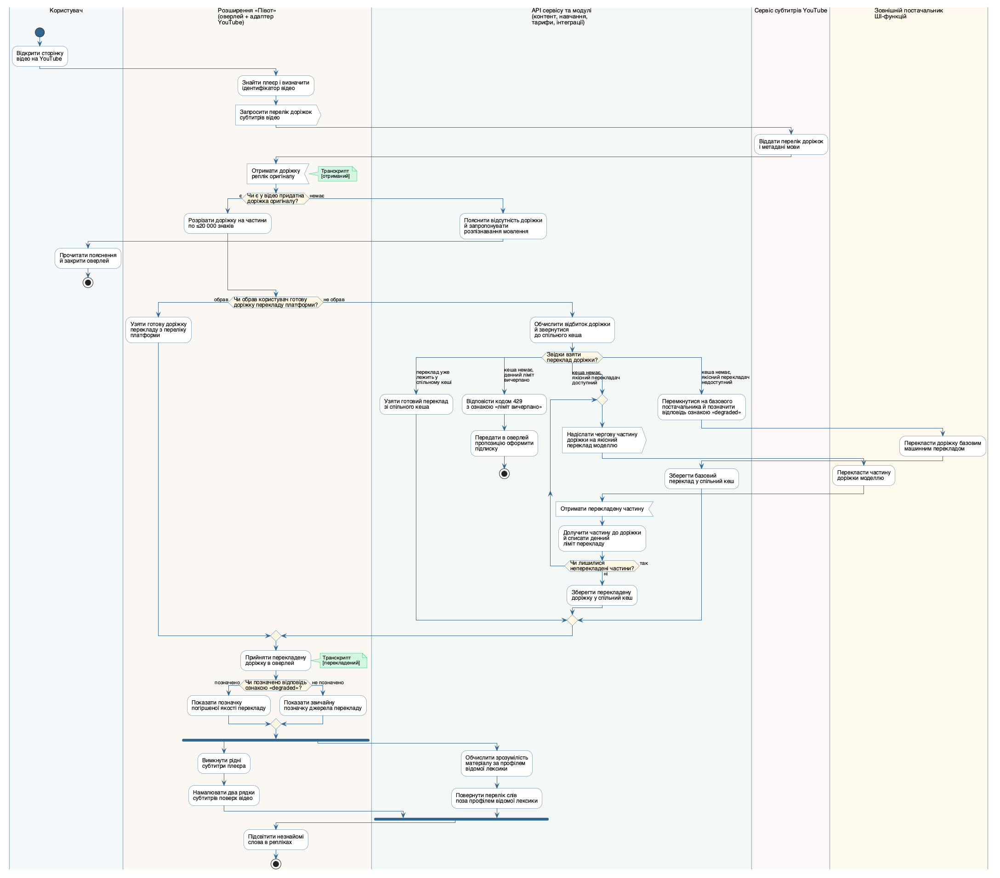
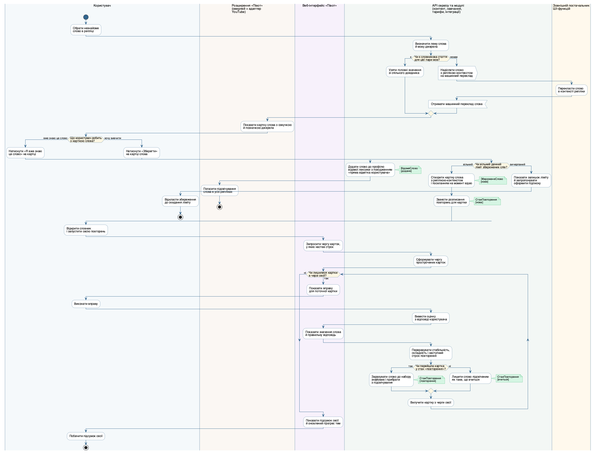
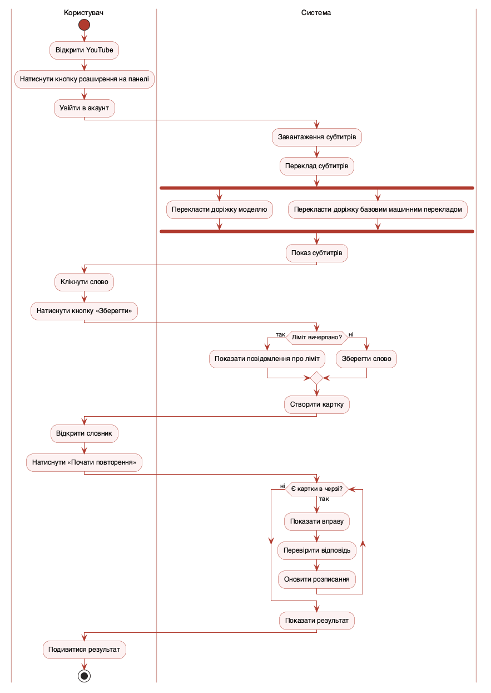

## Мета

Закріпити на практиці матеріал лекції 7 і навчитися будувати діаграму діяльності (Activity Diagram) мови UML (Unified Modeling Language — уніфікована мова моделювання) для реального сценарію власного курсового завдання: розподіляти дії між учасниками за доріжками, виражати розгалуження, цикли та паралельні гілки, показувати передачу обʼєктів у певних станах, а головне — перевіряти побудовану діаграму на коректність за правилами маркерів, а не лише малювати її.

Формальний титульний аркуш оформлено першою сторінкою цього документа; нижче продубльовано його змістові поля, яких вимагає пункт 1 структури звіту, — тему роботи та варіант предметної області.

| Поле титульного аркуша | Значення |
|---|---|
| Лабораторна робота | № 4 |
| Дисципліна | Моделювання та аналіз програмного забезпечення |
| Тема роботи | Побудова діаграми діяльності бізнес-процесу |
| Варіант предметної області | «Півот» — вебсервіс і браузерне розширення для вивчення іноземної мови на основі власного контенту користувача (робочий домен `pivotsubs.com`); та сама предметна область, що й у Лабораторних роботах №1, №2 і №3 |
| Змодельований бізнес-процес | Від відкриття відео на YouTube до слова, яке більше не підсвічується як незнайоме: UC04 → UC05 → далі або UC07, або UC06 → UC16 |
| Виконав | Камінський Олексій Дмитрович, група ВТ-23-2 |
| Перевірив | Власенко О.В. |
| Інструмент | PlantUML 1.2026.8 (локальна установка, рендеринг Graphviz) |

Тема є спільною для всіх чотирьох лабораторних робіт і для курсової, бо збігається з темою дипломної роботи. Система складається з вебсервісу й браузерного розширення: користувач дивиться відео на YouTube і бачить поверх плеєра два рядки субтитрів — оригінал і переклад, клікає незнайоме слово й отримує його значення, зберігає слово у власний словник разом з реплікою-контекстом, завантажує власні тексти в читалку, повторює слова в сесіях інтервальних повторень і оформлює підписку на платні ШІ-функції.

Межі моделі зафіксовано один раз і вони діють у всіх чотирьох роботах: відеоплатформа одна — **YouTube**, а решта площадок присутні лише як точка підстановки за інтерфейсом `ДжерелоСубтитрів`; ШІ — це **зовнішній сервіс за API**, система лише формує запит, кешує відповідь і рахує витрати ліміту; мобільний застосунок і Safari-версія розширення поза межами роботи; телеметрії в системі свідомо немає.

## Розділ 1. Обраний бізнес-процес і його текстова специфікація

### 1.1. Три кандидати і чому обрано саме перший

Пункт 1 завдання вимагає обрати варіант використання з Лабораторної роботи №1, основний сценарій якого має щонайменше вісім кроків і хоча б одну альтернативну гілку. У моделі предметної області заздалегідь було виділено три кандидати на діаграму діяльності, і перед побудовою їх звірено з усіма сімома вимогами пункту 2.

| Кандидат на бізнес-процес | Доріжок | Циклів | Зовнішні системи | Обʼєктні вузли | Оцінка |
|---|---|---|---|---|---|
| **А.** Перегляд відео з двомовними субтитрами й збереженням слова (UC04 → UC05 → UC06) | 5 | два вкладені | дві: Сервіс субтитрів YouTube і постачальник перекладу | `Транскрипт` у двох станах | **обрано як основу**: ядро теми дипломної роботи, усі сім вимог виконуються природно |
| **Б.** Завантаження й читання власного документа (UC12 → UC13) | 4 | цикл по сторінках | фактично одна й та слабка | `Документ` | хороший другий процес, але зовнішньої взаємодії майже немає |
| **В.** Сесія інтервальних повторень (UC16) | 4 | один, дуже наочний | немає зовсім | `СтанПовторення` у чотирьох станах | найкрасивіший цикл, але вимога «взаємодія із зовнішнім учасником» не виконується |

Кандидат А обрано основою, бо лише в ньому зовнішня взаємодія не декоративна: без доріжки сервісу субтитрів YouTube і без доріжки постачальника перекладу процес узагалі не має змісту, а отже вимога щодо сигналу або очікування події виконується по суті, а не формально.

### 1.2. Чому процес продовжено до сесії повторень

Кандидат А в чистому вигляді дає сильне розгалуження й два цикли, але має одну слабкість: обʼєктний вузол у ньому один — `Транскрипт`, і його стан змінюється лише з «отриманий» на «перекладений». Вимога пункту 2 щодо обʼєктного вузла виконувалася б формально.

Тому процес продовжено по ланцюжку варіантів використання до логічного кінця: користувач не просто побачив значення слова, а розпорядився ним. Тут процес розгалужується на дві змістовно різні долі того самого слова, і обидві є в системі насправді:

- якщо користувач це слово **вже знає**, він тисне на картці «Я вже знаю це слово», і слово йде в профіль відомої лексики (UC07) — на діаграмі це обʼєктний вузол `ВідомеСлово [додане]`;
- якщо слово **незнайоме і його треба вивчити**, користувач його **зберігає** (UC06), слово отримує розписання повторень і **проходить сесію повторень** (UC16), після якої або переходить у стан «повторення» й перестає підсвічуватися як незнайоме, або лишається у стані «вчиться» з новим строком.

Такий ланцюжок — це і є цінність сервісу з погляду користувача: слово, яке горіло в субтитрах, перестає горіти, бо його або вже знали, або вивчили. На діаграмі це дає сім обʼєктних вузлів, що зачіпають чотири різні класи діаграми класів ЛР2: `Транскрипт [отриманий]` → `Транскрипт [перекладений]` → далі або `ВідомеСлово [додане]`, або `ЗбереженеСлово [нове]` → `СтанПовторення [нова]` → `СтанПовторення [вчиться]` / `СтанПовторення [повторення]`.

Додатковий виграш — другий цикл іншого типу. Цикл перекладу частин доріжки має перевірку **після** тіла (`repeat while`), бо частина завжди є щонайменше одна. Цикл сесії повторень має перевірку **перед** тілом (`while`), бо черга може бути порожньою вже на старті: якщо жодна картка не прострочена, жодна вправа не повинна показатися. Два цикли різного типу в одній діаграмі — це прямий матеріал для відповіді на питання 3 самоконтролю.

### 1.3. Межі процесу: що свідомо лишилося поза діаграмою

Щоб діаграма не розповзлася, з процесу прибрано все, що є передумовою, а не кроком:

- **автентифікація** — передумова всіх варіантів використання, крім UC01, зафіксована так ще в ЛР1; інакше на діаграмі зʼявилася б гілка входу, що не має стосунку до перегляду відео;
- **налаштування мовної пари** (UC03) — виконується один раз у мастері першого запуску, а не в кожному сеансі перегляду; єдине налаштування, яке в процесі справді перевіряється, — вибір джерела перекладу доріжки, бо від нього залежить перша щабель драбини джерел;
- **оформлення підписки** (UC18) — на гілках «ліміт вичерпано» система лише пропонує підписку, а сам платіжний сценарій є окремим процесом з власною діаграмою;
- **розпізнавання мовлення** (UC10) — на гілці «у відео немає придатної доріжки» система лише пропонує цю послугу; сама робота з розпізнавання має власний життєвий цикл `у черзі → звук → модель → запис → готово / помилка` і буде діаграмою станів, а не діяльності.

### 1.4. Зведена текстова специфікація процесу

Специфікацію складено за структурою ЛР1 і зшито з пʼяти варіантів використання в один наскрізний сценарій.

| Поле | Значення |
|---|---|
| Назва процесу | Від незнайомого слова у відео до слова, яке більше не підсвічується |
| Варіанти використання ЛР1 | UC04 «Дивитися відео з двомовними субтитрами» → UC05 «Отримати значення слова» → далі або UC07 «Позначити слово як відоме», або UC06 «Зберегти слово у словник» → UC16 «Пройти сесію інтервальних повторень» |
| Основний актор | Зареєстрований користувач |
| Другорядні актори | Сервіс субтитрів YouTube; Зовнішній постачальник ШІ-функцій (його спеціалізації — Сервіс перекладу й Сервіс ШІ) |
| Передумови | Користувач автентифікований; розширення встановлене й повʼязане з акаунтом; у налаштуваннях задано мовну пару; відкрито сторінку відео на YouTube |
| Основний потік | 1. Користувач відкриває сторінку відео на YouTube. 2. Розширення знаходить плеєр і визначає ідентифікатор відео. 3. Розширення запрошує в сервісу субтитрів YouTube перелік доріжок. 4. Сервіс віддає перелік доріжок і метадані мови. 5. Розширення отримує доріжку реплік оригіналу. 6. Розширення ріже доріжку на частини по ≤20 000 знаків — межа одного пакета проксі. 7. Користувач не обирав готової доріжки перекладу платформи, тому сервер обчислює відбиток доріжки й звертається до спільного кеша. 8. Кеш порожній, денний ліміт перекладу вільний і якісний перекладач доступний, тому сервер надсилає частини доріжки постачальнику й списує денний ліміт. 9. Сервер зберігає перекладену доріжку у спільний кеш. 10. Розширення приймає перекладену доріжку в оверлей і, оскільки відповідь не позначена ознакою `degraded`, показує звичайну позначку джерела перекладу. 11. Розширення вимикає рідні субтитри плеєра й малює два рядки поверх відео, а водночас сервер обчислює зрозумілість матеріалу й повертає слова поза профілем відомої лексики. 12. Розширення підсвічує незнайомі слова в репліках. 13. Користувач обирає підсвічене слово. 14. Сервер визначає лему й мову джерела та бере значення зі спільного довідника. 15. Розширення показує картку слова з озвучкою й позначкою джерела. 16. Користувач вирішує, що слово треба вивчити, і натискає «Зберегти». 17. Сервер створює картку слова з реплікою-контекстом і посиланням на момент відео. 18. Сервер заводить для картки розписання повторень. 19. Користувач відкриває словник і запускає сесію повторень. 20. Вебінтерфейс запрошує чергу карток, у яких настав строк, і для кожної показує вправу. 21. Користувач виконує вправу; сервер виводить оцінку з його відповіді без кнопок самооцінки; вебінтерфейс обовʼязково показує значення слова й правильну відповідь; сервер перераховує стабільність, складність і наступний строк, перевіряє, чи картка перейшла у стан «повторення», і вилучає картку з черги. 22. Коли черга порожня, вебінтерфейс показує підсумок сесії й оновлений прогрес тем |
| Альтернативні потоки | **5а.** У відео немає придатної доріжки оригіналу — система пояснює причину й пропонує замовити розпізнавання мовлення; сценарій завершується власним кінцевим вузлом. **7а.** Користувач обрав джерелом готову доріжку перекладу платформи — розширення бере її з переліку, звернення до сервера й до постачальника немає взагалі. **7б.** Переклад доріжки вже є у спільному кеші — кроки 8 і 9 не виконуються, другий глядач того самого відео не коштує сервісу нічого. **7в.** Денний ліміт перекладу вичерпано — сервер відповідає кодом 429 з ознакою «ліміт вичерпано» й передає в оверлей пропозицію оформити підписку; відкату на базового постачальника тут **немає**, гілка завершується власним кінцевим вузлом. **7г.** Якісний перекладач недоступний — сервер перемикається на базового машинного постачальника й **позначає відповідь ознакою `degraded`**, після чого розширення показує позначку погіршеної якості перекладу. **14а.** Словникової статті для цієї пари мов немає — система надсилає слово з реплікою-контекстом на машинний переклад. **16а.** Користувач вважає слово вже відомим — тисне «Я вже знаю це слово», сервер додає слово до профілю відомої лексики з походженням «пряма відмітка користувача», розширення гасить підсвічування слова в усіх репліках, і гілка завершується власним кінцевим вузлом. **16б.** Денний ліміт збережених слів вичерпано — система показує залишок і пропонує оформити підписку, збереження відкладається, сценарій завершується власним кінцевим вузлом. **21а.** Картка не перейшла у стан «повторення» — слово лишається підсвіченим як таке, що вчиться |
| Постумови | Відео показане з двома рядками субтитрів; переклад доріжки лежить у спільному кеші й доступний наступним глядачам без повторних витрат; слово або внесене до профілю відомої лексики, або збережене у словник з контекстом і розписанням; після сесії повторень слово або перестало підсвічуватися як незнайоме, або отримало новий строк; денні ліміти зменшено на фактично витрачений обсяг |

Основний потік має 22 кроки замість потрібних восьми, альтернативних гілок — девʼять замість потрібної однієї, причому чотири з них (5а, 7в, 16а і 16б) завершуються власними кінцевими вузлами.

**Висновок:** обраний процес — це наскрізний життєвий цикл одного слова від підсвічування у відео до моменту, коли воно перестає підсвічуватися; він спирається на пʼять варіантів використання ЛР1, має 22 кроки основного потоку й девʼять альтернативних гілок, чотири з яких завершуються власними кінцевими вузлами, а головне — обидві зовнішні системи в ньому необхідні по суті, а не для формального виконання вимоги.

## Розділ 2. Розподіл дій по доріжках

### 2.1. Шість доріжок і їхні ролі

За кроком 3 методики розділу 1.2 для кожної дії визначено виконавця. Учасників виявилося шість, і це не довільне дроблення: кожна доріжка відповідає або актору ЛР1, або компоненту ЛР3 з власним наданим інтерфейсом.

| Доріжка | Відповідник у ЛР1 / ЛР3 | Роль у процесі | Дій |
|---|---|---|---|
| **Користувач** | актор «Зареєстрований користувач» | Ініціює процес, обирає слово, розпоряджається карткою слова, виконує вправи, бачить підсумок | 9 |
| **Розширення «Півот»** (оверлей + адаптер YouTube) | компоненти 1 і 2 ЛР3 | Знаходить плеєр, перехоплює доріжку, ріже її на частини, малює два рядки субтитрів, показує картку слова й позначку якості перекладу | 13 |
| **Веб-інтерфейс «Півот»** | компонент 3 ЛР3 | Веде сесію повторень, показує значення слова після відповіді й підсумок сесії | 4 |
| **API сервісу та модулі** (контент, навчання, тарифи, інтеграції) | компоненти 4, 5, 6, 7 і 8 ЛР3 | Кешує транскрипти, списує ліміти, веде словник і розписання FSRS, рахує зрозумілість, робить виклики до зовнішніх сервісів | 27 |
| **Сервіс субтитрів YouTube** | актор «Сервіс субтитрів YouTube» | Віддає перелік доріжок і метадані мови | 1 |
| **Зовнішній постачальник ШІ-функцій** | абстрактний актор ЛР1, спеціалізований Сервісом перекладу й Сервісом ШІ | Перекладає частини доріжки й окремі слова в контексті | 3 |

Остання доріжка потребує пояснення. У ЛР1 для зовнішніх систем було введено абстрактного актора **«Зовнішній постачальник ШІ-функцій»**, якого спеціалізують `Сервіс перекладу` і `Сервіс ШІ`, бо обидва викликаються однаково: запит, кеш, списання ліміту, відкат на базового постачальника з позначкою погіршеної якості. На діаграмі діяльності це узагальнення дає пряму вигоду: замість двох майже однакових доріжок зʼявляється одна, і процес не захаращується.

Доріжка «Розширення «Півот»» обʼєднує два компоненти ЛР3 — оверлей і адаптер платформи YouTube — навмисно. Поділ між ними архітектурний (одна частина платформенно-сліпа, друга знає плеєр), а не процесний: з погляду бізнес-процесу це один виконавець, що працює у вкладці браузера.

Доріжка «API сервісу та модулі» покриває пʼять серверних компонентів ЛР3, і підзаголовок «(контент, навчання, тарифи, інтеграції)» названо саме так свідомо. Крім компонентів 4 «API сервісу та контроль доступу», 5 «Тарифи й ліміти», 6 «Модуль навчання» і 7 «Модуль контенту», у неї входить і компонент 8 «Шар зовнішніх сервісів», бо саме він володіє інтерфейсами `IШІ` та `IПереклад` і фактично робить вихідні виклики. Без нього дії 14 «Надіслати чергову частину доріжки на якісний переклад моделлю» і 33 «Надіслати слово з реплікою-контекстом на машинний переклад» не мали б у моделі виконавця: це вихідні сигнали, і їх відправляє саме шар інтеграцій. Межі між цими пʼятьма компонентами — це межі відповідальності в коді, а не різні учасники процесу, тому окремої доріжки кожен з них не потребує.

### 2.2. Повний перелік дій у порядку виконання

Усі 57 дій сформульовано дієслівними фразами. Колонка «тип вузла» показує, де звичайна дія, де надсилання сигналу, а де очікування події.

| № | Дія | Доріжка | Тип вузла |
|---|---|---|---|
| 1 | Відкрити сторінку відео на YouTube | Користувач | дія |
| 2 | Знайти плеєр і визначити ідентифікатор відео | Розширення | дія |
| 3 | Запросити перелік доріжок субтитрів відео | Розширення | **надсилання сигналу** |
| 4 | Віддати перелік доріжок і метадані мови | Сервіс субтитрів YouTube | дія |
| 5 | Отримати доріжку реплік оригіналу | Розширення | **очікування події** |
| 6 | Розрізати доріжку на частини по ≤20 000 знаків | Розширення | дія |
| 7 | Пояснити відсутність доріжки й запропонувати розпізнавання мовлення | API сервісу | дія |
| 8 | Прочитати пояснення й закрити оверлей | Користувач | дія |
| 9 | Узяти готову доріжку перекладу з переліку платформи | Розширення | дія |
| 10 | Обчислити відбиток доріжки й звернутися до спільного кеша | API сервісу | дія |
| 11 | Узяти готовий переклад зі спільного кеша | API сервісу | дія |
| 12 | Відповісти кодом 429 з ознакою «ліміт вичерпано» | API сервісу | дія |
| 13 | Передати в оверлей пропозицію оформити підписку | API сервісу | дія |
| 14 | Надіслати чергову частину доріжки на якісний переклад моделлю | API сервісу | **надсилання сигналу** |
| 15 | Перекласти частину доріжки моделлю | Постачальник ШІ-функцій | дія |
| 16 | Отримати перекладену частину | API сервісу | **очікування події** |
| 17 | Долучити частину до доріжки й списати денний ліміт перекладу | API сервісу | дія |
| 18 | Зберегти перекладену доріжку у спільний кеш | API сервісу | дія |
| 19 | Перемкнутися на базового постачальника й позначити відповідь ознакою «degraded» | API сервісу | дія |
| 20 | Перекласти доріжку базовим машинним перекладом | Постачальник ШІ-функцій | дія |
| 21 | Зберегти базовий переклад у спільний кеш | API сервісу | дія |
| 22 | Прийняти перекладену доріжку в оверлей | Розширення | дія |
| 23 | Показати позначку погіршеної якості перекладу | Розширення | дія |
| 24 | Показати звичайну позначку джерела перекладу | Розширення | дія |
| 25 | Вимкнути рідні субтитри плеєра | Розширення | дія |
| 26 | Намалювати два рядки субтитрів поверх відео | Розширення | дія |
| 27 | Обчислити зрозумілість матеріалу за профілем відомої лексики | API сервісу | дія |
| 28 | Повернути перелік слів поза профілем відомої лексики | API сервісу | дія |
| 29 | Підсвітити незнайомі слова в репліках | Розширення | дія |
| 30 | Обрати незнайоме слово в репліці | Користувач | дія |
| 31 | Визначити лему слова й мову джерела | API сервісу | дія |
| 32 | Узяти головні значення зі спільного довідника | API сервісу | дія |
| 33 | Надіслати слово з реплікою-контекстом на машинний переклад | API сервісу | **надсилання сигналу** |
| 34 | Перекласти слово в контексті репліки | Постачальник ШІ-функцій | дія |
| 35 | Отримати машинний переклад слова | API сервісу | **очікування події** |
| 36 | Показати картку слова з озвучкою й позначкою джерела | Розширення | дія |
| 37 | Натиснути «Я вже знаю це слово» на картці | Користувач | дія |
| 38 | Додати слово до профілю відомої лексики з походженням «пряма відмітка користувача» | API сервісу | дія |
| 39 | Погасити підсвічування слова в усіх репліках | Розширення | дія |
| 40 | Натиснути «Зберегти» на картці слова | Користувач | дія |
| 41 | Створити картку слова з реплікою-контекстом і посиланням на момент відео | API сервісу | дія |
| 42 | Завести розписання повторень для картки | API сервісу | дія |
| 43 | Показати залишок ліміту й запропонувати оформити підписку | API сервісу | дія |
| 44 | Відкласти збереження до скидання ліміту | Користувач | дія |
| 45 | Відкрити словник і запустити сесію повторень | Користувач | дія |
| 46 | Запросити чергу карток, у яких настав строк | Веб-інтерфейс | дія |
| 47 | Сформувати чергу прострочених карток | API сервісу | дія |
| 48 | Показати вправу для поточної картки | Веб-інтерфейс | дія |
| 49 | Виконати вправу | Користувач | дія |
| 50 | Вивести оцінку з відповіді користувача | API сервісу | дія |
| 51 | Показати значення слова й правильну відповідь | Веб-інтерфейс | дія |
| 52 | Перерахувати стабільність, складність і наступний строк повторення | API сервісу | дія |
| 53 | Зарахувати слово до набору знайомих і прибрати з підсвічування | API сервісу | дія |
| 54 | Лишити слово підсвіченим як таке, що вчиться | API сервісу | дія |
| 55 | Вилучити картку з черги сесії | API сервісу | дія |
| 56 | Показати підсумок сесії й оновлений прогрес тем | Веб-інтерфейс | дія |
| 57 | Побачити підсумок сесії | Користувач | дія |

### 2.3. Як перевірено однаковий рівень абстракції

Розділ 1.3 методички застерігає: діаграма зручна лише тоді, коли всі дії мають приблизно однаковий масштаб, і дає практичне правило — дія має відповідати одному змістовному кроку сценарію з погляду виконавця, після якого результат уже можна спостерігати. Перелік дій перевірено за трьома ознаками.

- **Три дії рівня взаємодії лишено свідомо, решту прибрано.** У переліку немає «розкрити меню», «проскролити панель», «натиснути кнопку розширення на панелі». Але три дії доріжки «Користувач» названі саме як елементарні дії з інтерфейсом: 30 «Обрати незнайоме слово в репліці», 37 «Натиснути «Я вже знаю це слово» на картці» і 40 «Натиснути «Зберегти» на картці слова». Усі три лишилися з однією й тією самою підставою: це справжні точки ухвалення рішення користувачем, і без них процес не мав би розгалужень. Дія 30 запускає гілку отримання значення слова, а дії 37 і 40 — це дві гілки розгалуження «Що користувач робить з карткою слова?», тобто саме той вибір, від якого залежить, чи слово піде в профіль відомої лексики, чи у словник на вивчення. Решта взаємодії з інтерфейсом схована всередині дій на зразок «Показати картку слова з озвучкою й позначкою джерела».
- **Жодної дії рівня бази даних.** Немає «виконати SQL-запит», «відкрити транзакцію», «записати рядок у таблицю». Натомість є «Зберегти перекладену доріжку у спільний кеш» — результат, спостережний для наступного глядача того самого відео.
- **Жодної дії-процесу.** Немає «обробити відео», «виконати навчання», «провести сесію» — тобто жодної дії, яка сама є підпроцесом з власними кроками. Найбільша за обсягом внутрішньої роботи дія — 52 «Перерахувати стабільність, складність і наступний строк повторення»: за нею стоїть алгоритм FSRS, але з погляду виконавця це один крок з одним спостережним результатом — нова дата повторення.

**Висновок:** процес розподілено між шістьма доріжками, кожна з яких має відповідник серед акторів ЛР1 або компонентів ЛР3; 57 дій сформульовано дієслівними фразами й перевірено на однаковий рівень абстракції за трьома ознаками, причому три дії рівня взаємодії лишено з однаковим і явно названим обґрунтуванням — це точки вибору користувача, на яких тримаються розгалуження.

## Розділ 3. Діаграма діяльності

### 3.1. Код діаграми

Повний вихідний код файла `activity.puml`. Перемикання доріжок командою `|Назва|` поєднано з розгалуженням `switch` на чотири взаємовиключні гілки, двома циклами різного типу, парою `fork`/`end fork` і примітками, що відіграють роль обʼєктних вузлів.

```text
@startuml
' ============================================================================
' Лабораторна робота №4. Побудова діаграми діяльності бізнес-процесу
' Предметна область: «Півот» — вебсервіс і браузерне розширення для вивчення
' іноземної мови на основі власного контенту користувача (pivotsubs.com)
' Бізнес-процес: UC04 → UC05 → (UC07 або UC06 → UC16) — від відкриття відео
' на YouTube до слова, яке більше не підсвічується як незнайоме
' Камінський Олексій Дмитрович, група ВТ-23-2
' ============================================================================

skinparam defaultFontName "Helvetica"
skinparam shadowing false
skinparam ArrowFontSize 11
skinparam activity {
  BackgroundColor #FEFEFE
  BorderColor #33668E
  ArrowColor #33668E
  DiamondBackgroundColor #FDF6E3
  DiamondBorderColor #33668E
  DiamondFontSize 12
  StartColor #33668E
  EndColor #33668E
  BarColor #33668E
}
skinparam swimlane {
  BorderColor #9AB3C6
  TitleFontSize 13
}
' Обʼєктні вузли (клас ЛР2 у певному стані) оформлено зеленими примітками —
' відповідно до застереження розділу 1.1 методички: новий синтаксис діаграм
' діяльності PlantUML не має окремого елемента для обʼєктного вузла.
skinparam noteBackgroundColor #D5F5E3
skinparam noteBorderColor #27AE60
skinparam noteFontSize 11

' Надсилання сигналу — стереотип <<output>> (опуклий пʼятикутник SDL),
' очікування події — стереотип <<input>> (увігнутий пʼятикутник SDL).
' Старі термінатори :текст> і :текст< у PlantUML 1.2026.8 уже не розпізнаються.
' Вузли сигналів і подій PlantUML малює власною сірою заливкою #F1F1F1,
' і цього достатньо: їх упізнають за формою пʼятикутника, а не за кольором.
' Гілку case «денний ліміт вичерпано» утримано в одній доріжці: гілка case,
' яка змінює доріжку й завершується вузлом stop, обвалює рендерер 1.2026.8
' (IllegalArgumentException у FtileSwitchNude) — див. розділ 3.5 звіту.

' Порядок доріжок закріплено оголошенням до вузла start
|#F4F8FB|Користувач|
|#FBF7F2|Розширення «Півот»\n(оверлей + адаптер\nYouTube)|
|#F6F1FA|Веб-інтерфейс «Півот»|
|#F2F7F4|API сервісу та модулі\n(контент, навчання,\nтарифи, інтеграції)|
|#FDF7F7|Сервіс субтитрів YouTube|
|#FFF9EC|Зовнішній постачальник\nШІ-функцій|

|Користувач|
start
:Відкрити сторінку\nвідео на YouTube;

|Розширення «Півот»\n(оверлей + адаптер\nYouTube)|
:Знайти плеєр і визначити\nідентифікатор відео;
:Запросити перелік доріжок\nсубтитрів відео;<<output>>

|Сервіс субтитрів YouTube|
:Віддати перелік доріжок\nі метадані мови;

|Розширення «Півот»\n(оверлей + адаптер\nYouTube)|
:Отримати доріжку\nреплік оригіналу;<<input>>
note right: Транскрипт\n[отриманий]

if (Чи є у відео придатна\nдоріжка оригіналу?) then (є)
  |Розширення «Півот»\n(оверлей + адаптер\nYouTube)|
  :Розрізати доріжку на частини\nпо ≤20 000 знаків;
else (немає)
  |API сервісу та модулі\n(контент, навчання,\nтарифи, інтеграції)|
  :Пояснити відсутність доріжки\nй запропонувати\nрозпізнавання мовлення;
  |Користувач|
  :Прочитати пояснення\nй закрити оверлей;
  stop
endif

|Розширення «Півот»\n(оверлей + адаптер\nYouTube)|
if (Чи обрав користувач готову\nдоріжку перекладу платформи?) then (обрав)
  |Розширення «Півот»\n(оверлей + адаптер\nYouTube)|
  :Узяти готову доріжку\nперекладу з переліку\nплатформи;
else (не обрав)
  |API сервісу та модулі\n(контент, навчання,\nтарифи, інтеграції)|
  :Обчислити відбиток доріжки\nй звернутися\nдо спільного кеша;
  switch (Звідки взяти\nпереклад доріжки?)
  case (переклад уже\nлежить у\nспільному кеші)
    |API сервісу та модулі\n(контент, навчання,\nтарифи, інтеграції)|
    :Узяти готовий переклад\nзі спільного кеша;
  case (кеша немає,\nденний ліміт\nвичерпано)
    |API сервісу та модулі\n(контент, навчання,\nтарифи, інтеграції)|
    :Відповісти кодом 429\nз ознакою «ліміт вичерпано»;
    :Передати в оверлей\nпропозицію оформити\nпідписку;
    stop
  case (кеша немає,\nякісний перекладач\nдоступний)
    |API сервісу та модулі\n(контент, навчання,\nтарифи, інтеграції)|
    repeat
      :Надіслати чергову частину\nдоріжки на якісний\nпереклад моделлю;<<output>>
      |Зовнішній постачальник\nШІ-функцій|
      :Перекласти частину\nдоріжки моделлю;
      |API сервісу та модулі\n(контент, навчання,\nтарифи, інтеграції)|
      :Отримати перекладену частину;<<input>>
      :Долучити частину до доріжки\nй списати денний\nліміт перекладу;
    repeat while (Чи лишилися\nнеперекладені частини?) is (так) not (ні)
    :Зберегти перекладену\nдоріжку у спільний кеш;
  case (кеша немає,\nякісний перекладач\nнедоступний)
    |API сервісу та модулі\n(контент, навчання,\nтарифи, інтеграції)|
    :Перемкнутися на базового\nпостачальника й позначити\nвідповідь ознакою «degraded»;
    |Зовнішній постачальник\nШІ-функцій|
    :Перекласти доріжку базовим\nмашинним перекладом;
    |API сервісу та модулі\n(контент, навчання,\nтарифи, інтеграції)|
    :Зберегти базовий\nпереклад у спільний кеш;
  endswitch
endif

|Розширення «Півот»\n(оверлей + адаптер\nYouTube)|
:Прийняти перекладену\nдоріжку в оверлей;
note right: Транскрипт\n[перекладений]

if (Чи позначено відповідь\nознакою «degraded»?) then (позначено)
  :Показати позначку\nпогіршеної якості перекладу;
else (не позначено)
  :Показати звичайну\nпозначку джерела перекладу;
endif

fork
  |Розширення «Півот»\n(оверлей + адаптер\nYouTube)|
  :Вимкнути рідні\nсубтитри плеєра;
  :Намалювати два рядки\nсубтитрів поверх відео;
fork again
  |API сервісу та модулі\n(контент, навчання,\nтарифи, інтеграції)|
  :Обчислити зрозумілість\nматеріалу за профілем\nвідомої лексики;
  :Повернути перелік слів\nпоза профілем відомої лексики;
end fork

|Розширення «Півот»\n(оверлей + адаптер\nYouTube)|
:Підсвітити незнайомі\nслова в репліках;

|Користувач|
:Обрати незнайоме\nслово в репліці;

|API сервісу та модулі\n(контент, навчання,\nтарифи, інтеграції)|
:Визначити лему слова\nй мову джерела;
if (Чи є словникова стаття\nдля цієї пари мов?) then (є)
  :Узяти головні значення\nзі спільного довідника;
else (немає)
  :Надіслати слово\nз реплікою-контекстом\nна машинний переклад;<<output>>
  |Зовнішній постачальник\nШІ-функцій|
  :Перекласти слово\nв контексті репліки;
  |API сервісу та модулі\n(контент, навчання,\nтарифи, інтеграції)|
  :Отримати машинний переклад слова;<<input>>
endif

|Розширення «Півот»\n(оверлей + адаптер\nYouTube)|
:Показати картку слова з озвучкою\nй позначкою джерела;

|Користувач|
if (Що користувач робить\nз карткою слова?) then (вже знаю це слово)
  :Натиснути «Я вже знаю\nце слово» на картці;
  |API сервісу та модулі\n(контент, навчання,\nтарифи, інтеграції)|
  :Додати слово до профілю\nвідомої лексики з походженням\n«пряма відмітка користувача»;
  note right: ВідомеСлово\n[додане]
  |Розширення «Півот»\n(оверлей + адаптер\nYouTube)|
  :Погасити підсвічування\nслова в усіх репліках;
  stop
else (хочу вивчити)
  |Користувач|
  :Натиснути «Зберегти»\nна картці слова;
  |API сервісу та модулі\n(контент, навчання,\nтарифи, інтеграції)|
  if (Чи вільний денний\nліміт збережених слів?) then (вільний)
    :Створити картку слова\nз реплікою-контекстом\nі посиланням на момент відео;
    note right: ЗбереженеСлово\n[нове]
    :Завести розписання\nповторень для картки;
    note right: СтанПовторення\n[нова]
  else (вичерпаний)
    :Показати залишок ліміту\nй запропонувати\nоформити підписку;
    |Користувач|
    :Відкласти збереження\nдо скидання ліміту;
    stop
  endif
endif

|Користувач|
:Відкрити словник\nі запустити сесію повторень;

|Веб-інтерфейс «Півот»|
:Запросити чергу карток,\nу яких настав строк;

|API сервісу та модулі\n(контент, навчання,\nтарифи, інтеграції)|
:Сформувати чергу\nпрострочених карток;

|Веб-інтерфейс «Півот»|
while (Чи лишилися картки\nв черзі сесії?) is (так)
  :Показати вправу\nдля поточної картки;
  |Користувач|
  :Виконати вправу;
  |API сервісу та модулі\n(контент, навчання,\nтарифи, інтеграції)|
  :Вивести оцінку\nз відповіді користувача;
  |Веб-інтерфейс «Півот»|
  :Показати значення слова\nй правильну відповідь;
  |API сервісу та модулі\n(контент, навчання,\nтарифи, інтеграції)|
  :Перерахувати стабільність,\nскладність і наступний\nстрок повторення;
  if (Чи перейшла картка\nу стан «повторення»?) then (так)
    :Зарахувати слово до набору\nзнайомих і прибрати\nз підсвічування;
    note right: СтанПовторення\n[повторення]
  else (ні)
    :Лишити слово підсвіченим\nяк таке, що вчиться;
    note right: СтанПовторення\n[вчиться]
  endif
  :Вилучити картку з черги сесії;
  |Веб-інтерфейс «Півот»|
endwhile (ні)

|Веб-інтерфейс «Півот»|
:Показати підсумок сесії\nй оновлений прогрес тем;

|Користувач|
:Побачити підсумок сесії;
stop
@enduml
```

### 3.2. Повна діаграма



Читати діаграму зручно трьома смугами згори вниз. Перша смуга — отримання доріжки субтитрів: розширення надсилає сигнал сервісу субтитрів YouTube, чекає події, отримує `Транскрипт [отриманий]` і перевіряє, чи доріжка взагалі придатна. Друга смуга — драбина джерел перекладу: спочатку явний вибір користувача, потім спільний кеш, потім денний ліміт і доступність якісного перекладача; гілка «якісний перекладач доступний» містить цикл по частинах доріжки з виходом за явною умовою. Третя смуга — доля слова: вибір підсвіченого слова, картка значення, розгалуження «вже знаю / хочу вивчити» і, на другій гілці, сесія повторень із циклом по черзі карток.

Пара `fork`/`join` стоїть точно посередині, відразу після вузла злиття розгалуження «Чи позначено відповідь ознакою «degraded»?», тобто після дії 23 або 24 залежно від прогону. Це єдине місце процесу, де дві роботи справді не залежать одна від одної: розширення малює рядки субтитрів у вкладці браузера, а сервер тим часом рахує зрозумілість матеріалу за профілем лексики й готує перелік слів для підсвічування. Гілки лежать у різних доріжках — «Розширення «Півот»» і «API сервісу та модулі» — як того вимагає завдання.

### 3.3. Частковий вид 1 — фаза двомовних субтитрів

Повна діаграма має розмір 3301 × 3644 точки, і на аркуші звіту кегль тексту в ній падає до непридатного. Тому, як і в Лабораторних роботах №1 і №2, той самий процес додатково подано двома частковими видами. Це **не інші моделі**: обидва файли — це обрізки `activity.puml` з тими самими підписами доріжок і тими самими підписами дій, без жодної зміни змісту. Єдине, що в них додано, — технічний кінцевий вузол на межі обрізання першого виду: у повній діаграмі потік після дії 29 продовжується, а у виді мусить десь завершитися. Обидва файли згенеровано зі `activity.puml` скриптовим обрізанням, а не переписуванням уручну, щоб розбіжність підписів була неможлива в принципі.

Перший вид покриває дії 1–29: від відкриття сторінки відео до підсвічування незнайомих слів у репліках. Тут видно сигнал до сервісу субтитрів YouTube і очікування події, розгалуження «Звідки взяти переклад доріжки?» на чотири гілки, цикл перекладу частин з перевіркою після тіла і пару `fork`/`join` у різних доріжках.



### 3.4. Частковий вид 2 — слово, словник і сесія повторень

Другий вид покриває дії 30–57: від вибору підсвіченого слова до підсумку сесії повторень. Тут зосереджені пʼять з семи обʼєктних вузлів, розгалуження «Що користувач робить з карткою слова?» і цикл сесії повторень з перевіркою перед тілом.



### 3.5. Нотація PlantUML 1.2026.8: обʼєктні вузли, сигнали й події

При побудові діаграми виявилися розбіжності між нотацією, наведеною в таблиці розділу 1.1 методички, і поведінкою локально встановленої версії PlantUML 1.2026.8. Усі задокументовано, бо вони впливають на вигляд діаграми.

| Елемент | Запис у методичці | Поведінка PlantUML 1.2026.8 | Ужитий запис |
|---|---|---|---|
| Надсилання сигналу | `:Текст>` | Рядок не парситься: рендеринг завершується повідомленням `Error line 4` | `:Текст;<<output>>` — опуклий пʼятикутник нотації SDL |
| Очікування події | `:Текст<` | Те саме: `Error line 4`, зображення не утворюється | `:Текст;<<input>>` — увігнутий пʼятикутник нотації SDL |
| Обʼєктний вузол | окремого елемента немає, методичка радить примітку | Примітка `note right:` працює як описано | `note right: Клас\n[стан]`, пофарбована зеленим через `skinparam noteBackgroundColor` |

Перевірку виконано окремими мінімальними файлами, кожен на одне твердження. Файл з рядком `:Запросити перелік доріжок>` дає `Error line 4` і не рендериться зовсім; після заміни на `:Запросити перелік доріжок;<<output>>` той самий файл рендериться без помилок і дає пʼятикутник.

Друга знайдена обмеженість стосується кольору. Якщо вузлу сигналу задати власний колір записом `#FDEBD0:Текст;<<output>>`, парсер перестає коректно закривати наступний блок `if … else … endif` і рендеринг падає з `Error line 7` — перевірено мінімальним файлом з восьми рядків. Тому колір вузлам сигналів не задавався: PlantUML малює їх власною сірою заливкою, і цього достатньо, бо впізнають їх за формою пʼятикутника, а не за кольором.

Третя обмеженість знайшлася вже під час компонування драбини джерел перекладу і прямо повпливала на структуру діаграми. **Гілка `case` розгалуження `switch`, яка змінює доріжку і завершується власним кінцевим вузлом `stop`, обвалює рендерер** — PlantUML 1.2026.8 падає з `java.lang.IllegalArgumentException` у `FtileSwitchWithDiamonds.getTranslateOf`, не видавши жодного діагностичного повідомлення про діаграму. Мінімальний відтворювальний приклад — чотирнадцять рядків: `switch` з двома гілками, у другій з яких `|L2|` і далі `stop`. Якщо ту саму гілку втримати в доріжці, у якій вона почалася, файл рендериться нормально; якщо замінити `switch` на `if … else … endif`, зміна доріжки перед `stop` теж працює. Через це відмовну гілку «кеша немає, денний ліміт вичерпано» утримано цілком у доріжці «API сервісу та модулі»: сервер відповідає кодом 429 і сам передає в оверлей пропозицію оформити підписку. У гілках `if` такого обмеження немає, тому три інші відмовні гілки процесу («немає придатної доріжки», «вже знаю це слово», «ліміт збережених слів вичерпано») спокійно переходять у доріжку «Користувач» перед власним кінцевим вузлом.

Окремо варто сказати, чого в цій версії **не** виявилося, хоч на це можна було очікувати. Порожня гілка `then` розгалуження обробляється нормально: контрольний файл з `if (умова?) then (так)` без жодної дії і з непорожньою гілкою `else` рендериться без помилок, зокрема й разом з доріжками та `stop` у гілці `else`. Тому дію 6 «Розрізати доріжку на частини по ≤20 000 знаків» розміщено в гілці «є» розгалуження «Чи є у відео придатна доріжка оригіналу?» не через обмеження інструмента, а зі змістовної причини: різати на частини можна лише ту доріжку, яка справді прийшла, і саме ця дія задає скінченну кількість обігів циклу перекладу.

**Висновок:** діаграма подана трьома файлами — повною діаграмою й двома її скриптовими обрізками для читабельності; обʼєктні вузли оформлено зеленими примітками відповідно до застереження розділу 1.1 методички, а для сигналів і подій замість застарілих термінаторів `>` і `<` ужито стереотипи `<<output>>` і `<<input>>`, що в PlantUML 1.2026.8 дають справжні пʼятикутники нотації SDL.

## Розділ 4. Перевірка відповідності вимогам завдання

### 4.1. Вимога → де саме виконана

Таблиця відповідає зразку розділу 3.3 методички. Колонка «підрахунок у `.puml`» містить фактичне число, отримане розбором файла `activity.puml`, а не оцінку на око.

| № | Вимога завдання | Мінімум | Де саме виконана | Підрахунок у `.puml` |
|---|---|---|---|---|
| 1 | Діаграма розбита на доріжки | 3 | Користувач; Розширення «Півот»; Веб-інтерфейс «Півот»; API сервісу та модулі; Сервіс субтитрів YouTube; Зовнішній постачальник ШІ-функцій | **6 доріжок** |
| 2 | Дії одного рівня абстракції, сформульовані дієслівними фразами | 12 | Повний перелік у таблиці розділу 2.2; перевірка рівня абстракції — розділ 2.3 | **57 дій** |
| 3 | Розгалуження з вичерпними й взаємовиключними умовами; кожна гілка зливається або має власний кінцевий вузол | 1 | «Звідки взяти переклад доріжки?» — чотири гілки, три зливаються, гілка «денний ліміт вичерпано» має власний кінцевий вузол; «Чи є у відео придатна доріжка оригіналу?» і «Чи вільний денний ліміт збережених слів?» — по гілці з власним кінцевим вузлом; «Що користувач робить з карткою слова?» — гілка «вже знаю це слово» має власний кінцевий вузол; «Чи обрав користувач готову доріжку перекладу платформи?», «Чи позначено відповідь ознакою «degraded»?», «Чи є словникова стаття для цієї пари мов?», «Чи перейшла картка у стан «повторення»?» — гілки зливаються | **8 розгалужень за умовою** (7 `if` + 1 `switch` на 4 гілки); разом з двома умовами циклів — **10 вузлів рішення** і **6 вузлів злиття** у зображенні |
| 4 | Пара розгалуження та зʼєднання, гілки якої належать різним доріжкам | 1 | Після злиття розгалуження про ознаку «degraded» (дії 23 або 24): гілка 1 — «Вимкнути рідні субтитри плеєра» → «Намалювати два рядки субтитрів поверх відео» у доріжці **Розширення «Півот»**; гілка 2 — «Обчислити зрозумілість матеріалу» → «Повернути перелік слів поза профілем відомої лексики» у доріжці **API сервісу та модулі** | **1 пара** `fork` / `end fork`; **2 смуги** синхронізації в зображенні |
| 5 | Цикл з явною умовою виходу | 1 | Цикл перекладу частин доріжки з перевіркою **після** тіла: умова виходу «Чи лишилися неперекладені частини?» = ні. Цикл сесії повторень з перевіркою **перед** тілом: умова виходу «Чи лишилися картки в черзі сесії?» = ні | **2 цикли** (1 `repeat while`, 1 `while`) |
| 6 | Обʼєктний вузол, що відображає клас із діаграми класів ЛР2 у певному стані | 1 | `Транскрипт [отриманий]`, `Транскрипт [перекладений]`, `ВідомеСлово [додане]`, `ЗбереженеСлово [нове]`, `СтанПовторення [нова]`, `СтанПовторення [повторення]`, `СтанПовторення [вчиться]` | **7 обʼєктних вузлів** на **4 класи** ЛР2 |
| 7 | Дія надсилання сигналу або очікування події, що моделює взаємодію із зовнішнім учасником | 1 | Сигнали: «Запросити перелік доріжок субтитрів відео» → Сервіс субтитрів YouTube; «Надіслати чергову частину доріжки на якісний переклад моделлю» і «Надіслати слово з реплікою-контекстом на машинний переклад» → Постачальник ШІ-функцій. Події: «Отримати доріжку реплік оригіналу», «Отримати перекладену частину», «Отримати машинний переклад слова» | **3 сигнали** `<<output>>` + **3 події** `<<input>>` |

### 4.2. Вичерпність і взаємовиключність умов кожного розгалуження

Вимога 3 має дві частини, і друга з них — вичерпність — найчастіше порушується саме на розгалуженнях з трьома й більше гілками. Нижче обґрунтовано кожне розгалуження окремо.

| Розгалуження | Гілки | Чому вичерпні | Чому взаємовиключні |
|---|---|---|---|
| Чи є у відео придатна доріжка оригіналу? | є / немає | Предикат булевий, третього значення не існує | Гілки — предикат і його заперечення |
| Чи обрав користувач готову доріжку перекладу платформи? | обрав / не обрав | Значення налаштування або дорівнює «готова доріжка платформи», або ні | Гілки — предикат і його заперечення |
| Звідки взяти переклад доріжки? | переклад уже лежить у спільному кеші / кеша немає, денний ліміт вичерпано / кеша немає, якісний перекладач доступний / кеша немає, якісний перекладач недоступний | Драбина з трьома щаблями, перевірених у цьому порядку: спочатку влучання у спільний кеш за відбитком доріжки, далі залишок денного ліміту, далі доступність якісного перекладача. Четвертої можливості немає: якщо кеш порожній і ліміт вільний, якісний перекладач або відповів, або ні | Перша гілка відкидає три інші влучанням у кеш; друга відкидає дві останні вичерпаним лімітом; третя й четверта — предикат «якісний перекладач доступний» і його заперечення |
| Чи позначено відповідь ознакою «degraded»? | позначено / не позначено | Поле відповіді або є, або його немає | Гілки — предикат і його заперечення |
| Чи є словникова стаття для цієї пари мов? | є / немає | Стаття у спільному довіднику або знайдена, або ні | Гілки — предикат і його заперечення |
| Що користувач робить з карткою слова? | вже знаю це слово / хочу вивчити | На картці рівно дві дії, що продовжують процес, і вони відповідають двом відношенням `<<extend>>` до UC05 з ЛР1 | Користувач тисне одну кнопку: або «Я вже знаю це слово», або «Зберегти» |
| Чи вільний денний ліміт збережених слів? | вільний / вичерпаний | Лічильник витрат або менший за стелю тарифу, або дорівнює їй | Гілки — предикат і його заперечення |
| Чи перейшла картка у стан «повторення»? | так / ні | Значення `СтанПовторення.стан` або дорівнює «повторення», або ні | Гілки — предикат і його заперечення |
| Чи лишилися неперекладені частини? | так / ні | Кількість неперекладених частин або додатна, або нульова | Гілки — предикат і його заперечення |
| Чи лишилися картки в черзі сесії? | так / ні | Черга або непорожня, або порожня | Гілки — предикат і його заперечення |

Два розгалуження цієї таблиці потребують окремого слова, бо на перший погляд виглядають як дублювання.

Перше — **«Чи обрав користувач готову доріжку перекладу платформи?» перед драбиною джерел**, а не серед її гілок. Це найстарша умова всього процесу: вона задана в налаштуваннях (UC03) ще до відкриття відео, і якщо користувач обрав готову доріжку платформи, то розширення бере її з переліку й **до сервера не звертається взагалі** — ні за кешем, ні за лімітом. Саме тому ця умова стоїть вище за влучання в кеш: інакше кеш безумовно перекривав би явний вибір користувача, і драбина перевірялася б у зворотному порядку щодо описаного.

Друге — **«Чи позначено відповідь ознакою «degraded»?» після зʼєднання гілок драбини**. Формально сервер уже «знає», якою гілкою пішов переклад, тому перевірка виглядає повторною. Але перевіряє її **інший виконавець на іншій інформації**: розгалуження стоїть у доріжці «Розширення «Півот»», і розширення не бачить серверних гілок — воно бачить лише поле у відповіді. На гілках «готова доріжка платформи» і «переклад уже у спільному кеші» цього поля немає взагалі, і саме це дає значення «не позначено». Тобто предикат обчислюється над тим, що дійсно доступне виконавцеві, а не над внутрішнім станом іншої доріжки.

**Висновок:** усі сім вимог пункту 2 завдання виконано з запасом — від 2× за доріжками до майже 5× за кількістю дій; розгалуження на чотири гілки обґрунтовано як драбину з вичерпними й попарно несумісними умовами, а пара `fork`/`join` має гілки точно в різних доріжках.

## Розділ 5. Перевірка за правилами маркерів

Розділ 1.2 методички застерігає: діаграма може виглядати охайно й містити приховану помилку — наприклад вузол зʼєднання, що чекатиме гілку, яка ніколи не буде виконана. Знайти таку помилку можна лише тоді, коли уявно пропустити через діаграму маркер. Нижче процес «програно» чотири рази: для основного сценарію і для трьох альтернативних гілок. Колонка «маркерів» показує, скільки маркерів одночасно існує в діаграмі.

### 5.1. Основний сценарій

Прийняті припущення: у відео є придатна доріжка оригіналу; користувач не обирав готової доріжки платформи; спільний кеш порожній; денний ліміт перекладу вільний; якісний перекладач доступний; доріжка складається з двох частин; словникова стаття у довіднику знайдена; користувач вирішує вивчити слово; денний ліміт збережених слів вільний; у черзі сесії три прострочені картки; на третьому обігу картка переходить у стан «повторення», на перших двох — ні.

| Крок | Вузол | Маркерів | Пояснення |
|---|---|---|---|
| 1 | Початковий вузол → «Відкрити сторінку відео на YouTube» | 1 | Діяльність запущено в доріжці «Користувач» |
| 2 | «Знайти плеєр і визначити ідентифікатор відео» | 1 | Маркер перейшов у доріжку «Розширення «Півот»» |
| 3 | «Запросити перелік доріжок субтитрів відео» (надсилання сигналу) | 1 | Сигнал надіслано; вузол надсилання маркер не затримує |
| 4 | «Віддати перелік доріжок і метадані мови» | 1 | Керування у доріжці зовнішньої системи |
| 5 | «Отримати доріжку реплік оригіналу» (очікування події) | 1 | Маркер чекав події й рушив далі разом з обʼєктом `Транскрипт [отриманий]` |
| 6 | Рішення «Чи є у відео придатна доріжка оригіналу?» → «є» → «Розрізати доріжку на частини по ≤20 000 знаків» | 1 | Рішення пропускає маркер **однією** гілкою; гілка «немає» маркера не отримує. Кількість частин доріжки з цього моменту фіксована |
| 7 | Рішення «Чи обрав користувач готову доріжку перекладу платформи?» → «не обрав» | 1 | Маркер іде в гілку серверного перекладу; гілка «обрав» маркера не отримує |
| 8 | «Обчислити відбиток доріжки й звернутися до спільного кеша» | 1 | Послідовне виконання в доріжці «API сервісу та модулі» |
| 9 | Рішення «Звідки взяти переклад доріжки?» → «кеша немає, якісний перекладач доступний» | 1 | Чотири гілки взаємовиключні, маркер лише в одній |
| 10 | Перший обіг циклу: «Надіслати частину» → «Перекласти частину» → «Отримати частину» → «Долучити частину й списати ліміт» | 1 | Маркер ходить по тілу циклу сам; доріжки змінюються, кількість маркерів ні |
| 11 | Рішення «Чи лишилися неперекладені частини?» → «так» | 1 | Лишилася друга частина, маркер повертається на початок тіла |
| 12 | Другий обіг циклу → рішення «Чи лишилися неперекладені частини?» → «ні» | 1 | Умова виходу виконалася, маркер покидає цикл |
| 13 | «Зберегти перекладену доріжку у спільний кеш» → вузол злиття розгалуження джерел → вузол злиття розгалуження вибору користувача | 1 | **Злиття**, а не зʼєднання: маркер проходить без очікування інших гілок |
| 14 | «Прийняти перекладену доріжку в оверлей» | 1 | Маркер у доріжці «Розширення «Півот»», далі передається обʼєкт `Транскрипт [перекладений]` |
| 15 | Рішення «Чи позначено відповідь ознакою «degraded»?» → «не позначено» → «Показати звичайну позначку джерела перекладу» → вузол злиття | 1 | Гілка «позначено» маркера не отримує |
| 16 | Вузол розгалуження (`fork`) | **1 → 2** | Маркер розмножується: один у доріжку «Розширення «Півот»», другий у доріжку «API сервісу та модулі» |
| 17 | Гілка 1: «Вимкнути рідні субтитри плеєра» → «Намалювати два рядки субтитрів поверх відео». Гілка 2: «Обчислити зрозумілість матеріалу» → «Повернути перелік слів поза профілем відомої лексики» | 2 | Обидві гілки виконуються одночасно в різних доріжках |
| 18 | Вузол зʼєднання (`join`) | **2 → 1** | Чекає обидва маркери й породжує один |
| 19 | «Підсвітити незнайомі слова в репліках» → «Обрати незнайоме слово в репліці» → «Визначити лему слова й мову джерела» | 1 | Послідовне виконання, доріжки змінюються тричі |
| 20 | Рішення «Чи є словникова стаття для цієї пари мов?» → «є» → «Узяти головні значення зі спільного довідника» → вузол злиття | 1 | Гілка «немає» маркера не отримує; злиття не чекає її |
| 21 | «Показати картку слова з озвучкою й позначкою джерела» | 1 | Маркер у доріжці «Розширення «Півот»» |
| 22 | Рішення «Що користувач робить з карткою слова?» → «хочу вивчити» → «Натиснути «Зберегти» на картці слова» | 1 | Гілка «вже знаю це слово» разом з обʼєктним вузлом `ВідомеСлово [додане]` маркера не отримує |
| 23 | Рішення «Чи вільний денний ліміт збережених слів?» → «вільний» → «Створити картку слова» → «Завести розписання повторень» | 1 | Утворюються обʼєкти `ЗбереженеСлово [нове]` і `СтанПовторення [нова]` |
| 24 | «Відкрити словник і запустити сесію повторень» → «Запросити чергу карток, у яких настав строк» → «Сформувати чергу прострочених карток» | 1 | У черзі три картки |
| 25 | Умова циклу «Чи лишилися картки в черзі сесії?» → «так» (перша перевірка) | 1 | Перевірка **перед** тілом: черга непорожня |
| 26 | Перший обіг тіла: «Показати вправу» → «Виконати вправу» → «Вивести оцінку» → «Показати значення слова й правильну відповідь» → «Перерахувати стабільність, складність і строк» | 1 | Показ значення слова виконується **кожного** обігу — це і є слід відношення `<<include>>` UC16 → UC05 |
| 27 | Рішення «Чи перейшла картка у стан «повторення»?» → «ні» → «Лишити слово підсвіченим як таке, що вчиться» → злиття → «Вилучити картку з черги сесії» | 1 | Обʼєкт `СтанПовторення [вчиться]`; перевірка стану стоїть **у тілі циклу**, тому обчислюється для тієї картки, що саме пройшла вправу; черга 3 → 2 |
| 28 | Другий обіг тіла з тим самим результатом | 1 | Черга 2 → 1; обʼєкт `СтанПовторення [вчиться]` |
| 29 | Третій обіг тіла: рішення «Чи перейшла картка у стан «повторення»?» → «так» → «Зарахувати слово до набору знайомих і прибрати з підсвічування» → злиття → «Вилучити картку з черги сесії» | 1 | Обʼєкт `СтанПовторення [повторення]`; черга 1 → 0 |
| 30 | Умова циклу → «ні» | 1 | Черга порожня, маркер виходить із циклу |
| 31 | «Показати підсумок сесії й оновлений прогрес тем» → «Побачити підсумок сесії» → кінцевий вузол | **1 → 0** | Діяльність завершена |

Максимальна одночасна кількість маркерів — **два**, і тільки між вузлом розгалуження й вузлом зʼєднання. Поза цим відрізком маркер у діаграмі завжди один.

### 5.2. Альтернативна гілка «якісний перекладач недоступний»

Ця гілка найцікавіша для перевірки, бо на ній система **погіршує якість відповіді** й мусить про це сказати. Відкат на базового машинного постачальника тут відбувається не замовчуванням: сервер позначає відповідь ознакою `degraded`, і розширення показує користувачеві позначку погіршеної якості перекладу. Саме тому розгалуження «Чи позначено відповідь ознакою «degraded»?» стоїть не в серверній доріжці, а в доріжці розширення.

| Крок | Вузол | Маркерів | Пояснення |
|---|---|---|---|
| 1 | Кроки 1–8 основного сценарію | 1 | Без змін: доріжка отримана й порізана, користувач не обирав доріжки платформи, кеш порожній |
| 2 | Рішення «Звідки взяти переклад доріжки?» → «кеша немає, якісний перекладач недоступний» | 1 | Маркер іде четвертою гілкою; гілка з циклом перекладу **маркера не отримує зовсім** |
| 3 | «Перемкнутися на базового постачальника й позначити відповідь ознакою «degraded»» | 1 | Доріжка «API сервісу та модулі» |
| 4 | «Перекласти доріжку базовим машинним перекладом» | 1 | Доріжка «Зовнішній постачальник ШІ-функцій» |
| 5 | «Зберегти базовий переклад у спільний кеш» | 1 | Повернення в доріжку сервісу |
| 6 | Вузол злиття розгалуження джерел | 1 | **Ключовий момент перевірки.** Тут стоїть злиття, а не зʼєднання, тому вузол **не чекає** трьох інших гілок, яких у цьому прогоні не було |
| 7 | Вузол злиття розгалуження вибору користувача → «Прийняти перекладену доріжку в оверлей» | 1 | Процес повертається у спільний потік з обʼєктом `Транскрипт [перекладений]` |
| 8 | Рішення «Чи позначено відповідь ознакою «degraded»?» → «позначено» → «Показати позначку погіршеної якості перекладу» → вузол злиття | 1 | Єдина відмінність прогону, видима користувачеві |
| 9 | Вузол розгалуження → дві гілки → вузол зʼєднання | 1 → 2 → 1 | Пара `fork`/`join` досягається однаково, незалежно від того, якою гілкою прийшов маркер |
| 10 | Кроки 19–31 основного сценарію → кінцевий вузол | 1 → 0 | Діяльність завершена |

Якби на кроці 6 стояло зʼєднання, маркер застряг би назавжди: вузол чекав би ще трьох маркерів від гілок «переклад уже у спільному кеші», «денний ліміт вичерпано» і «якісний перекладач доступний», які в цьому прогоні не виконувалися. Саме це й є типове взаємне блокування, про яке попереджає методичка, і саме таку помилку зробила ШІ-чернетка (розділ «Критичний аналіз ШІ-чернетки», рядок 2).

### 5.3. Альтернативна гілка «денний ліміт перекладу вичерпано»

Цю гілку варто прорахувати окремо, бо її легко сплутати з попередньою, хоч поводиться вона протилежно: відкату на базового постачальника тут **немає**, і процес завершується, не дійшовши до двомовних субтитрів.

| Крок | Вузол | Маркерів | Пояснення |
|---|---|---|---|
| 1 | Кроки 1–8 основного сценарію | 1 | Доріжка отримана, кеш порожній |
| 2 | Рішення «Звідки взяти переклад доріжки?» → «кеша немає, денний ліміт вичерпано» | 1 | Маркер іде другою гілкою |
| 3 | «Відповісти кодом 429 з ознакою «ліміт вичерпано»» → «Передати в оверлей пропозицію оформити підписку» | 1 | Доріжка «API сервісу та модулі»; повторних спроб перекладу немає — ліміт не зникне від повтору |
| 4 | **Власний кінцевий вузол гілки** | **1 → 0** | Гілка не зливається зі спільним потоком: без перекладеної доріжки показувати два рядки субтитрів нічим |
| — | Решта діаграми | 0 | Маркерів у діаграмі не лишилося: ні перед вузлом зʼєднання, ні в циклах нічого не чекає |

### 5.4. Альтернативна гілка «у відео немає придатної доріжки субтитрів»

| Крок | Вузол | Маркерів | Пояснення |
|---|---|---|---|
| 1 | Кроки 1–5 основного сценарію | 1 | Розширення отримало від платформи перелік доріжок |
| 2 | Рішення «Чи є у відео придатна доріжка оригіналу?» → «немає» | 1 | Маркер іде другою гілкою; гілка «є» маркера не отримує |
| 3 | «Пояснити відсутність доріжки й запропонувати розпізнавання мовлення» | 1 | Доріжка «API сервісу та модулі» |
| 4 | «Прочитати пояснення й закрити оверлей» | 1 | Доріжка «Користувач» |
| 5 | **Власний кінцевий вузол гілки** | **1 → 0** | Гілка не зливається зі спільним потоком, бо далі в процесі немає чого робити: без доріжки субтитрів двомовний показ неможливий |
| — | Решта діаграми | 0 | Маркерів у діаграмі не лишилося |

Так само поводяться ще дві гілки. Гілка «вже знаю це слово» після дій «Натиснути «Я вже знаю це слово» на картці» → «Додати слово до профілю відомої лексики» → «Погасити підсвічування слова в усіх репліках» завершується власним кінцевим вузлом: слово вже відоме, вивчати його в сесії повторень нічого. Гілка «ліміт збережених слів вичерпано» завершується після дії «Відкласти збереження до скидання ліміту», і сесія повторень не починається, бо повторювати ще нічого.

### 5.5. Чому вузол зʼєднання не може заблокуватися

Єдиний вузол зʼєднання діаграми стоїть після пари `fork`. Щоб він заблокувався, мусила б виникнути одна з двох ситуацій: або одна з гілок завершилася б кінцевим вузлом замість того, щоб дійти до зʼєднання, або в гілку потрапило б розгалуження, одна з гілок якого обходить зʼєднання. Перевірка показує, що ні першого, ні другого немає:

- **гілка 1** — рівно дві послідовні дії в доріжці «Розширення «Півот»» без жодного рішення, циклу й кінцевого вузла;
- **гілка 2** — рівно дві послідовні дії в доріжці «API сервісу та модулі», також без рішень, циклів і кінцевих вузлів.

Отже обидві гілки після розгалуження безумовно доходять до зʼєднання, і воно безумовно отримує обидва маркери. Усі пʼять кінцевих вузлів діаграми лежать **поза** відрізком між розгалуженням і зʼєднанням, а саме: два на альтернативних гілках **до** розгалуження («немає придатної доріжки» і «денний ліміт перекладу вичерпано»), два на альтернативних гілках **після** зʼєднання («вже знаю це слово» і «ліміт збережених слів вичерпано») і один у самому кінці процесу.

Окремо варто підкреслити правило, за яким перевірялася вся діаграма: **гілки вузла рішення зводяться тільки вузлом злиття, а гілки вузла розгалуження — тільки вузлом зʼєднання**. У `.puml` це розрізнення проходить по конструкціях: `if … else … endif` і `switch … endswitch` дають злиття, `fork … fork again … end fork` дає зʼєднання. У зображенні злиття видно як малий порожній ромб, а зʼєднання — як товсту смугу. У файлі `activity.svg` таких смуг рівно дві (розгалуження й зʼєднання однієї пари) і шість малих ромбів злиття.

### 5.6. Чому обидва цикли завершуються

Цикл з явною умовою виходу ще не гарантує завершення: умова мусить **змінюватися** в тілі циклу. Перевірено обидва цикли.

| Цикл | Тип перевірки | Умова виходу | Що в тілі змінює умову | Чому завершується |
|---|---|---|---|---|
| Переклад частин доріжки | після тіла (`repeat while`) | «Чи лишилися неперекладені частини?» = ні | Дія 17 «Долучити частину до доріжки й списати денний ліміт перекладу» зменшує кількість неперекладених частин рівно на одну | Кількість частин скінченна і зафіксована дією 6 ще до входу в цикл (доріжка ділиться по ≤20 000 знаків), а в тілі строго спадає, отже цикл завершується за стільки обігів, скільки частин |
| Сесія інтервальних повторень | перед тілом (`while`) | «Чи лишилися картки в черзі сесії?» = ні | Дія 55 «Вилучити картку з черги сесії» зменшує чергу рівно на одну картку | Черга формується один раз дією 47 і далі лише спадає; нові картки в неї не додаються, отже цикл завершується за стільки обігів, скільки карток було прострочено |

Вибір типу перевірки в кожному циклі не випадковий. Частина доріжки завжди є щонайменше одна, тому тіло циклу перекладу гарантовано виконується хоча б раз, і перевірка після тіла точніша. Черга прострочених карток, навпаки, може бути порожньою вже на старті сесії — користувач міг відкрити словник за годину після попередньої сесії. Якби тут стояла перевірка після тіла, система показала б вправу для картки, якої в черзі немає. Тому цикл сесії має перевірку перед тілом.

Окремо варто сказати про розгалуження «Чи перейшла картка у стан «повторення»?». Його місце — **у тілі циклу**, перед дією «Вилучити картку з черги сесії», і це не оформлювальна дрібниця. Предикат говорить про **поточну** картку, а поточна картка існує лише доки вона в черзі: умова виходу з циклу — саме порожня черга. Якби перевірку винести за `endwhile`, вона посилалася б на обʼєкт, якого вже немає, і за прогін із трьома картками спрацювала б один раз замість трьох, причому невідомо для якої картки. Таблиця розділу 5.1 показує цю перевірку тричі — рядки 27, 28 і 29, по разу на кожну картку.

**Висновок:** маркер «програно» для основного сценарію й трьох альтернативних гілок; максимальна одночасна кількість маркерів — два, і лише між розгалуженням і зʼєднанням. Взаємних блокувань у діаграмі немає: гілки всіх восьми рішень зводяться вузлами злиття, які не чекають невиконаних гілок; єдиний вузол зʼєднання має дві безумовні гілки без рішень і кінцевих вузлів, тому завжди отримує обидва маркери; обидва цикли мають умови виходу, які тіло циклу монотонно наближає.

## Розділ 6. Узгодженість з Лабораторними роботами №1, №2 і №3

### 6.1. Доріжки → актори ЛР1 і компоненти ЛР3

Вимога «відповідність діаграми специфікації варіанта використання та діаграмі класів» важить 15 % оцінки, тому відповідність перевірено в трьох напрямах окремо.

| Доріжка ЛР4 | Актор ЛР1 | Компонент ЛР3 |
|---|---|---|
| Користувач | Зареєстрований користувач (спеціалізація абстрактного «Користувач сервісу») | — |
| Розширення «Півот» (оверлей + адаптер YouTube) | — | 1. Оверлей розширення; 2. Адаптер платформи YouTube |
| Веб-інтерфейс «Півот» | — | 3. Веб-інтерфейс |
| API сервісу та модулі (контент, навчання, тарифи, інтеграції) | — | 4. API сервісу та контроль доступу; 5. Тарифи й ліміти; 6. Модуль навчання; 7. Модуль контенту; 8. Шар зовнішніх сервісів |
| Сервіс субтитрів YouTube | Сервіс субтитрів YouTube | зовнішній вузол, доступний через 2. Адаптер платформи YouTube |
| Зовнішній постачальник ШІ-функцій | Зовнішній постачальник ШІ-функцій *(абстрактний)*, спеціалізований Сервісом перекладу й Сервісом ШІ | зовнішній вузол, доступний через 8. Шар зовнішніх сервісів |

Компонент 8 «Шар зовнішніх сервісів» входить саме в доріжку «API сервісу та модулі», і це свідоме рішення, а не недогляд. Він володіє інтерфейсами `IШІ` та `IПереклад` і фактично робить вихідні виклики, тому без нього три вузли надсилання сигналу — дії 14, 33 і частково 19 — не мали б у моделі виконавця. Виносити його в окрему сьому доріжку було б чистішим архітектурно, але процесно безглуздим: з погляду бізнес-процесу розширення звертається до одного сервера, а не до двох.

Пʼятьох акторів ЛР1 у процесі немає свідомо: **Гість** не має доступу до перегляду з субтитрами, **Адміністратор** у цьому процесі не задіяний, а **Платіжний провайдер**, **Провайдер авторизації** й **Поштовий сервіс** належать процесам підписки й входу. **Користувач з підпискою** присутній неявно: гілка «готова доріжка платформи», гілка з якісним перекладом моделлю і пропозиція розпізнавання мовлення стосуються саме його, але окремої доріжки він не потребує, бо спадкує всі варіанти використання зареєстрованого користувача. Абстрактні актори «Користувач сервісу» і «Зовнішній постачальник ШІ-функцій» на діаграмі представлені своїми спеціалізаціями або самим абстрактним іменем.

### 6.2. Обʼєктні вузли → класи ЛР2

| Обʼєктний вузол на діаграмі | Клас ЛР2 | Атрибут, що визначає стан | Де на діаграмі |
|---|---|---|---|
| `Транскрипт [отриманий]` | `Транскрипт` | `реплики: Реплика[]` заповнено, `постачальник` = платформа | після дії 5 |
| `Транскрипт [перекладений]` | `Транскрипт` | результат `перекласти(цільоваМова)`, відбиток збережено у спільний кеш | після дії 22 |
| `ВідомеСлово [додане]` | `ВідомеСлово` | `походження` = «пряма відмітка користувача» з `ПоходженняEnum` | після дії 38 |
| `ЗбереженеСлово [нове]` | `ЗбереженеСлово` | `контекст` і `моваДжерела`/`моваЦілі` заповнені, тема ще не прикріплена | після дії 41 |
| `СтанПовторення [нова]` | `СтанПовторення` | `стан` = `нова` з `СтанEnum` | після дії 42 |
| `СтанПовторення [повторення]` | `СтанПовторення` | `стан` = `повторення`, `стабільність` і `складність` перераховані | після дії 53 |
| `СтанПовторення [вчиться]` | `СтанПовторення` | `стан` = `вчиться`, строк перенесено | після дії 54 |

Вузол `ВідомеСлово [додане]` варто пояснити окремо, бо від його походження залежить, чия це дія. Перелічуваний тип `ПоходженняEnum` у ЛР2 має рівно два значення — «пряма відмітка користувача» і «виведене за частотним рангом», — і на цій діаграмі застосовне лише перше: слово потрапляє у профіль відомої лексики **кліком користувача** по кнопці «Я вже знаю це слово» на картці. Друге значення належить іншому процесу — тесту обсягу словника (UC17), де відомі слова виводяться за частотним рангом корпусу, і цей процес на діаграмі не показаний. Тому дія 37 стоїть у доріжці «Користувач», а дія 38 — у доріжці «API сервісу та модулі»: сервер лише записує те, що користувач явно відмітив.

Три значення `СтанПовторення.стан` з чотирьох, оголошених у `СтанEnum` ЛР2 («нова, вчиться, повторення, перевчається»), на діаграмі показані: `нова` при створенні розписання, а далі `вчиться` або `повторення` залежно від результату вправи. Четверте значення `перевчається` належить **діаграмі станів картки слова**, яка й передбачена моделлю як окрема робота: щоб показати його на діаграмі діяльності, довелося б моделювати забуту картку, що повертається в цикл навчання, а це вже окремий процес.

Відношення між класами, задіяні в процесі, також узгоджені з ЛР2: композиція `Користувач → ЗбереженеСлово` виправдовує те, що картку створює сервер, а не розширення; композиція `ЗбереженеСлово → СтанПовторення` з кратністю `1 — 0..1` виправдовує те, що дія 42 «Завести розписання повторень для картки» іде **одразу після** створення картки й у тій самій доріжці; композиція `Користувач → ВідомеСлово` виправдовує те, що профіль відомої лексики окремий для кожного користувача; асоціація без ромба `Відео → Транскрипт` з кратністю `0..* — 0..1` виправдовує саме існування гілки «переклад уже у спільному кеші» — транскрипт спільний і не належить жодному користувачеві.

### 6.3. Варіанти використання ЛР1, покриті процесом

| Варіант використання ЛР1 | Як покритий на діаграмі | Відношення ЛР1 |
|---|---|---|
| UC04 Дивитися відео з двомовними субтитрами | Дії 1–29: основний потік і альтернативні гілки 5а, 7а, 7б, 7в, 7г | базовий варіант |
| UC05 Отримати значення слова | Дії 30–36, включно з гілкою 14а «статті в довіднику немає»; крім того, дія 51 «Показати значення слова й правильну відповідь» у тілі циклу сесії | базовий варіант для двох `<<extend>>` і включений варіант для UC16 |
| UC07 Позначити слово як відоме | Дії 37–39 і обʼєктний вузол `ВідомеСлово [додане]` | `<<extend>>` до UC05, точка розширення «картка слова відкрита»: гілка «вже знаю це слово» розгалуження на картці, ініціатива користувача |
| UC06 Зберегти слово у словник | Дії 40–42 і гілка 16б «ліміт вичерпано» | `<<extend>>` до UC05 з умовою «вільний ліміт збережених слів» — умова показана як розгалуження |
| UC16 Пройти сесію інтервальних повторень | Дії 45–55, цикл з перевіркою перед тілом | базовий варіант; його `<<include>>` до UC05 реалізовано дією 51, яка стоїть **у тілі циклу** й тому виконується в кожній вправі |
| UC10 Замовити розпізнавання мовлення | Згадується в дії 7 як пропозиція | `<<extend>>` до UC04 з умовою «у відео немає придатної доріжки» — умова показана як гілка розгалуження |
| UC18 Оформити й керувати підпискою | Згадується в діях 13 і 43 як пропозиція | поза межами процесу, окремий бізнес-процес |

Варто окремо показати, як три різні відношення ЛР1 отримали на діаграмі діяльності три різні конструкції — і чому саме такі.

**`<<include>>` UC16 → UC05.** За семантикою UML включена поведінка обовʼязкова при **кожному** виконанні базового варіанта, тому слід на діаграмі діяльності мусить бути безумовним. Таким слідом є дія 51 «Показати значення слова й правильну відповідь»: вона стоїть у тілі циклу сесії між виведенням оцінки й перерахунком розписання, і жодне розгалуження її не обходить. Тобто скільки карток пройде сесію, стільки разів і покажеться значення слова. Якби ця дія стояла за `endwhile`, відношення було б не покрите: значення показалося б один раз на всю сесію.

**Два `<<extend>>` до UC05.** Обидва перетворилися на гілки одного розгалуження «Що користувач робить з карткою слова?», і це точно відповідає ЛР1: там UC06 і UC07 розширюють UC05 в одній точці розширення «картка слова відкрита». Відмінність між ними збереглася: UC07 завершується власним кінцевим вузлом (слово відоме — вивчати нічого), а UC06 продовжується в сесію повторень.

**`<<extend>>` з умовою входу.** У ЛР1 було записано, що UC06 розширює UC05 за умовою «вільний ліміт збережених слів», а UC10 розширює UC04 за умовою «у відео немає придатної доріжки субтитрів». На діаграмі діяльності обидві умови стали явними вузлами рішення з двома гілками. Тобто умови входу розширень, які на use case діаграмі є лише підписом біля стрілки, тут отримали виконавчу семантику — і це найкорисніше, що дає перехід від ЛР1 до ЛР4.

**Висновок:** усі шість доріжок мають відповідника серед акторів ЛР1 або компонентів ЛР3, усі сім обʼєктних вузлів — серед класів ЛР2 з конкретними атрибутами стану й легальними значеннями перелічуваних типів, а сім варіантів використання ЛР1 покриті діями або явно згадані як межі процесу; відношення `<<include>>` отримало безумовний слід у тілі циклу, а обидва `<<extend>>` — гілки одного розгалуження.

## Розділ 7. Рендеринг і перевірка вихідних файлів

Пункт 4 завдання вимагає зберегти діаграму у вигляді `.puml`-файла й експортувати її в зображення формату SVG або PNG. Експортовано в **обидва** формати: SVG потрібен для масштабування без утрати якості, PNG — для вставляння в документ звіту.

Команда рендерингу однакова для всіх файлів:

```text
plantuml -tsvg activity.puml && plantuml -tpng activity.puml
```

| Вихідний файл | Що містить | Розмір зображення, точок | `.svg` | `.png` |
|---|---|---|---|---|
| `activity.puml` | Повна діаграма діяльності процесу | 3301 × 3644 | 84 КБ | 390 КБ |
| `activity_view1.puml` | Частковий вид 1: двомовні субтитри (дії 1–29) | 2177 × 1913 | 45 КБ | 191 КБ |
| `activity_view2.puml` | Частковий вид 2: слово, словник і повторення (дії 30–57) | 2458 × 1873 | 43 КБ | 183 КБ |
| `activity_ai_draft.puml` | Чернетка ШІ, збережена для критичного аналізу | 884 × 1245 | 20 КБ | 34 КБ |

Кожен файл перевірено на три речі: що він створився, що його розмір перевищує 3 КБ (тобто це не порожнє зображення й не картинка з повідомленням про синтаксичну помилку) і що у вихідному SVG немає тексту `Syntax Error`. Окремо перевірено, що ширина кожного зображення не перевищує 4096 точок — стелю, яку PlantUML застосовує до PNG за замовчуванням і за якою він **обрізає** зображення без жодного попередження. Першу версію драбини джерел перекладу довелося перебудувати саме через це: вона була 6320 точок завширшки, і PNG виходив обрізаним по ширині при цілій висоті.

Додатково у файлі `activity.svg` підраховано геометричні фігури, і їхня кількість зійшлася з розбором `.puml`: шість пʼятикутників нотації SDL (три опуклі — надсилання сигналу, три увігнуті — очікування події), дві смуги синхронізації, десять вузлів рішення, шість вузлів злиття, одинадцять еліпсів початкового й пʼяти кінцевих вузлів, сім приміток-обʼєктних вузлів. Числа щодо пʼятикутників і ромбів варто уточнити, щоб підрахунок був відтворюваний: прямий розбір `activity.svg` дає не шість, а одинадцять полігонів із пʼятьма точками — шість із них справді вузли SDL (три опуклі завширшки 135–212 точок і три увігнуті), а решта пʼять — малі ромби злиття розміром 24 × 24 точки, які PlantUML записує пʼятьма точками через замикання контуру. Шостий ромб злиття записаний шістьма точками, тому в розбір за формою «пʼять точок» не потрапляє, і саме через це просте перелічування пʼятикутників дає інше число, ніж перелічування вузлів. Так само одинадцять еліпсів — це один початковий вузол і пʼять кінцевих, бо кінцевий вузол UML складається з двох вкладених кіл.

**Висновок:** усі чотири діаграми відрендерено у SVG і PNG звичайною командою без додаткових параметрів, розмір кожного файла значно перевищує контрольні 3 КБ, жодне зображення не перевищує стелі 4096 точок, а підрахунок фігур у вихідному SVG збігся з розбором вихідного `.puml` — отже зображення відповідає коду, а не є наслідком помилки парсера чи тихого обрізання.

## Критичний аналіз ШІ-чернетки

Пункт 5 завдання пропонує згенерувати чернетку діаграми за допомогою ШІ й порівняти її зі своєю версією. Чернетку збережено у файлі `activity_ai_draft.puml` **навмисно з усіма хибами** — вона потрібна лише для цього розділу й не є результатом роботи. Нижче її код і зображення.

```text
@startuml
' ============================================================================
' ЧЕРНЕТКА, ЗГЕНЕРОВАНА ШІ (перший прохід, ДО ручного виправлення).
' Файл збережено НАВМИСНО з усіма хибами — він потрібен лише для розділу
' «Критичний аналіз ШІ-чернетки» звіту і НЕ є результатом лабораторної роботи.
' Хиби, заради яких чернетку збережено:
'   1) усі зовнішні системи зведено в одну доріжку «Система» (лише 2 доріжки);
'   2) fork/join накладено на взаємовиключні гілки «модель / базовий переклад»;
'   3) цикл сесії повторень не змінює умову виходу — картка з черги не вилучається;
'   4) дії різного рівня абстракції: кліки по кнопках поруч з перекладом доріжки;
'   5) жодного обʼєктного вузла — стан слова невидимий;
'   6) відмовна гілка «ліміт вичерпано» без кінцевого вузла, зливається назад.
' Камінський Олексій Дмитрович, група ВТ-23-2
' ============================================================================

skinparam defaultFontName "Helvetica"
skinparam shadowing false
skinparam ArrowFontSize 11
skinparam activity {
  BackgroundColor #FDF2F2
  BorderColor #B03A2E
  ArrowColor #B03A2E
  DiamondBackgroundColor #FDF2F2
  DiamondBorderColor #B03A2E
  StartColor #B03A2E
  EndColor #B03A2E
  BarColor #B03A2E
}
skinparam swimlane {
  BorderColor #D5A6A0
  TitleFontSize 13
}

|Користувач|
start
:Відкрити YouTube;
:Натиснути кнопку розширення на панелі;
:Увійти в акаунт;

|Система|
:Завантаження субтитрів;
:Переклад субтитрів;
fork
  :Перекласти доріжку моделлю;
fork again
  :Перекласти доріжку базовим машинним перекладом;
end fork
:Показ субтитрів;

|Користувач|
:Клікнути слово;
:Натиснути кнопку «Зберегти»;

|Система|
if (Ліміт вичерпано?) then (так)
  :Показати повідомлення про ліміт;
else (ні)
  :Зберегти слово;
endif
:Створити картку;

|Користувач|
:Відкрити словник;
:Натиснути «Почати повторення»;

|Система|
while (Є картки в черзі?) is (так)
  :Показати вправу;
  :Перевірити відповідь;
  :Оновити розписання;
endwhile (ні)
:Показати результат;

|Користувач|
:Подивитися результат;
stop
@enduml
```



Розділ 1.4 методички окремо застерігає: мовна модель не виконує діаграму за правилами семантики, а лише імітує міркування, тому вона нерідко пропускає саме ті помилки, заради виявлення яких і створюється перевірка. Це підтвердилося: коли ту саму модель попросили перевірити власну чернетку за правилами маркерів, вона впевнено написала, що блокувань немає, хоча вузол зʼєднання в рядку 2 таблиці гарантовано блокує процес.

| № | Що зробив ШІ | До якої категорії належить розбіжність | Як виправлено |
|---|---|---|---|
| 1 | Звів усі зовнішні системи й сервер в одну доріжку «Система», залишивши дві доріжки замість шести | Порушення вимоги до складу (щонайменше три доріжки) і втрата сенсу сигналів: надсилати сигнал самому собі безглуздо | Доріжок стало шість; зовнішні системи винесено в окремі доріжки «Сервіс субтитрів YouTube» і «Зовнішній постачальник ШІ-функцій», де вони й отримують сигнали `<<output>>` і віддають події `<<input>>` |
| 2 | Накрив парою `fork`/`end fork` взаємовиключні гілки «перекласти моделлю» і «перекласти базовим машинним перекладом» | Семантична помилка: паралелізм замість рішення **і** взаємне блокування. Обидві гілки виконуються одночасно, денний ліміт списується двічі, а зʼєднання чекає гілку, якої в реальному прогоні не буде | Замінено одним вузлом рішення `switch` на чотири взаємовиключні гілки, що зводяться **вузлом злиття**; `fork` залишено рівно в одному місці, де гілки справді незалежні (показ субтитрів проти обчислення зрозумілості) |
| 3 | Записав цикл сесії як `while (Є картки в черзі?)`, але в тіло циклу не поставив жодної дії, що зменшує чергу | Приховане зациклення: умова виходу є, але тіло її не змінює, тому маркер ніколи не покине цикл. Візуальний огляд такої помилки не бачить | У тіло циклу додано дію 55 «Вилучити картку з черги сесії», і в розділі 5.6 окремо обґрунтовано, що умова виходу монотонно наближається |
| 4 | Поставив поруч дії різного масштабу: «Натиснути кнопку розширення на панелі», «Увійти в акаунт» і «Переклад субтитрів» | Різнорівнева деталізація, про яку попереджає розділ 1.3 методички; до того ж іменникові формулювання замість дієслівних фраз | Усі 57 дій переформульовано дієслівними фразами одного рівня. Кроки рівня інтерфейсу, що не несуть вибору, прибрано зовсім («натиснути кнопку розширення», «увійти в акаунт» — передумова, а не крок). Лишилися рівно три дії рівня взаємодії — 30, 37 і 40, — і всі три обґрунтовано однаково в розділі 2.3: це точки вибору користувача, на яких тримаються розгалуження процесу |
| 5 | Не показав жодного обʼєктного вузла — у чернетці немає ні `Транскрипт`, ні `ЗбереженеСлово`, ні `СтанПовторення` | Порушення вимоги до складу й утрата звʼязку з діаграмою класів ЛР2: з діаграми не видно, що саме передається між діями і в якому стані | Додано сім обʼєктних вузлів на чотири класи ЛР2; їхня послідовність показує долю слова від `[отриманий]` транскрипту до `[повторення]` або `[додане]` |
| 6 | Гілку «Ліміт вичерпано? → так → Показати повідомлення про ліміт» звів назад у спільний потік, після чого однаково виконав «Створити картку» | Помилка предметної області: при вичерпаному ліміті картка не створюється, тому гілка не має зливатися — вона має завершуватися власним кінцевим вузлом | Гілка «вичерпаний» завершується діями «Показати залишок ліміту й запропонувати оформити підписку» → «Відкласти збереження до скидання ліміту» → власний кінцевий вузол |

Спостереження на майбутнє. У Лабораторній роботі №1 ШІ помилявся переважно в **декомпозиції** — плутав `<<include>>` і `<<extend>>`; у Лабораторній роботі №2 — у **типах відношень**, ставив композицію на спільні довідники. Тут помилки змістилися ще глибше: модель коректно відтворила **перелік** кроків процесу, але провалилася саме на **семантиці вузлів керування** — сплутала рішення з розгалуженням, злиття зі зʼєднанням і не помітила циклу, тіло якого не змінює умову виходу. Тобто чим далі від структури й чим ближче до поведінки, тим менше можна покладатися на згенеровану чернетку: перелік дій у неї брати корисно, а розставляти вузли керування потрібно самому.

## Відповіді на питання для самоконтролю

### 1. Чому перед побудовою діаграми діяльності корисно спочатку розподілити дії по виконавцях?

Бо виконавець — це єдина ознака, яка одразу показує, де процес **не може** йти послідовно. Поки всі дії лежать в одному списку, вони виглядають як один ланцюжок. Коли ж у таблиці розділу 2.1 поруч стали «Намалювати два рядки субтитрів поверх відео» в доріжці розширення і «Обчислити зрозумілість матеріалу за профілем відомої лексики» в доріжці сервера, стало очевидно, що ці дві роботи йдуть одночасно, бо виконавці різні й результат одної не потрібен другій. Саме так і знайшлася єдина пара `fork`/`join` цієї діаграми. Крім того, розподіл по виконавцях відразу виявляє дії, які ШІ-чернетка віднесла не туди: у ній «Завантаження субтитрів» виконувала «Система», хоч насправді доріжку перехоплює розширення у вкладці браузера, а сервер до CDN YouTube узагалі не звертається.

### 2. Як розпізнати, що дві дії можна виконувати паралельно, а не послідовно?

Потрібна одночасна перевірка двох умов: між діями немає потоку даних (результат першої не є входом другої) і вони належать різним виконавцям, тобто не конкурують за один ресурс. У цій роботі перевірку пройшла лише одна пара. «Намалювати два рядки субтитрів» потребує перекладеної доріжки, «Обчислити зрозумілість матеріалу» потребує карти частот слів і профілю відомої лексики — спільного входу в них немає, результат одної другій не потрібен, а виконавці різні: вкладка браузера й сервер. Натомість пара «Перекласти частину доріжки» і «Долучити частину до доріжки» виглядає схоже, але паралельною бути не може: друга дія споживає результат першої. Типова помилка — побачити паралелізм там, де є лише **вибір**: гілки «якісний перекладач доступний» і «якісний перекладач недоступний» ніколи не виконуються разом, тому вони належать вузлу рішення, а не розгалуженню.

### 3. Чим відрізняється цикл із перевіркою після тіла від циклу з перевіркою перед тілом? Наведіть приклад із власного сценарію.

Цикл з перевіркою після тіла (`repeat … repeat while`) виконує тіло **щонайменше один раз**, бо умова перевіряється вже після першого обігу. Цикл з перевіркою перед тілом (`while … endwhile`) може не виконати тіло **ні разу**. У цій діаграмі є обидва, і вибір у кожному випадку змістовний. Цикл перекладу частин доріжки має перевірку після тіла: доріжка завжди ділиться щонайменше на одну частину — це фіксує дія 6, — тому перший обіг гарантовано потрібен, і перевіряти умову до нього було б зайвою роботою. Цикл сесії інтервальних повторень має перевірку перед тілом: черга прострочених карток може бути порожньою вже на старті — користувач міг відкрити словник за годину після попередньої сесії. Якби тут стояла перевірка після тіла, система показала б вправу для картки, якої в черзі немає, тобто помилка була б не косметична, а функціональна.

### 4. Що станеться, якщо гілки, які виходять із вузла рішення, зʼєднати вузлом зʼєднання?

Процес заблокується назавжди. Вузол зʼєднання за семантикою UML чекає маркер на **кожному** вхідному потоці, а вузол рішення пропускає маркер рівно **одним** потоком. Отже зʼєднання дочекається одного маркера й стоятиме, чекаючи решти, яких ніхто не надішле. У розділі 5.2 цю ситуацію прораховано на конкретному прогоні: якби чотири гілки розгалуження «Звідки взяти переклад доріжки?» зводилися зʼєднанням, то в прогоні з недоступним якісним перекладачем маркер дійшов би до зʼєднання й завис, чекаючи маркерів від трьох інших гілок, які в цьому прогоні не виконувалися. Небезпека цієї помилки в тому, що вона **не видна на вигляд**: діаграма виглядає симетрично й охайно. Саме тому гілки рішень у роботі зведено вузлами злиття, які пропускають перший-таки маркер, не чекаючи інших.

### 5. Навіщо на діаграмі діяльності показувати стан обʼєкта, що передається між діями?

Бо назва дії говорить, **що робиться**, але не говорить, **що на виході**, а для перевірки коректності процесу потрібне саме друге. Дії «Узяти готовий переклад зі спільного кеша», «Зберегти перекладену доріжку у спільний кеш» і «Перекласти доріжку базовим машинним перекладом» дуже різні, але обʼєктний вузол `Транскрипт [перекладений]` після вузла злиття доводить головне: якою б із гілок драбини маркер не прийшов, в оверлей потрапляє обʼєкт **в одному й тому самому стані**. Саме тому цей вузол поставлено після дії 22 «Прийняти перекладену доріжку в оверлей» у доріжці «Розширення «Півот»», а не в серверній доріжці: на гілці «готова доріжка платформи» доріжку взагалі тримає розширення, і серверу передавати в оверлей нічого. Обʼєктний вузол стоїть там, де обʼєкт справді є, і в усіх прогонах цей виконавець той самий. Друге призначення обʼєктних вузлів — прошити діаграму діяльності з діаграмою класів: послідовність `ЗбереженеСлово [нове]` → `СтанПовторення [нова]` → `СтанПовторення [вчиться]` / `[повторення]` показує, що в процесі задіяні саме ті класи ЛР2 і саме ті значення `СтанEnum`, які там оголошені.

### 6. Чому таблиця проходження маркера є більш надійним способом перевірки діаграми, ніж візуальний огляд?

Бо візуальний огляд перевіряє **вигляд**, а таблиця маркерів перевіряє **семантику вузлів**, і ці дві речі не збігаються. Злиття й зʼєднання на зображенні — це різні фігури, але ромб і смуга стоять в однакових місцях, і око не підказує, який із них тут правильний. Таблиця ж змушує для кожного вузла написати число маркерів і пояснення, а на вузлі зʼєднання — явно сказати, скільком гілкам цей вузол дозволяє не прийти. Саме на цьому кроці й виявляються помилки: у розділі 5.2 блокування знайшлося не тому, що діаграма виглядала дивно, а тому, що в рядку таблиці довелося написати, скільки маркерів вузол чекає й скільки їх фактично прийде. Є і третя перевага, яка в цій роботі дала конкретний результат: таблиця змушує для кожного предиката назвати обʼєкт, про який той предикат говорить. Рядки 27–29 розділу 5.1 показують перевірку «Чи перейшла картка у стан «повторення»?» тричі — по разу на кожну картку, — і саме складання цих рядків показало, що перевірка мусить стояти **в тілі** циклу: за `endwhile` черга вже порожня, а отже «поточної картки» не існує і предикат ні про що.

### 7. У яких випадках ШІ-чернетка діаграми діяльності найімовірніше містить помилки?

За досвідом цієї й попередніх робіт — у трьох місцях. Перше: **там, де потрібно обрати тип вузла керування**. Перелік дій модель відтворює добре, але рішення й розгалуження, злиття й зʼєднання вона плутає систематично, бо в текстовому описі процесу слова «одночасно» й «або» стоять поруч і не мають формальної різниці. Друге: **там, де умову циклу має змінювати тіло циклу**. Модель ставить правильну умову виходу й не перевіряє, чи є в тілі дія, яка цю умову наближає, — рівно така помилка в рядку 3 таблиці критичного аналізу. Третє: **там, де гілка має завершитися власним кінцевим вузлом**. Модель тяготіє до симетрії й зводить усі гілки в спільний потік, навіть коли на відмовній гілці продовжувати процес нічим. Загальне правило: що ближче до **поведінки** й далі від **структури**, то менше можна покладатися на чернетку. Перелік дій і розподіл по доріжках з неї брати корисно, а вузли керування потрібно розставляти й перевіряти самому за правилами маркерів.

## Висновки

У роботі побудовано діаграму діяльності наскрізного бізнес-процесу сервісу «Півот» — від відкриття відео на YouTube до моменту, коли слово перестає підсвічуватися як незнайоме. Процес зшито з пʼяти варіантів використання Лабораторної роботи №1 (UC04 → UC05 → далі або UC07, або UC06 → UC16) і розподілено між шістьма доріжками, кожна з яких має відповідника або серед акторів ЛР1, або серед компонентів ЛР3. Усі сім вимог пункту 2 завдання виконано з запасом: 6 доріжок проти потрібних 3, 57 дій проти 12, 8 розгалужень за умовою проти 1, 2 цикли проти 1, 7 обʼєктних вузлів проти 1 і по 3 вузли надсилання сигналу та очікування події проти одного будь-якого. Кожне з цих чисел не оцінено на око, а отримано розбором файла `activity.puml` і підтверджено підрахунком геометричних фігур у вихідному `activity.svg`.

Найбільшу користь дала не сама побудова, а перевірка за правилами маркерів, і вона дала дві різні знахідки. Перша стосується вузлів керування. Поки діаграма малювалася, здавалося природним звести гілки розгалуження «Звідки взяти переклад доріжки?» так само, як зводяться гілки пари `fork`, — адже на зображенні і те й те виглядає як точка, де потоки сходяться. Прогін маркера по альтернативній гілці «якісний перекладач недоступний» відразу показав, що це дві принципово різні речі: вузол злиття пропускає перший-таки маркер, а вузол зʼєднання чекає маркер на кожному вході й у цьому прогоні завис би назавжди. Важливо, що знайти це можна було **лише** на альтернативній гілці: в основному сценарії помилка не проявилася б. Друга знахідка стосується предикатів. Складання таблиці для сесії повторень показало, що розгалуження «Чи перейшла картка у стан «повторення»?» не може стояти за `endwhile`: умовою виходу з циклу є саме порожня черга, тому після `endwhile` «поточної картки» вже не існує, і предикат посилався б на невизначений обʼєкт. Перевірку перенесено в тіло циклу, і в таблиці вона тепер зʼявляється по разу на кожну картку прогону.

Третій результат — узгодженість із попередніми роботами виявилася не формальною звіркою, а джерелом рішень, причому двічі такою, що змінила діаграму. Абстрактний актор «Зовнішній постачальник ШІ-функцій», введений у ЛР1 через те, що сервіс перекладу й сервіс ШІ викликаються однаково, зекономив тут цілу доріжку. Перелічуваний тип `ПоходженняEnum` із ЛР2, який має рівно два значення — «пряма відмітка користувача» і «виведене за частотним рангом», — визначив, чиєю дією є перехід слова у профіль відомої лексики: жодне з цих значень не описує автоматичного переходу, тому дія 37 стоїть у доріжці «Користувач», а не в серверній. Відношення `<<include>>` UC16 → UC05 змусило поставити показ значення слова саме в тіло циклу сесії, бо включена поведінка обовʼязкова при кожному виконанні базового варіанта, а не один раз на сесію. Асоціація без ромба `Відео → Транскрипт`, яка фіксувала, що транскрипт спільний і не належить жодному користувачеві, виправдала існування гілки «переклад уже у спільному кеші» — без неї ця гілка виглядала б оптимізацією, а не властивістю моделі.

Окремо варто сказати про те, як перевірка узгодженості з реальною поведінкою системи виправила дві гілки, які спочатку були змодельовані навпаки. Перша — відкат на базового машинного постачальника: природно було показати його як тихе перемикання, бо користувачеві нібито краще отримати грубший переклад, ніж повідомлення про помилку. Насправді в системі замовчування відкату було дефектом, який свідомо виправили: відповідь позначається ознакою `degraded`, і користувач бачить позначку погіршеної якості. Через це в діаграмі зʼявилося розгалуження «Чи позначено відповідь ознакою «degraded»?» у доріжці розширення. Друга — вичерпаний денний ліміт перекладу: його легко сплутати з попереднім випадком, але поводиться він протилежно, бо жодного відкату не відбувається: сервер відповідає кодом 429 з ознакою «ліміт вичерпано», повторних спроб немає, і гілка завершується власним кінцевим вузлом. Два схожі на вигляд відмовні випадки виявилися різними за семантикою, і розділити їх змусила саме звірка з фактичною поведінкою.

Технічна частина роботи теж принесла результат, який варто зафіксувати для наступних робіт. У PlantUML 1.2026.8 термінатори `:текст>` і `:текст<`, наведені в таблиці розділу 1.1 методички, вже не розпізнаються, тому сигнали й події оформлено стереотипами `<<output>>` і `<<input>>`, що дають справжні пʼятикутники нотації SDL; задавати цим вузлам власний колір не можна, бо парсер після цього перестає коректно закривати наступний блок `if … endif`; і ще одна особливість, яка прямо повпливала на структуру діаграми, — гілка `case` розгалуження `switch`, що змінює доріжку й завершується вузлом `stop`, обвалює рендерер з `IllegalArgumentException` без жодного діагностичного повідомлення, тому відмовну гілку «денний ліміт вичерпано» утримано цілком в одній доріжці. Усі три особливості підтверджено мінімальними відтворювальними файлами й задокументовано в розділі 3.5 разом зі способом обходу. Натомість припущення, що парсер не приймає порожню гілку `then`, перевірку **не** пройшло: контрольний файл рендериться без помилок, тому розміщення дії «Розрізати доріжку на частини» в гілці «є» обґрунтовано змістовно, а не обмеженням інструмента. Останнє, про що варто памʼятати наступного разу: PNG за замовчуванням обрізається по ширині 4096 точок без попередження, тому ширину зображення треба перевіряти так само, як і наявність тексту `Syntax Error`.
